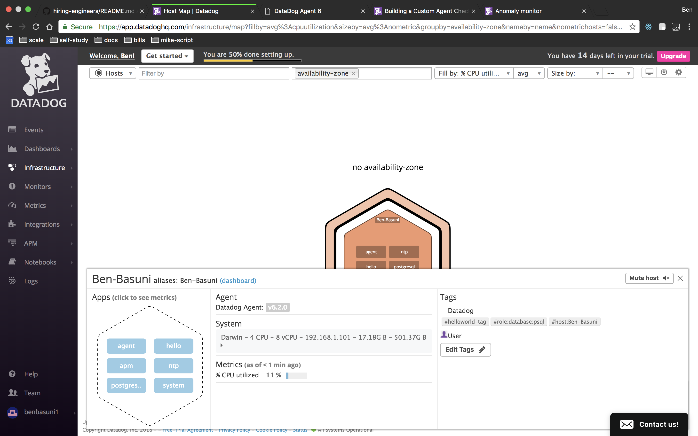
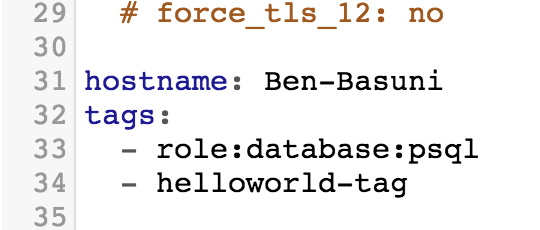
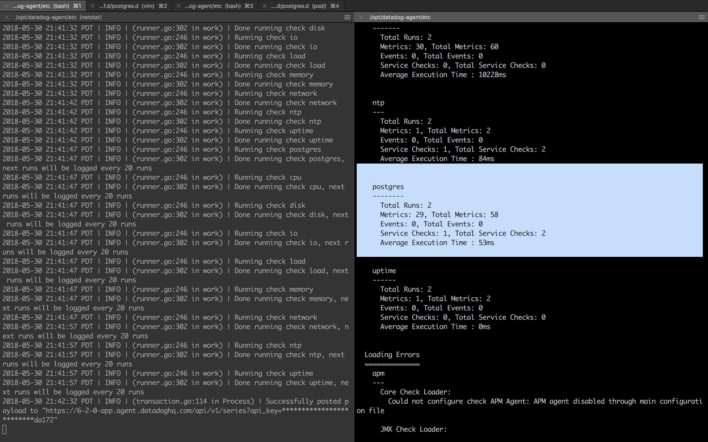
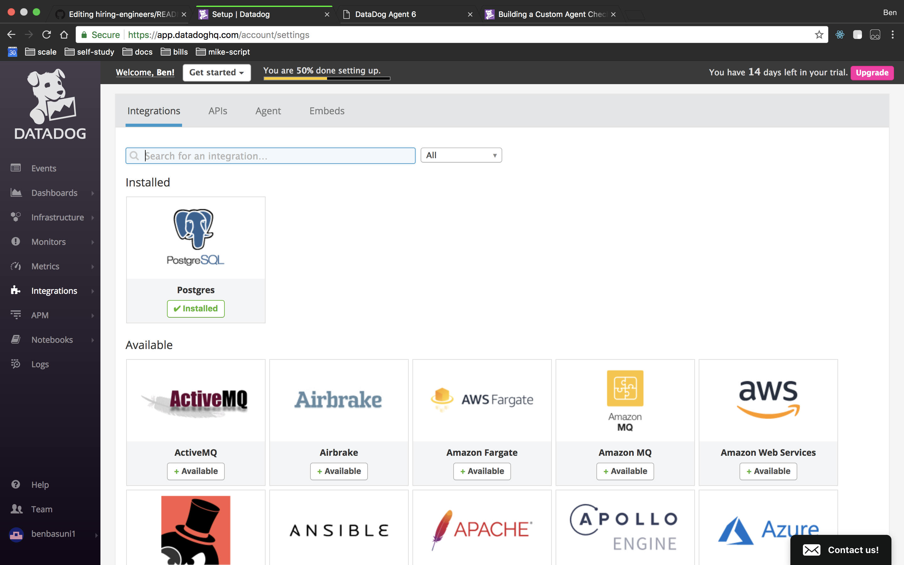

# Answer for Recuiting Challenge
I took the docker-containerized approach to complete the Challenge.  
You can reproduce the environment by docker-compose with a deploy script.  
**```DD_API_KEY="<DatadogAPIKEY>" YOUR_LOCAL_IP="<LOCAL_HOST_IP>" sh deploy_local.sh```  **
The script launches four containers (web, app, db, and datadog-agent) in your computer with `YOUR_LOCAL IP`.  
Following is the flow for containers to launch.
```
1. Postgres db starts with datadog user.
2. Datadog agent starts with configured yaml files inside.
3. Django app starts as backend after database migration.
4. Nginx starts http web service as frontend.
```
---
# 1. Collecting Metrics
### Add tags in the Agent config file and show us a screenshot of your host and its tags on the Host Map page in Datadog.
* [x] Agent cofing file: [datadog.yaml](datadog/datadog.yaml)  
```yaml
tags:
  - project:testweb
  - env:dev
```  
* [x]  Screenshots (Host Map)  
    
  

---
### Install a database on your machine and then install the Datadog integration for that database.

* [x] Integration file: [conf.d/postgres.d/conf.yaml](datadog/conf.d/postgres.d/conf.yaml)  
```yaml
init_config:

instances:
  - host: ${DB_HOST}
    port: 5432
    username: postgres
    password: Test1Pass
    dbname: testweb
    tags:
      - project:testweb
      - role:db
      - env:dev
```  
* [x] PostgresQL Integration  
    
  

---
### Create a custom Agent check that submits a metric named my_metric with a random value between 0 and 1000.

* [x] Agent check python: [checks.d/test_check.py](datadog/checks.d/test_check.py)  
```python
__version__ = "1.0.0"

from checks import AgentCheck
import random
class HelloCheck(AgentCheck):
    def check(self, instance):
        some_num = random.randint(1,1001)
        self.gauge('my_metric', some_num, tags=['test_check'])
```

---
### Change your check's collection interval so that it only submits the metric once every 45 seconds.
### Bonus Question Can you change the collection interval without modifying the Python check file you created?
* [x] Agent check config : [conf.d/test_check.yaml](datadog/conf.d/test_check.yaml)  
```yaml
init_config:

instances:
  - min_collection_interval: 45
```
* [x] Screenshots
    

---
# 2. Visualizing Data:
###  a Timeboard that contains:
* [x] My custom metric scoped over your host.  
    

* [x] Any metric from the Integration on Database with the anomaly function applied.  
    

* [x] My custom metric with the rollup function applied to sum up all the points for the past hour into one bucket  
    

* [x] The script to create this Timeboard  
    

### Dashboard
* [x] Set the Timeboard's timeframe to the past 5 minutes  
    

* [x] Take a snapshot of this graph and use the @ notation to send it to yourself.  
    

* [x] Bonus Question: What is the Anomaly graph displaying?  
    

# 3. Monitoring Data
### Create a new Metric Monitor that watches the average of your custom metric (my_metric) 
* Warning threshold of 500
* Alerting threshold of 800
* And also ensure that it will notify you if there is No Data for this query over the past 10m.

* [x] Send you an email whenever the monitor triggers.  
    
  
* [x] Create different messages based on whether the monitor is in an Alert, Warning, or No Data state.  
    

* [x] Include the metric value that caused the monitor to trigger and host ip when the Monitor triggers an Alert state.  
    

* [x] When this monitor sends you an email notification, take a screenshot of the email that it sends you.
    

### Bonus Question: Since this monitor is going to alert pretty often, you don’t want to be alerted when you are out of the office. Set up two scheduled downtimes for this monitor:
* One that silences it from 7pm to 9am daily on M-F,
    
* And one that silences it all day on Sat-Sun.
    
* Make sure that your email is notified when you schedule the downtime and take a screenshot of that notification.
    

---

# 4. Collecting APM Data:

### Bonus Question: What is the difference between a Service and a Resource?
* [x] Answer
```text

```
### Provide a link and a screenshot of a Dashboard with both APM and Infrastructure Metrics.
* [x] Answer
```python
#Your code here
```
* [x] Screenshots  
    
    

### Final Question:
### Is there anything creative you would use Datadog for?
