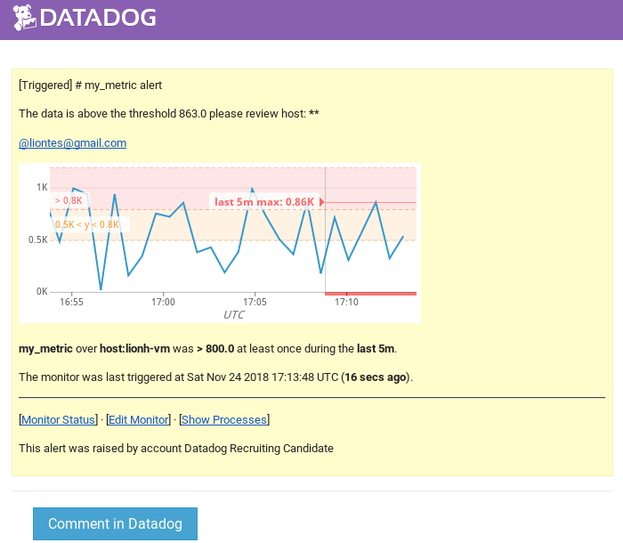
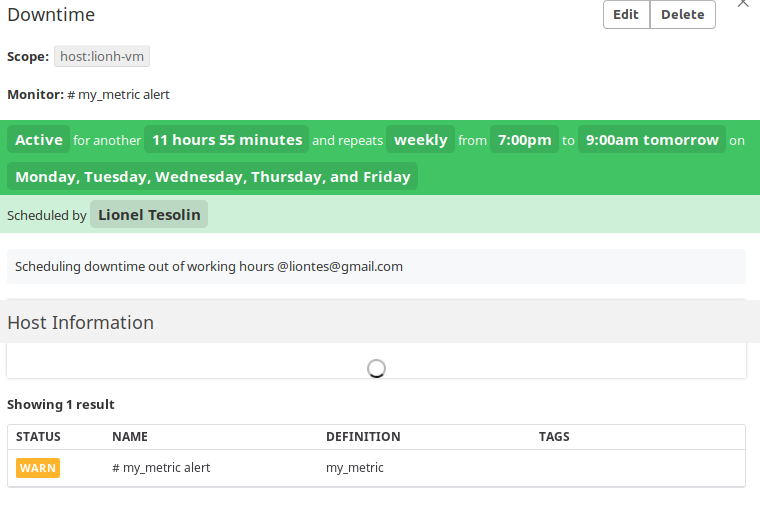
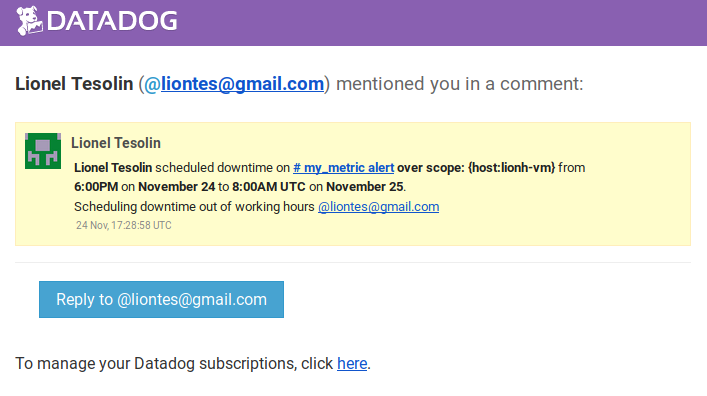
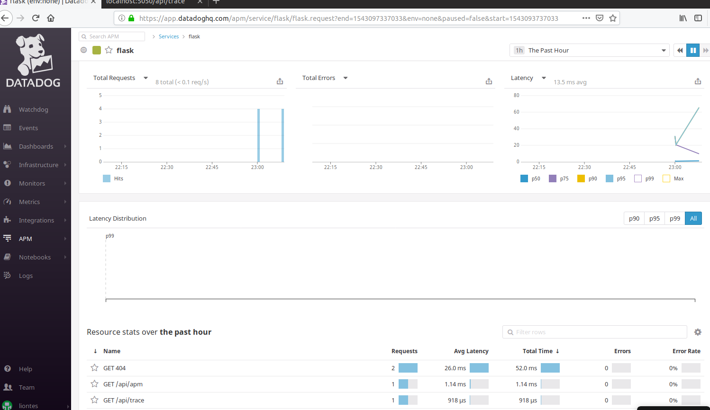
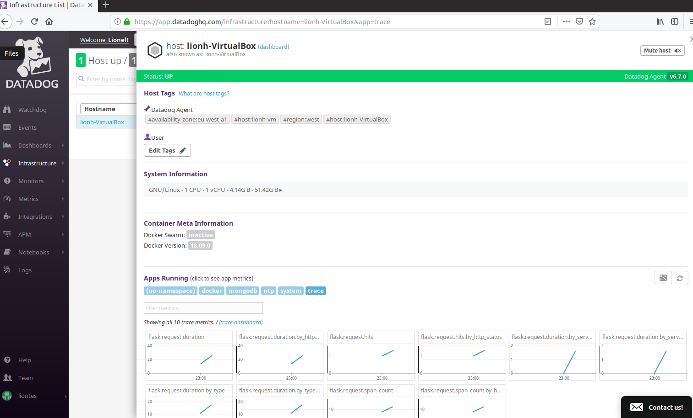

## Datadog Coding Challenge - Lionel Tesolin

Hello Datadog, all the consolidated answers of the coding challenge is resumed in this livedoc. My approach is to relate each step with in mind an hipotetical customer that might need to replicate the same task.
I'm aware (and you also are) that Github is a public platform and all forks are accessible by everyone so it is useful and interesting to check what have the others candidates answered to the same challenge. 
Let's start!


# Prerequisites - Setup the Environment

### Installation

Vagrant is a powerful vm orchestrator but I have already in my personal notebook an Ubuntu vm image with Docker. I'm using VirtualBox. I will then install the dockerized version of mongodb and datadog agent:

```shell
sudo docker run --name mongodb \
-e MONGO_INITDB_ROOT_USERNAME=lionh \
-e MONGO_INITDB_ROOT_PASSWORD=******** \
-p 27017 \
-d mongo:latest
```

```shell
sudo docker run -d --name dd-agent \
-v /var/run/docker.sock:/var/run/docker.sock:ro \
-v /proc/:/host/proc/:ro \
-v /sys/fs/cgroup/:/host/sys/fs/cgroup:ro \
-v /opt/datadog-agent-conf.d:/conf.d:ro \
-v /opt/datadog-agent-checks.d:/checks.d \
-p 8125:8125 \
-p 8126:8126 \
-p 5002:5002 \
--link mongodb:mongodb \
-e DD_TAGS=host:lionh-vm\ availability-zone:eu-west-a1\ region:west \
-e DD_API_KEY=44777b5614adfe98cfc78886cbea1eba datadog/agent:latest
```

The run command allow us to share volume between the docker container and the docker host to persist our file configuration. I also made a linkage with the mongodb container and added some custom tags.


I tried to validate the container deployment using:

```
lionh@lionh-VirtualBox:~$ sudo docker exec -it dd-agent /opt/datadog-agent/bin/agent/agent health
Agent health: PASS
=== 15 healthy components ===
ad-configpolling, ad-dockerlistener, ad-dockerprovider, ad-servicelistening, aggregator, collector-queue, collector-queue, dogstatsd-main, forwarder, healthcheck, metadata-agent_checks, metadata-host, metadata-resources, tagger, tagger-docker
```

It's necessary to add a user in mongodb to allow the datadog agent to access in ro the database metrics:

```shell
creating user datadog in mongo:
db.createUser({
... "user":"datadog",
... "pwd": "********",
... "roles" : [
... {role: 'read', db: 'admin'},
... {role: 'clusterMonitor', db: 'admin'},
... {role: 'read', db: 'local' }
... ]
... })
Successfully added user: {
	"user" : "datadog",
	"roles" : [
		{
			"role" : "read",
			"db" : "admin"
		},
		{
			"role" : "clusterMonitor",
			"db" : "admin"
		},
		{
			"role" : "read",
			"db" : "local"
		}
	]
}
```


# Section 1: Collecting Metrics

##### Step 1: Find Hostmap in Datadog, provide screenshot
Here a screenshot of my host in the Host Map page in Datadog:


## Create an Agent Check
##### Step 2: Create the check and metric, generate a random number

Creating a custom agent check 
 - 
Defining a custom metric
 - 

After creating my custom metric, I add to validate it through the command:
```
sudo docker exec -it dd-agent /opt/datadog-agent/bin/agent/agent configcheck
```
=== my_metric check ===
Source: File
Instance ID: my_metric:5ba864f3937b5bad
min_collection_interval: 45
~
===
```

##### Step 3: Run and verify the check
Stopping and restarting the dd-agent container is easy with Docker

```
sudo docker stop dd-agent
sudo docker start dd-agent
```
---
> *Bonus Question Can you change the collection interval without modifying the Python check file you created?*
---
Modifying the ```.yaml``` file was my first approach. The question asked if it is possible to do it without modifying the ```.py```. The Gauge class exposes a ```flush```method that takes *interval* argument. So in Python, it is possible to set how often a given metric is flushed to Datadog.


# Section 2: Visualizing Data

*Utilize the Datadog API to create a Timeboard...*

---

## Create a Timeboard

##### Step 1: I'm going to use Curl as a simple Rest Client and storing the call in a bash script.
---
> *(Make sure your timeboard contains:*)
> - *Your custom metric scoped over your host.*
> - *Any metric from the Integration on your Database with the anomaly function applied.*
---
 - 

##### Step 2: Verify the custom Dashboard


##### Step 3: Verify the email notification with 5 minutes timeframe
---
>*(Access the Dashboard in the UI:)*
> - *Take a snapshot of this graph and use the @ notation to send it to yourself.*
---
Selecting any graph, using the camera button in the top right, I was able to take a snapshot and share it using @ with a suggestion list of user and use my own email adress. I receive immediately the following email in my inbox:


## What is the Anomaly graph displaying?
An Anomaly uses algorithmic detection to compare a metric with its historical data highlighting deviations over a specific window time. Different algorithm can be chosen.


# Section 3: Monitoring Data

I created a monitor through UI with the requested conditional messages. The host ip is not visible for security reason in Docker by default, but can be exposed. The {{host.name}} placeholder works by the way.

```
**query** max(last_5m):max:my_metric{host:lionh-vm} > 800

{{#is_alert}} The data is above the threshold. A peak of {{value}} is too high, please review host: {{host.ip}} {{/is_alert}}

{{#is_warning}} The data is below the threshold. A peak of {{value}} is high, please consider review what is going on {{/is_warning}}

{{#is_no_data}} No data coming in 10m, please contact support {{/is_no_data}}
```


---
> ***Bonus Question:*** *Since this monitor is going to alert pretty often, you don’t want to be alerted when you are out of the office. Set up two scheduled downtimes for this monitor:*
> - *One that silences it from 7pm to 9am daily on M-F,*
> - *And one that silences it all day on Sat-Sun.,*
> - *Make sure that your email is notified when you schedule the downtime and take a screenshot of that notification.*
---
I scheduled two recurring Downtime and received the notification by mail. One each working day from 7pm, duration 14h and one on Saturday beginning at 00:00am, duration 2 days.

Here the details:






Please note that the time is scheduled in CET and the notification is displayed in UTC (1 hour delayed) as expected

# Section 4: Collecting APM Data

*Given the (supplied) Flask app (or any Python/Ruby/Go app of your choice) instrument this using Datadog’s APM solution:*
- *Note: Using both ddtrace-run and manually inserting the Middleware has been known to cause issues. Please only use one or the other.*
---

## Instrument an Flask/Python/Ruby/Go app using Datadog APM
##### Step 1: Configure the environment

First of all I have to enable the APM trace in my dd-agent with the DD_APM_ENABLED=true:

```
sudo docker run -d --name dd-agent \
-v /var/run/docker.sock:/var/run/docker.sock:ro \
-v /proc/:/host/proc/:ro \
-v /sys/fs/cgroup/:/host/sys/fs/cgroup:ro \
-v /opt/datadog-agent-conf.d:/conf.d:ro \
-v /opt/datadog-agent-checks.d:/checks.d \
-p 8125:8125 \
-p 8126:8126 \
-p 5002:5002 \
--link mongodb:mongodb \
-e DD_APM_ENABLED=true \
-e DD_TAGS=host:lionh-vm\ availability-zone:eu-west-a1\ region:west \
-e DD_API_KEY=44777b5614adfe98cfc78886cbea1eba datadog/agent:latest
```

##### Step 2: Instrumentalization of the flask application with dd-trace

 - 
The purpose of instrumentalization is to get metric from within the code to analyze the performance. The purpose of the exercise is to demonstrate how it works but it is clearly not the cleanest way to do it... but it works.

##### Step 3: Verify Datadog SaaS application receive the traces

Here a screenshot of the APM dashboard:

And from the Infrastructure


---
> ***Bonus Question:*** *What is the difference between a Service and a Resource?*
---

A Service is a set of different processes working together. The developer is free to divide his application in different services (e.g. one frontend and one backend or one for the services and one for the persistence layer).
A Resource is a particular query to a service for exemple in a REST application, it would be a canonical URL like /api/v2/user. You can have multiple resource for one service.


# Final Question


*Datadog has been used in a lot of creative ways in the past. We’ve written some blog posts about using Datadog to monitor the NYC Subway System, Pokemon Go, and even office restroom availability!*

*Is there anything creative you would use Datadog for?*

I'm very interested in home automation and the number of devices at home is growing massively (Alarm, multimedia devices, electrical devices, car, vacuum robot, lights). I think in the nearly future, the demand for centralized monitoring solutions will increase and I'm sure Datadog will lead this sector.
