# **Datadog Hiring Exercise — Varun Rana**
I thoroughly enjoyed exploring Datadog's product offerings! Several of the activities brought back memories of times where Datadog would've been a major lifesaver for my team, which I shed light on throughout the exercise. It is by far the most elegant operations tool I've ever used.

## **Prerequisites**
For this exercise, I used an Ubuntu virtual machine created via Vagrant. Once I installed the Datadog agent on the VM, I was able to retrieve system metrics in my Datadog dashboard as shown below:

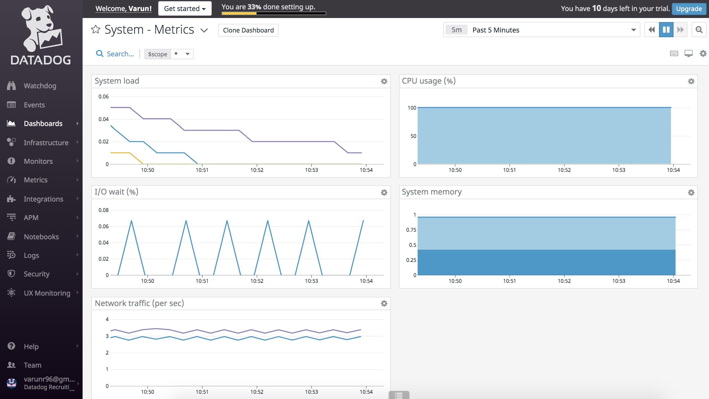

I was very pleased with how easy it was to install Datadog onto my host and collect tech metrics immediately!

## **Collecting Metrics**
### **Adding Tags**
Developers in cloud-first organizations are becoming increasingly involved with fleet management, and it can be a real pain to troubleshoot hardware issues without any labeling mechanisms. To address this, Datadog provides an awesome tagging solution to allow teams to categorize and identify hardware. We can add some tags to the host by modifying the `tags` property in the [Agent configuration file](./collecting-metrics/datadog.yaml#L24):

```yaml
tags: ["availability-zone:us-east-1", "environment:dev", "operating_system:ubuntu", "cloud_provider:aws", "database:mysql"]
```

After a few minutes, the tags were listed under my host in the Host Map:

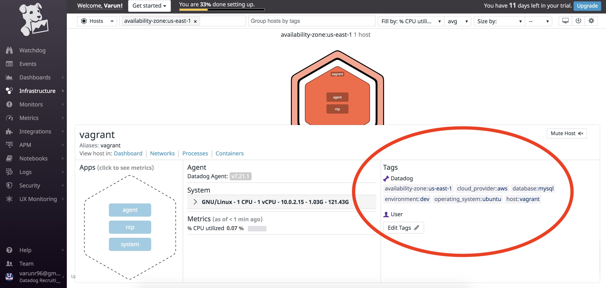

Now, if I ever needed to find a host in `us-east-1`  running a MySQL server, I could find it in a matter of seconds.


### **Installing a Database**
I installed MySQL Server following [these instructions](https://support.rackspace.com/how-to/install-mysql-server-on-the-ubuntu-operating-system/). I then [prepared the MySQL integration](https://docs.datadoghq.com/integrations/mysql/) on my host, creating a [conf.yaml](./collecting-metrics/conf.yaml) file for the integration.

Once I restarted the agent, Datadog automatically created a MySQL dashboard, which confirmed the agent was successfully reporting MySQL metrics:
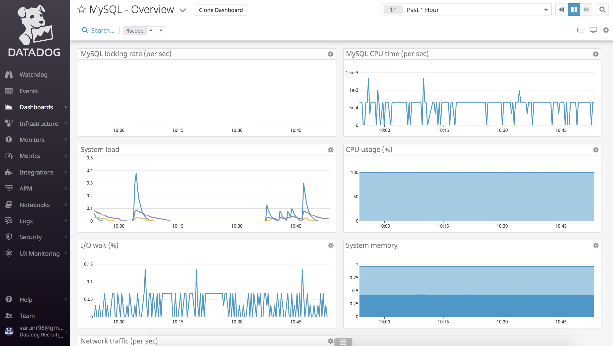

I appreciated how simple it was to retrieve MySQL metrics. I didn't have to tell Datadog which metrics I wanted, or that I wanted them displayed in a dashboard. Datadog took care of all that for me! This is very a pleasant experience for development teams, who would rather focus their time on building great things for customers instead of collecting metrics from all their infrastructure.

### **Creating a Custom Agent Check**
Teams adopting monitoring solutions generally want some freedom to customize. What if there is a specific metric we want to collect, but Datadog doesn't check for it out of the box?

Thankfully, Datadog has a straightforward process to add your own checks. Following the [custom agent check docs](https://docs.datadoghq.com/developers/write_agent_check/?tab=agentv6v7), I created a basic check configuration file in the `/etc/datadog-agent/conf.d/` directory:

```yaml
# /etc/datadog-agent/conf.d/hello.yaml
instances: [{}]
```
and a [basic check Python script](./collecting-metrics/hello.py) in `/etc/datadog-agent/checks.d/`. 

Finally, I restarted the agent, and the metric was picked up by Datadog:

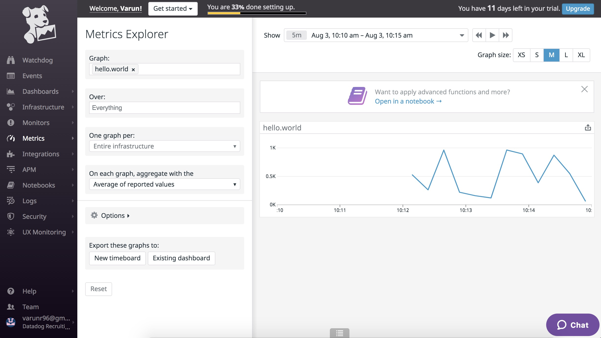

Datadog gives teams the freedom to customize their metric reporting to their needs, without having to worry about the dashboard UX at all. I can attest to the fact that data collection can be a mundane task for engineers, but Datadog makes it fun!

### **Changing the Collection Interval**
To change the collection interval for our metric, I simply modified the check's [configuration file](./collecting-metrics/hello.yaml). After restarting the agent, the new collection interval of 45 seconds was apparent in the metric graph:


### **Bonus Question:** 
Yes - Datadog does a great job of separating configurations from implementation details. You can change the check’s collection interval by simply modifying the check’s configuration file, [conf.d/hello.yaml](./collecting-metrics/hello.yaml). Just add a `min_collection_interval` element to the `instances` property, and assign it an integer value (in seconds):
```yaml
# /etc/datadog-agent/conf.d/hello.yaml
# agent check configuration file for hello.world metric
init_config:

instances:
        - min_collection_interval: 45
```
<br/>
<br/>
This part of the exercise was a great introduction to metric collection processes in Datadog. I can already see why engineering teams love it! The variety of integrations, ease of use, and customizability make it more than just another DevOps tool; it's a pleasant and empowering experience for tech and business users alike.
<br/>
<br/>

## **Visualizing Data**
### **Creating a Timeboard**
Setting up dashboards for a new service or feature can be cumbersome. Your cloud provider might have its own dashboarding solution, and your company might have its own documentation tools, like Wiki, Quip, etc. Before you know it, you've spent an entire Friday clicking around and mastering markdown plugins to put together a dashboard. Who wants to spend their Fridays like that?

Using the [Datadog Dashboard API](https://docs.datadoghq.com/api/v1/dashboards/), I was able to write a [Python script](./visualizing-data/create_timeboard_hello_world.py) that created a simple Timeboard with the requested metrics and settings. Upon running the script, the [dashboard](https://p.datadoghq.com/sb/8kx1ywkg668jpfbx-391c1b67aba5fc08ee84fb428bdd9709
) appeared in the Datadog UI:

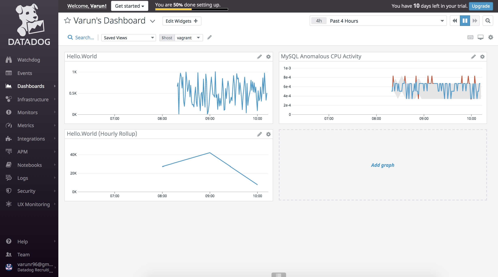

 Datadog's API makes the dashboarding process much more efficient, repeatable, and enjoyable for engineers. 

### **Taking a Snapshot**
This is my favorite Datadog feature. I can't tell you how many times I've sent a concerning metric to our team chat room. This usually leads to  two people having an in-depth discussion on it, figuring out why the link isn't working for the other person, spamming the group, and eventually deciding on nothing. What if there was a way to send this worrisome graph to the right people, directly from our dashboard?

Enter Datadog snapshots. To send someone a snapshot of a graph, all you have to do is hover your pointer over a graph, select the **export** icon, and click **Send snapshot**. You can then enter "@" followed by a team member's email address, and hit Enter to send them an email with a snapshot of the graph:

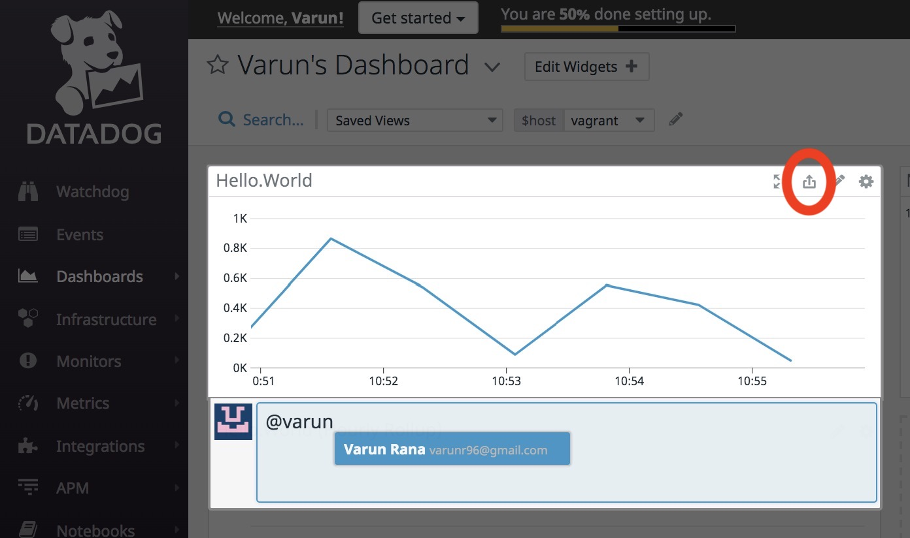

They will then receive an email with the snapshot, with a link to this graph in the Datadog UI:

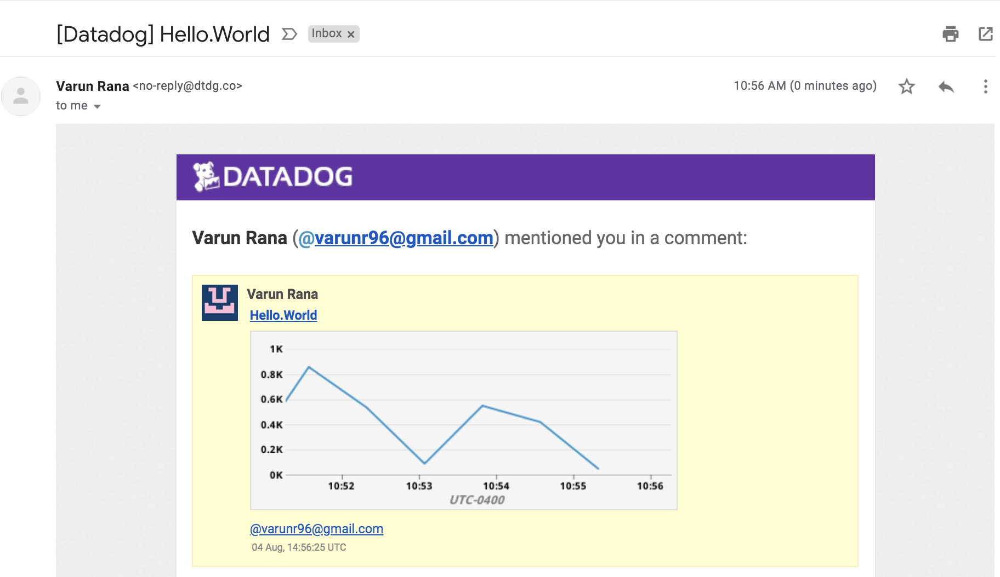

If I'm ever observing our dashboards and notice something odd, I can easily loop in a team member to take a look. We can then proceed to geek out over the metric!

### **Bonus Question**
The Anomaly graph is displaying MySQL CPU Activity datapoints that are more than two standard deviations from their expected value. These expected values are computed by an algorithm. This graph is using the "basic" algorithm, which uses very little data and adjusts quickly to changing conditions, but has no knowledge of seasonal behavior or longer trends. This graph is helpful to know if MySQL CPU Activity is abnormally high or low, giving insight into database impact from any potential critical incidents or changes in customer behavior.
<br/>
<br/>
My team's tech stack mainly consists of in-house services and AWS. Even then, tech metric visualization always becomes a project of its own. I can only imagine how frustrating it is for teams with multiple cloud providers! Datadog has taken matters into their own hands and provided us with tools to visualize data *fast*, in a glossy and navigable UI.
<br/>
<br/>

## **Monitoring Data**
Gone are the days of configuring separate monitors for each desired alarm condition. Datadog's monitoring suite simplifies monitor creation down to a science.

Datadog organizes your monitors on a per-metric basis. Once you choose a metric, you can choose thresholds for alerts, warnings, and recovery for your metric. It even lets you add a missing data check:
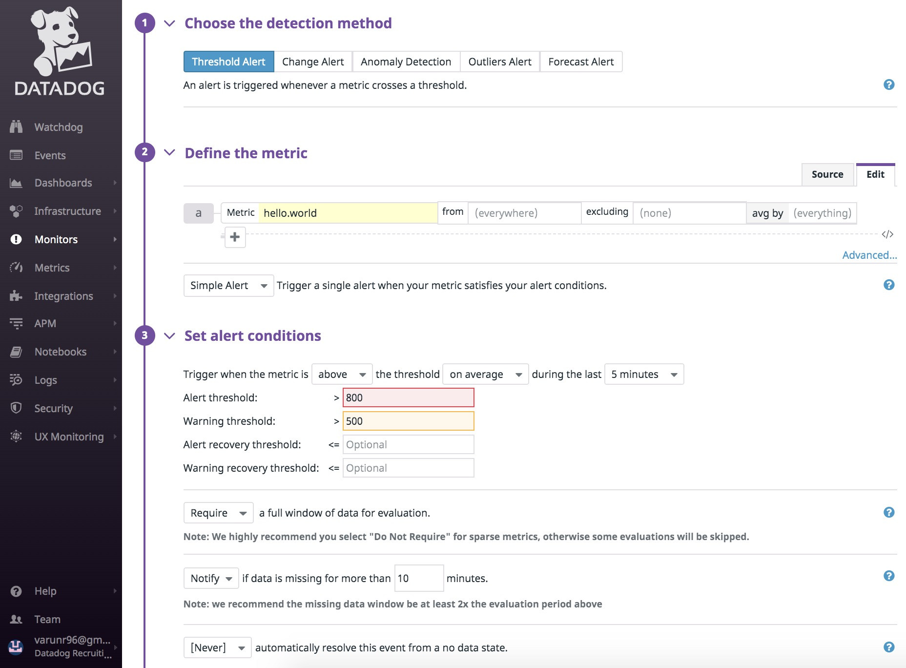

You can even send separate messages for each alarming condition. Using [template variables](https://docs.datadoghq.com/monitors/notifications/?tab=is_alert#variables) provided by Datadog, you can easily attach a message to your monitor that varies based on the monitor state. You can also use them to retrieve the metric value, thresholds, host name, and host IP:

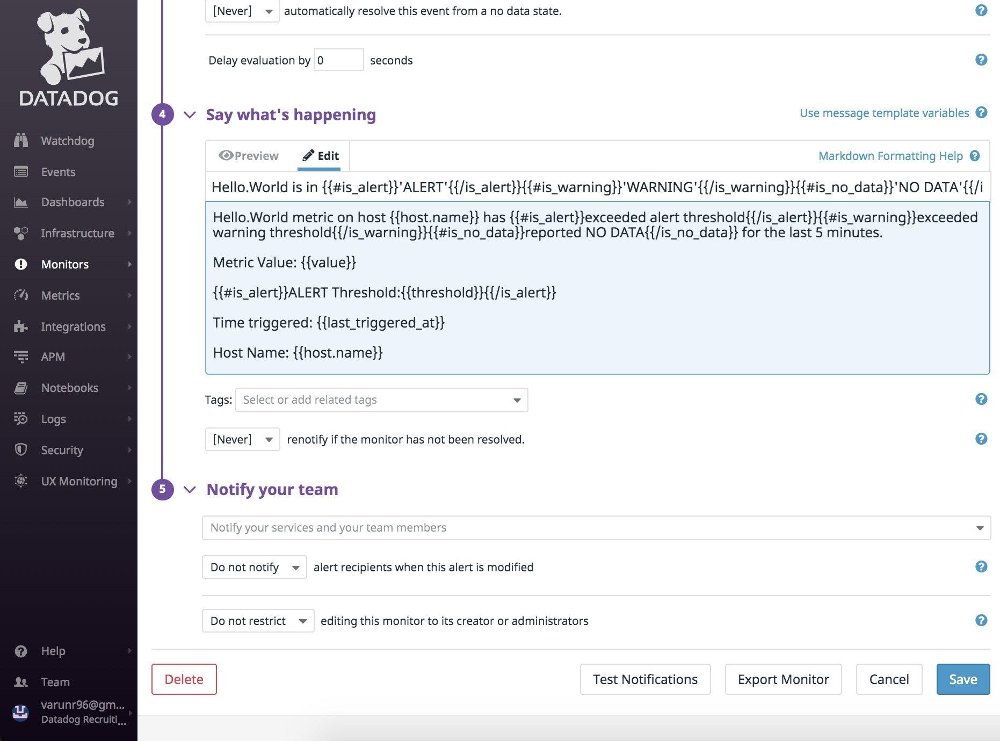

As desired, I received a distinct email for warnings:

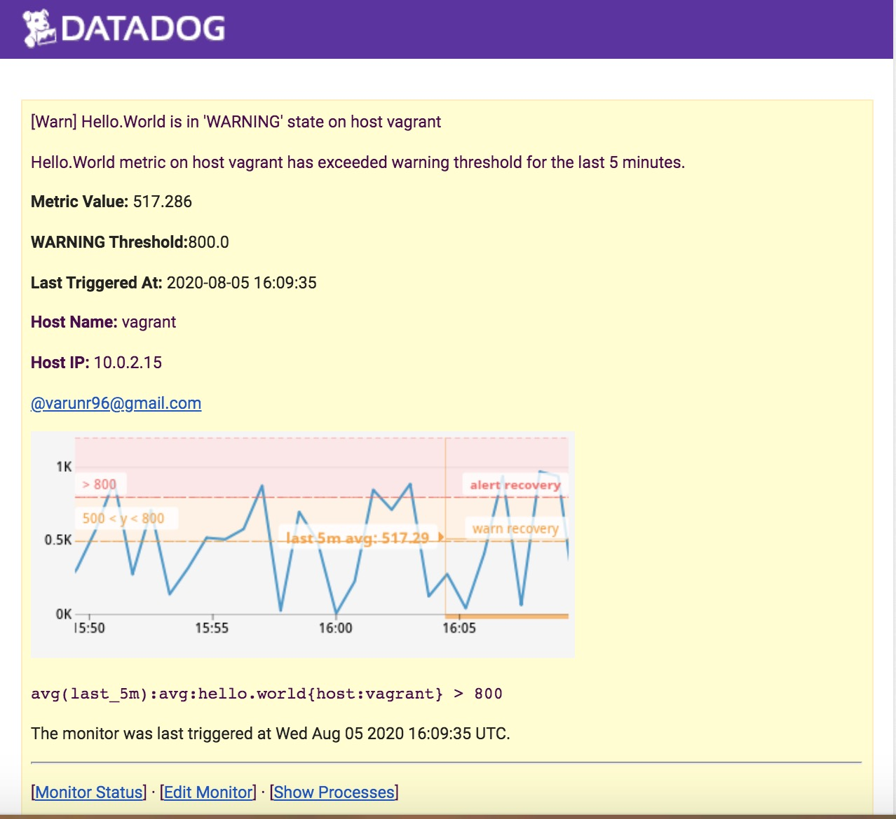


### **Bonus Question**
Some metrics aren't worth losing sleep over. Fortunately, Datadog provides a workflow *dedicated* to managing downtime for your monitors!

You can find this under *Monitors* >> *Manage Downtime* in the main navigation. Then click *Schedule Downtime* in the upper-right corner to start cleaning out that inbox.

Since we want our downtime to be Monday through Friday from 7PM-9AM, plus the whole weekend, I will create two separate downtimes:

**1)** One that repeats every week from Monday through Thursday, 7PM-9AM

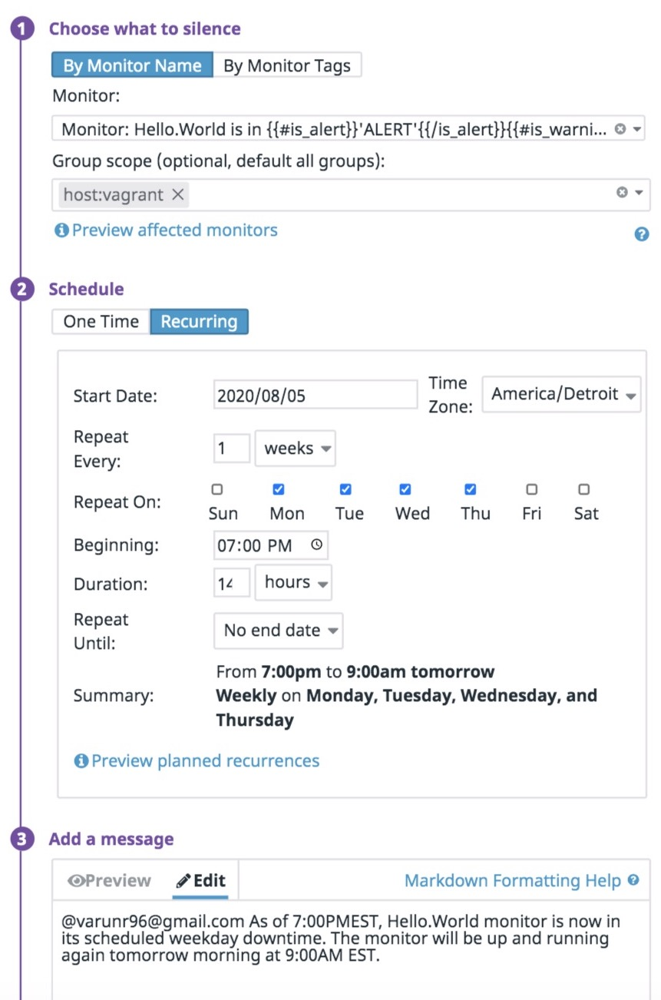

**2)** One that repeats every week from Friday at 7PM to Monday at 9AM
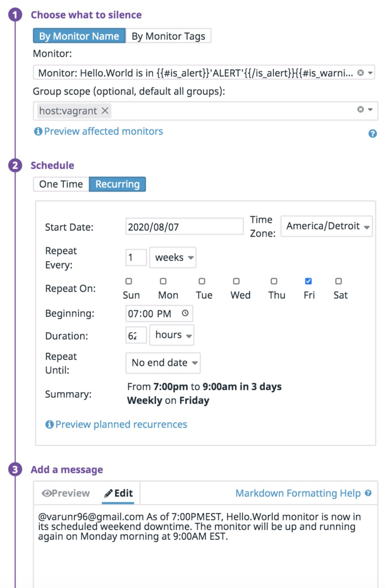

And sure enough, I received an email on Wednesday evening:

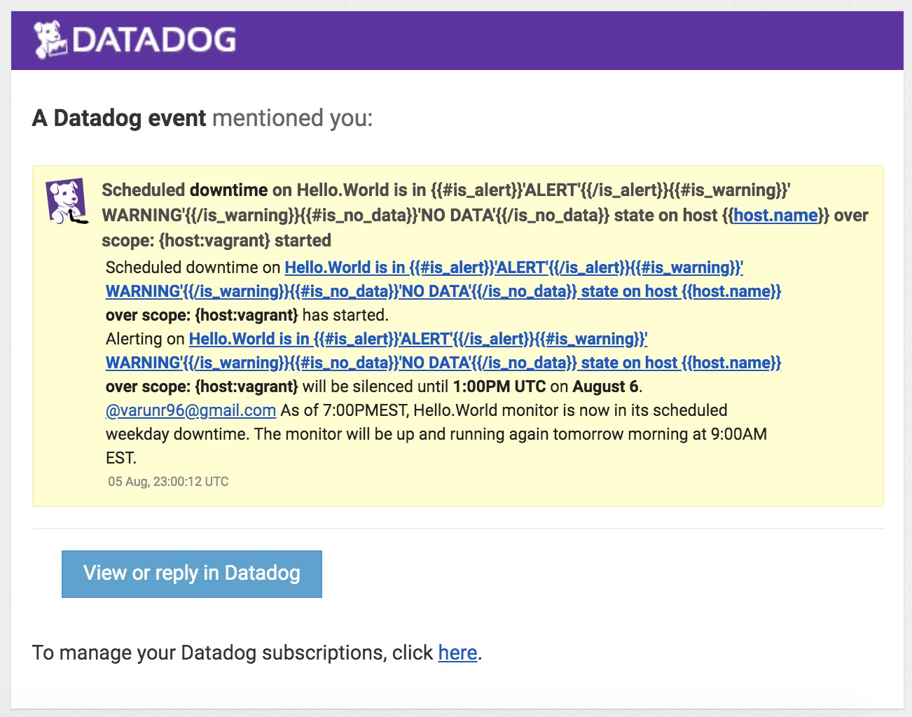

With monitor downtimes, Datadog makes it easy to decide what the team should be worried about, and *when*. No more clogged inboxes or sleepless engineers. Everyone can get a good night's rest!

<br/>

Datadog's monitoring solution was built with developers in mind. Devs are busy, and never want to spend several hours configuring metrics and alarms for a new feature. With Datadog, they can do it within minutes. Organizations can win back weeks of engineering time per year by adopting Datadog for cloud monitoring.
<br/>
<br/>

## **Collecting APM Data:**
So far, we've seen that Datadog can provide a great deal of insight into our tech stack with minimal setup effort. However, there's still one open question: besides my infrastructure, how can we see how our actual *code* is performing?

Datadog's Application Performance Monitoring (APM) solution lets you do this in a number of ways. For the sample Python Flask application, I followed the [instructions](https://docs.datadoghq.com/tracing/setup/python/) for tracing Python applications. Then I installed `ddtrace` to my host and started up the Flask app by running:
 ```shell
 $ FLASK_APP=flask_app.py DATADOG_ENV=flask_test DD_TRACE_ANALYTICS_ENABLED=true DD_PROFILING_ENABLED=true DD_RUNTIME_METRICS_ENABLED=true ddtrace-run python sample_flask_app.py
 ```

After making a few sample requests, Datadog started to pick up APM data from our service.

### **Services**
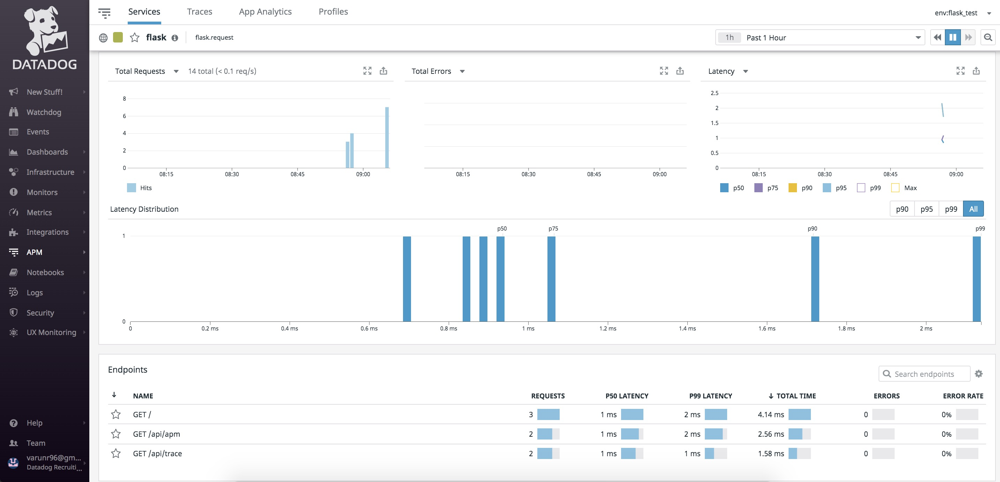

Above we can see  a high-level overview of what's going on with our Flask service in the Services dashboard. `ddtrace` automatically gives us very simple metrics like total requests, total errors, and latency. We can also see resource-level metrics at the bottom, broken down by API endpoint.

### **Traces**
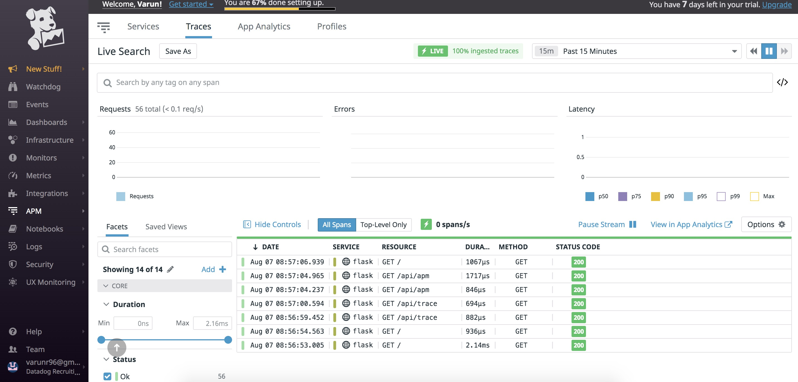

On the Traces dashboard, we can see more detailed information about the requests to our service. If we click on a request, we get a more detailed picture of what happened:

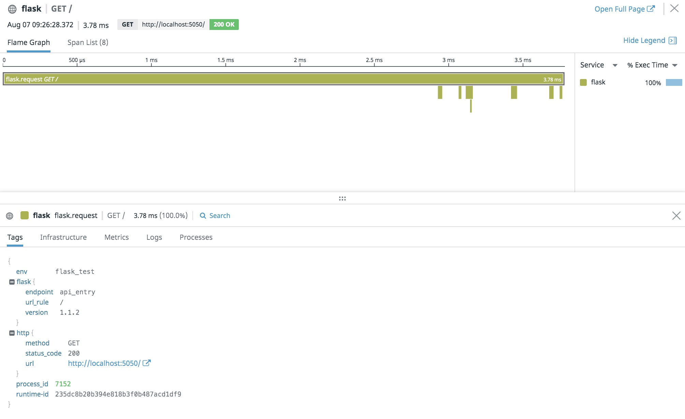

Here we can see the full latency breakdown of this `GET` request, and some other useful information like the status code, the URL, etc. However, for more complex services, we will probably need more information than what `ddtrace` can provide us. Wouldn't it be awesome to have a little more control over your app tracing?

I followed the docs for [custom instrumentation for Python applications](https://docs.datadoghq.com/tracing/custom_instrumentation/python/?tab=decorator), which allows you to manually decide what to trace from your app, right in code. I then [spieced up our Flask service](./collecting-apm-data/flask_app.py) a bit; I built a very basic Event RSVP API that lets you RSVP names (`POST`) and see the guest list (`GET`).  

To get more information about our database calls, we can create *spans* for them, which are pieces of logic in a system over a given timeframe. In my code, I created spans for both database [reads](./collecting-apm-data/flask_app.py#L48) and [writes](./collecting-apm-data/flask_app.py#L32). I [saved span tags](./collecting-apm-data/flask_app.py#L34) for each API endpoint, so we can see the exact database query input, in case we have issues down the line. For `/api/rsvp`, I saved the guest's name. For `/api/guests/`, I saved the number of guests.

After updating the code and  starting up the Flask server again, I started making `POST` requests to `/api/rsvp`. I also performed some `GET` requests to `/api/guests` to see who's attending the event. The requests now show a latency breakdown including our new database span and our recorded tag:

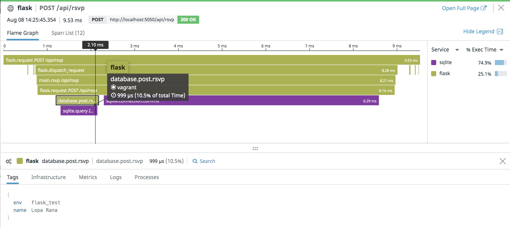

Good to know at least my mom is attending.
### **App Analytics**
App Analytics allows us to search through all our traces for a given query. If I wanted to see all of my recent `404` requests, I can simply go to my App Analytics page and filter by Status Code:

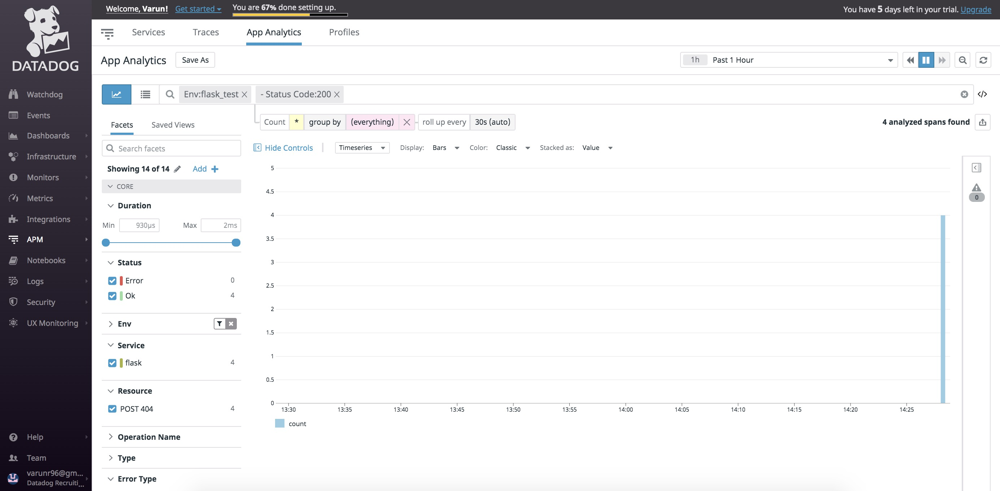

To learn more about these requests, I can click the bars on the graph, then click "View Traces" to see what's going on with those requests.

### **Profiles**
What if we really wanted to get down to the nitty-gritty metrics of our code performance? As our Event RSVP API scales to serve bigger live events, these metrics will become increasingly important. We want to make sure we can see what parts of our application are consuming the most resources, like CPU and memory. On the Profiles page, we can analyze code-level performance with Datadog APM's built-in profiler:

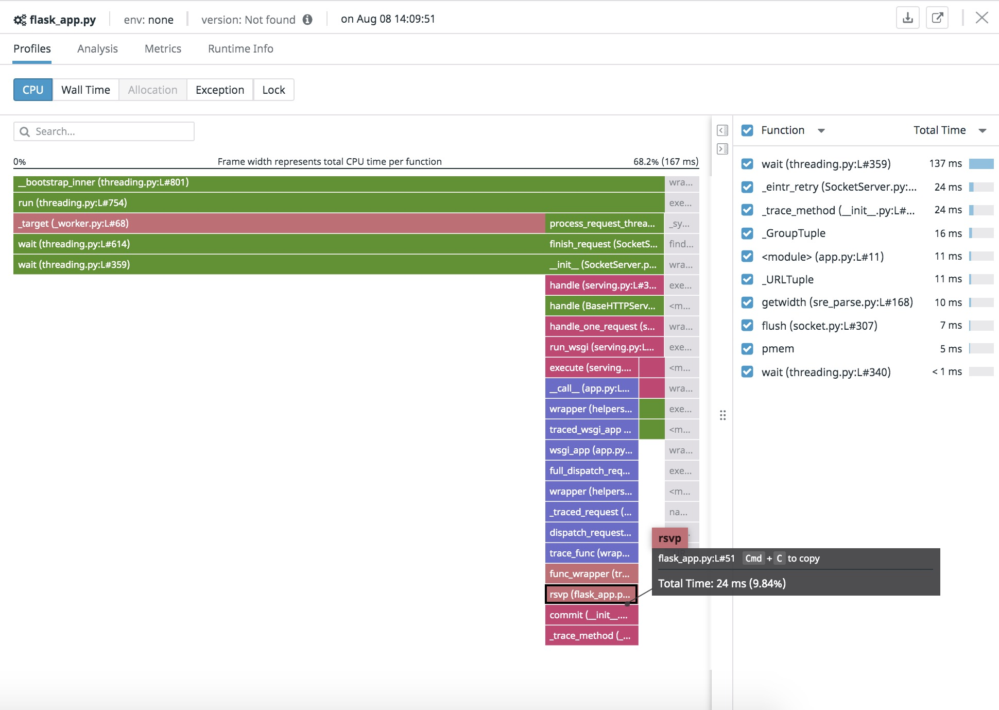

Without having to write any extra code, I can see the comprehensive breakdown of CPU time across processes. Our `rsvp()` function took 24ms.

### **Dashboarding APM Metrics**
Datadog's APM suite offers so many capabilities, it can be overwhelming! To save ourselves time, we can create a dashboard with the exact APM and infrastructure metrics we want so we don't always have to sift through the APM workflows to view them:

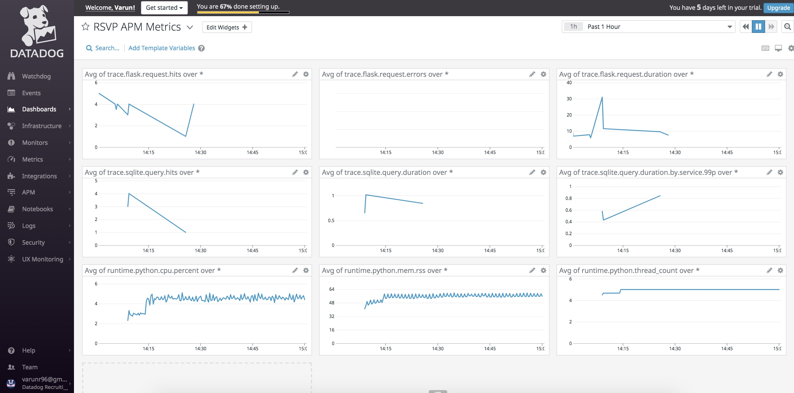

### **Bonus Question**
**Service**: A Service is a combination of technical resources including, but not limited to, API endpoints, database queries, serverless functions, and ETL jobs, which work together to solve a specific problem as part of an application. In our example, our Flask service was dedicated to providing clients an easy way to register names for an event and retrieve a guest list. It consisted of a few API endpoints and some database queries.

**Resource**: Resources are components of a service or application that complete particular actions - it could be a web endpoint, database query, or ETL job. Our Event RSVP service provides three endpoints, `/`, `/api/rsvp` and `/api/guests`, which are all considered resources.

<br/>

Datadog's APM solution can empower teams to learn things about their code that they never even thought about. Identifying performance bottlenecks has never been so easy!
<br/>
<br/>
## **Final Question**


If there's anything I love more than technology, it's food. I am always hungry. Typically, when the world isn't ending and I work in a \~real\~ office, I like to take trips to nearby restaurants for lunch, coffee, or even just casual meetings. It's a great mini-escape from the office hustle, an opportunity to explore new sides of town, and an excuse to eat more!

But whenever I'm looking for my respite during the workday, so is everyone else. A "quick bite" almost always turns into 45 minutes wasted waiting in lines. And I know what you're thinking. "Just go after the lunch rush!" I can't tell you how many times I went to grab late lunch at 2PM and still encountered a long line. If only there were a way to monitor exactly when a restaurant's traffic dips, so I can go grab my burrito in peace.

Assuming we have unlimited access to restaurant data, I believe every office should have a Datadog timeboard dedicated to monitoring nearby restaurants. It should display the following metrics for each restaurant:
1. **Traffic**: If I'm having a rough day, I want to know when Chipotle has zero customers in the store, so I can eat alone in peace. Or if I'm taking colleagues to a happy hour after work, it might be more fun to go where all the cool kids are right now.
1. **Wait Time**: You're probably wondering, "doesn't traffic tell us the same thing?" Hear me out. If you're going to eat alone or just for a quick bite, then sure; this metric isn't much different than traffic. But what if you're looking to buy some time? When you're meeting that old colleague over lunch that you haven't seen since the pre-COVID era, you might actually want a long line to give you extra time to catch up about your remote work woes. Or you might just want to be "accidentally" late to that post-lunch meeting!
1. **Special Ingredient Inventory**: If Chipotle doesn't have guac, I'm out. There is nothing that frustrates me more than spending 20 minutes in line to find out that the best ingredient is out of stock. Let's create an alarm for this too, so I can be notified when the crisis has been averted.


## **Closing Thoughts**
Thank you for taking the time to read my thoughts on Datadog's key features! Datadog addresses several painpoints shared by developers everywhere and makes DevOps fun. I am seriously jealous of teams that get to use Datadog in their day-to-day and can only imagine the plans the company has in store to make it even more awesome.

Stay safe and healthy out there!