## Hiring Exercise Answers
### Candidate - Sean Carolan

### Introduction
Thank you for the opportunity to go through this hiring exercise. I enjoyed the technical challenge and learned a lot about the Datadog platform. I took detailed notes about the process, which I'm happy to share privately.

### An Interactive Solution
Solutions to the hiring exercise are available as an interactive GCP tutorial and demo. You can walk through all the steps in Google Cloud Shell. A Google Cloud Platform account with active billing is required to run the tutorial. The walkthrough instructions are also available directly as markdown. This tutorial duplicates the exact steps I took to do all the hiring exercise tasks.

[](https://ssh.cloud.google.com/cloudshell/editor?cloudshell_git_repo=https://github.com/scarolan/hiring-engineers.git&cloudshell_git_branch=sean-carolan-answers&cloudshell_tutorial=walkthrough.md)

[Datadog and GCP Walkthrough](https://github.com/scarolan/hiring-engineers/blob/sean-carolan-answers/walkthrough.md)

## Answers with Screenshots
My answers are included below, as inline blockquotes.

## Collecting Metrics:

* Add tags in the Agent config file and show us a screenshot of your host and its tags on the Host Map page in Datadog.

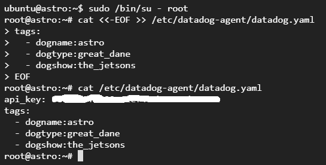

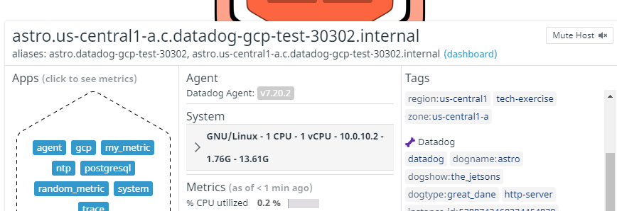

* Install a database on your machine (MongoDB, MySQL, or PostgreSQL) and then install the respective Datadog integration for that database.

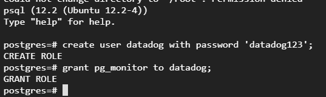

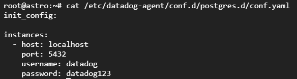

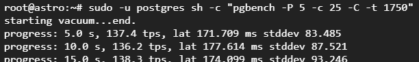

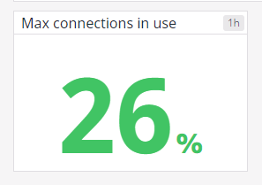

* Create a custom Agent check that submits a metric named my_metric with a random value between 0 and 1000.

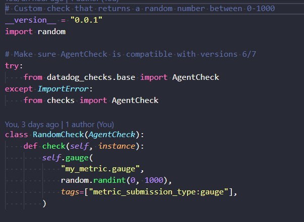

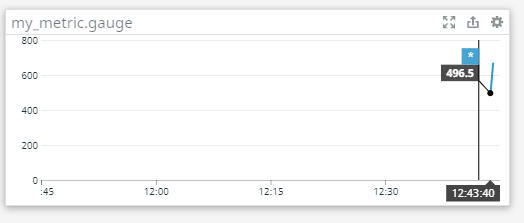

* Change your check's collection interval so that it only submits the metric once every 45 seconds.

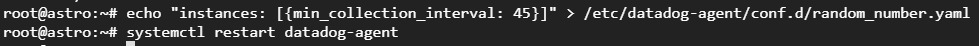

* **Bonus Question** Can you change the collection interval without modifying the Python check file you created?

> Yes. See the screenshot above, we simply update the collection interval in the yaml config file.

## Visualizing Data:

Utilize the Datadog API to create a Timeboard that contains:

* Your custom metric scoped over your host.
* Any metric from the Integration on your Database with the anomaly function applied.
* Your custom metric with the rollup function applied to sum up all the points for the past hour into one bucket

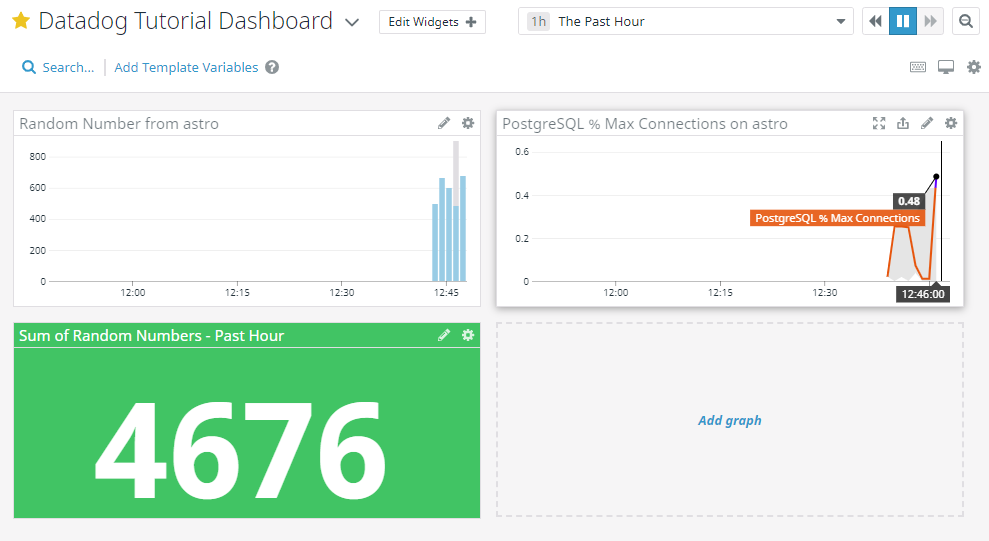

Please be sure, when submitting your hiring challenge, to include the script that you've used to create this Timeboard.

> The terraform code used to create this timeboard is stored in [solution/dd_dashboard.tf](./solution/dd_dashboard.tf)

Once this is created, access the Dashboard from your Dashboard List in the UI:

* Set the Timeboard's timeframe to the past 5 minutes

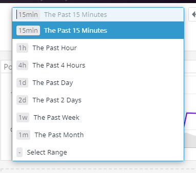

> Note: The pulldown menu only seems to go as granular as Past 15 minutes

* Take a snapshot of this graph and use the @ notation to send it to yourself.

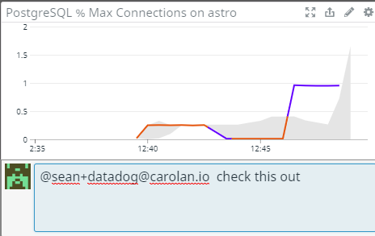

* **Bonus Question**: What is the Anomaly graph displaying?

> The anomaly graph is showing the percentage of used connections on the database.  The orange line represents data points that are 'normal' or within the expected range. Purple indicates data points that have gone outside the expected bounds. More data is required to allow the algorithm to adjust to actual usage patterns.

## Monitoring Data

Since you’ve already caught your test metric going above 800 once, you don’t want to have to continually watch this dashboard to be alerted when it goes above 800 again. So let’s make life easier by creating a monitor.

Create a new Metric Monitor that watches the average of your custom metric (my_metric) and will alert if it’s above the following values over the past 5 minutes:

* Warning threshold of 500
* Alerting threshold of 800
* And also ensure that it will notify you if there is No Data for this query over the past 10m.

Please configure the monitor’s message so that it will:

* Send you an email whenever the monitor triggers.
* Create different messages based on whether the monitor is in an Alert, Warning, or No Data state.
* Include the metric value that caused the monitor to trigger and host ip when the Monitor triggers an Alert state.
* When this monitor sends you an email notification, take a screenshot of the email that it sends you.

> The terraform code used to create the monitor and downtime schedules is in [solution/dd_monitor.tf](./solution/dd_monitor.tf)

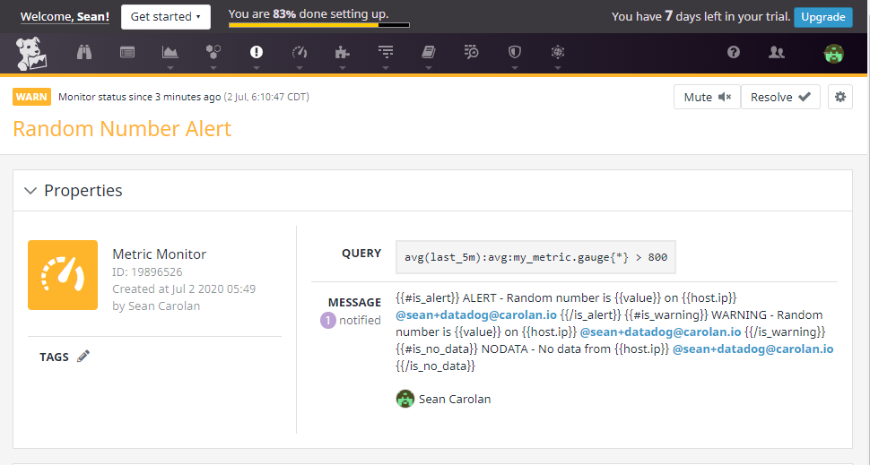

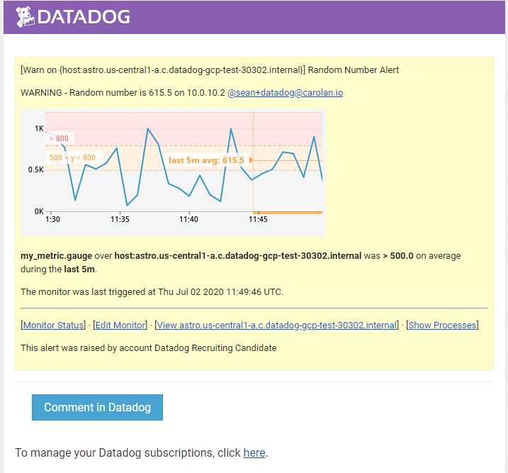

* **Bonus Question**: Since this monitor is going to alert pretty often, you don’t want to be alerted when you are out of the office. Set up two scheduled downtimes for this monitor:

  * One that silences it from 7pm to 9am daily on M-F,
  * And one that silences it all day on Sat-Sun.
  * Make sure that your email is notified when you schedule the downtime and take a screenshot of that notification.

> NOTE: I used an offset for the timing of the downtime, to be kind to our US-based employees. The timezone offset is configurable in the Terraform code. Also, I added Sunday night to the 'weeknight' downtimes so as not to wake up our engineers between midnight at 7am on Monday morning...

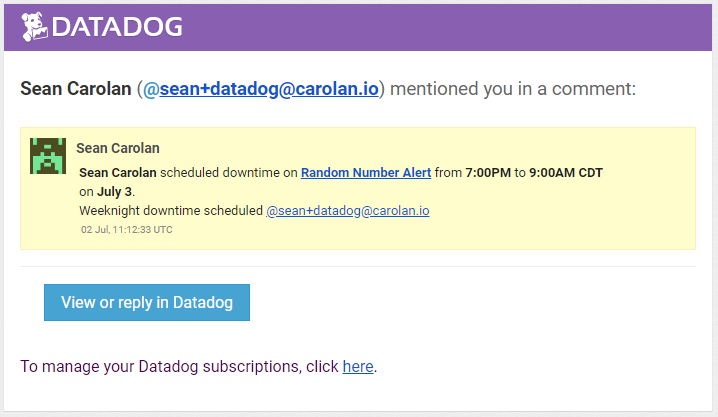

## Collecting APM Data:

Given the following Flask app (or any Python/Ruby/Go app of your choice) instrument this using Datadog’s APM solution:

```python
from flask import Flask
import logging
import sys

# Have flask use stdout as the logger
main_logger = logging.getLogger()
main_logger.setLevel(logging.DEBUG)
c = logging.StreamHandler(sys.stdout)
formatter = logging.Formatter('%(asctime)s - %(name)s - %(levelname)s - %(message)s')
c.setFormatter(formatter)
main_logger.addHandler(c)

app = Flask(__name__)

@app.route('/')
def api_entry():
    return 'Entrypoint to the Application'

@app.route('/api/apm')
def apm_endpoint():
    return 'Getting APM Started'

@app.route('/api/trace')
def trace_endpoint():
    return 'Posting Traces'

if __name__ == '__main__':
    app.run(host='0.0.0.0', port='5050')
```

* **Note**: Using both ddtrace-run and manually inserting the Middleware has been known to cause issues. Please only use one or the other.

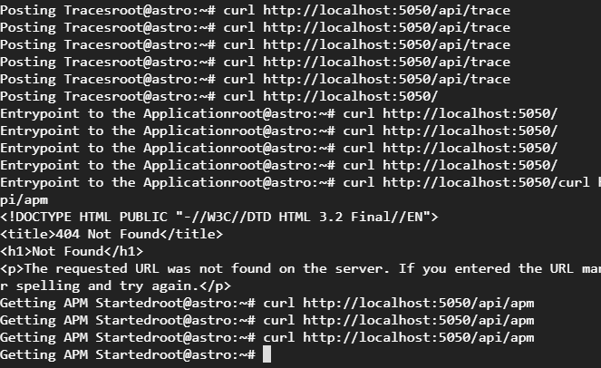

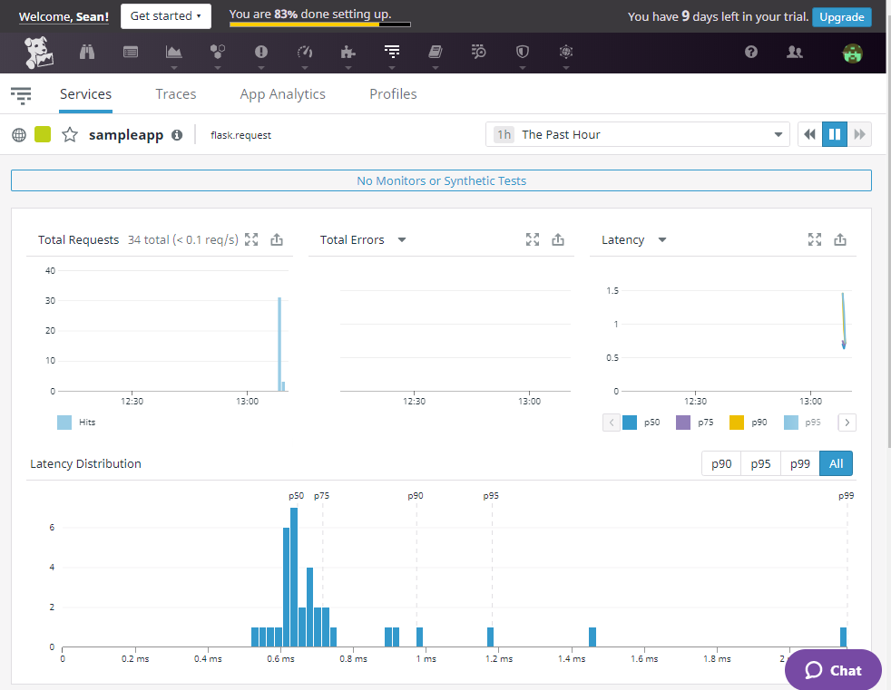

* **Bonus Question**: What is the difference between a Service and a Resource?

> Services are the building blocks of modern microservice architectures - broadly a service groups together endpoints, queries, or jobs for the purposes of building your application.

> https://docs.datadoghq.com/tracing/visualization/#services

> Resources represent a particular domain of a customer application - they are typically an instrumented web endpoint, database query, or background job.

> https://docs.datadoghq.com/tracing/visualization/#resources

Provide a link and a screenshot of a Dashboard with both APM and Infrastructure Metrics.

> Here is a quick dashboard I whipped up showing CPU (Infrastructure) and APM (Latency on sampleapp)

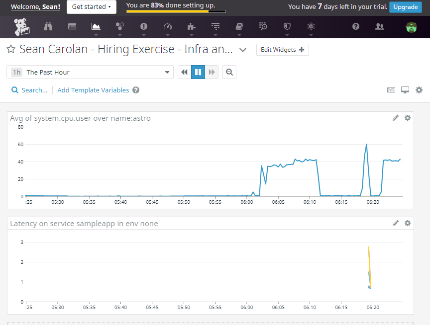

## Dashboard and monitor links for Sean Carolan:
https://app.datadoghq.com/dashboard/szg-x5q-3kt/datadog-tutorial-dashboard<br>
https://app.datadoghq.com/dashboard/a7v-mv2-3id/sean-carolan---hiring-exercise---infra-and-apm<br>
https://app.datadoghq.com/apm/service/sampleapp/flask.request<br>
https://app.datadoghq.com/monitors/19896526<br>
https://app.datadoghq.com/monitors#downtime?id=878657788<br>
https://app.datadoghq.com/monitors#downtime?id=878657787

Please include your fully instrumented app in your submission, as well.

> I used the sample code you included in the hiring exercise, it is stored in solution/assets/flaskapp.py. I ran it with the following command:

```
nohup ddtrace-run python3 /home/ubuntu/flaskapp.py &
```

> I then used the curl command to generate traffic on the endpoints.

## Final Question:

Datadog has been used in a lot of creative ways in the past. We’ve written some blog posts about using Datadog to monitor the NYC Subway System, Pokemon Go, and even office restroom availability!

Is there anything creative you would use Datadog for?

>Absolutely. The NASA Mars Insight lander has a public API:

> https://mars.nasa.gov/insight/weather/

> I would build a Datadog monitor that checks the weather at Elysium Planitia.