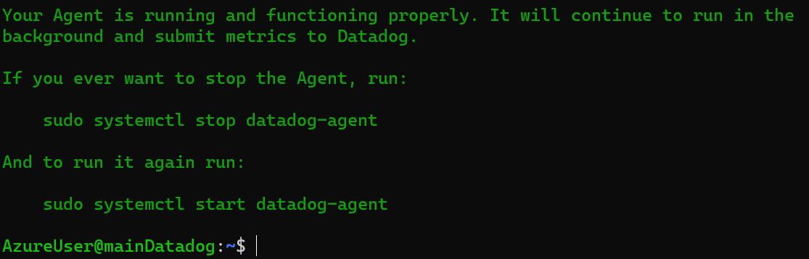
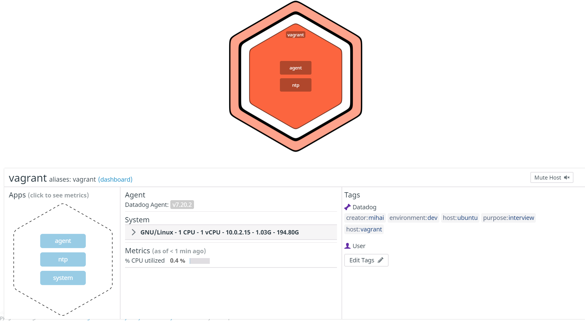

```       
       .-'`   `'-.
   _,.'.===   ===.'.,_
  / /  .___. .___.  \ \
 / /   ( o ) ( o )   \ \                                            _
: /|    '-'___'-'    |\ ;                                          (_)
| |`\_,.-'`   `"-.,_/'| |                                          /|
| |  \             /  | |                                         /\;
| |   \           /   | | _                              ___     /\/
| |    \   __    /\   | |' `\-.-.-.-.-.-.-.-.-.-.-.-.-./`   `"-,/\/ 
| |     \ (__)  /\ `-'| |    `\ \ \ \ \ \ \ \ \ \ \ \ \`\       \/
| |      \-...-/  `-,_| |      \`\ \ \ \ \ \ \ \ \ \ \ \ \       \
| |       '---'    /  | |       | | | | | | | | | | | | | |       |
| |               |   | |       |    Datadog - Mihai    | |       |
\_/               |   \_/       | | | | | | | | | | | | | | .--.  ;
                  |       .--.  | | | | | | | | | | | | | | |  | /
                   \      |  | / / / / / / / / / / / / / /  |  |/
                   |`-.___|  |/-'-'-'-'-'-'-'-'-'-'-'-'-'`--|  |
            ,.-----'~~;   |  |                  (_(_(______)|  |
           (_(_(_______)  |  |                         ,-----`~~~\
                    ,-----`~~~\                      (_(_(_______)
                   (_(_(_______)

```
# Prerequisites - Setting up the environment

- [x] Spinned up an Azure Ubuntu VM and connected to it.


- [x] Installed a Datadog agent



# Collecting Metrics

- [x] Edited the datadog.yaml file, added the tags, restarted the Datadog Agent



1. Solutions Engineer: check out the `solutions-engineer` [branch](https://github.com/DataDog/hiring-engineers/tree/solutions-engineer) of this repository.
2. Devops Evangelist: check out the `devops-evangelist` [branch](https://github.com/DataDog/hiring-engineers/tree/devops-evangelist) of this repository.


# How do I submit my results?

1. Fork this repository.
2. Check out the branch that interests you.
3. Commit your work.
4. Submit a pull request against this upstream repository.

# Questions?
File an issue in this repository.
