Sean Yu - Support Engineer

## Level 1 - Collecting your Data
### Sign up for Datadog (use "Datadog Recruiting Candidate" in the "Company" field), get the Agent reporting metrics from your local machine.
To signup for a trial account with Datadog, navigate to the datadog [website](www.datadoghq.com).
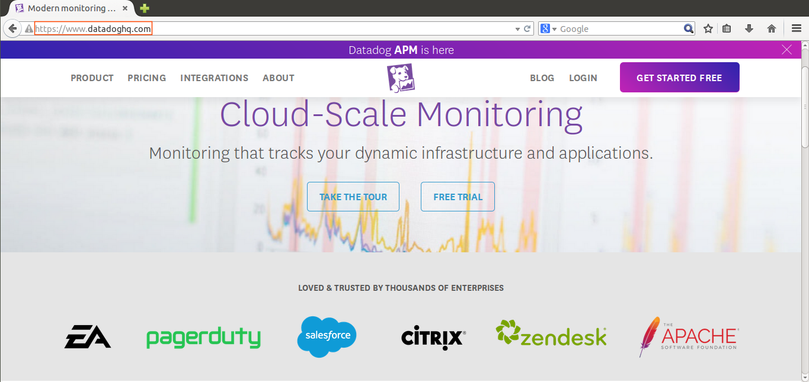
And click on the "GET STARTED FREE" button.

Fill up the form. Don't forget to key in Datadog Recruiting Candidate" in the "Company" field.

After clicking the "Sign up" button, you will be greeted by a page with a short survey.
You can fill up the form or just skip it.
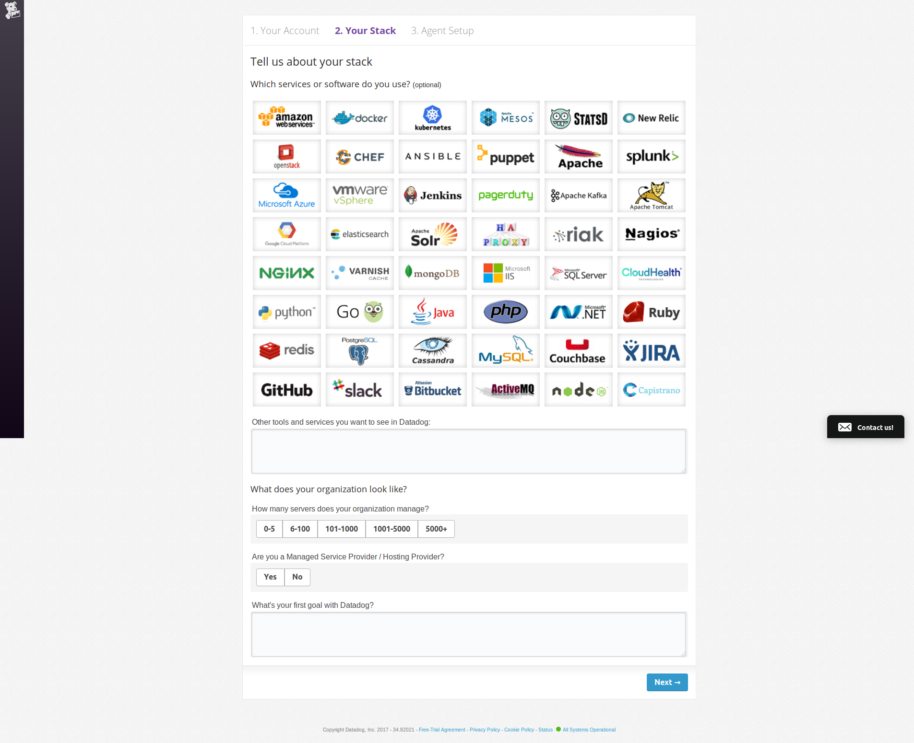
We are now in the page for us to setup the Datadog Agent.
Since our host machine is using Ubuntu 12.04, 
lets click on Ubuntu on the left hand navigation bar.
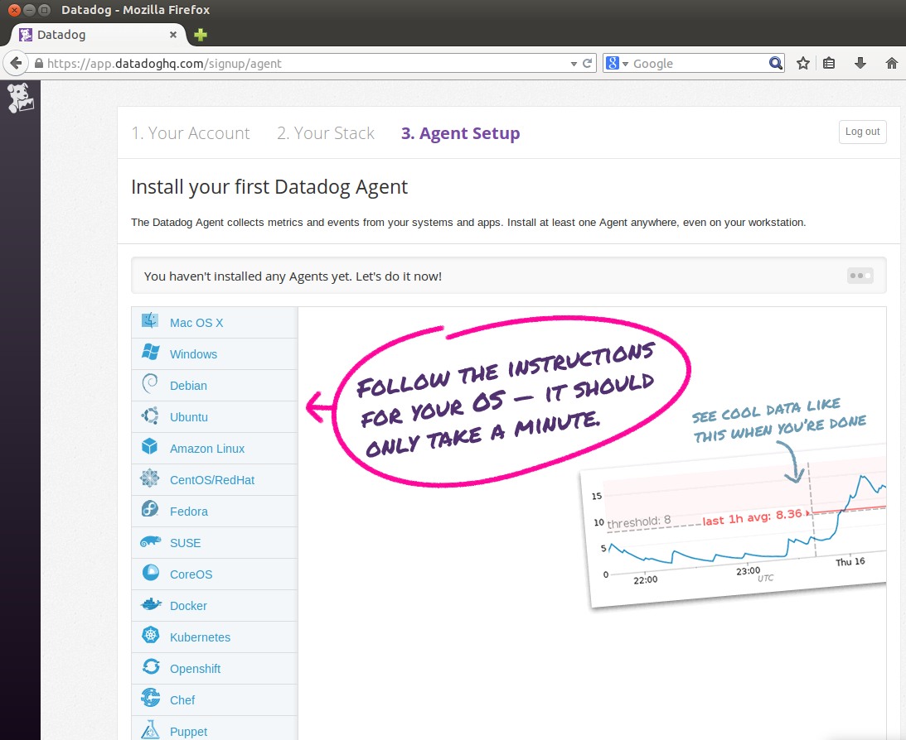
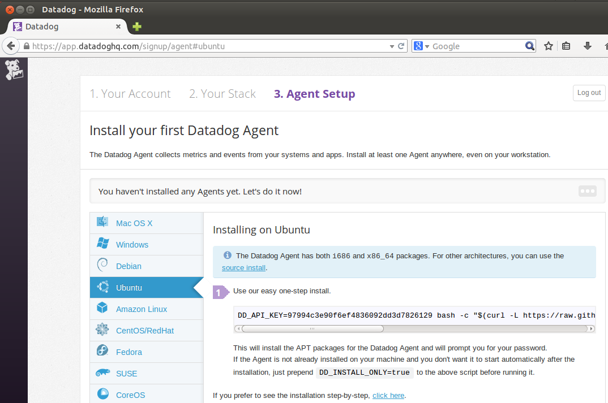
Open a terminal and execute the code.
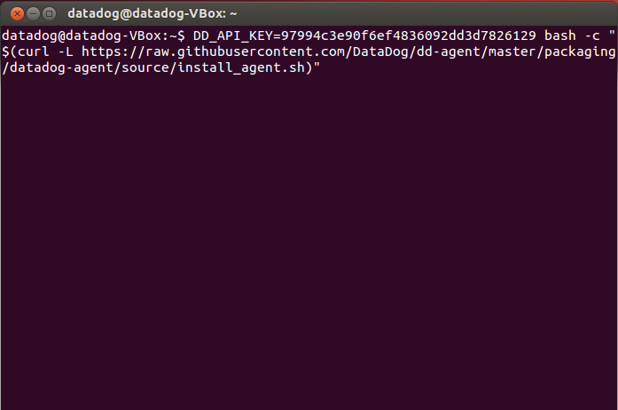
The Datadog Agent installation is pretty quick and will show quite a long text showing the installation progress.
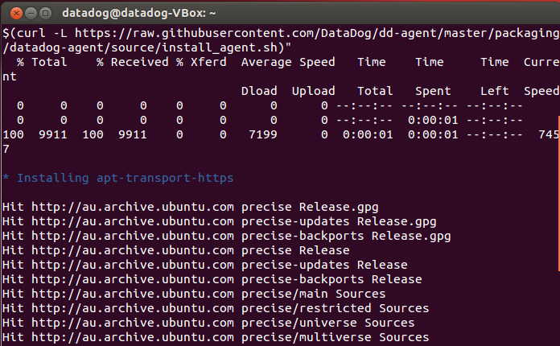
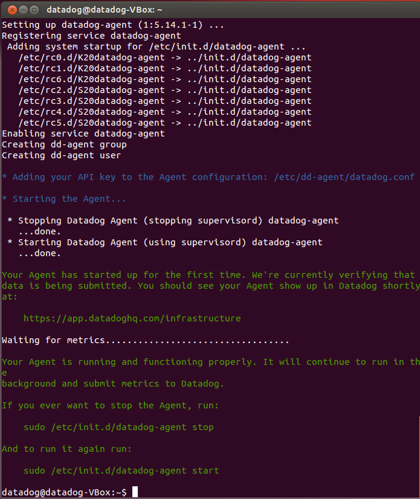
After all that action in the Terminal is finished, lets go back to our web browser and click the "Finish" button.
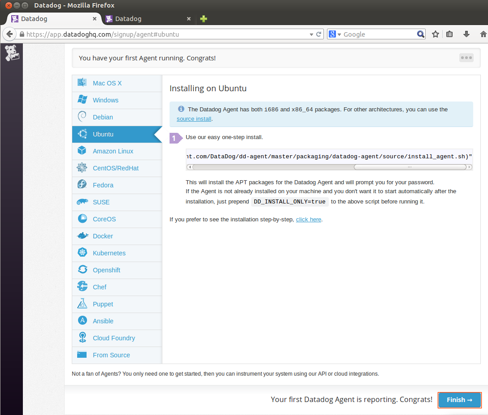
On the next page, we should be able to see that our Ubuntu host is now sending data to our Datadog account in the cloud.
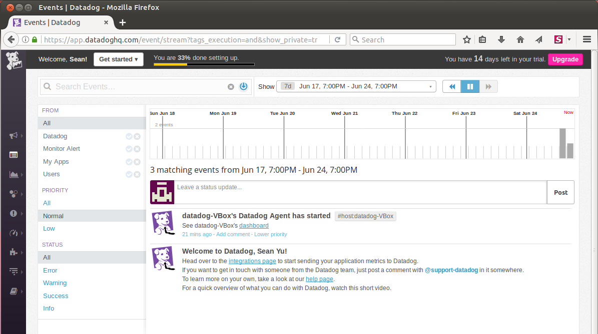
*Useful Links*
  * [Agent Status and Information](https://help.datadoghq.com/hc/en-us/articles/203764635-Agent-Status-and-Information)  
  * [Start/Stop/Restart the Datadog Agent](https://help.datadoghq.com/hc/en-us/articles/203764515-Start-Stop-Restart-the-Datadog-Agent)

2. Bonus question: In your own words, what is the Agent?
>An agent is an application which runs in the background, and performs different kinds of tasks. In the case of our newly installed Datadog Agent, it collects and sends metrics about our Ubuntu installation to Datadog's servers.

3. Add tags in the Agent config file and show us a screenshot of your host and its tags on the Host Map page in Datadog.  
> Let us now add tags to our host so it can be easily be identified in our Datadog Dashboard. We first need to locate the Agent configuration file in our Ubuntu installation.
In Linux, the Agent configuration file is located at **/etc/dd-agent/datadog.conf**.  
You will need to open the configuration file with sudo, using your preferred text editor.  
The snippet below opens the Agent configuration file, with sudo privileges, using the text editor gedit.    
```
sudo gedit /etc/dd-agent/datadog.conf
```
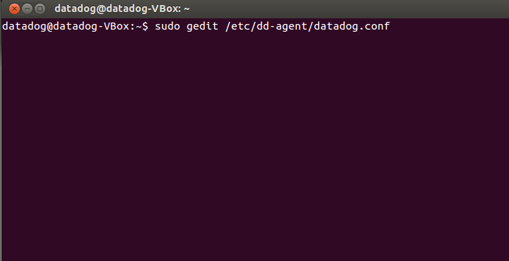
Look for the line which has the text "Set the host's tags (optional)", and below that line add your tags in key:value pairs.
Try adding the line below on the datadog.conf file.

>**tags: os:ubuntu1404, country:aus**

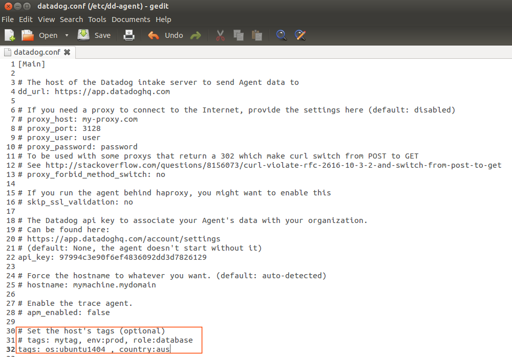

After adding the line and saving the file, go to Host Map page in your Datadog account.
To see the new tags that we just added.

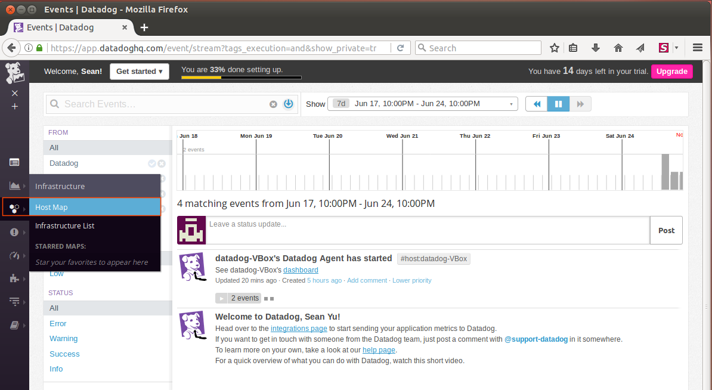
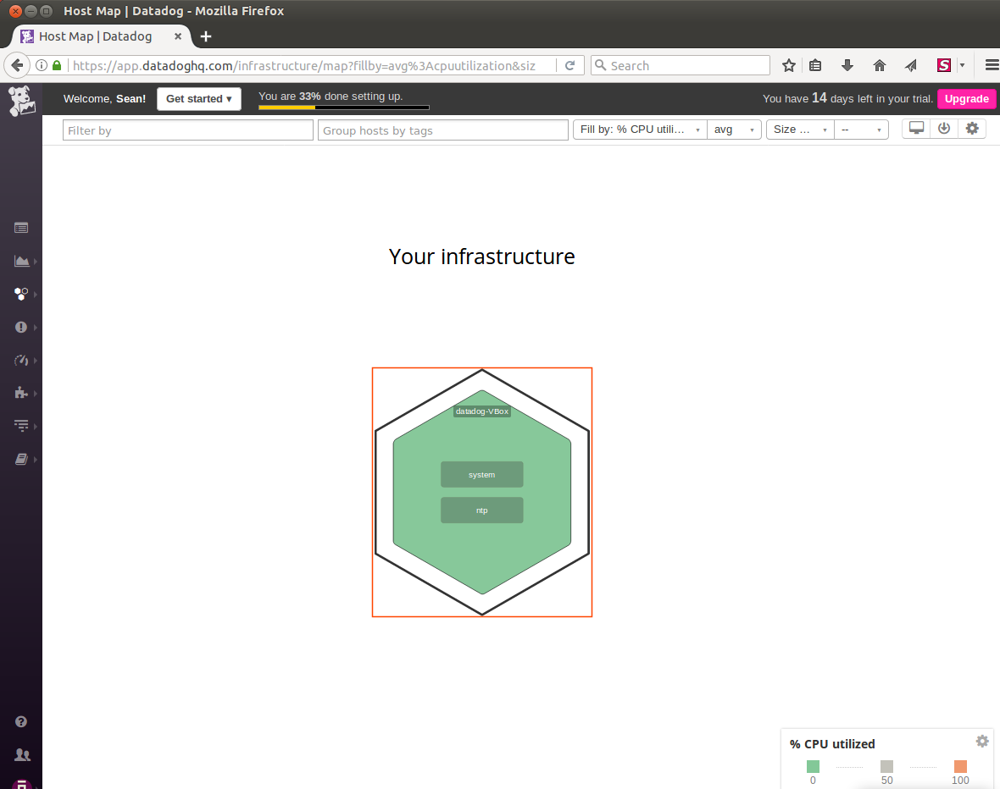
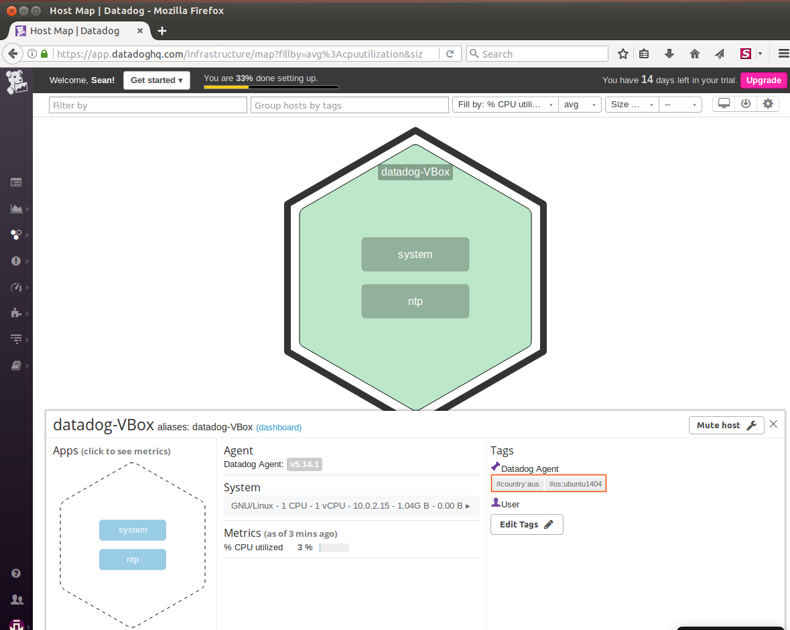

If you were not able to see the tags we added to datadog.conf,  double check if the syntax is correct. 
Please see the rules for tag naming [here](https://help.datadoghq.com/hc/en-us/articles/204312749-Getting-started-with-tags).
Lastly, try restarting the Datadog agent by running the code below in the terminal:

```
sudo /etc/init.d/datadog-agent restart
```
*Useful links* 
* [Where is the configuration file for the Agent?](https://help.datadoghq.com/hc/en-us/articles/203037169-Where-is-the-configuration-file-for-the-Agent-)  
* [Getting Started with Tags](https://help.datadoghq.com/hc/en-us/articles/204312749-Getting-started-with-tags)
