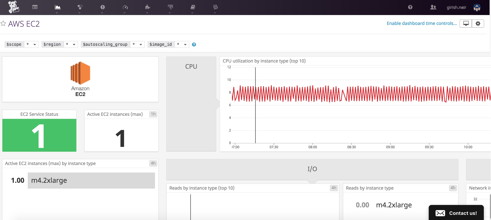
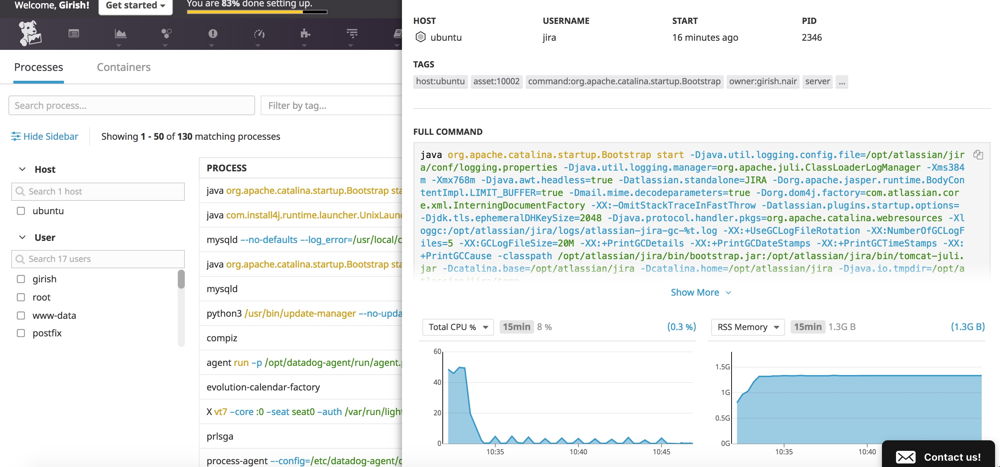
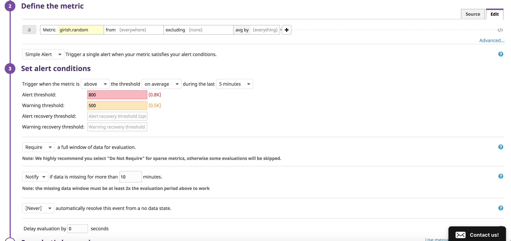
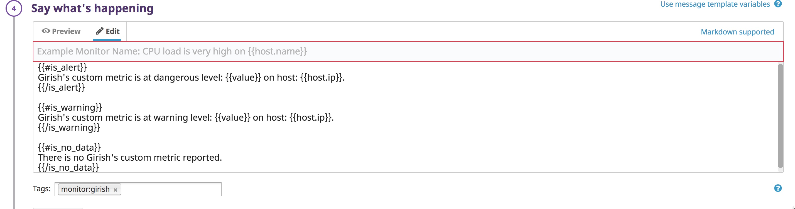
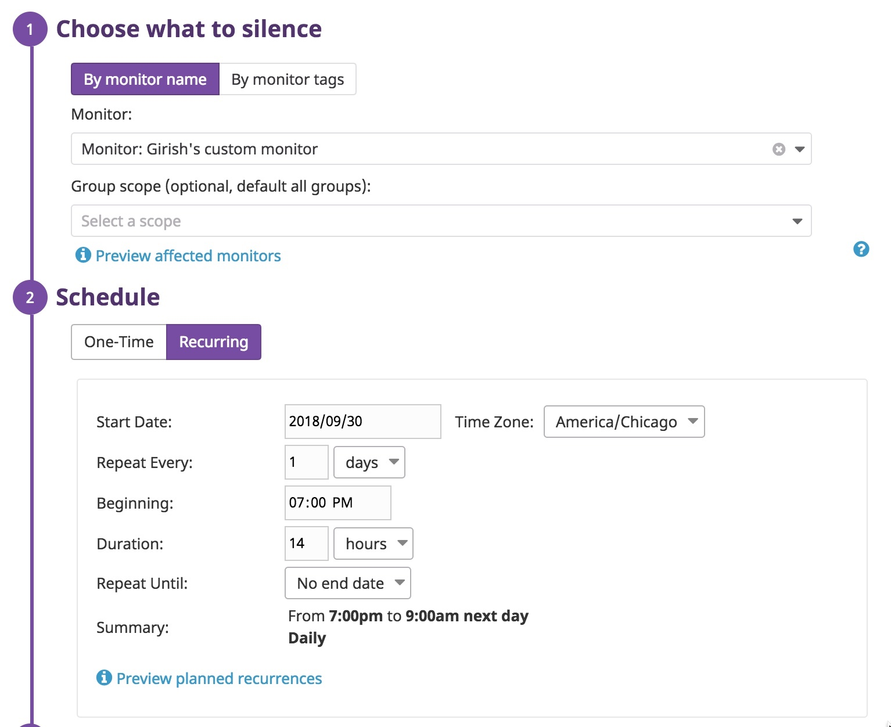
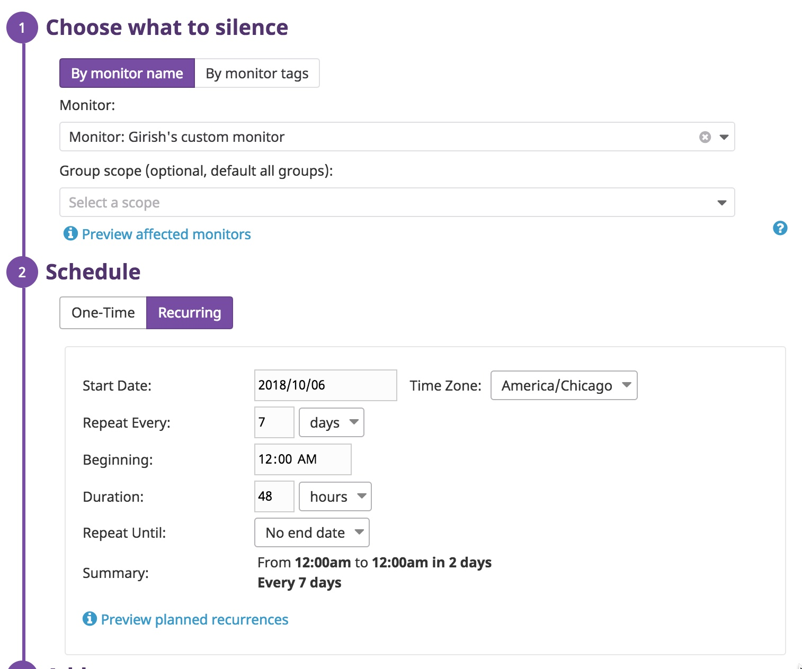

## Collecting Metrics


### Exercise 1 

I use the following [Datadog config](./opt/datadog-agent/etc/datadog.yaml) file for my Macbook Pro agent. **I also experimented with Ubuntu Linux and Windows agents.** 

Here is a view of my Macbook Pro with tags.


The integration with AWS was a breeze. Here is a view of one of my EC2 instances.




### Exercise 2

The Datadog MongoDB agent is setup to monitor on my local workstation.


### Exercise 3

I added a custom metric "girish.random" to display a random number between 0 and 1000.

 The customer metric files are [random_num.py](./opt/datadog-agent/etc/checks.d/random_num.py) and [random_num.yaml](./opt/datadog-agent/etc/conf.d/random_num.yaml). The `min_collection_interval` has been set to `45 seconds`.

Here is a view of my custom metric dashboard. 


### Exercise 4

I was intrigued by the Process view and wanted to see it in action. I could not get it to work on my Macbook. I therefore tried it on Ubuntu and found out that I was missing a valid instance configuration. I finally got it working with the following [process config](./opt/datadog-agent/etc/conf.d/process.yaml). I came to the realization that  Mac agent is hard to troubleshoot as the log output is not very good. 

Here is a view of my custom metric dashboard. 




## Monitoring Data

I created a custom monitor that triggers alert/warning messages based on the following threshold.



It sends custom messages as defined below.




I added two downtimes:

 - prevent notification after hours daily from 7 pm to 9 am


 - and another for weekend. 



## APM

### Java Agent

I ran the Spring Petclinic application with the following command:

```
java -javaagent:datadog/dd-java-agent-0.16.0.jar -jar ./target/spring-petclinic-1.5.1.jar
```
