## Level 1

#### Sign up for Datadog, get the agent reporting metrics from your local machine.

Successful installation!

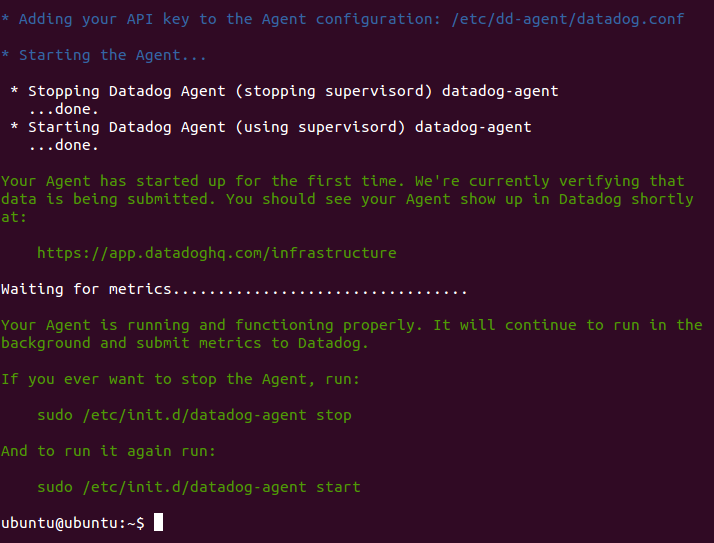

Metrics reported from my local machine!

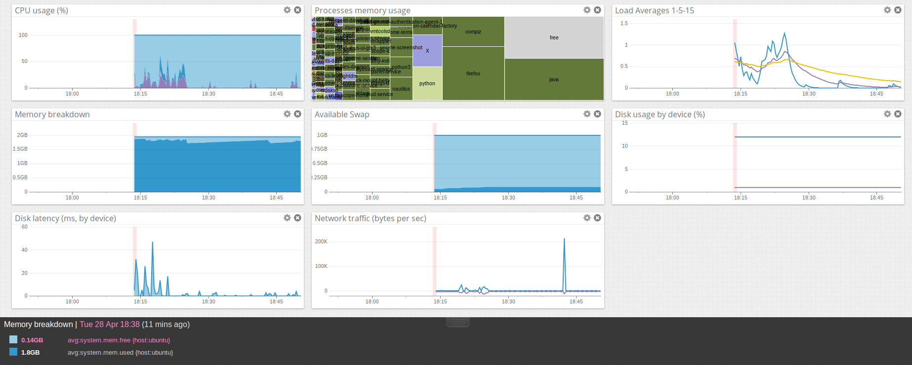

#### Bonus question: What is the agent?

The Datadog agent is software that runs on host machines to collect events and metrics. The data is then sent to
Datadog where it is presented in an easy to read format for clients.

The Datadog agent is comprised of

* The Collector - Runs checks on the host and captures system metrics.
* Dogstatsd - A statsd backend server that receives custom metrics from applications.
* The Forwarder - Responsible for forwarding data from "The Collector" and "Dogstatsd" to Datadog.

#### Submit an event via the API.

[Full code found here!](code/level1.py)

```
# Submit an event via the API.
print api.Event.create(title="My First Event!", text="This event was created via the Datadog API.")
```

```
Response:
{
    u'status': u'ok',
    u'event': {
        u'date_happened': 1430266475,
        u'handle': None,
        u'title': u'My First Event!',
        u'url': u'https://app.datadoghq.com/event/event?id=2785078421481329528',
        u'text': u'This event was created via the Datadog API.',
        u'tags': None,
        u'priority': None,
        u'related_event_id': None,
        u'id': 2785078421481329528
    }
}
```

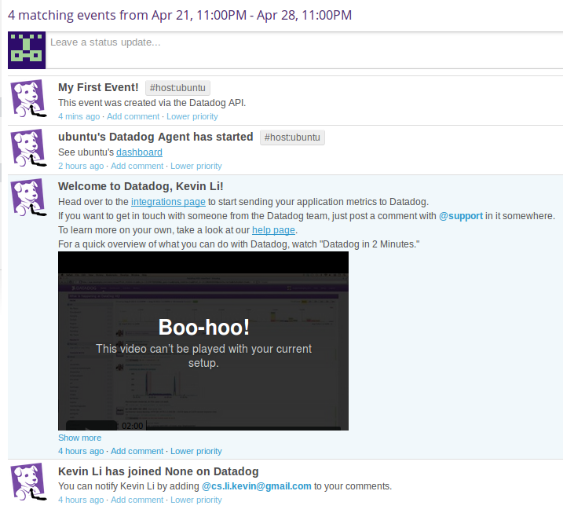

#### Get an event to appear in your email inbox (the email address you signed up for the account with)

[Full code found here!](code/level1.py)

```
# Submit an event via the API and send out an email notification.
print api.Event.create(title="My First Email Event!", text="@cs.Li.Kevin@gmail.com This event was created via the Datadog API.")
```

```
Response:
{
    u'status': u'ok',
    u'event': {
        u'date_happened': 1430267871,
        u'handle': None,
        u'title': u'My First Email Event!',
        u'url': u'https://app.datadoghq.com/event/event?id=2785101829824845689',
        u'text': u'@cs.Li.Kevin@gmail.com This event was created via the Datadog API.',
        u'tags': None,
        u'priority': None,
        u'related_event_id': None,
        u'id': 2785101829824845689
    }
}
```

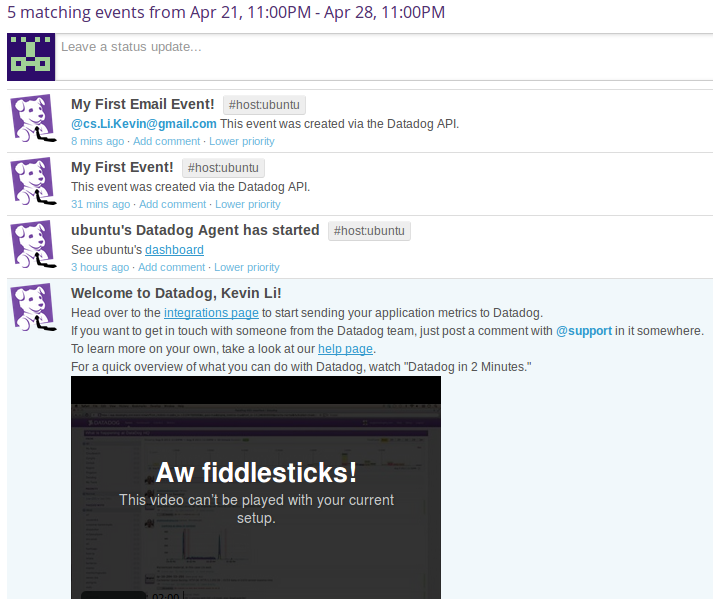

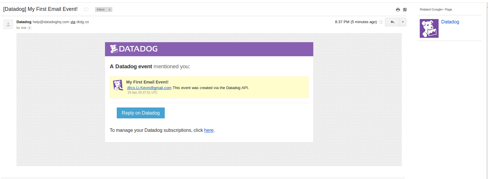

## Level 2

#### Take a simple web app ([in any of our supported languages](http://docs.datadoghq.com/libraries/)) that you've already built and instrument your code with dogstatsd. This will create **metrics**.

I added dogstatsd to a simple web application so that the page view counter is incremented every time the home page is visited. [Full code found here!](code/level2.py)

```
class Home:
    def GET(self):
        # Increment the page view counter every time the home page is viewed.
        statsd.increment("page.views")
        return "Homepage"
```

#### While running a load test (see References) for a few minutes, visualize page views per second. Send us the link to this graph!

```
apt-get install apache2-utils
ab -n 100000 -c 100 -r http://0.0.0.0.:8080/
```

Note: The -r option is required to prevent Apache from exiting when there is a socket error.

<a href="https://app.datadoghq.com/graph/embed?token=a12aeb9d0a74e7b2db2e819dc15ce6c4fa46f646adcbdfac14639e11eb93250d&height=300&width=600&legend=false">Link to live graph.</a>

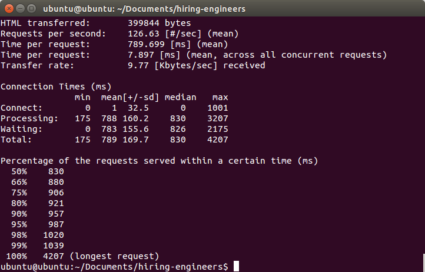

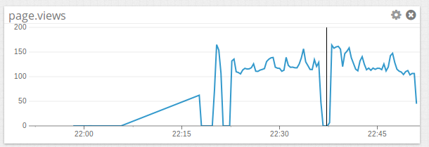

#### Create a histogram to see the latency; also give us the link to the graph

I used the timed decorator to get the latency each request. [Full code found here!](code/level2.py)

```
class Home:
    @statsd.timed("page.latency")
    def GET(self):
        # Increment the page view counter every time the home page is viewed.
        statsd.increment("page.views")
        return "Home"
```

<a href="https://app.datadoghq.com/graph/embed?token=8790353a418d362afd53bbe8c6cfa559473da8bec357b887377512188d786e71&height=300&width=600&legend=false">Link to live graph.</a>

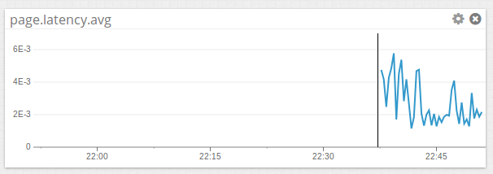

#### Bonus points for putting together more creative dashboards.

## Level 3

Using the same web app from level 2:

#### tag your metrics with `support` (one tag for all metrics)

[Full code found here!](code/level3.py)

#### tag your metrics per page (e.g. metrics generated on `/` can be tagged with `page:home`, `/page1` with  `page:page1`)

[Full code found here!](code/level3.py)

#### visualize the latency by page on a graph (using stacked areas, with one color per `page`)

I ran the following commands at the same time in different terminals.

```
ab -n 2500 -c 100 -r http://0.0.0.0.:8080/
ab -n 2500 -c 100 -r http://0.0.0.0.:8080/about
ab -n 2500 -c 100 -r http://0.0.0.0.:8080/contact
```

<a href="https://app.datadoghq.com/graph/embed?token=cdbd5397ab1f2bfc16ae5e8e42a3d3eda27cae8e7834193d8e178092e7b78b94&height=300&width=600&legend=true">Link to live graph.</a>

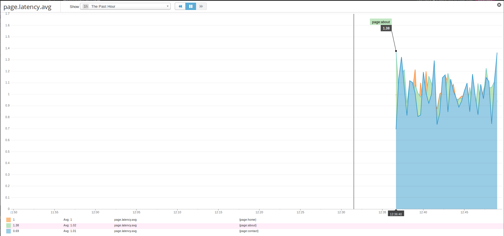

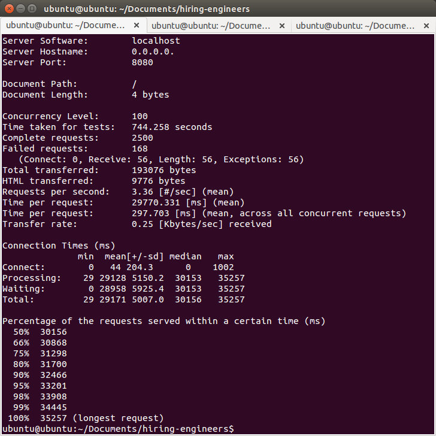

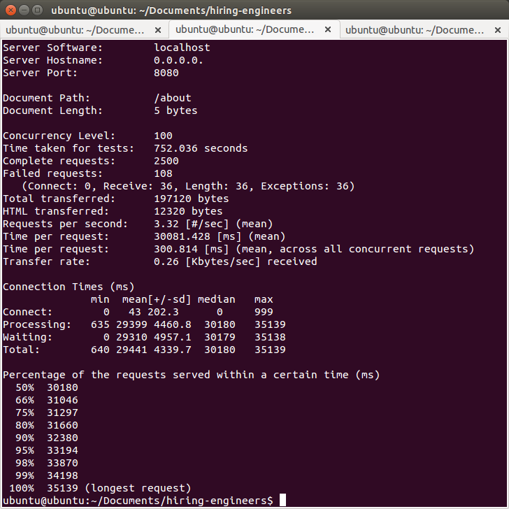

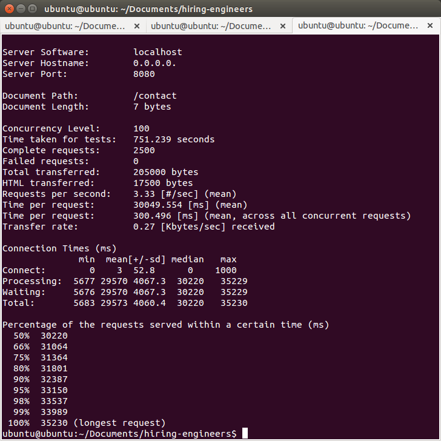

## Level 4

Same web app:

#### count the overall number of page views using dogstatsd counters.

#### count the number of page views, split by page (hint: use tags)

#### visualize the results on a graph

Total page view graph

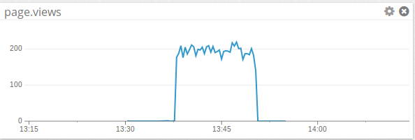

Total page view graph by page

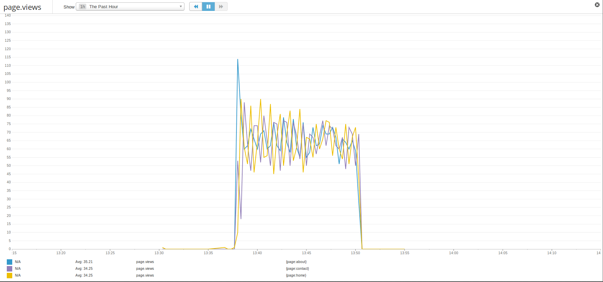

Total Home page view graph

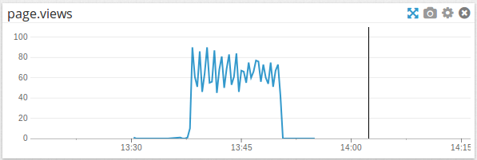

Total About page view graph

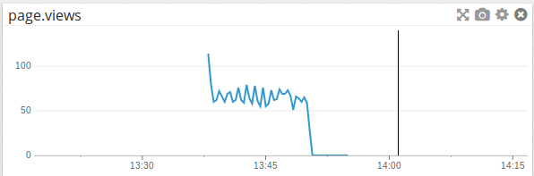

Total Contact page view graph

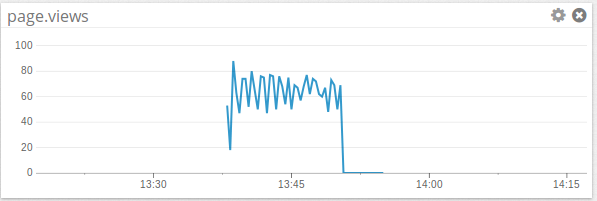

#### Bonus question: do you know why the graphs are very spiky?

It has to do with the interval that stats are being collected at. For example the Collector collects standard metrics every 15 seconds so all data within that 15 seconds are lumped together resulting in sharp points.

## Level 5

Let's switch to the agent.

#### Write an agent check that samples a random value. Call this new metric: `test.support.random`
#### Visualize this new metric on Datadog, send us the link.

Here is a snippet that prints a random value in python:

```python
import random
print(random.random())
```