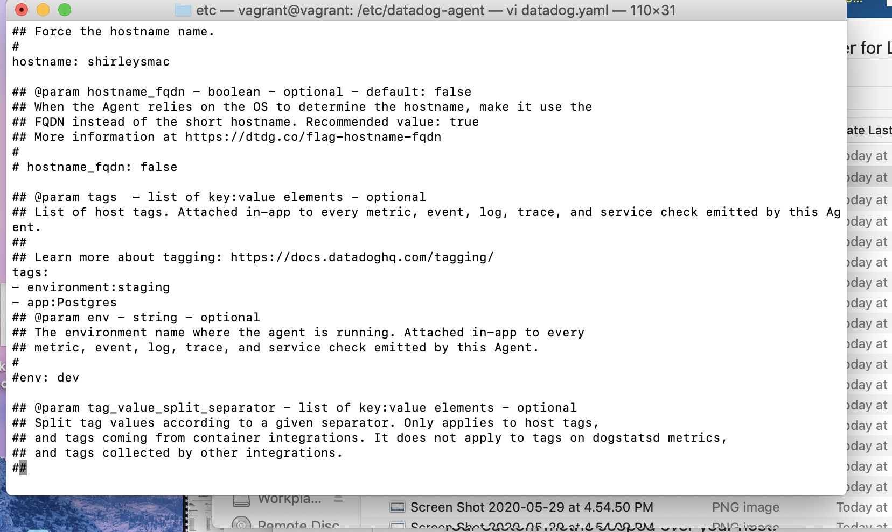

Your answers to the questions go here.

###Prerequisites - Setup the environment###

Decided to spin up a fresh linux VM via Vagrant.

Then signed up for  Datadog (used “Datadog Recruiting Candidate” in the “Company” field).

##Collecting Metrics!##
Task: Add tags in the Agent config file and show us a screenshot of your host and its tags on the Host Map page in Datadog.

Task: Install a database on your machine (MongoDB, MySQL, or PostgreSQL) and then install the respective Datadog integration for that database.

Task: Create a custom Agent check that submits a metric named my_metric with a random value between 0 and 1000.

Task: Change your check's collection interval so that it only submits the metric once every 45 seconds.

Bonus Question Can you change the collection interval without modifying the Python check file you created?
