## Datadog Coding Challenge - Bradley Shields

Hello Datadog, here is the livedoc I created while completing the Datadog Coding Challenge. It was suggested that I document my thought process, steps that worked, those that didn't, and so on. I've positioned the detail level of my answers to be somewhere between a process explanation to a colleague, and that of a workflow you might send a capable client that may need guidance -  enough detail to reproduce results, even through sub-steps like installing other packages, and so on. 

I know that you all are extremely familiar, but I thought a detailed account would make a useful reference later and show my thought process as well. I've enjoyed this challenge and learned a few things from it; thank you for the opportunity.

With that, let's begin.
  


## Format Testing - Embedding Images:

The first section is an initial test for markdown and image embedding syntax. Answers to the Challenge begin at "Prerequisites - Setup the Environment." 

To be sure I knew how to embed my screenshots, and that my markdown formatting displayed as I expected, I created the repository [datadog_test](https://github.com/bradleyjay/datadog_test). I tried two methods to embed images from github's "Mastering Markdown" [guide.](https://guides.github.com/features/mastering-markdown/)

##### Method 1: Absolute github path

`````` 

This works, but that's not necessarily a static URL. Depending on the branch referenced, that URL grows to include the branch name, and "tree". That's risky if structure changes in the repo.

##### Method 2: Relative github path

``` ```


In this case, a relative path worked better for me because it allowed me to organize and update images locally within the repo, all in one location. And so,


As you can clearly see, here we have a prime example of Datadog. I can't wait to work with your product more. With image embedding out of the way, I set up the environment for the **Coding Challenge.**


# Prerequisites - Setup the Environment

*You can utilize any OS/host that you would like to complete this exercise. However, we recommend one of the following approaches:*
  - *You can spin up a fresh Linux VM via Vagrant or other tools so that you don’t run into any OS or dependency issues. Here are instructions for setting up a Vagrant Ubuntu VM. We strongly recommend using minimum v. 16.04 to avoid dependency issues.*
  - *You can utilize a Containerized approach with Docker for Linux and our dockerized Datadog Agent image.*
---
  
## Virtual Machine Setup
##### Step 1: Initial VM Install and Launch

Having used Docker briefly before, I was curious to learn about Vagrant. I followed the [guide](https://www.vagrantup.com/intro/getting-started/) for setting up a Vagrant Virtual Machine(VM) project:
- Downloaded and installed [Vagrant](https://www.vagrantup.com/downloads.html) 2.1.2 for macOS.
- Per Vagrant's recommendation, updated my [VirtualBox](https://www.virtualbox.org/wiki/Downloads) install to 5.2.18. 

Then, I tested launching the VM via

    vagrant init hashicorp/precise64
    vagrant up 

And confirmed successful access to the VM via ```vagrant ssh```. 

##### Step 2: VM Customization

With the VM up and running, that's great, but the DataDog coding challenge specifically recommends running Ubuntu v.16.04. By default, Vagrant VM boots into Ubuntu 12.04 LTS. I changed that to ensure my dependencies were in-line for the Datadog Agent.

Vagrant base images are called "boxes," and cloning one is how a VirtualBox environment is chosen. From the [Box Catalog](https://app.vagrantup.com/boxes/search?page=1&provider=virtualbox&q=ubuntu+16.04&sort=downloads&utf8=%E2%9C%93) I found [Ubuntu 16.04 LTS](https://app.vagrantup.com/ubuntu/boxes/xenial64). Adding the ```config.vm.box``` line to the Vagrantfile like so:

    Vagrant.configure("2") do |config|
       config.vm.box = "ubuntu/xenial64"
    end

 gave me access to this box. I then commented out the previous ```config.vm.box``` line to deselect Ubuntu 12.04 LTS. This version of the virtual box was already running, so a ```vagrant destroy``` was used to remove that instance of the virtual machine. 

 I then ran a ```vagrant up```, which downloaded the new 16.04 LTS box and started my new server. Finally, ```vagrant ssh``` brought me into the new version of the box. Upon launch, there was a message about Ubuntu 18.04.1 LTS being available, but I opted to use 16.04 LTS until I found stability or dependency issues. The Ubuntu 16.04 LTS box has *many* more downloads, so the odds seem good that it's a very stable release, despite being a daily build.  
  
---
> *Then, sign up for Datadog (use “Datadog Recruiting Candidate” in the “Company” field), get the Agent reporting metrics from your local machine.*
---
## Datadog and Agent Setup
##### Step 1: Datadog Signup and Stack Specification

As instructed, I signed up for Datadog as a "Datadog Recruiting Candidate", then informed Datadog about my stack (Python, MySQL, GitHub, Slack). For the Agent Setup, I chose Ubuntu (since we'll be using our VM, not my local macOS), and applied the provided command to my Vagrant box:

```DD_API_KEY=8677a7b08834961d73c4e0e22dbd6e07 bash -c "$(curl -L https://raw.githubusercontent.com/DataDog/datadog-agent/master/cmd/agent/install_script.sh)"```

##### Step 2: Agent Installation
After a number of get, unpack, and install calls, the Datadog Agent reported it was running and functioning properly. For reference, the installer reported at the end:

    If you ever want to stop the Agent, run:

        ```sudo systemctl stop datadog-agent```

    And to run it again run:

        ```sudo systemctl start datadog-agent```


(Some useful Agent Commands - [Start, Stop, Restart](https://docs.datadoghq.com/agent/faq/agent-commands/#start-stop-restart-the-agent))


# Section 1: Collecting Metrics

*Add tags in the Agent config file and show us a screenshot of your host and its tags on the Host Map page in Datadog.*

---
## Adding Host Tags
##### Step 1: Find the Agent config file
At this point, I went to the Datadog [overview](https://docs.datadoghq.com/) documentation, and opened up the Agent section. Selecting [Ubuntu](https://docs.datadoghq.com/agent/basic_agent_usage/ubuntu/), the Agent config file location is listed. Looking through the Datadog Agent Installer output in my VM terminal window, I could see Agent V6 was installed, not V5. The Agent config file is therefore located at ```/etc/datadog-agent/datadog.yaml```.

##### Step 2: Add tags to the config file.
By searching the Datadog Docs documentation for **tags**, I found an [article](https://docs.datadoghq.com/tagging/assigning_tags/) on assigning tags. ["Getting Started With Tags"](https://docs.datadoghq.com/tagging/#tags-best-practices) had further recommendations for useful tags and notes on formatting.

I attempted to use **vi** to open the datadog.yaml, but was denied due to permissions. **Sudo** let me through. Using **/tags** to find the section on tags, I set the following:

    # Set the host's tags (optional)
        tags: machine_name: VagrantVM_Ubuntu1604LTS, region:eastus, env:prod, role:database

*Aside: I notice this mistake later - there's an extra space between **machine_name:** and **VagrantVM_Ubuntu1604LTS**. When I see the Hostmap in the next step, I do immediately notice that my custom tags aren't there, but decided that there may be another later step that updates the Host's info, after some investigating. After setting up my MySQL integration in the following part of "Collecting Metrics," I realize that's not the case when more information is missing. There's more explanation at that point in this document, as you'll see - please keep reading for now. At that time, I came back to (correctly) replace the above two lines with:*

    # Set the host's tags (optional)
        tags: machine_name:VagrantVM_Ubuntu1604LTS, region:eastus, env:prod, role:database 


##### Step 3: Find Hostmap in Datadog, provide screenshot
Back in the browser walk-through for setting up Datadog, the "Datadog 101 - 1 - Overview" [video](https://www.youtube.com/watch?v=uI3YN_cnahk) indicates the Hostmap should be in the Sidebar menu. From **Infrastructure > Hostmap**, note the tags present in the right hand of the pane displaying info about our Ubuntu VM host - they match those added in datadog.yaml: 

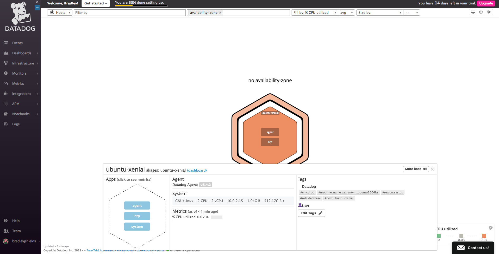

---
> *Install a database on your machine (MongoDB, MySQL, or PostgreSQL) and then install the respective Datadog integration for that database.*
---
## Database Installation and Integration
##### Step 1: Install a database (MySQL)

Following the Debian/Ubuntu apt-get install workflow [guide](https://dev.mysql.com/doc/mysql-apt-repo-quick-guide/en/#apt-repo-fresh-install), I installed via ```sudo apt-get install mysql-server```, and left the root password blank. Of course, that's not secure, but for the proof of concept we're doing here, simplicity seemed wise. I found this [guide](https://www.digitalocean.com/community/tutorials/how-to-install-mysql-on-ubuntu-16-04) useful as well.

I confirmed the SQL server was running via ```systemctl status mysql.service```. The second check to make sure MySQL was running **and** user accessible, done by a version check via ```mysqladmin -p -u root version```:

    vagrant@ubuntu-xenial:~$ mysqladmin -u root version
    mysqladmin: connect to server at 'localhost' failed
    error: 'Access denied for user 'root'@'localhost''

I've seen this before - it's related to the default auth_socket plugin (MySQL does this on macOS too). This [Stack Overflow](https://stackoverflow.com/questions/39281594/error-1698-28000-access-denied-for-user-rootlocalhost) helped resolve the issue. The user root is using the **auth_socket** plugin by default, as below:

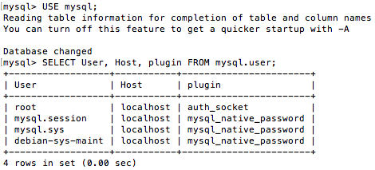

The solution is to grant permissions to the user and use SQL that way (i.e., as vagrant@ubuntu-xenial). So,

    vagrant@ubuntu-xenial:~$ sudo mysql -u root
    mysql> USE mysql
    mysql> CREATE USER 'vagrant'@'localhost' IDENTIFIED BY '';
    mysql> GRANT ALL PRIVILEGES ON *.* TO 'vagrant'@'localhost';
    mysql> UPDATE user SET plugin='auth_socket' WHERE User='vagrant';
    mysql> FLUSH PRIVILEGES;
    sudo service mysql restart

Then, ```mysqladmin -u vagrant version``` correctly outputs the version, indicating that the MySQL service is up, running, and user accessible. ```mysql -u vagrant``` then correctly got me to the MySQL monitor to interact with the MySQL service as necessary.

##### Step 2a: Install the Corresponding Integration for that Database (MySQL) - Preparing MySQL

From the [MySQL Integration Documentation](https://docs.datadoghq.com/integrations/mysql/), MySQL integration comes with the Datadog Agent installation. For configuration, ```conf.d/mysql.d/conf.yaml``` must be edited in the Agent's [configuration directory](https://docs.datadoghq.com/agent/faq/agent-configuration-files/#agent-configuration-directory), which for Linux is ```/etc/datadog-agent/conf.d/```.

Before doing that, the SQL server must be prepared by creating a user for Datadog (in actual documentation, I would of course **never** list the password, as I've done here). These commands use @'localhost', which will work for the single host proof of concept:

    vagrant@ubuntu-xenial:/etc/datadog-agent/conf.d$ sudo mysql -u root
    mysql> CREATE USER 'datadog'@'localhost' IDENTIFIED BY 'datadog';

As in the documentation, user creation is verified via:

    mysql -u datadog --password=datadog -e "show status" | \
    grep Uptime && echo -e "\033[0;32mMySQL user - OK\033[0m" || \
    echo -e "\033[0;31mCannot connect to MySQL\033[0m"
    mysql -u datadog --password=datadog -e "show slave status" && \
    echo -e "\033[0;32mMySQL grant - OK\033[0m" || \
    echo -e "\033[0;31mMissing REPLICATION CLIENT grant\033[0m"

Which then yields an "access denied" error, as expected. To grant the necessary replication client privileges, I logged in as root (this didn't work when logging into MySQL as Datadog):

    vagrant@ubuntu-xenial:/etc/datadog-agent/conf.d$ sudo mysql -u root
    mysql> GRANT REPLICATION CLIENT ON *.* TO 'datadog'@'localhost' WITH MAX_USER_CONNECTIONS 5;
    mysql> GRANT PROCESS ON *.* TO 'datadog'@'localhost';

##### Step 2b: Install the Corresponding Integration for that Database (MySQL) - Enabling Metric Collection
To enable metric collection from the performance_schema database:

    mysql> show databases like 'performance_schema';
    mysql> GRANT SELECT ON performance_schema.* TO 'datadog'@'localhost';

To start gathering MySQL metrics, some code needed to be added to the config file. However, only the example file ```conf.yaml.example``` exists in ```/etc/datadog-agent/conf.d/mysql.d```, so I copied the example to make my own version via```cp conf.yaml.example conf.yaml```. This creates conf.yaml, but the file belongs to root. Finally, I used ```sudo chown dd-agent:dd-agent conf.yaml``` to change ownership properly to the dd-agent.

Next, I modified ```mysql.d/conf.yaml```, replacing the commented-out lines in the example with those listed in the documentation (using **sudo vi**, as the file is read-only). My conf.yaml then looked like:

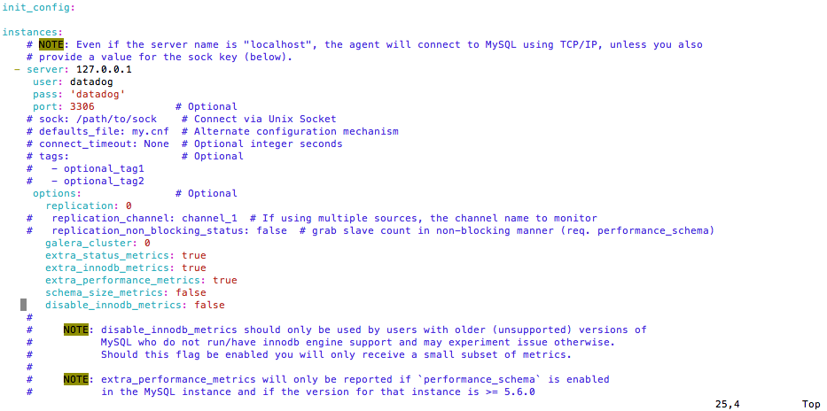

*Aside: After restarting the Agent, I notice in the Datadog dashboard that I can't see my MySQL integration info on my host in Hostmap. I was curious before, when my tags didn't show up in the HostMap, despite being set in my config.yaml file. ```sudo datadog-agent status``` reports that it cannot load the Datadog config file, specifically related to mapping values under the "host tags" section. Opening the config.yaml, I see that I've left an extra space in-between one of my tag key:value pairs. After fixing that, then running ```sudo service datadog-agent start```, and finally the status query again, I can see the Agent is up and running correctly, this time. At this point, I've gone back and updated the HostMap image for my answer under Part 1 of this section, "Collecting Metrics."*

##### Step 2c: Install the Corresponding Integration for that Database (MySQL) - Allow Agent Communication with MySQL
With that complete, the final step was to add the MySQL Integration for Datadog in-browser, and allow the Agent to connect to MySQL. Following the MySQL Integration [guide](https://app.datadoghq.com/account/settings#integrations/mysql), the remaining step was to create the ```conf.d/mysql.yaml``` file as per:

    init_config:

    instances:
     - server: localhost
        user: datadog
        pass: datadog
     
        tags:
            - optional_tag1
            - optional_tag2
        options:
            replication: 0
            galera_cluster: 1

Then, I set ownership and permissions for that file via:
    
    sudo chown dd-agent:dd-agent mysql.yaml 
    sudo chmod 755 ./mysql.yaml 

Restarting the agent with ```sudo service datadog-agent restart```, I then ran the **info** command (```sudo datadog-agent status``` on Linux), confirming that the "Checks" section showed a successful MySQL Collector check:

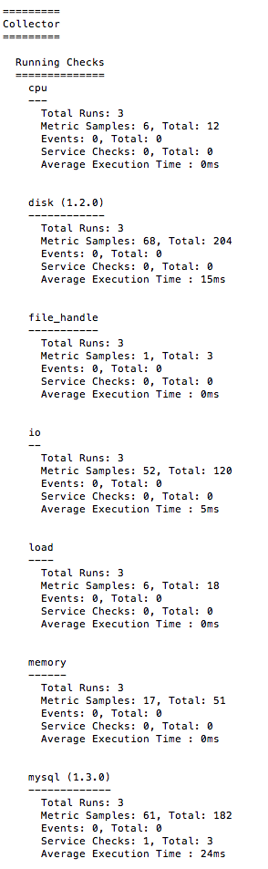

And, finally, I pressed the MySQL "Install Integration" button, completing the Integration install. Checking my Hostmap again, I can see the MySQL Integration:

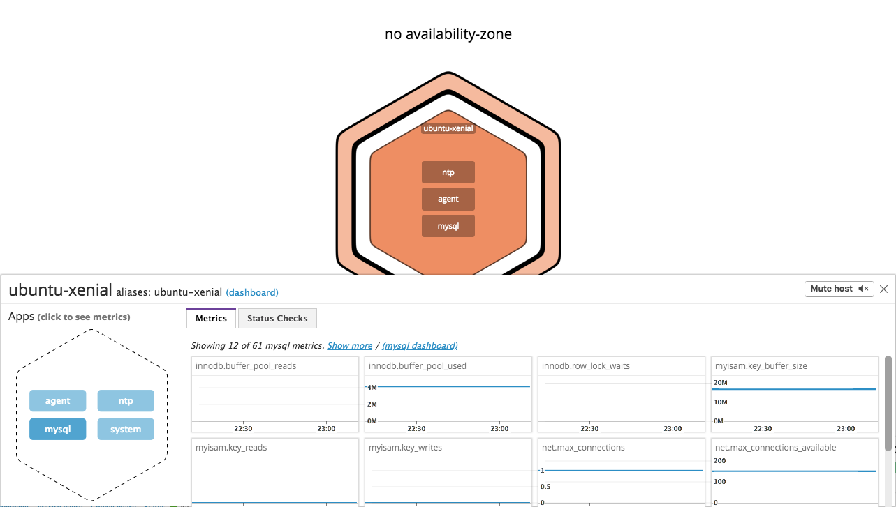

---
> *Create a custom Agent check that submits a metric named my_metric with a random value between 0 and 1000.*
---
## Create an Agent Check
##### Step 1: Create the check and metric, generate a random number

From the Datadog Docs [Agent Checks](https://docs.datadoghq.com/developers/agent_checks/) section, found with the search function and a tiny amount of digging around for the relevant link, checks are handled through the AgentCheck interface. The documentation provides a simple tutorial.

I created my_metric.yaml in /etc/datadog-agent/conf.d, with a single instance:

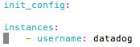

And a basic check python code in /etc/datadog-agent/checks.d, using random.randint() for the random number generation:

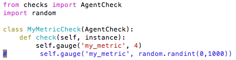

##### Step 2: Run and verify the check

I restarted the Agent via ```sudo service datadog-agent restart``` , then used ```sudo -u dd-agent -- datadog-agent check my_metric``` to confirm the check was being run:

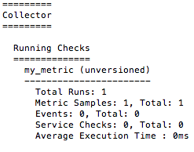

To confirm that Datadog was receiving actual metric values, I checked static values of 1 and 4, to be sure the Hostmap metric graph wasn't reporting a default value or similar. Between each, I restarted the Agent service, yielding a fresh my_metric.pyc file. 

First, here is the Hostmap, showing the custom Agent check in the left-hand pane of the ubuntu-xenial detail window (pardon the bouncing values, I played around with what to use, and the random generator a bit):

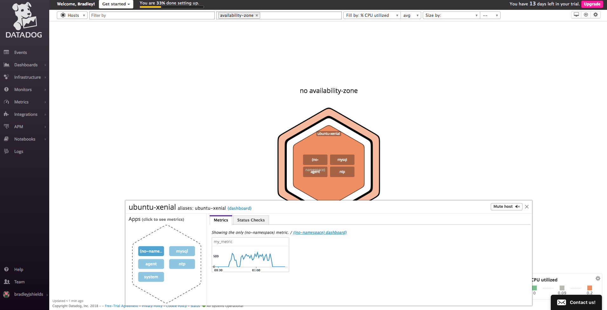

Next, close-ups of static values being reported, 1 and 4 respectively:

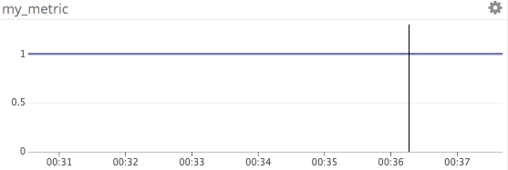
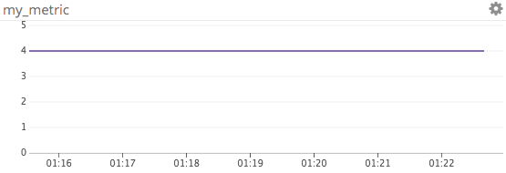

And finally, the varying metric value reported with random.randint(), after uncommenting the line:


---
> *Change your check's collection interval so that it only submits the metric once every 45 seconds.*
---
## Modify check's collection interval

I modified my_metric.yaml located at ```/etc/datadog-agent/conf.d``` to include a min_collection_interval of 45 seconds:

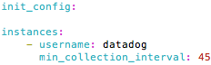

After restarting the service, the metric is reported roughly half as frequently:

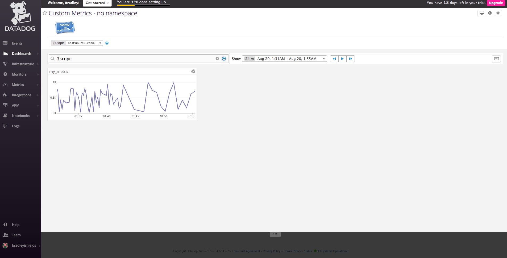

---
> *Bonus Question Can you change the collection interval without modifying the Python check file you created?*
---
## Modify the collection interval, specifically without touching Python
##### My Answer: Without modifying the Python Script 
Modifying the ```.yaml``` file for a given check (located at ```/etc/datadog-agent/conf.d```) allows setting min_collection_interval. From the Agent checks [documentation](https://docs.datadoghq.com/developers/agent_checks/), if this value is greater than the interval time for the Agent collector, a line is added to the log noting that the metric was not collected. Each time the Collector runs, it compares the time since the check was last run, and if it's greater than the set value of min_collection_interval, it runs the check. 

Otherwise, there are several options in the Agent config file, ```/etc/datadog-agent/datadog.yaml```. There are options for process-config and so on (Line 503), among others, but that's more specific than I think the question was intended to be.

###### Incorrect Answer (for context): The Python Script way
The wrong way to do this, to justify my above answer, is as follows. The flush() method in the Gauge class does take *interval* as an argument. This is located in [aggregator.py](https://github.com/DataDog/dd-agent/blob/master/aggregator.py), in the ```dd-agent``` source code. In Python, you would be able to directly set how often a given metric was flushed to Datadog:

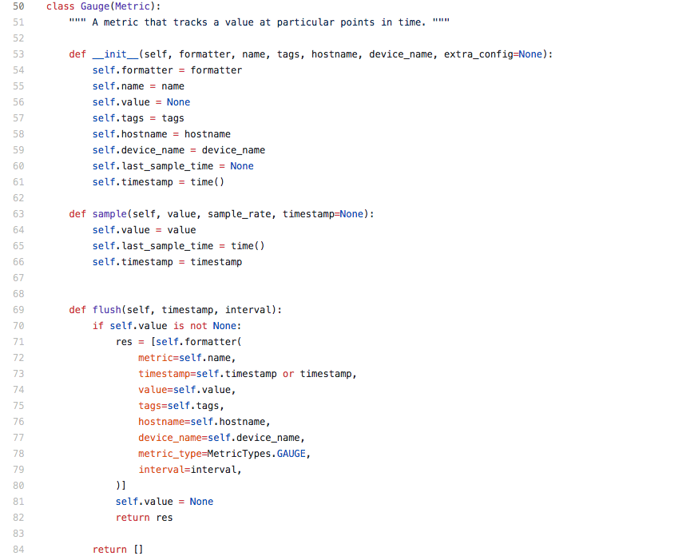


# Section 2: Visualizing Data
*Utilize the Datadog API to create a Timeboard...*

---

## Create a Timeboard
##### Step 1: Setup dogshell
I opted to use the command-line interface for the Datadog API, described in the Dogshell [guide](https://docs.datadoghq.com/developers/faq/dogshell-quickly-use-datadog-s-api-from-terminal-shell/). To install it, I followed the dedicated [instructions](https://github.com/DataDog/datadogpy#installation). First, I installed pip from my Ubuntu VM command line:

    sudo apt-get install python-pip

then ran:

    pip install datadog

I then tested my install via ```dog metric post test_metric 1```, and confirmed that I'd like to create my ```~/.dogrc```.

When asked for my API key, I checked under the Datadog web interface > Integrations > APIs. The API key had been created already, through previous steps. I generated an APP key named my_app_key there, and entered them in response to the dogshell initialization query, which replied ```Wrote /home/vagrant/.dogrc``` to confirm the file creation.

##### Step 2: Use Dogshell commands to create a Timeboard

For the command to create my Timeboard, I found the Datadog API [guide](https://docs.datadoghq.com/api/?lang=python#timeboards) section on Creating Timeboards. I created a Python script from the Example Request listed. I entered my API and APP keys (from the previous section), added a title, and named the file ```my_first_timeboard.py```:

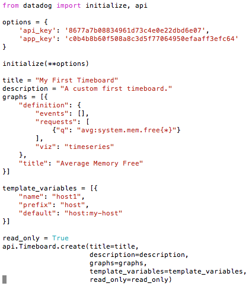

I placed this into a new folder in ```/etc/datadog-agent/``` to keep things organized. I checked the Timeboard man page via ```dog timeboard -h``` After playing around with possible ```dog timeboard post``` commands, I realized there wasn't a way to feed Dogshell a Python script - those API Python examples are (obviously, now) meant to be run directly in Python to run the ```api.Timeboard.create()``` method at the bottom of the file. I then my Python script via:

    python my_first_timeboard.py

In the Datadog web interface > Dashboards, I could then see "My First Timeboard" on the list: 

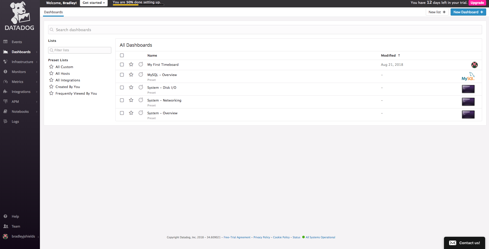

and clicking on it, that it contained the example metric (Average Memory Free):

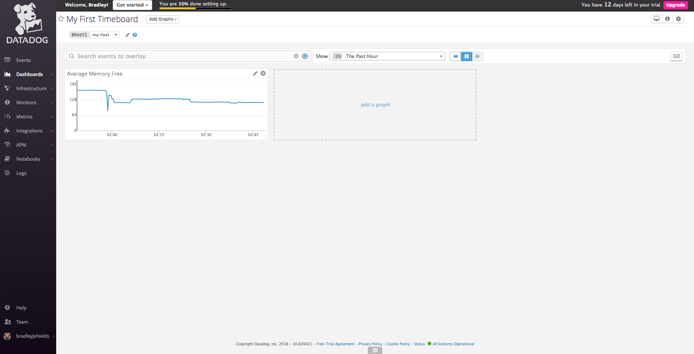

---
> *(Make sure your timeboard contains:*)
> - *Your custom metric scoped over your host.*
---

## Add your custom metric scoped over your host to the Timeboard

From my example Timeboard, I started building each feature that would be added to the Timeboard by the ```api.Timeboard.create()``` call, as a graph. I did try implementing this first as a call to send metrics directly via api.Metric.send() (detailed [here](https://docs.datadoghq.com/api/?lang=python#post-time-series-points)), but while that made the metric available on Datadog for my localhost, it didn't generate the graph as I intended. As I tested syntax, I deleted incorrect Timeboards via the command

    dog timeboard show_all
    dog timeboard delete <timeboard id>

I was able to correctly graph my_metric: under the **arguments** listed for Creating a Timeboard, under **graphs**, the proper **definition** syntax is listed for graphing a metric for a given host. After building this request definition more or less by intuition (and some trial and error), I found the very helpful Graphing Primer using JSON [guide](https://docs.datadoghq.com/graphing/miscellaneous/graphingjson/). I discovered my syntax for scoping by host was a little off, and instead wrote this:

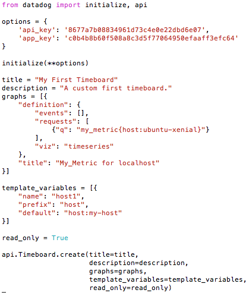

This yielded the Timeboard:

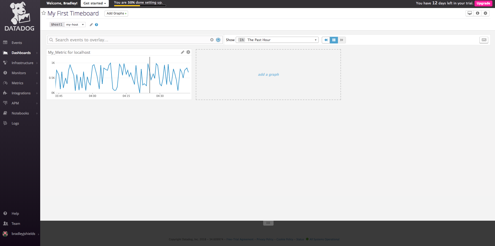

---
> *(Make sure your timeboard contains:*)
> - *Your custom metric scoped over your host.*
> - *Any metric from the Integration on your Database with the anomaly function applied.*
---
## Add a metric from the MySQL Integration, include the anomaly function

With the JSON guide in hand, this part was much easier. The anomaly function was added by simply wrapping the metric in the anomalies() function. Additionally, per the general anomaly monitor [guide](https://docs.datadoghq.com/monitors/monitor_types/anomaly/), I set the anomalies() call to watch for values beyond two standard deviations away from the average CPU time MySQL spends in user space, displayed as a percentage:

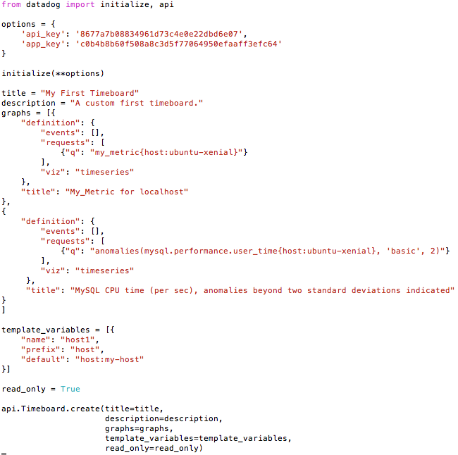

And visually, the Timeboard,

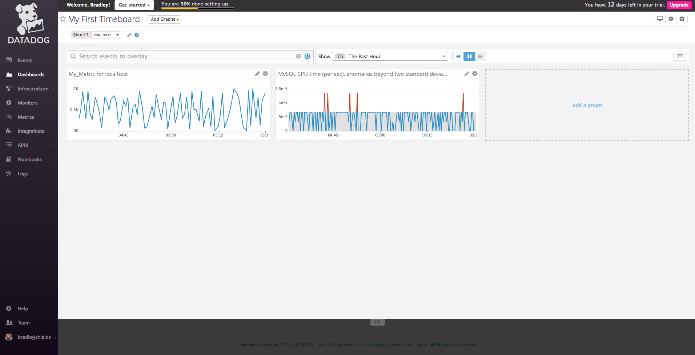

---
> *(Make sure your timeboard contains:*)
> - *Your custom metric scoped over your host.*
> - *Any metric from the Integration on your Database with the anomaly function applied.*
> - *Your custom metric with the rollup function applied to sum up all the points for the past hour into one bucket.*
---
## Add your custom metric, summed over the last hour

Aggregate and rollup are covered in this [guide](https://docs.datadoghq.com/graphing/#aggregate-and-rollup). 

**I tried (incorrectly):** Since previously I modified ```my_metric.yaml``` located at ```/etc/datadog-agent/conf.d``` to collect ```my_metric``` in (at minimum) 45 second intervals, to rollup data over the last hour, that's 80 points required (3600 seconds * (1 data point/45 seconds)). I added another graph to plot the query ```"q": "my_metric{host:ubuntu-xenial}.rollup(sum,80)"```.

**Correct way**: That's not quite right - the graph output looked far too low. The '80' value is *not* point count, it's time in seconds. As per the [documentation](https://docs.datadoghq.com/graphing/miscellaneous/functions/) on .rollup,

>The function takes two parameters: method and time: .rollup(method,time). The method can be sum/min/max/count/avg and time is in seconds. You can use either one individually, or both together like .rollup(sum,120).

So instead, I implemented a graph to plot the query ```"q": "my_metric{host:ubuntu-xenial}.rollup(sum,3600)"``` as an aggregate sum of the last 3600 seconds (one hour) of my_metric values:


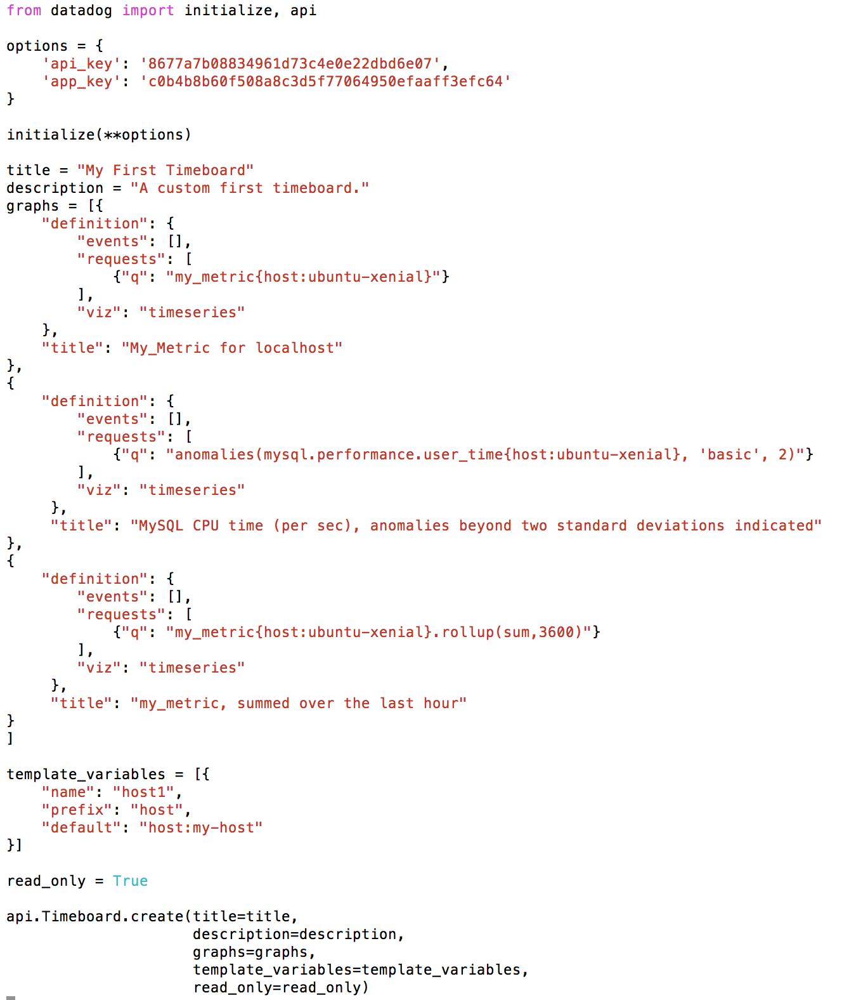

And the Timeboard, 

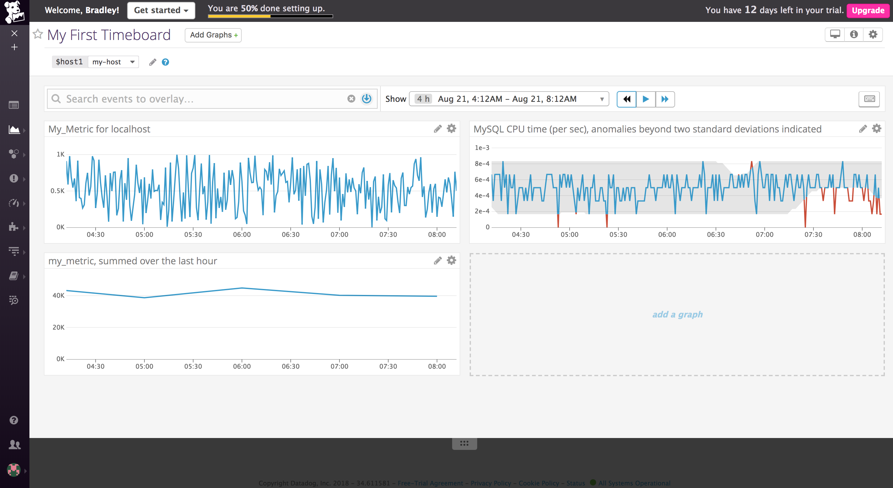 

---
> *Please be sure, when submitting your hiring challenge, to include the script that you've used to create this Timeboard.*
---
## Submit your Timeboard Python script with the Coding Challenge
##### Step 1: Transfer the Python Script from Vagrant VM to my local host

To pull my Python script from the Vagrant VM, I first installed vagrant-scp (as [recommended](https://medium.com/@smartsplash/using-scp-and-vagrant-scp-in-virtualbox-to-copy-from-guest-vm-to-host-os-and-vice-versa-9d2c828b6197})), then pulled the file to my local machine via:

    vagrant plugin install vagrant-scp
    vagrant scp :/etc/datadog-agent/dog/my_first_timeboard.py ./

##### Step 2: Include the Python script

The Python script I used to create this Timeboard is at the path ```etc/datadog-agent/dog/my_first_timeboard.py```, and embedded via link and codeblock below.

Link to the Timeboard itself: [(link)](https://app.datadoghq.com/dash/894375/my-first-timeboard?live=true&page=0&is_auto=false&from_ts=1535337265597&to_ts=1535340865597&tile_size=m)

Python Script for Timeboard ([Github Link](pythonScripts/my_first_timeboard.py)):

```python
from datadog import initialize, api

options = {
    'api_key': '8677a7b08834961d73c4e0e22dbd6e07',
    'app_key': 'c0b4b8b60f508a8c3d5f77064950efaaff3efc64'
}

initialize(**options)

title = "My First Timeboard"
description = "A custom first timeboard."
graphs = [{
    "definition": {
        "events": [],
        "requests": [
            {"q": "my_metric{host:ubuntu-xenial}"}
        ],
        "viz": "timeseries"
    },
    "title": "My_Metric for localhost"
},
{
    "definition": {
        "events": [],
        "requests": [
            {"q": "anomalies(mysql.performance.user_time{host:ubuntu-xenial}, 'basic', 2)"}
        ],
        "viz": "timeseries"
     },
     "title": "MySQL CPU time (per sec), anomalies beyond two standard deviations indicated"
},
{
    "definition": {
        "events": [],
        "requests": [
            {"q": "my_metric{host:ubuntu-xenial}.rollup(sum,3600)"}
        ],
        "viz": "timeseries"
     },
     "title": "my_metric, summed over the last hour"
}
]

template_variables = [{
    "name": "host1",
    "prefix": "host",
    "default": "host:my-host"
}]

read_only = True

api.Timeboard.create(title=title,
                     description=description,
                     graphs=graphs,
                     template_variables=template_variables,
                     read_only=read_only)

```

---
> *Once this is created, access the Dashboard from your Dashboard List in the UI:*
> - *Set the Timeboard's timeframe to the past 5 minutes*
---
 
## Modify the Timeboard: Set the timeframe to the past 5 minutes
By selecting the last sliver of time on any graph using my mouse, the last five minutes are selected (as far as I can tell, that's the minimum displayable window): 

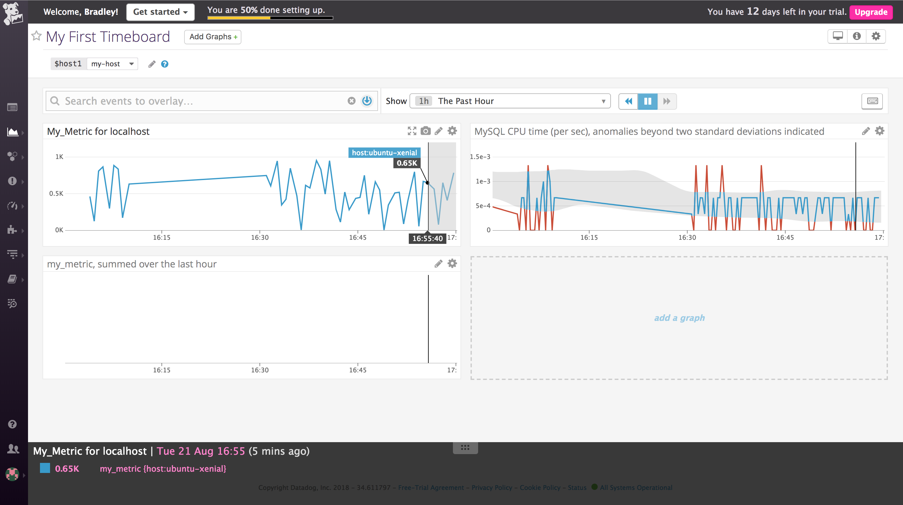

---
>*(Access the Dashboard in the UI:)*
> - *Take a snapshot of this graph and use the @ notation to send it to yourself.*
---

## Take a snapshot of this graph and use the @ notation to send it to yourself.
Using the camera button in the top right of any graph, the option to take a snapshot comes forward. In that window, using @ suggests a list of users, from which I chose bradleyjshields@gmail.com:
 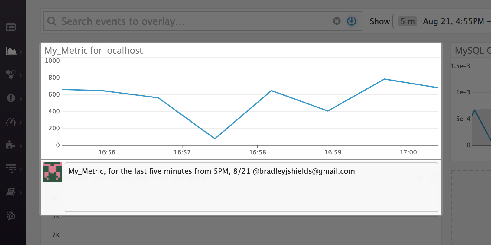

And there it is, in my gmail:
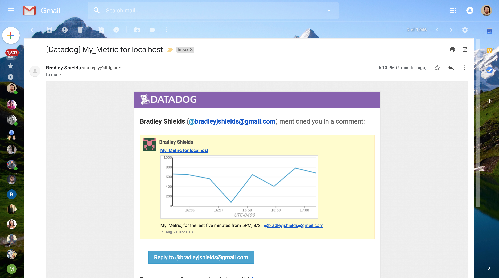

---
>*(Access the Dashboard in the UI:)*
> - ***Bonus Question:*** *What is the Anomaly graph displaying?*
---

## What is the Anomaly graph displaying?
Generally, an [anomaly](https://docs.datadoghq.com/monitors/monitor_types/anomaly/) uses algorithmic detection to compare a metric to it's past values, and can be configured to use historical data as well (time of day, day of the week patterns, and so on).

The Anomaly graph here is displaying the current value of the MySQL CPU time metric, and a region on either side of the current value of the reported metric. This represents the range of values within a set number (2, here) of standard deviations of the mean value, taken over some number of seconds set by a default rollup value, explained [here]([rollup](https://docs.datadoghq.com/monitors/monitor_types/anomaly/)), but I'm not sure what that default value is. Because I've chosen the 'basic' algorithm, the anomaly is calculated with a "simple lagging quantile computation," i.e. no seasonal/longer term trend data.


# Section 3: Monitoring Data

*Since you’ve already caught your test metric going above 800 once, you don’t want to have to continually watch this dashboard to be alerted when it goes above 800 again. So let’s make life easier by creating a monitor.*

*Create a new Metric Monitor that watches the average of your custom metric (my_metric) and will alert if it’s above the following values over the past 5 minutes:*

- *Warning threshold of 500*
- *Alerting threshold of 800*
- *And also ensure that it will notify you if there is No Data for this query over the past 10m.*
---

## Create a Metric Monitor for my_metric, with Warning Threshold 500, Alerting Threshold 800

To create a Metric Monitor ([documentation](https://docs.datadoghq.com/monitors/monitor_types/metric/)), I navigated to Monitors > New Monitor > Metric in the Datadog web interface. I chose my detection method, defined my metric as the single value (removing avg() from the monitor query, since that's an average over Hosts, not needed here) reported by my_metric, set my Warning and Alerting Thresholds, and enabled **Notify** for missing data after ten minutes:

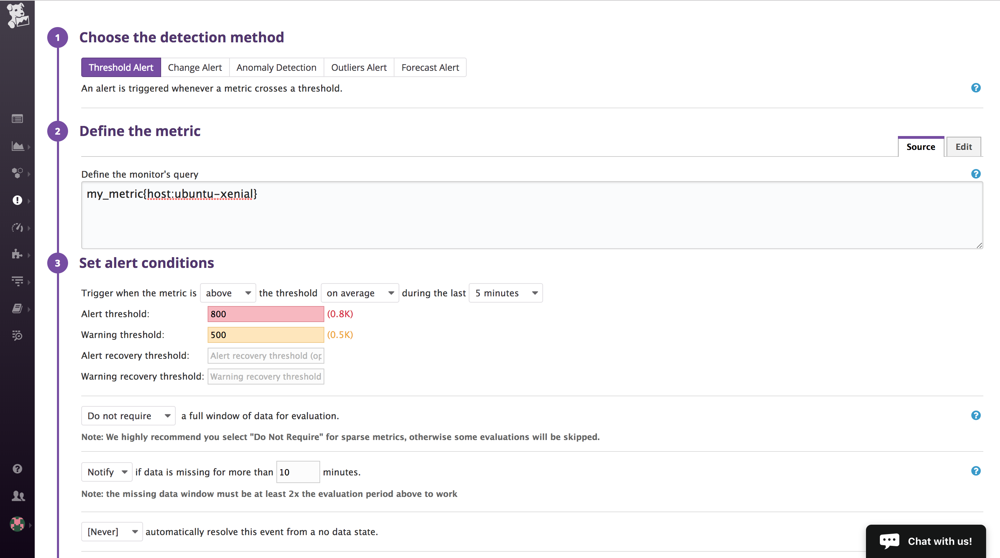

---
> *Please configure the monitor’s message so that it will:*
> - *Send you an email whenever the monitor triggers.*
> - *Create different messages based on whether the monitor is in an Alert, Warning, or No Data state.*
> - *Include the metric value that caused the monitor to trigger and host ip when the Monitor triggers an Alert state.*
> - *When this monitor sends you an email notification, take a screenshot of the email that it sends you.*
---

## Configure the Alert Monitor's Message: have a different email sent for an Alert(include metric, host ip), a Warning, and a No Data event. Show a screenshot.

I configured the monitor's message to respond to Alerts, Warnings, and No Data events. Additionally, the monitor will email me when the threshold reaches a Warning or Alert.

To configure the monitor's message, I referenced the *Use message template variables*  help under that same "Say what's happening" section. The documentation for [notifications](https://docs.datadoghq.com/monitors/notifications/) provided helpful syntax as well. The ```Notify: @bradleyjshields@gmail.com``` also adds my email to the "Notify your team section." The monitor's message is:

```
{{#is_alert}} 
ALERT: my_metric has averaged more than 800 for the last 5 minutes! 
Host IP {{host.ip}} has reported an average value of  {{value}} during that time. Please take corrective action!
{{/is_alert}}


{{#is_warning}} Warning: Host IP {{host.ip}} reports that my_metric has averaged more than 500 for the last 5 minutes! {{/is_warning}}


{{#is_no_data}} 
Warning! No data has been reported by my_metric on Host IP {{host.ip}} in the last 10 minutes!
{{/is_no_data}}

Notify: @bradleyjshields@gmail.com
```

The email I received when the monitor threshold was reached was:

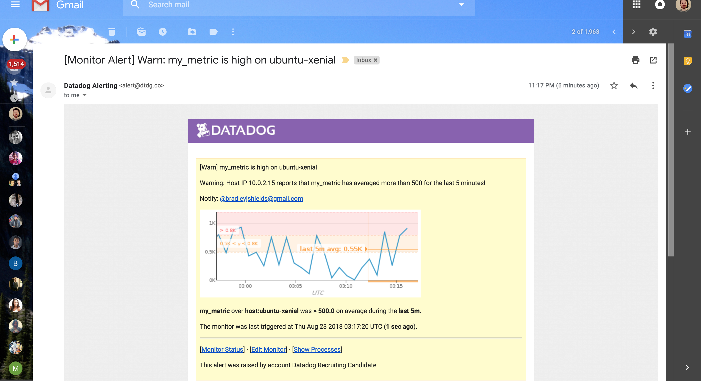

---
> ***Bonus Question:*** *Since this monitor is going to alert pretty often, you don’t want to be alerted when you are out of the office. Set up two scheduled downtimes for this monitor:*
> - *One that silences it from 7pm to 9am daily on M-F,*
---

## **Bonus Question Response:** Schedule Alert downtime: 7PM to 9AM, Monday-Friday
The [guide](https://docs.datadoghq.com/monitors/downtimes/) for Scheduling monitor downtime recommends doing this through Monitors > Manage Downtime, then pressing the "Schedule Downtime" button. I chose to mute only this monitor, and so added ```host:ubuntu-xenial``` under "Group scope."

Scheduled downtime for weekday evenings and mornings begins at 7:00 PM EST each night, and goes until 9:00 AM the following day:
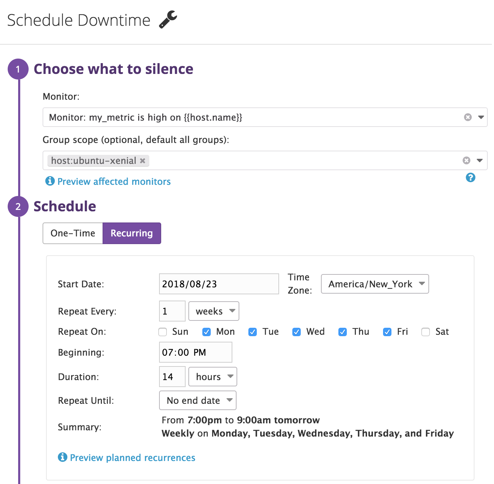

And the corresponding alert message:

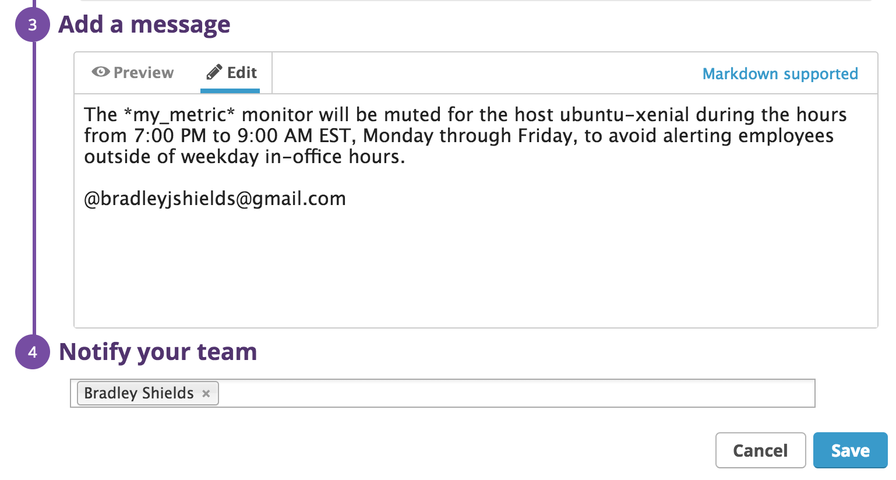

---
> *(Set up scheduled downtimes for this monitor:)*
> - *One that silences it all day on Sat-Sun.*
---
## Schedule Alert downtime: Saturdays and Sundays

For the weekend, Saturday morning will already be muted through 9:00 AM EST due to the weekday rule. Muting Saturday and Sunday only would overlap (probably not a problem) and leave Monday morning until 9:00 AM EST un-muted (actually a problem). As such, the weekend mute begins at 9:00 AM, and runs 24 hours, both on Saturday and again on Sunday:

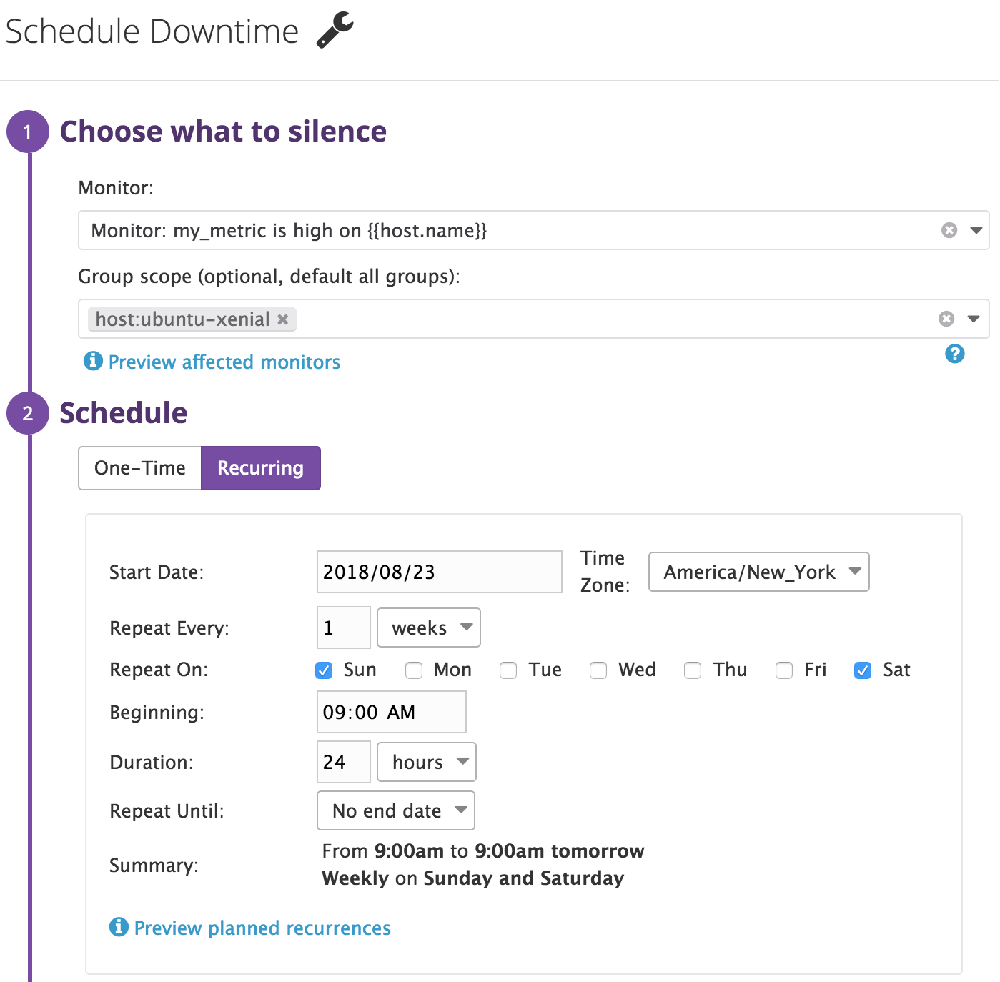
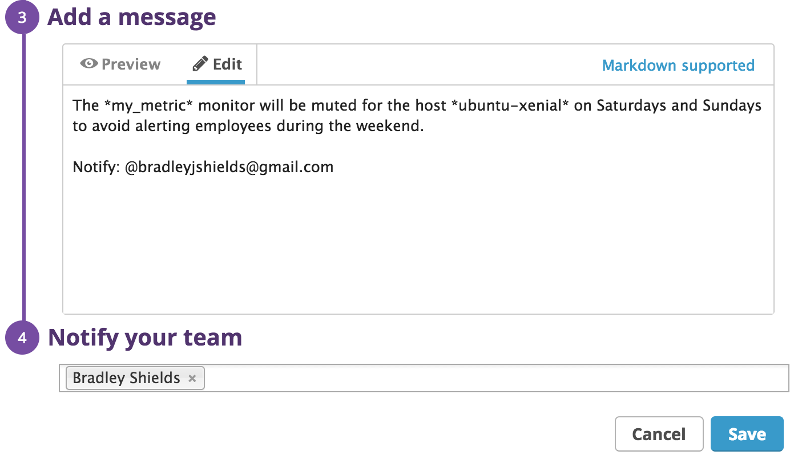

---
> *(Set up scheduled downtimes for this monitor:)*
> - *Make sure that your email is notified when you schedule the downtime and take a screenshot of that notification.*
---
## Send an email when the downtime is scheduled and provide a screenshot
These produced the emails:

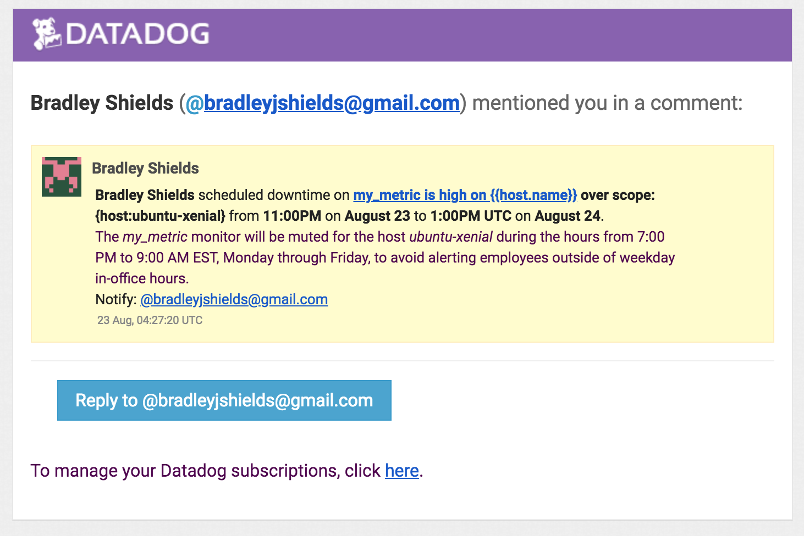
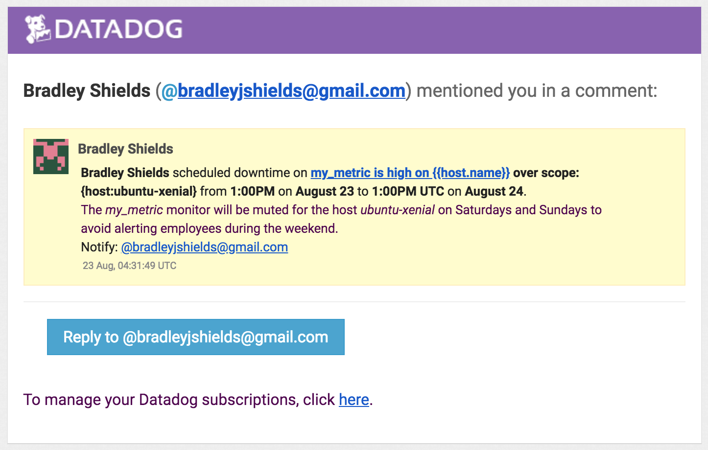


# Section 4: Collecting APM Data

*Given the (supplied) Flask app (or any Python/Ruby/Go app of your choice) instrument this using Datadog’s APM solution:*
- *Note: Using both ddtrace-run and manually inserting the Middleware has been known to cause issues. Please only use one or the other.*
---

## Instrument an Flask/Python/Ruby/Go app using Datadog APM
##### Step 1: Examine the supplied Flask app

The Datadog-supplied Flask app:

```python
from flask import Flask
import logging
import sys

# Have flask use stdout as the logger
main_logger = logging.getLogger()
main_logger.setLevel(logging.DEBUG)
c = logging.StreamHandler(sys.stdout)
formatter = logging.Formatter('%(asctime)s - %(name)s - %(levelname)s - %(message)s')
c.setFormatter(formatter)
main_logger.addHandler(c)

app = Flask(__name__)

@app.route('/')
def api_entry():
    return 'Entrypoint to the Application'

@app.route('/api/apm')
def apm_endpoint():
    return 'Getting APM Started'

@app.route('/api/trace')
def trace_endpoint():
    return 'Posting Traces'

if __name__ == '__main__':
    app.run(host='0.0.0.0', port='5050')
```

##### Step 2a: Set up the Trace Agent
Applying Application Performance Monitoring (APM) requires using the Trace agent. In Linux, it comes packaged with the Datadog agent ([source](https://docs.datadoghq.com/tracing/setup/)),

##### Step 2b: Install the Datadog Agent

*(Done previously)*

##### Step 3: Configure the Trace Agent

On Linux the APM Agent is enabled by default, and "no extra configuration is needed." According to the github [repo](https://github.com/DataDog/datadog-trace-agent/#run-on-linux), simply running the Datadog Agent is enough. Configuration settings are found under the ```apm_config``` line in the ```/etc/datadog-agent/datadog.yaml```. 

##### Step 3: Configure the Environment

Specifying a custom environment will allow all traces run through the APM to be grouped via an environment tag. To do that, I overrode the default env tag used by the trace Agent in the Agent config file. In ```datadog.yaml```, I've uncommented then specified the environment as "pre-prod" with:

    apm_config:
      env: pre-prod

To apply these changes, I restarted the Agent via ```sudo service datadog-agent restart```.

##### Step 4: Dependencies in Vagrant VM's Ubuntu

Using the Tracing Python Applications [guide](https://docs.datadoghq.com/tracing/setup/python/),
I first installed the Datadog Tracing library and Flask itself via: 

    pip install ddtrace
    pip install flask

Additionally, I've installed the ```Blinker```library via ```pip install blinker```(required by Flask's Middleware for signaling). 


---
## I attempted to use the supplied Flask app at this stage - I ended up getting stuck actually sending trace data from the Flask app's functions to Datadog. I'll discuss why. In the end, I wrote my own script using the ddtrace API to create my own fake "server" app to trace.

## I'll first describe what I tried with the Datadog-supplied App, then the app I succeeded with. Please feel free to skip down to the section title "Successful Tracing with a simple ddtrace script" if you'd like to see the working solution right away, instead.
---

## My first (unsuccessful) attempt at Tracing with the Datadog-supplied App
##### Step 1: Prepping the Python Script for Tracing

I wanted to start by setting up the Middleware for Flask, to give myself the choice to use it or not. That way, I could use ```ddtrace``` or manually-included Middleware, depending on what worked. I suspected this part might be difficult.

To enable manual inclusion of the Middleware for Flask (recommended [here](http://pypi.datadoghq.com/trace/docs/#flask)), I added import statements for ```tracer``` and ```TraceMiddleware```, and a line to create a TraceMiddleware object.

##### Step 2: Setting up the Python Script for running with ddtrace

Since the Coding Challenge recommended using only ```ddtrace``` *or* manually-included Middleware, using ```dd-trace``` requires commenting out the Middleware import statement,

```python
    #from ddtrace.contrib.flask import TraceMiddleware     # TraceMiddleWare import
```

 and Middleware creation lines,

```python
    # Create TraceMiddleware object
    #traced_app = TraceMiddleware(app, tracer, service="my-flask-app", distributed_tracing=False)
```

 Then, the instrumented my-flask-app.py app looks like:

```python
from flask import Flask
import blinker as _                                   # blinker import
from ddtrace import tracer                            # tracer import                      
#from ddtrace.contrib.flask import TraceMiddleware     # TraceMiddleWare import
import logging
import sys

# Have flask use stdout as the logger
main_logger = logging.getLogger()
main_logger.setLevel(logging.DEBUG)
c = logging.StreamHandler(sys.stdout)
formatter = logging.Formatter('%(asctime)s - %(name)s - %(levelname)s - %(message)s')
c.setFormatter(formatter)
main_logger.addHandler(c)

app = Flask(__name__)

# Create TraceMiddleware object
#traced_app = TraceMiddleware(app, tracer, service="my-flask-app", distributed_tracing=False)


@app.route('/')
def api_entry():
    return 'Entrypoint to the Application'

@app.route('/api/apm')
def apm_endpoint():
    return 'Getting APM Started'

@app.route('/api/trace')
def trace_endpoint():
    return 'Posting Traces'

if __name__ == '__main__':
    app.run(host='0.0.0.0', port='5050')
```

##### Step 3: Moving the Python Script onto Vagrant VM

I moved my local ```my-flask-app.py``` onto my Ubuntu VM by placing it into the same directory as the VM's Vagrantfile (as per this [stackoverflow](https://stackoverflow.com/questions/16704059/easiest-way-to-copy-a-single-file-from-host-to-vagrant-guest)). This file is then automatically available at the path ```/vagrant``` within the Vagrant VM.

##### Step 4: Attempting Tracing

In the VM, I changed the owner:group and provided privileges with:

    sudo chown dd-agent:dd-agent my-flask-app.py
    sudo chmod 755 my-flask-app.py

Then ran with ```python my-flask-app.py```. 

I found consistent errors in the form of:

    2018-08-23 07:11:46,050 - ddtrace.writer - ERROR - cannot send services to localhost:8126: [Errno 111] Connection refused

This then became the first goal - obtaining a clean, error-free tracer script run. My troubleshooting process involved working through basic fix attempts to each one of several issues: the run command's syntax, port communication, and environment variable issues. I wasn't sure what was wrong as I began running the script, so I worked down what I thought were obvious failure modes first.

I began by double-checking my config settings as a sanity check, and modified ```/etc/datadog-agent/datadog.yaml``` to ensure that the following were uncommented:

    apm_config:
        enabled: true
        env: 'pre-prod'


Then, looking for the error specifically, I explored the documentation. I found a Datadog [article](https://docs.datadoghq.com/tracing/faq/why-am-i-getting-errno-111-connection-refused-errors-in-my-application-logs/) explaining this was the result of the Trace Agent listening somewhere other than expected. That certainly sounded like a port access issue. 

I experimented with ```tracer.configure()```, and changing the ```app.run(host='0.0.0.0',port='5050')``` run command line, trying different host and port combinations. I also explored Vagrant's port forwarding feature ([here](https://www.vagrantup.com/docs/networking/basic_usage.html)) by modifying the Vagrantfile, thinking perhaps the tracer was working, but not reaching Datadog:

    config.vm.network :forwarded_port, guest: 4999, host: 4998

Those didn't seem to fix the issue. I experimented with manually-inserting the Middleware, by uncommenting the previously mentioned lines, then running with ```python my-flask-app.py```. I tried that in various combinations with the above fixes, but had less luck there, and eventually returned to trying ```ddtrace-run```.

##### Step 5: Questionable Tracer Results

I found improved results by changing ```ddtrace-run``` by adding environment variable settings in-line with the run command, as per this [guide](https://www.datadoghq.com/blog/monitoring-flask-apps-with-datadog/):

```
FLASK_APP=sample_app.py DATADOG_ENV=flask_test ddtrace-run flask run --port=4999
```

These led me to a place where the trace ran, and provided output such as:

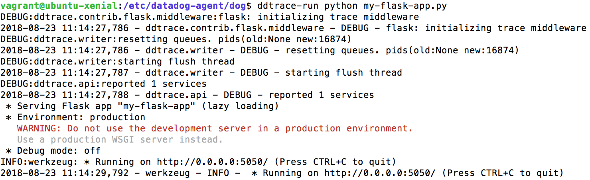

While promising, the APM section of Datadog's web browser UI didn't report any trace from a service. 

##### Step 6: Taking stock of the problem so far

At this point, I took a step back. I wasn't sure if the issue was Vagrant's connectivity back to Datadog. However, after Port Forwarding didn't fix the issue, and knowing that other metrics were reaching Datadog (from previous sections of the Challenge), I suspected the issue most likely had to do with Flask. However, that still left the possibility that traces weren't being properly recorded, on top of connectivity issues, which could even be between Flask/Vagrant VM/my Macbook's port handling.

I had already explored Flask's documentation throughout this process, and decided that I was troubleshooting several things at once, potentially. The best course of action, I felt, was to build something simple from a base example instead. Building a test case that isolates a single issue is a technique I like, when possible.

## Successful Tracing with a simple ddtrace script
##### Step 1: First successful data reported back to Datadog

Many of the guides mentioned here had "My First Tracer" examples - I went back to an example code in the Datadog Doc on [Python Tracing](https://docs.datadoghq.com/tracing/setup/python/):

```python
from ddtrace import tracer

with tracer.trace("web.request", service="my_service") as span:
  span.set_tag("my_tag", "my_value")
```

and found that it actually *did* report data back to Datadog in the Datadog UI > APM. I with this code, and looked to see what I could add.

##### Step 2: Using the ddtrace API

To build out this example codeblock into something that might report trace data, I used the ddtrace API [guide](http://pypi.datadoghq.com/trace/docs/#module-ddtrace.contrib.flask). I realized that a sleep() command run with a random integer input could work as a varying but straightforward metric to trace. Wrapping that in a ```while True:``` loop, I had a process that would run continuously, and report a trace at random intervals.

---
> Note: These are answered a little out of order, to make my thought process easier to read through. First, I show the Python "app" I use, then the Dashboard with APM and Infrastructure Metrics, then the Bonus Question answer.

> *Please include your fully instrumented app in your submission, as well.*

---

## My Answer, Part 1: Fully-Instrumented "App"

The ```ddtrace.tracer``` class method trace() is called to begin measuring execution time before the random-input sleep command runs, then finish() reports that span back to the Datadog APM. The script was run via ```ddtrace-run python my_fake_server.py``` to collect trace information. The Python script is provided below, and in the github repo [here](pythonScripts/my_fake_server.py):

```python
from ddtrace import tracer
import time
import random

while True:
    span = tracer.trace("My_Interval",service="Fake_Serv")
    time.sleep(random.randint(15,25))
    span.finish()
```

---
*Provide a link and a screenshot of a Dashboard with both APM and Infrastructure Metrics.*

---

## My Answer, Part 2: Link and Screenshot of Dashboard with APM, Infrastructure Metrics

For my APM Metric, I've included the span reported by my ```fake_server``` on the host ```ubuntu-xenial``` in the environment pre-prod:

     trace.My_Interval.duration

For Infrastructure Metrics, I've included **System Bytes Sent vs. Received**, and a measure of **System IO Utilization Percentage** averaged over all hosts (i.e. the system, which here is again just ```ubuntu-xenial``` ):
    
    avg:system.io.util{*}


The Timeboard presenting these is linked ([here](https://app.datadoghq.com/dash/897139/fakeserver-real-host-timeboard?live=true&page=0&is_auto=false&from_ts=1535098716060&to_ts=1535102316060&tile_size=m&fullscreen=false)) and presented below:

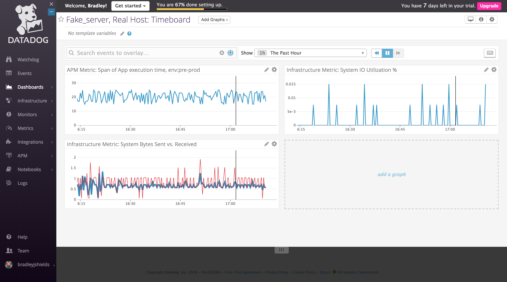

---
> ***Bonus Question:*** *What is the difference between a Service and a Resource?*
---

## My Answer, Part 3: Service vs. Resources

From this Datadog help [article](https://help.datadoghq.com/hc/en-us/articles/115000702546-What-is-the-Difference-Between-Type-Service-Resource-and-Name-), a **service** is a "set of processes that work together to provide a feature set." I.e., for a web app, one service might handle database-related tasks, while another handles admin functions, and still another handles the web front end.

A **resource** is a "particular query to a service." This could include the literal SQL query for a database, or a route or canonical URL.

# Final Question


*Datadog has been used in a lot of creative ways in the past. We’ve written some blog posts about using Datadog to monitor the NYC Subway System, Pokemon Go, and even office restroom availability!*

*Is there anything creative you would use Datadog for?*

---

## What I Would Use Datadog For
##### Idea 1: Advanced Cluster Management for Cloud-Computing 

Most production-scale Computational Fluid Dynamics (CFD) simulations require vast amounts of computational resources, either via a physical compute cluster or a cloud-based, high performance computing platform like Rescale (which uses Amazon AWS, a service Datadog plays nicely with). Datadog could provide real insight into the health and status of a running job - runs of that size are not cheap, so good monitoring is vital.

We've seen large jobs receive resources from a cluster management system, then simply sit, using up those resources but not solving the intended job. Other times, when a job has ended, a computational node resource may not release properly, creating an unusable zombie node. On our physical cluster, our cluster administrator fixes those *manually* today by forcing a node restart, despite the size and importance of our cluster's health and efficiency. 

I'm not sure that's uncommon, unfortunately. Datadog could be a great way to report when a node has locked up or become unresponsive, or a user has made some mistake that causes the job to end immediately after it starts running. While we have excellent cluster management software, it doesn't provide the kind of historical, behavior-based comparison Datadog uses to automatically report events. For a large job, Email Alerts would mean *not* losing a full weekend of computational time over a hung process; on a typical run of 20-150 nodes at 8-12 cores each, 72 hours translates to an enormous amount of wasted resources. Where jobs are generally under a deadline, that time savings could be critical - if a contracts or bid is on the line, it's a very real problem.

##### Idea 2: Disaster Relief

A simple app that provided some heartbeat to Datadog at periodic intervals would be lightweight on a smartphone's processor and battery, but could very powerful. A simple interface that allowed the user to send a "Disaster Flag" and then share GPS coordinates could go a long way to helping victims in disaster areas. 

This does require an app download and possession of a smartphone, but could allow communciation through the surge in phone calls that often drops cell service in disaster zones with much lighter-weight metric reporting.

Similarly, Datadog could be used to monitor the audio gunshot sensors about New York city, providing fast informatics to police response teams.