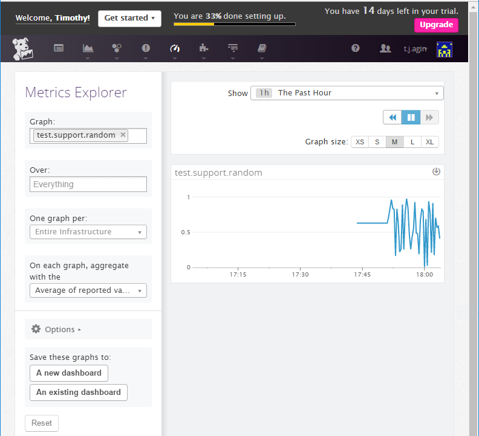
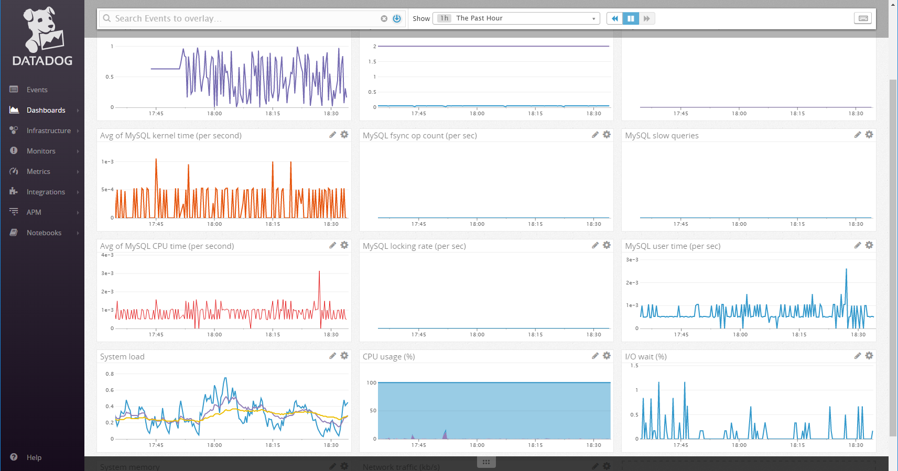
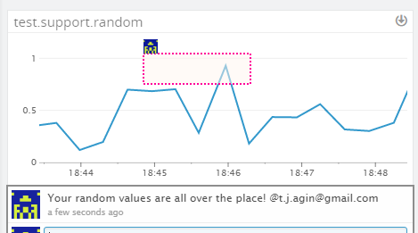
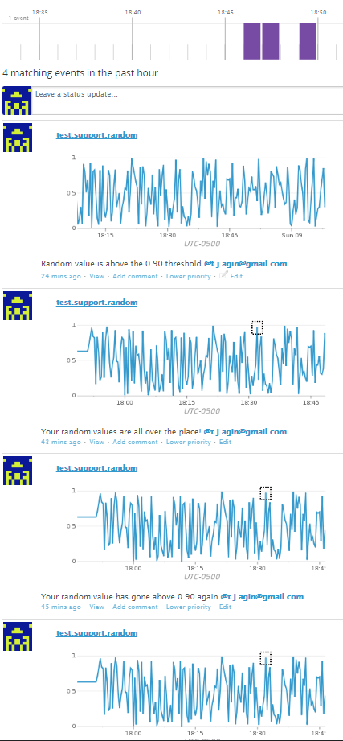
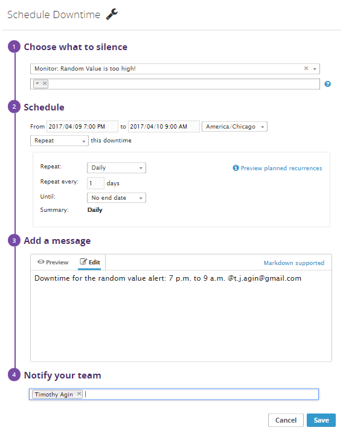

# Support Engineer Challenge

## Questions

### Level 0 - Setup an Ubuntu 12.04 LTS VM with Vagrant

Screenshot of `vagrant up` and `vagrant ssh`:  
  


### Level 1  
  
* Sign up for Datadog (use "Datadog Recruiting Candidate" in the "Company" field), get the Agent reporting metrics from your local machine.

Copy the one-step install instructions from Datadog:  


  
Enter the one-step install insructions at the command line to initiate installation:  
  
  

* Bonus question: In your own words, what is the Agent?  

The Agent is that part of Datadog's service that lives on a client's host(s) and collects system and application data.  It's responsible for collecting basic system metrics (e.g. cpu usage, memory, disk I/O, network latency), checking which services are set to be monitored (i.e. what integrations has the client configured), aggregating custom metrics and events from a client's applications and infrastructure, and sending data to Datadog's intake servers via HTTPS.

It is an open-source, python-based service designed for simple, potentially automated set-up and integration with modern devops stacks.  That means it works on all modern operating systems, on a variety of platforms (e.g. virtual machines, containers, cloud platforms), and with a variety of configurable [integrations](https://www.datadoghq.com/product/integrations/) for popular devops tools (e.g. web servers, databases, message queues, code repositories) allowing its monitoring capabilities to be tailored to clients' needs.

* Add tags in the Agent config file and show us a screenshot of your host and its tags on the Host Map page in Datadog.  

Editing the Agent config file (`/etc/dd-agent/datadog.conf`) to add tags:  
  
  

Screenshot of host and its tags on the Host Map page:  
    
  

* Install a database on your machine (MongoDB, MySQL, or PostgreSQL) and then install the respective Datadog integration for that database.

Install MySQL and check that it's listening:
  
  
  

Follow the MySQL integration instructions from Datadog (https://docs.datadoghq.com/integrations/mysql/) to connect the Agent to MySQL.  
  
First, create a datadog user and grant it replication rights (and other privileges as desired).    
`sudo mysql -e "CREATE USER 'datadog'@'localhost' IDENTIFIED BY 'YOURUNIQUEPASSWORDHERE';"`  
`sudo mysql -e "GRANT REPLICATION CLIENT ON *.* TO 'datadog'@'localhost' WITH MAX_USER_CONNECTIONS 5;"`  
  
Then, verify that the user was created and was granted replication rights and other privileges, as appropriate:  
  
  
Next, edit `/etc/dd-agent/conf.d/mysql.yaml` to configure the connection and related monitoring options:  
  
  
Finally, restart the agent (`sudo /etc/init.d/datadog-agent restart`), and use the  
info command (`sudo /etc/init.d/datadog-agent info`) to check that the MySQL integration is OK:  
  

* Write a custom Agent check that samples a random value. Call this new metric: `test.support.random`

custom_agent_check.py:
```python
import random

from checks import AgentCheck

class RandomCheck(AgentCheck):
    def check(self, instance):
        self.gauge('test.support.random', random.random())
```

custom_agent_check.yaml:
```yaml
init_config:
    min_collection_interval: 1

instances:
    [{}]
```  
  



### Level 2 - Visualizing your Data  
  
* Since your database integration is reporting now, clone your database integration dashboard and add additional database metrics to it as well as your `test.support.random` metric from the custom Agent check.
  
Links to cloned database dashboard with test.support.random metric (links to two different timespans): 
https://app.datadoghq.com/dash/272733/clones---the-sql?live=true&page=0&is_auto=false&from_ts=1491712990718&to_ts=1491799390718&tile_size=m  
https://app.datadoghq.com/dash/272733/clones---the-sql?live=false&page=0&is_auto=false&from_ts=1491774764925&to_ts=1491791690293&tile_size=m  
  
Screenshot of cloned database dashboard:


* Bonus question: What is the difference between a timeboard and a screenboard?

Timeboards are interactive dashboards featuring an automatic layout and a strong focus on time as a synchronizing factor, which allows an intuitive way to correlate metrics and events over various timespans.  They allow you to see how multiple metrics are (or were) changing over time, which means they are great for troubleshooting and understanding how your stack's components relate and change together.  
  
In comparison, screenboards are more general dashboards featuring a cutomizable drag-and-drop layout and support for a variety of widgets and formatting options.  They are easy to share and function as status boards.  Using a screenboard, it is possible to tell a story about your system or some important metrics through the use of conditional formatting and annotations with various widgets across different timeframes.  

* Take a snapshot of your `test.support.random` graph and draw a box around a section that shows it going above 0.90. Make sure this snapshot is sent to your email by using the @notification




### Level 3 - Alerting on your Data

* Set up a monitor on this metric that alerts you when it goes above 0.90 at least once during the last 5 minutes 
* Bonus points:  Make it a multi-alert by host so that you won't have to recreate it if your infrastructure scales up.  
* Give it a descriptive monitor name and message (it might be worth it to include the link to your previously created dashboard in the message).  Make sure that the monitor will notify you via email.

  

* This monitor should alert you within 15 minutes. So when it does, take a screenshot of the email that it sends you.

  

* Bonus: Since this monitor is going to alert pretty often, you don't want to be alerted when you are out of the office. Set up a scheduled downtime for this monitor that silences it from 7pm to 9am daily. Make sure that your email is notified when you schedule the downtime and take a screenshot of that notification.

Schedule the downtime:  

  
Receive email alert about downtime:  

