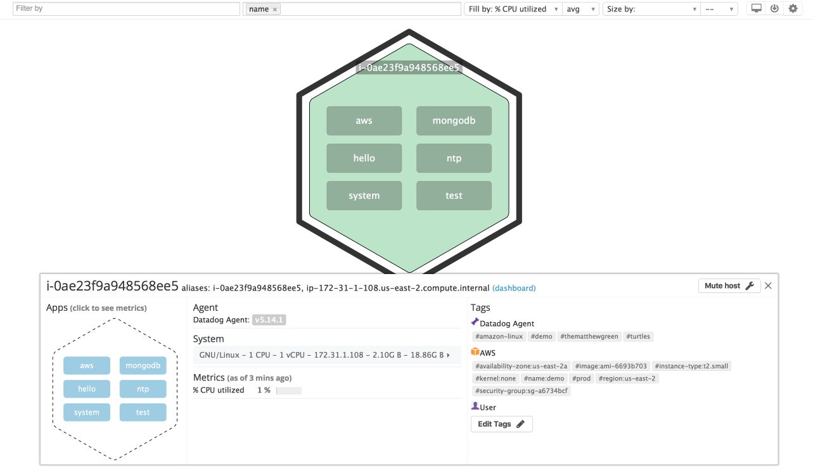
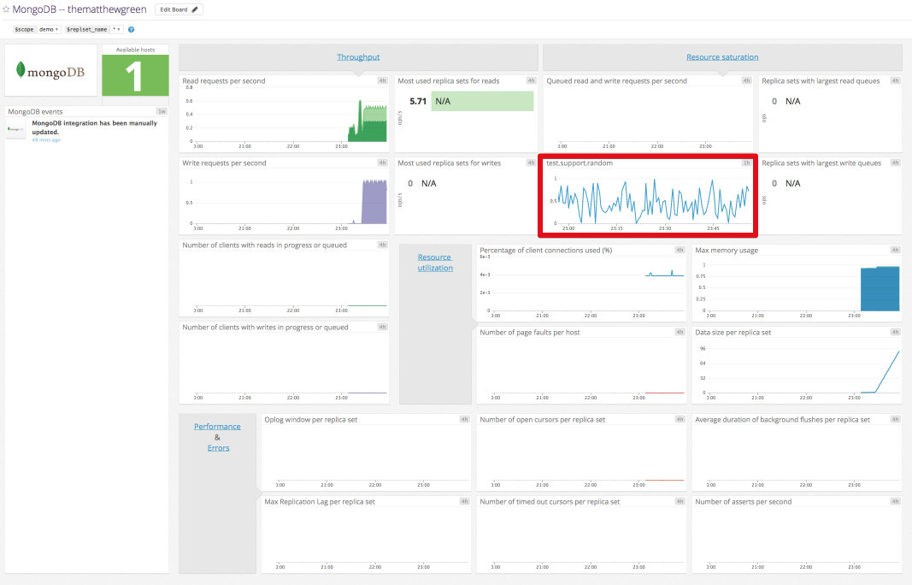
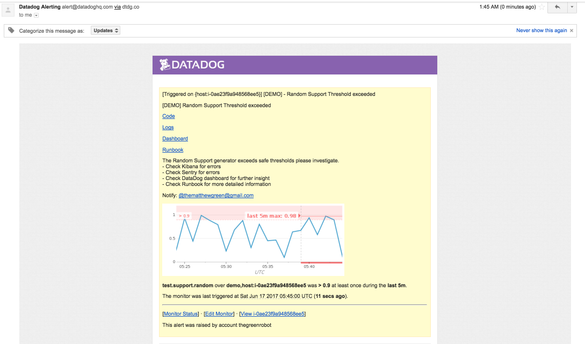

# Answers

## Level 0 - Setup

- Virtual Machine
    - I opted to created an EC2 instance in AWS.  The instance was provisioned using Terraform and configured with Ansible.

## Level 1 - Collecting Data

- Bonus Question! What is the Agent?
    - The Datadog agent is software running on your host (virtual or physical) that gathers performance metrics and information. It can provide system level data (e.g. cpu, memory, disk) and integration metrics from applications such as ElasticSearch, Nginx or Cassandra.  

    Also included is a Dogstatsd endpoint for sending traditional statsd metrics like counters, gauges and histograms. This can be extremely useful for instrumenting the performance of your own application or services.

    The Agent is supported on all major operating system platforms and can be easily installed via a variety of tools such as Chef, Puppet, Ansible or Docker.

- The Datadog agent was installed and configured on the AWS EC2 instance using Ansible and the Datadog [role][datadog-ansible].
    - The following screenshot shows the host and tags that have been configured from within the Host Map section.
        - Custom tags were set via the Agent configuration in `/etc/dd-agent/datadog.conf`.
        - AWS tags were populated via the AWS integration.
        - The MongoDB "App" is visible, indicating that the MongoDB integration is working properly.
        - The test "App" is visible, indicating that the `test.support.random` metric is working properly. A custom tag was also applied to the metric.
        - 
- The MongoDB integration and custom Agent Check were created and deployed using Ansible in the `ansible/roles/datadog-checks` role.

## Level 2 - Visualizing Data

- A cloned MongoDB was created and the `test.support.random` metric was added. The red box highlights the added custom metric. I also generated some random read and write operations to generate some MongoDB load. The dashboard looked a little sad with MongoDB just idling.
    - 

- Bonus Question! What are the differences between a TimeBoard and ScreenBoard?

    - There are several differences between a TimeBoard and ScreenBoard.
        - A ScreenBoard can be shared publicly, offers multiple widget types for displaying different types of data and supports different time ranges per widget. A ScreenBoard might best be used for summary or at a glance information.
        - A TimeBoard provides metrics in a grid. They are best used when trying to correlate problems or changes in behavior. Using a TimeBoard in conjunction with an event overlay for deploys is a good way determine if programatic changes to your application or environment is impacting your customers or performance.

## Level 3 - Alerting on Data

- A multi-alert monitor was created using Terraform to notify the appropriate user when the `test.support.random` metric exceeds the 0.90 threshold once during the last five minutes. The monitor can be found in `terraform/datadog.tf`
    - The following screenshot was taken of the Datadog email notification when the monitor fired.
    - 

[datadog-ansible]: https://github.com/Datadog/ansible-Datadog
