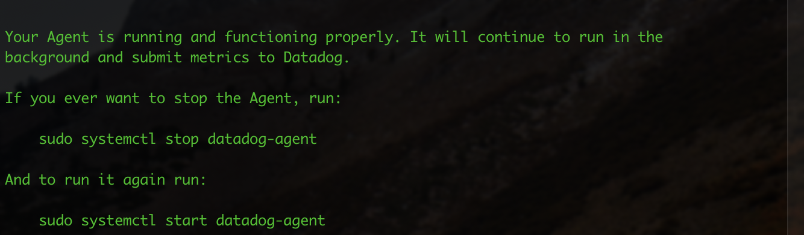
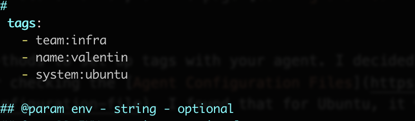
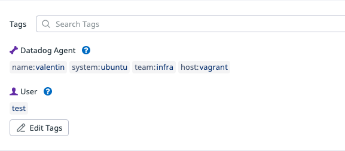
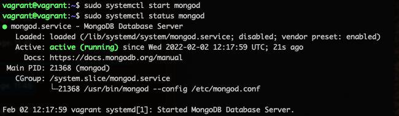
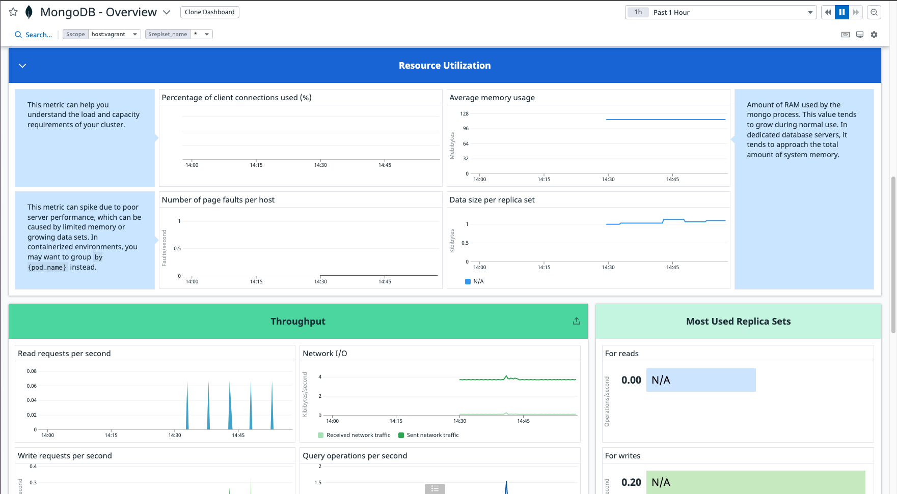
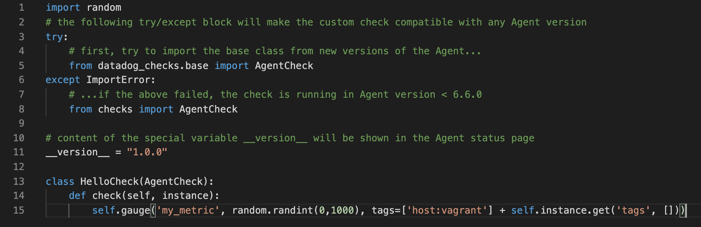
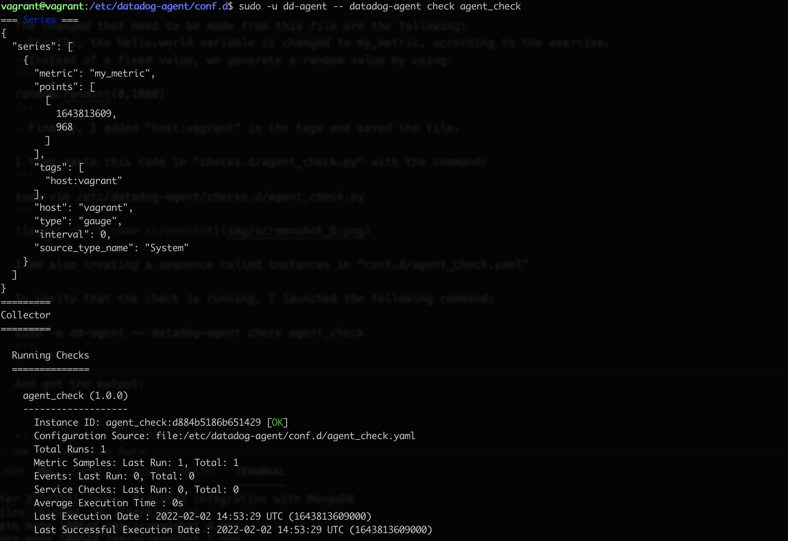
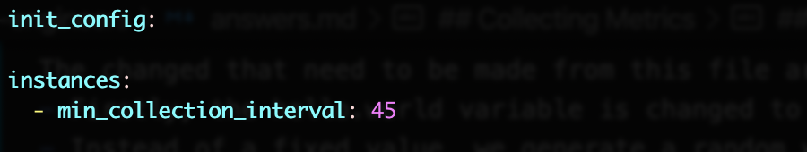
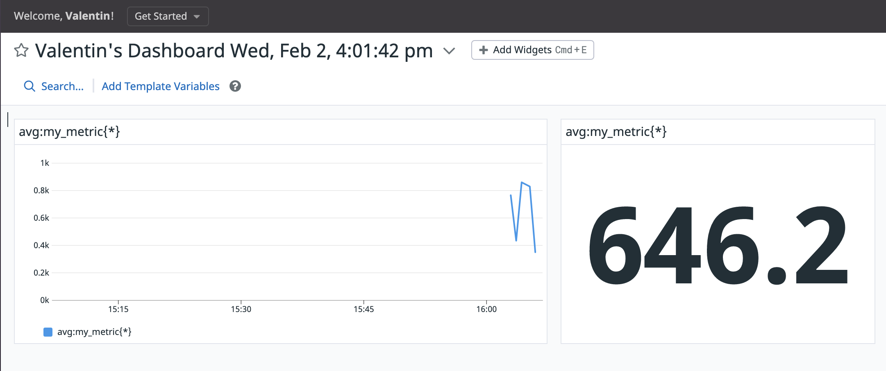

<!-- Header -->
<br />
<p align="center">
  <a href="img/Datadog_logo.png">
    
  </a>

  <h3 align="center">Datadog - Sales Engineer Technical Interview</h3>

  <p align="center">
    Valentin PEREIRA
    <br />
    <a href="https://www.linkedin.com/in/valentin-pereira/"><strong>View on LinkedIn »</strong></a>
    <br />
  </p>
</p>


<!-- Table of contents -->
<details open="open">
  <summary>Table of Contents</summary>
  <ol>
    <li>
      <a href="#setup-the-environment">Setup the environment</a>
      <ul>
        <li><a href="#installing-the-datadog-agent">Installing the Datadog agent</a></li>
      </ul>
    </li>
    <li>
      <a href="#collecting-metrics">Collecting Metrics</a>
      <ul>
        <li><a href="#adding-tags">Adding Tags</a></li>
        <li><a href="#installing-a-database">Installing a database</a></li>
        <li><a href="#creating-custom-agent-check">Creating custom Agent check</a></li>
        <li><a href="#changing-the-collection-interval">Changing the collection interval</a></li>
        <li><a href="#bonus-question">Bonus question</a></li>
      </ul>
    </li>
    <li><a href="#visualizing-data">Visualizing Data</a></li>
    <li><a href="#monitoring-data">Monitoring Data</a></li>
    <li><a href="#collecting-apm-data">Collecting APM Data</a></li>
    <li><a href="#final-question">Final Question</a></li>
  </ol>
</details>


<!-- Prerequisites -->
## Setup the environment

To ensure a proper environment for this exercise, and avoid dependency issues, we are using Vagrant to spawn an Ubuntu Virtual Machine with version 18.04.3.

Following the steps detailed on [Vagrant](https://learn.hashicorp.com/collections/vagrant/getting-started) getting-started guide, we simply installed Vagrant and [VirtualBox](https://www.virtualbox.org/), and performed the following steps:

```
vagrant init hashicorp/bionic64
vagrant up
```

Our VM is now running. We then SSH into it using:
```
vagrant ssh
```

### Installing the Datadog agent

Following the installation process after creating a [Datadog account](https://docs.datadoghq.com/), we are installing the Datadog Agent on our Ubuntu VM, using the simple following command:

```
DD_AGENT_MAJOR_VERSION=7 DD_API_KEY=aac12d08c8efaa3d00c0fb61eadfec5f DD_SITE="datadoghq.eu" bash -c "$(curl -L https://s3.amazonaws.com/dd-agent/scripts/install_script.sh)"
```

The agent is now running:



<!-- Collecting Metrics -->
## Collecting Metrics

### Adding tags
To understand more about tags, I headed to the Datadog Documentation, on the page [Getting Started with Tags](https://docs.datadoghq.com/getting_started/tagging/).

By following along, we see that there are different methods to set up tags with your agent. I decided to go with the manual method, for which I needed to locate the Datadog agent configuration files. After checking the [Agent Configuration Files](https://docs.datadoghq.com/agent/guide/agent-configuration-files/?tab=agentv6v7#agent-main-configuration-file), I found that for Ubuntu, it was in:
```
/etc/datadog-agent/datadog.yaml
```
To edit it, I decided to use Vim:
```
sudo vim /etc/datadog-agent/datadog.yaml
```
And added some tags as per the following screenshot:


And restarted the agent service to apply the changes:
```
sudo service datadog-agent restart
```

We can now see the tags in the Datadog dashboard:



### Installing a database

I decided to install MongoDB as this is a database I have worked with in the past. For the installation process, I simply followed the steps written in the [MongoDB Installation Guide](https://docs.mongodb.com/manual/tutorial/install-mongodb-on-ubuntu/).

After installing MongoDB, we start the mongod process and verify that the DB is indeed running:


Based on the Datadog Documentation, [Integration for MongoDB](https://docs.datadoghq.com/integrations/mongo/?tab=standalone):
```
The MongoDB check is included in the Datadog Agent package. No additional installation is necessary.
```

Following the steps described, we then create a read-only user for the Datadog Agent in the admin database:
```
db.createUser({
  "user": "datadog",
  "pwd": "<UNIQUEPASSWORD>",
  "roles": [
    { role: "read", db: "admin" },
    { role: "clusterMonitor", db: "admin" },
    { role: "read", db: "local" }
  ]
})
```

We then access the mongoDB config file:
```
sudo vim /etc/datadog-agent/conf.d/mongo.d/conf.yaml
```
and edit the configuration with the following parameters:
```
init_config:

instances:

  - hosts:
      - localhost

    username: datadog

    password: **********

    database: admin

    options:
      authSource: admin
```

We then restart the Datadog Agent using:
```
sudo service datadog-agent restart
```

Once the integration was added successfully, We can finally observe some of the metrics in the MongoDB - Overview dashboard:



### Creating custom Agent check

Following the Datadog Documentation on [Custom Agent Check](https://docs.datadoghq.com/developers/write_agent_check/?tab=agentv6v7), I created a python file based on the sample one presented in the doc. 

The changed that need to be made from this file are the following:
- Firstly, the hello.world variable is changed to my_metric, according to the exercise.
- Instead of a fixed value, we generate a random value by using: 
```
random.randint(0,1000)
```
- Finally, I added "host:vagrant" in the tags and saved the file.

I then paste this code in "checks.d/agent_check.py" with the command:
```
sudo vim /etc/datadog-agent/checks.d/agent_check.py
```


I am also creating a sequence called instances in "conf.d/agent_check.yaml"

To verify that the check is running, I launched the following command:
```
sudo -u dd-agent -- datadog-agent check agent_check
```

And got the output:


### Changing the collection interval
Still following the documentation, I edit the "conf.d/agent_check.yaml" to change the check's collection interval to once every 45sec (the default being once every 15sec).



We can then observe the metric in a dashboard to see our check_agent from the Datadog platform:



### Bonus question
It is possible to change the collection interval without modifying the Python script by modifying the file "/etc/datadog-agent/conf.d/agent_check.yaml" as shown in the section above.

<!-- Visualizing Data -->
## Visualizing Data

ToDo

<!-- Monitoring Data -->
## Monitoring Data

ToDo


<!-- Collecting APM Data -->
## Collecting APM Data

ToDo

<!-- Final Question -->
## Final Question

ToDo


