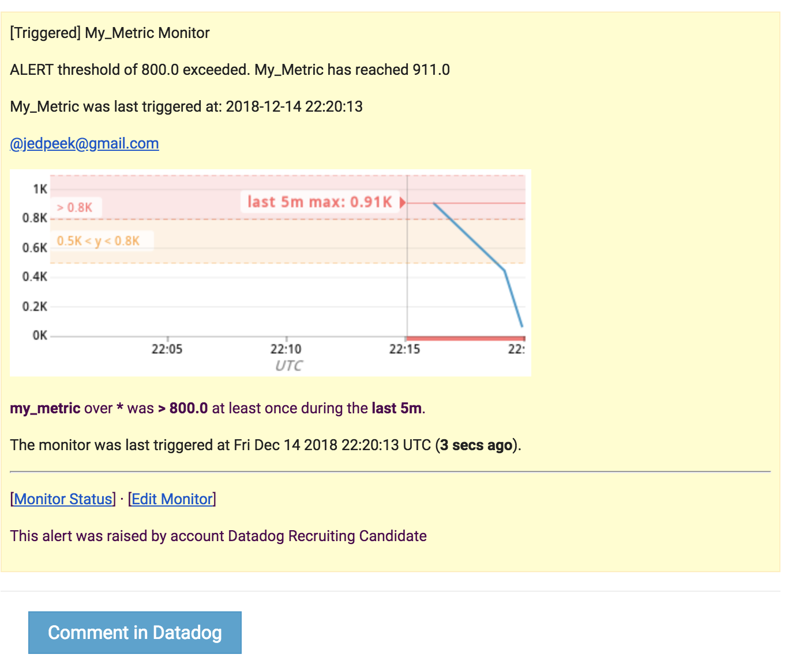

## COLLECTING METRICS
1. Custom tags screenshot


3. MongoDB installed
4. my_metric created
5. Collection interval set to 45 using my_metric.yaml file
6. **Can you change the collection interval without modifying the Python check file you created?**
		Yes, by changing your metrics yaml file you can customize the collection interval using min_collection_interval.
```
init_config:

instances:
  - min_collection_interval: 45
  ```

## VISUALIZING DATA

1. my_metric scoped over Jeds-MacBook-Pro.local
```
"q": "avg:my_metric{host:Jeds-MacBook-Pro.local}"

```

2. Available MongoDb Connections
```
"q" => "anomalies(avg:mongodb.connections.available{server:mongodb://datadog:_localhost:27017}, 'basic', 2)"
```

3. All Custom Metric points for last hour
```
"q" => "sum:my_metric{host:Jeds-MacBook-Pro.local}.rollup(sum, 3600)"
```

4. To view script see: [dog_api](dog_api.rb)


5. What is the Anomaly graph displaying?

	The anomaly graph is displaying a blue line representing the number of MongoDB connections available. The blue line is buffered by a gray area representing the acceptable area of deviation from the average number of connections. If the number of connections is greater than or less than the gray area, the size of which is controlled by the bounds parameter, the line will turn red representing an anomaly in the data. After a period of having a large number of connections to the Mongo database the anomaly graph has shifted representing a change in the expected behavior.

## MONITORING DATA

Thresholds can be set on a metric to either warn you to keep and eye on it or alert you that something more serious is happening. These can be set using the Datadog monitoring tools.
Here we have an example of a notification message for the my_metric metric. Using a one monitor you can have a single message that varies depending on what type of notification needs to be sent.
If the monitor is triggered with an alert all contents in between {{#is_alert}} and {{/is_alert}} will be sent to the specified team member(s). The same is true for {{is_warning}} and {{is_no_data}}.

```
{{#is_alert}}ALERT threshold of {{threshold}} exceeded. My_Metric has reached {{value}} {{/is_alert}}
{{#is_warning}}WARNING threshold of {{warn_threshold}} exceeded. My_Metric has reached {{value}} {{/is_warning}}
{{#is_no_data}}My_Metric data missing{{/is_no_data}}
My_Metric was last triggered at: {{last_triggered_at}}
@jedpeek@gmail.com
```

In this example an alert threshold of 800 was set. If my_metric exceeds 800 @jedpeek@gmail.com will receive an email that reads:

ALERT threshold of 800 exceeded. My_Metric has reached 911


WARNING threshold of 500 exceeded. My_Metric has reached 793


Downtimes can also be set so you are not bothered during your time off. Here are examples of daily and weekend downtimes.


## COLLECTING APM DATA


1. **What is the difference between a Service and a Resource?**
A service is a set of processes that do a job. Examples include web applications and databases.
A resource is an action that takes place inside a service. Examples include routes in a web app and database queries.

## CREATIVE USES
**Is there anything creative you would use Datadog for?**
As someone who has always been a fan of gardening but was not gifted with a green thumb, building a raspberry Pi connected to Datadog alerts would give me the help I need. Alerts would be triggered whenever the plants being monitored need to be watered (soil moisture to low) or they are not getting enough sun.
Tools needed for the job:

1. A Raspberry Pi

2. Solar Panel - Using a solar panel for both powering the raspberry Pi and tracking the amount of direct sunlight on the plants would take care of one of the major aspects of gardening, choosing the right placement for your plants. [SunControl for Raspberry Pi](https://www.kickstarter.com/projects/sunair/suncontrol-diy-solar-power-for-the-raspberry-pi-ar)

3. A Moisture gauge. These can be found at any gardening or home store (or Amazon). [Moisture Meter](https://www.amazon.com/Moisture-Gardens-Sensor-Flowers-Vegetable/dp/B07DL1V4V9/ref=asc_df_B07DL1V4V9/?tag=hyprod-20&linkCode=df0&hvadid=242120314056&hvpos=1o16&hvnetw=g&hvrand=2686245420727738238&hvpone=&hvptwo=&hvqmt=&hvdev=c&hvdvcmdl=&hvlocint=&hvlocphy=9031341&hvtargid=pla-486737576574&psc=1)

5. A Reed switch to gather to attach to our moisture gauge (I have an old one from a cycling speedometer).
