# Answers

## Level 0 (optional) - Setup an Ubuntu VM

I set up a Vagrant Ubuntu 12.04 VM for the hiring exercice as recommanded.

## Level 1 - Collecting your Data
>*Sign up for Datadog (use "Datadog Recruiting Candidate" in the "Company" field), get the Agent reporting metrics from your local machine*

I sign up for Datadog and follow the instructions seen in [datadog guides](https://docs.datadoghq.com/guides/basic_agent_usage/ubuntu/) to get the Agent reporting metrics

>*Bonus question: In your own words, what is the Agent?*

The agent is a service that will collect informations and data needeed and foward to Datadog Dashboard  in order to show graph and metric for Datadog  

> *Add tags in the Agent config file and show us a screenshot of your host and its tags on the Host Map page in Datadog.*

The configuration file for the Agent is located in */etc/dd-agent/datadog.conf*
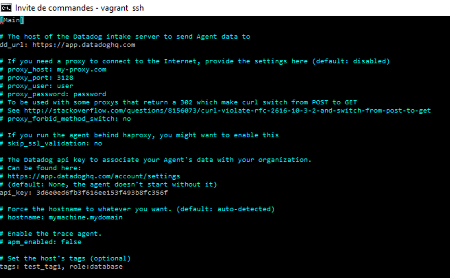

I also add tag using the UI


> *Install a database on your machine (MongoDB, MySQL, or PostgreSQL) and then install the respective Datadog integration for that database.*
I choose MySQL and install the respective Datadog integration by following instructions [here](https://app.datadoghq.com/account/settings#integrations/mysql)

And check if the integration is ok by using the command : 
```sh
$ sudo /etc/init.d/datadog-agent info
```

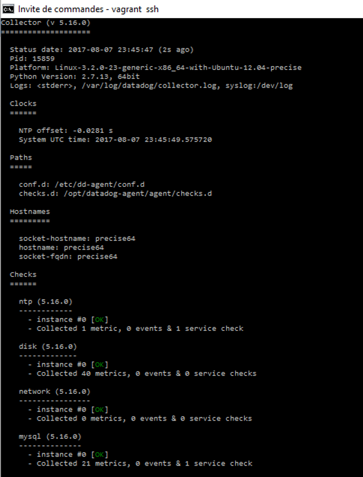

> *Write a custom Agent check that samples a random value. Call this new metric: test.support.random*

I created *test.support.random.yaml* and *test.support.random.yaml* files on *checks.d* and *conf.d* repertory (respectively) 
Py file : 

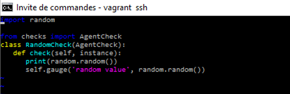
Yaml file : 
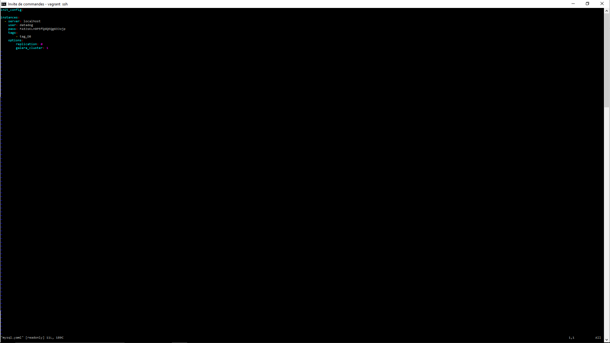

And check the script by using the following command : 
```sh
$ sudo -u dd-agent dd-agent check test.support.random 
```

## Level 2 - Visualizing your Data
> *Since your database integration is reporting now, clone your database integration dashboard and add additional database metrics to it as well as your test.support.random metric from the custom Agent check.*

I cloned my database integration dashboard by using the User Interface and add test.support.random metric by using [metrics explorer ](https://app.datadoghq.com/metric/explorer)
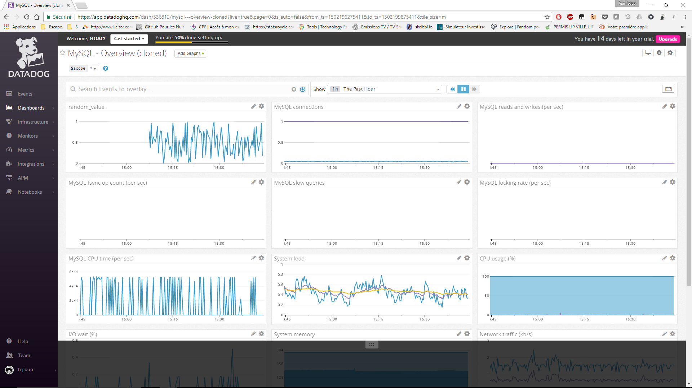

> *Bonus question: What is the difference between a timeboard and a screenboard?*

I generate a timeboard and a screenboard in order to understand differencies.
They both can show same informations but not for differents needs : Screenboard is adapted for monitoring and Timeboard for troobleshooting.
Screenboard is as it says for screen (TV, wallboard..) it permits to have a global view or status of a service or infrastructure. It is flexible and customizable : you can add widgets and metrics with differing time scales.
Timeboard is for investigation : graphs are synchronised so it's better for troubleshooting and correlation. 

> *Take a snapshot of your test.support.random graph and draw a box around a section that shows it going above 0.90. Make sure this snapshot is sent to your email by using the @notification*

After following instructions the snapshot appears on the [events page](https://app.datadoghq.com/event/stream) : 


## Level 3 - Alerting on your Data
> *Since you've already caught your test metric going above 0.90 once, you don't want to have to continually watch this dashboard to be alerted when it goes above 0.90 again. So let's make life easier by creating a monitor.*

I go [here](https://app.datadoghq.com/monitors#create/metric) to create a monitor

> *Set up a monitor on this metric that alerts you when it goes above 0.90 at least once during the last 5 minutes*

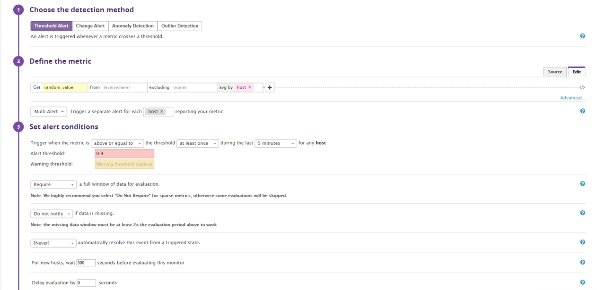

> *Bonus points: Make it a multi-alert by host so that you won't have to recreate it if your infrastructure scales up.*

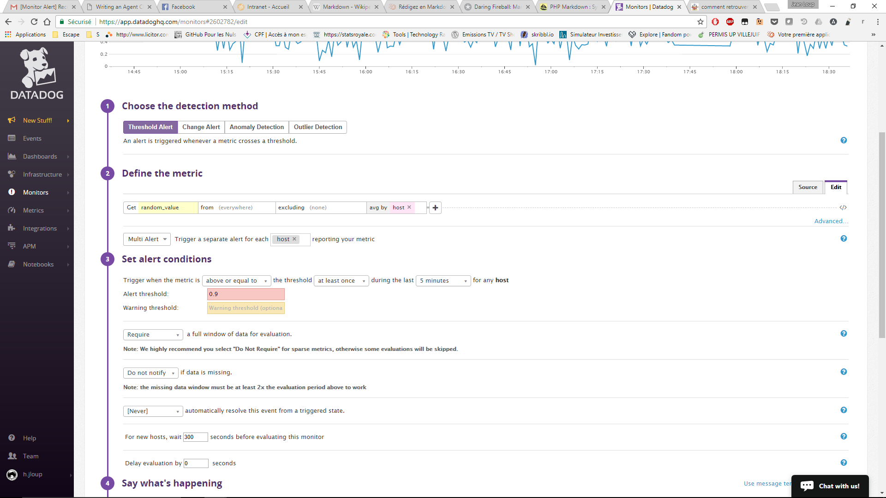

> *Give it a descriptive monitor name and message (it might be worth it to include the link to your previously created dashboard in the message). Make sure that the monitor will notify you via email.*

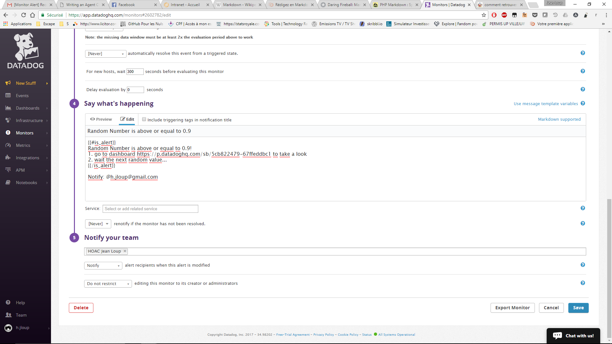

> *This monitor should alert you within 15 minutes. So when it does, take a screenshot of the email that it sends you.*

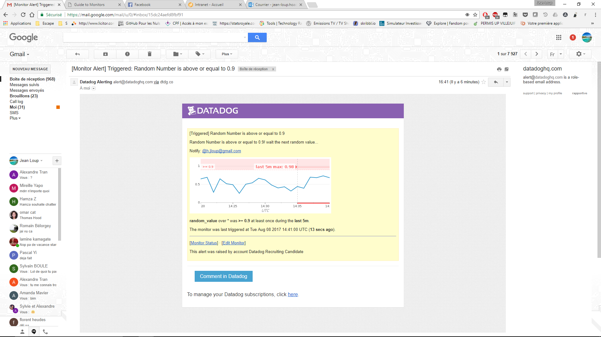

> *Bonus: Since this monitor is going to alert pretty often, you don't want to be alerted when you are out of the office. Set up a scheduled downtime for this monitor that silences it from 7pm to 9am daily. Make sure that your email is notified when you schedule the downtime and take a screenshot of that notification.*

I go [here](https://app.datadoghq.com/monitors#/downtime) to schedule my downtime

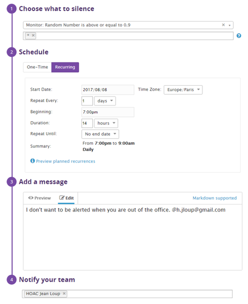
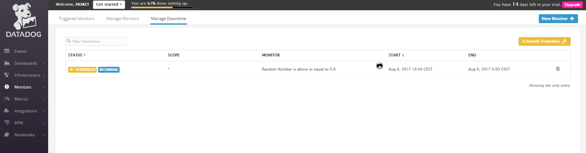
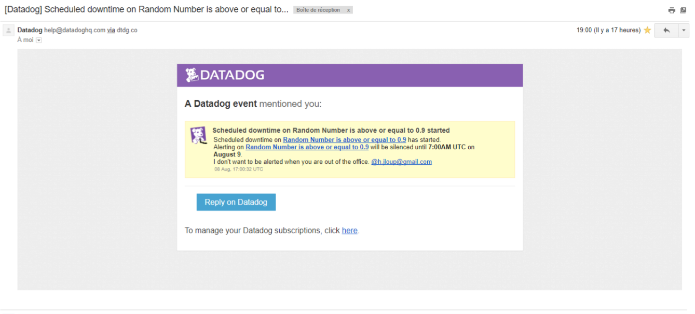
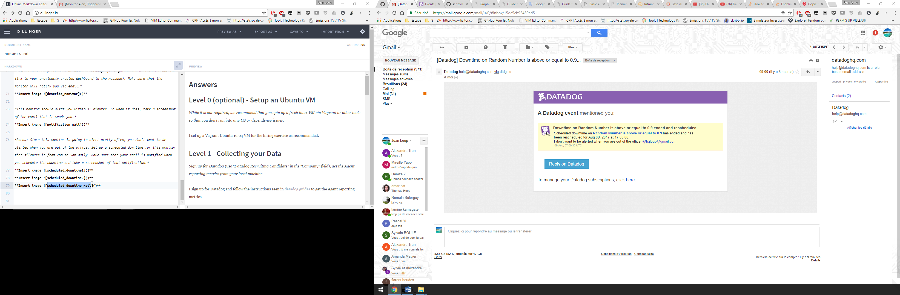


