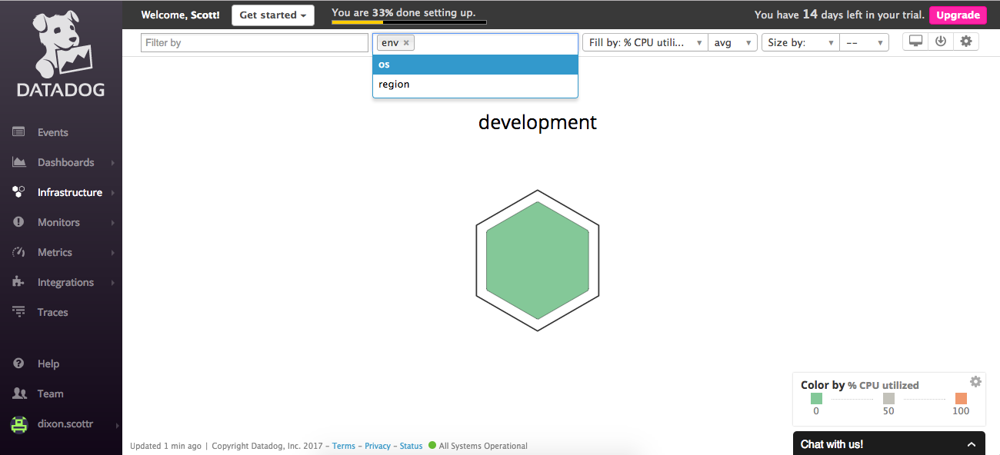
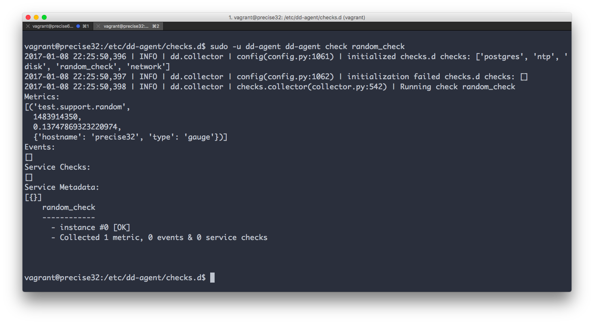
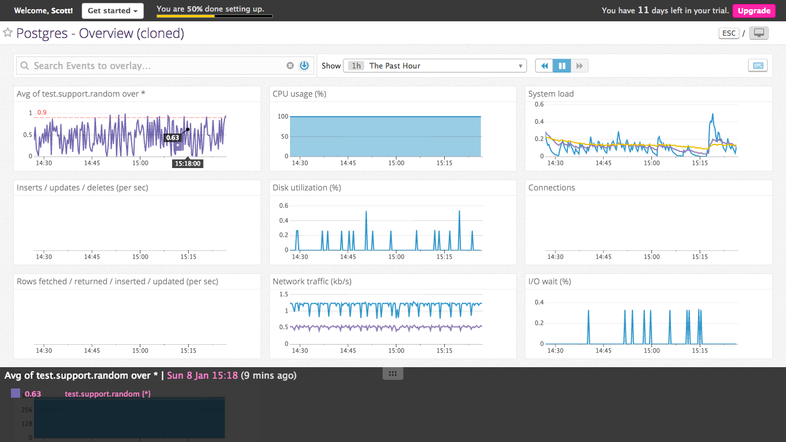
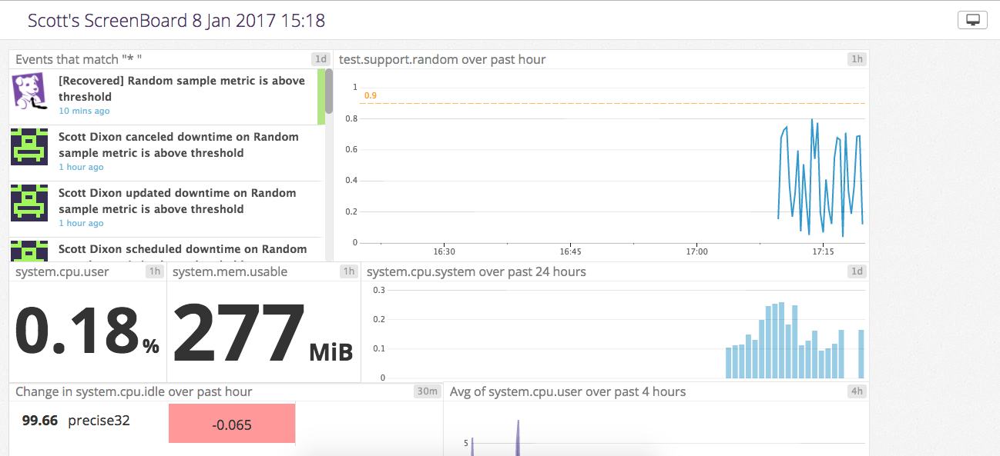
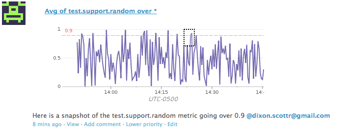
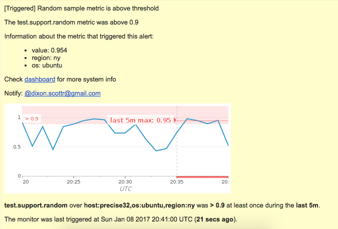
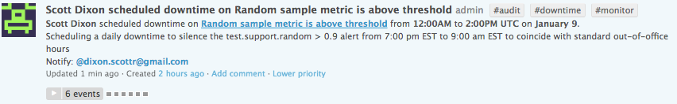
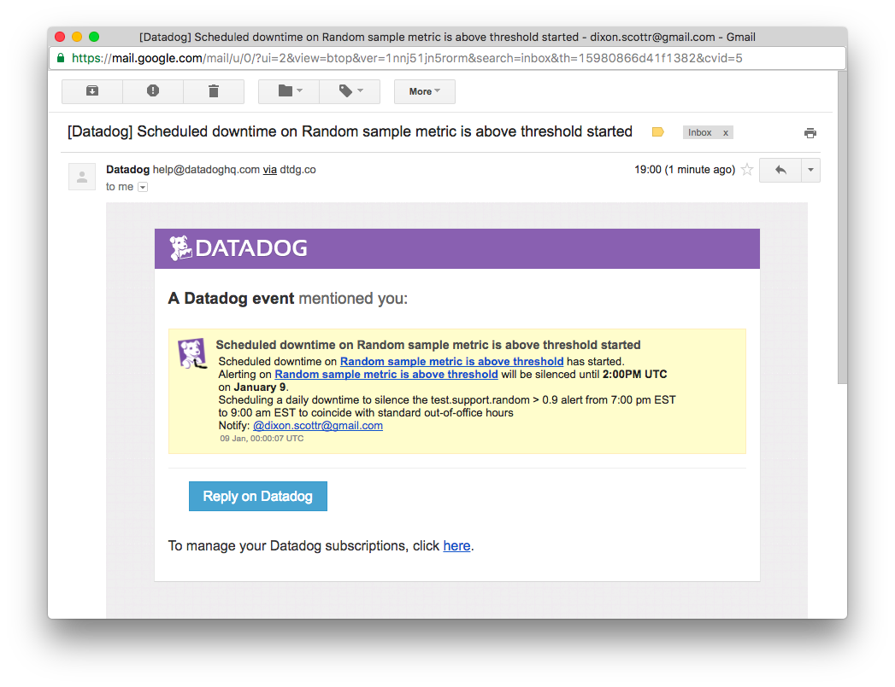

##Answers

###Level 1

* *In your own words, what is the Agent?*
    The agent is software that is installed on a customer's system that monitors the system and is able to collect metrics, such as memory or CPU usage. The agent sends those metrics back to Datadog where the customer can monitor them.
    
* *a screenshot of your host and its tags*


* *a custom Agent check that samples a random value*
````
from checks import AgentCheck
import random
class RandomCheck(AgentCheck):
  def check(self, instance):
    self.gauge('test.support.random', random.random())
````

* *screenshot of the output of the custom Agent check, 'random_check'*


###Level 2

* *screenshot of cloned database integration dashboard with additional metrics plus the test.support.random metric*


* *What is the difference between a timeboard and a screenboard?*
    All of the graphs on a TimeBoard are synced up to the same time frame and are shown in a standardized grid format, making them ideal for troubleshooting. Whereas ScreenBoards are more customizable and ideal for seeing the overall status of a system. Each graph on a ScreenBoard can have a different time frame and the graphs can be arranged in a variety of formats. Another difference is that while the live status of an entire ScreenBoard can be shared though a unique public link, only images of an individual graph in a TimeBoard can be shared.

* *screenshot of custom ScreenBoard as seen through its [public URL](https://p.datadoghq.com/sb/82adb2cc5-099c8ab083)*


* *a snapshot of your test.support.random graph and draw a box around a section that shows it going above 0.90*


###Level 3

* *a screenshot of the email alert sent after the monitor was triggered*



* *a screenshot of the notification that downtime has been scheduled for the monitor daily between 7:00 pm and 9:00 am EST*


* *a screenshot of the emailed notification that scheduled downtime has started*
