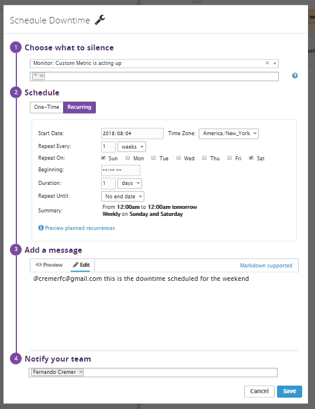

Your answers to the questions go here.

## Prerequisites - Setup the environment
The Agent reporting metrics from my local machine (which is using a linux VM vis Vagrant).

I setup a Ubuntu agent with this command once I spun up my Vagrant linux VM (Ubuntu):
```
DD_AGENT_MAJOR_VERSION=7 DD_API_KEY=MY_API_KEY bash -c "$(curl -L https://raw.githubusercontent.com/DataDog/datadog-agent/master/cmd/agent/install_script.sh)"

```

## Collecting Metrics
* Add tags in the Agent config file and show us a screenshot of your host and its tags on the Host Map page in Datadog.

In the datadog.yaml, added the following tags:
```
tags:
    - state:MA
    - city:Canton
    - agent:Ubuntu
    - os:Ubuntu_18.04.3_LTS
    - candidate-type:SalesEngineer
    - candidate-name:JoseBrache
```


This host map can be seen here: https://app.datadoghq.com/infrastructure/map?fillby=avg%3Acpuutilization&sizeby=avg%3Anometric&groupby=availability-zone&nameby=name&nometrichosts=false&tvMode=false&nogrouphosts=true&palette=green_to_orange&paletteflip=false&node_type=host&host=2551253227


* Install a database on your machine (MongoDB, MySQL, or PostgreSQL) and then install the respective Datadog integration for that database.

Installed mysql on my ubuntu VM
```
sudo apt install mysql-server
```

Installed the DataDog integration for MySQL, following these instructions (https://docs.datadoghq.com/integrations/mysql/)

Added this configuration block to my mysql.d/conf.yaml to collect MySQL metrics:
```
init_config:

instances:
  - server: 127.0.0.1
    user: datadog
    pass: "ILikeDataDog"
    port: "3306"
    tags:
      - MySQL:JoseBrache
    options:
      replication: false
      galera_cluster: true
      extra_status_metrics: true
      extra_innodb_metrics: true
      extra_performance_metrics: true
      schema_size_metrics: false
      disable_innodb_metrics: false

```

Was able to see the captured metrics in DataDog here: https://app.datadoghq.com/infrastructure/map?fillby=avg%3Acpuutilization&sizeby=avg%3Anometric&groupby=availability-zone&nameby=name&nometrichosts=false&tvMode=false&nogrouphosts=true&palette=green_to_orange&paletteflip=false&node_type=host&host=2551253227


* Create a custom Agent check that submits a metric named my_metric with a random value between 0 and 1000.

First created a custom_randomcheck.yaml in ‘/etc/datadog-agent/conf.d/custom_randomcheck.d’
This was in the contents:
```
instances: [{}]
```

Then created a custom_randomcheck.py in:
‘/etc/datadog-agent/checks.d’

With this code:
```python
import random

# the following try/except block will make the custom check compatible with any Agent version
try:
    # first, try to import the base class from new versions of the Agent...
    from datadog_checks.base import AgentCheck
except ImportError:
    # ...if the above failed, the check is running in Agent version < 6.6.0
    from checks import AgentCheck

# content of the special variable __version__ will be shown in the Agent status page
__version__ = "1.0.0"

class RandomCheck(AgentCheck):
    def check(self, instance):
        self.gauge('mymetric', random.randint(0,1000), tags=['metric_submission_type:gauge'])
```

After restarting the agent, I was able to find this metric being reported, graph shown below with the link here:
https://app.datadoghq.com/metric/explorer?from_ts=1591331546799&to_ts=1591335146799&live=true&page=0&is_auto=false&tile_size=m&exp_metric=mymetric&exp_agg=avg&exp_row_type=metric


* Change your check's collection interval so that it only submits the metric once every 45 seconds.

I added the ‘min_configuration_interval’ field in custom_randomcheck.yaml, so it looks like this (following these(https://docs.datadoghq.com/developers/write_agent_check/?tab=agentv6v7) instructions):
```
init_config:
 
instances:
  - min_collection_interval: 45
```

* **Bonus Question** Can you change the collection interval without modifying the Python check file you created?

**Answer**: Yes, looking at the documentation (https://docs.datadoghq.com/developers/write_agent_check/?tab=agentv6v7) you can change the collection interval of a check, by adjusting **min_collection_interval** field in the configuration file. A user may be able to add a sleep method in the custom agent check python file, i.e. the one I had was **custom_randomcheck.py** so I believe you could add a sleep function in there to modify the collection interval. Alternatively, using that min_collection_interval is a nice configuration to be able to manipulate.

## Visualizing Data
Utilize the Datadog API to create a Timeboard that contains:
* Your custom metric scoped over your host.
* Any metric from the Integration on your Database with the anomaly function applied.
* Your custom metric with the rollup function applied to sum up all the points for the past hour into one bucket

Please be sure, when submitting your hiring challenge, to include the script that you've used to create this Timeboard.

**Answer**: This is the timeboard, with all these 3 metrics, I did have one for each that you can view in this zip. For the graph below, I used the log y scale to visualize these metrics a bit clearer because they have different scales.


Here’s the JSON script for this timeboard:
https://gist.github.com/jbrache/7c032d404be26a1f471c7c7d0215d608
```json
{
    "viz": "timeseries",
    "requests": [
        {
            "q": "anomalies(avg:mysql.performance.cpu_time{*}, 'basic', 2), avg:mymetric{*}, avg:mymetric{*}.rollup(sum, 3600)",
            "type": "line",
            "style": {
                "palette": "dog_classic",
                "type": "solid",
                "width": "normal"
            }
        }
    ],
    "yaxis": {
        "max": "auto",
        "scale": "log",
        "min": "auto",
        "label": "",
        "includeZero": true
    },
    "markers": []
}

```

Once this is created, access the Dashboard from your Dashboard List in the UI:
* Set the Timeboard's timeframe to the past 5 minutes
* Take a snapshot of this graph and use the @ notation to send it to yourself.

**Answer**: Below is a screenshot of the email with the timeboard set to the past 5 minutes with my mention.


* **Bonus Question**: What is the Anomaly graph displaying?

**Answer**: The anomaly graph is displaying behavior for a metric which may be abnormal by analyzing the historical data for that metric. It displays what looks normal as well as what looks like anomalies (with red lines). There are some additional settings you can adjust based on the type of algorithm used for tracking trends as well as the ‘bounds’ parameter which allows you to adjust the tolerances.

## Monitoring Data
Since you’ve already caught your test metric going above 800 once, you don’t want to have to continually watch this dashboard to be alerted when it goes above 800 again. So let’s make life easier by creating a monitor.
Create a new Metric Monitor that watches the average of your custom metric (my_metric) and will alert if it’s above the following values over the past 5 minutes:
* Warning threshold of 500
* Alerting threshold of 800
* And also ensure that it will notify you if there is No Data for this query over the past 10m.

**Answer**: below are the message conditions


Please configure the monitor’s message so that it will:
* Send you an email whenever the monitor triggers.
* Create different messages based on whether the monitor is in an Alert, Warning, or No Data state.
* Include the metric value that caused the monitor to trigger and host ip when the Monitor triggers an Alert state.
When this monitor sends you an email notification, take a screenshot of the email that it sends you.

**Answer**: Here is the message configuration with this these conditions:


**Answer**: Here is the email notification I received:


**Bonus Question**: Since this monitor is going to alert pretty often, you don’t want to be alerted when you are out of the office. Set up two scheduled downtimes for this monitor:

* One that silences it from 7pm to 9am daily on M-F,


* And one that silences it all day on Sat-Sun.


* Make sure that your email is notified when you schedule the downtime and take a screenshot of that notification.
Email notification for M-F downtime:


Email notification for Sat-Sun downtime:


## Collecting APM Data
Given the following Flask app (or any Python/Ruby/Go app of your choice) instrument this using Datadog’s APM solution:

* **Bonus Question**: What is the difference between a Service and a Resource?

Provide a link and a screenshot of a Dashboard with both APM and Infrastructure Metrics.

Please include your fully instrumented app in your submission, as well.

## Final Question
Datadog has been used in a lot of creative ways in the past. We’ve written some blog posts about using Datadog to monitor the NYC Subway System, Pokemon Go, and even office restroom availability!

Is there anything creative you would use Datadog for?
