# Questions

Hi there, my name is Sara Burke. I'm applying for a Solutions Engineer position at DataDog's SF office. Below you'll find my coding challenge answers in roughly the same order as the questions presented in the README file.

## Prerequisites - Setup the environment

I chose to keep the VM simple and follow recommendations to make an Ubuntu VM using Vagrant. I haven't had many opportunities to work with Docker, so I'll try to isolate the learning part of this process to DataDog products.

* Initially, I tried (and failed) to install the DataDog Agent using provisioning within the [Vagrantfile](docs/vagrant/Vagrantfile) and a [shell script](docs/vagrant/install.sh). My knowledge of setting up Vagrant from scratch with provisions is spotty, particularly in working with keys.

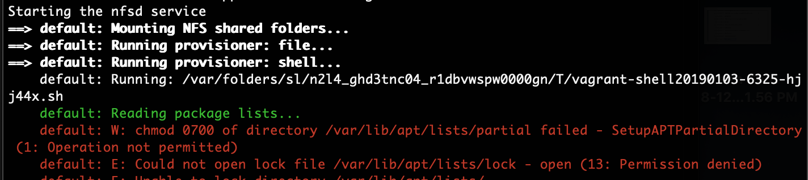

* So instead I'll admit defeat and successfully run the Agent's "easy one-step install" in the shell.

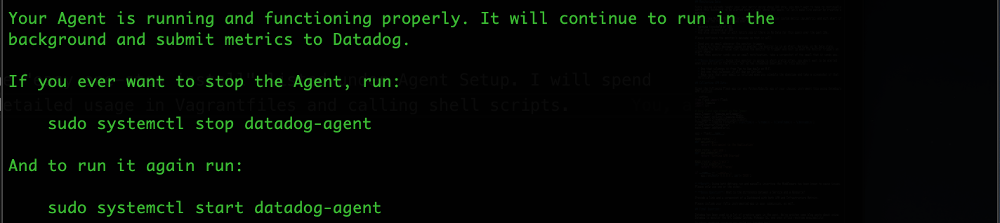

* Great! It's working. Let's move on.

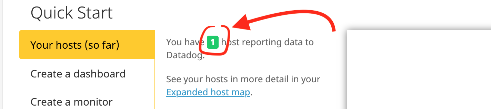

## Collecting Metrics

* I decided to spin up a couple of additional Vagrant instances of Ubuntu (total count of one Trusty64, two Xenial64s). This time I successfully used Vagrant's provisioning to install the DataDog Agent on first "Vagrant up". Previously, I must have accidentally included a newline when adding the one-liner-install into the the provisioning file. I have included these [Vagrant related files in the docs folder.](docs/vagrant/)

* I added tags and changed hostnames on the Agent config files across the three VMs and restarted the Agent. Then I discovered that I should have prepended the one-liner-intalls in the provisioning files with "DD_INSTALL_ONLY=true". Since changes can take up to 30 minutes to take full effect, DataDog was recognizing the new hostnames as separate machines. Temporarily, five hosts were displayed instead of three.

* A snippet of some changes that I made to the [datadog.yaml](docs/datadog/datadog.yaml) are displayed below.

```yaml
# Force the hostname to whatever you want. (default: auto-detected)
hostname: Primary.machine

# ...

# Set the host's tags (optional)
tags:
  - importance:high
  - env:prod
  - role:database
```

* Tag functionality displayed across three VMs on the Host Map.

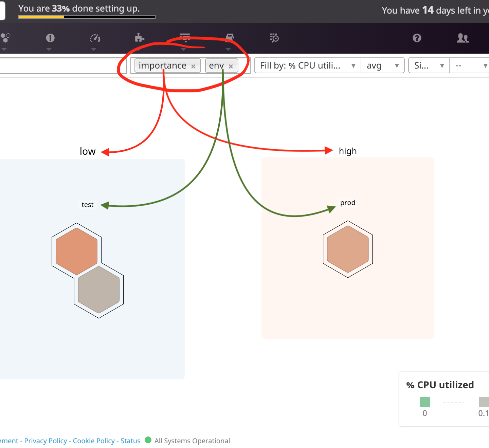

* I installed MySQL using a [shell script](docs/vagrant/install.sh) linked to my [Vagrantfile](docs/vagrant/install.sh) provisions with the script snippet below.

```bash
# MySQL ========================
    # Set MySQL Password
    debconf-set-selections <<< "mysql-server mysql-server/root_password password $DBPASSWD"
    debconf-set-selections <<< "mysql-server mysql-server/root_password_again password $DBPASSWD"

    # Install MySQL
    apt-get -y install mysql-server

    # Create a new database
    mysql -uroot -p$DBPASSWD -e "CREATE DATABASE $DBNAME"
```

* I installed the DataDog integration for MySQL via shell and then performed the checks shown below.

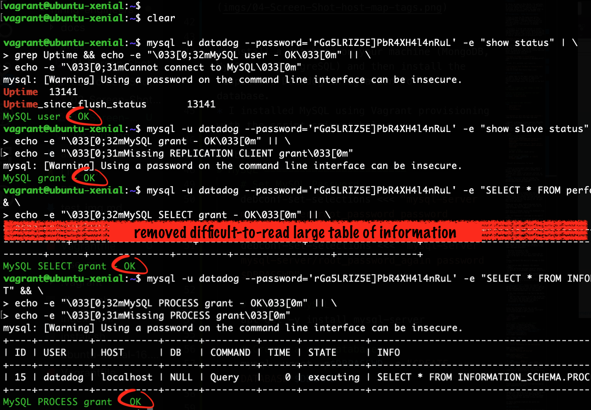

* I also ran datadog-agent status checks for MySQL integration, and confirmed the integration via web GUI.

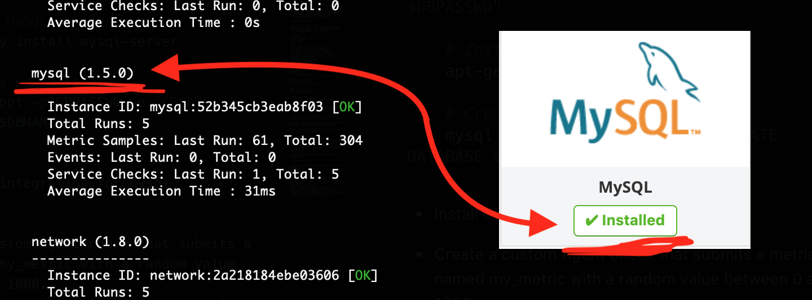

* I created a custom Agent check [my_metric.py](docs/datadog/my_metric.py) that generates a random int between 0 and 1000 in Python. Displayed below is the code with comments trimmed for readability, and [my_metric.yaml](docs/datadog/my_metric.yaml) at this point in the exercise.

```python
import random

try:
    from checks import AgentCheck
except ImportError:
    from datadog_checks.checks import AgentCheck

__version__ = "1.0.0"

class my_metric_check(AgentCheck):
    def check(self, instance):
            self.gauge('my_metric', random.randint(0, 1001))

```

```yaml
instances: [{}]
```

* Here is a screen shot of a successful Agent check on my_metric.

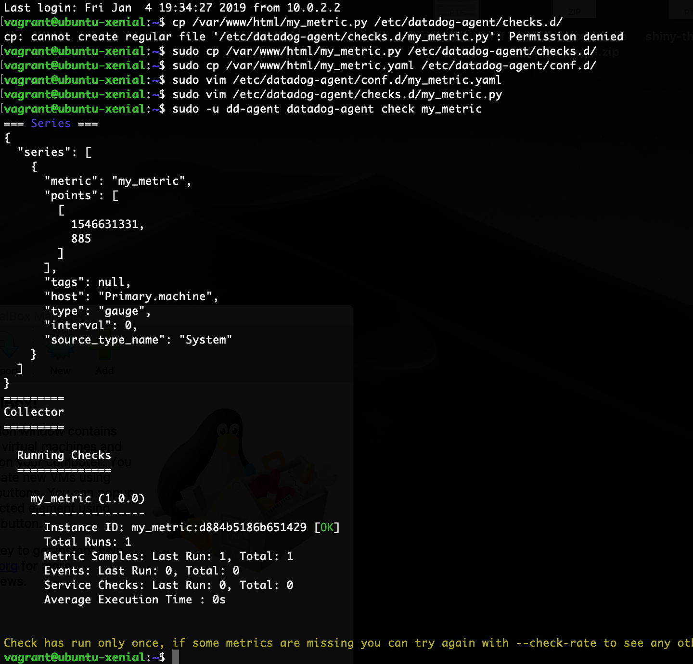

* I changed my_metric's collection interval to once every 45 seconds by changing the [my_metric.yaml](docs/datadog/my_metric.yaml) file to contain the following code snippet.

```yaml
# instances: [{}]

init_config:

instances:
  - min_collection_interval: 45
```

* **Bonus Question** Can you change the collection interval without modifying the Python check file you created?
  * Yes, interval collection can be changed within the metric's yaml file as shown in the last step.

## Visualizing Data

* This timeboard was created with this [API-timeboard.py](docs/datadog/API-timeboard.py) script. Completing this task took longer than I expected while looking through the API docs. So, I used the GUI for creating graphs on a different timeboard to generate JSON so I could better understand the structure of the requests.

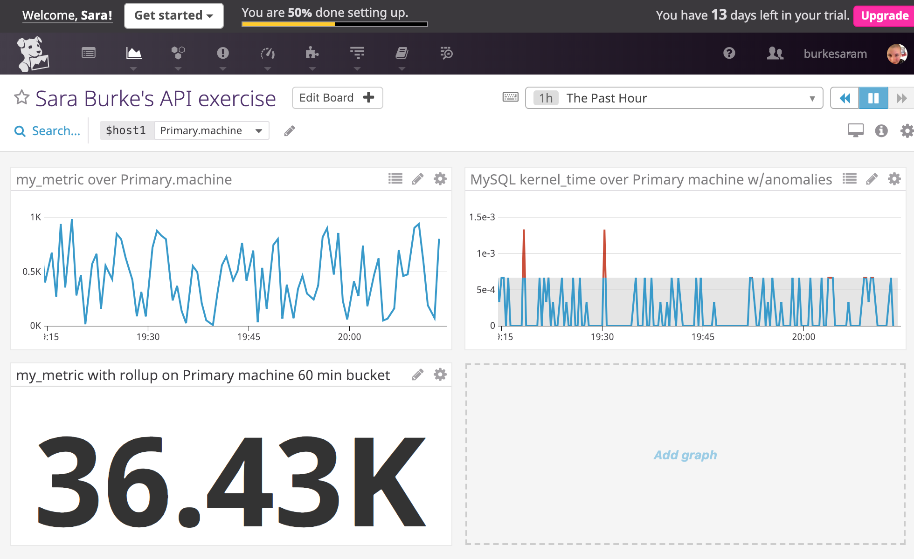

* In this screen shot, I've shortened the Timeboard's timeframe to the last 5 minutes, taken a snapshot, and used the @ notation to send it to myself.

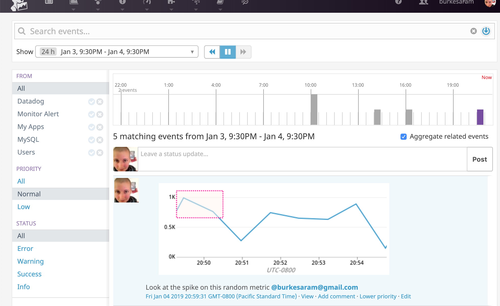

* **Bonus Question**: What is the Anomaly graph displaying?
  * My Anomaly graph is showing the MySQL kernel_time which displays the percentage of CPU time spent in kernel space by MySQL. The anomaly part of this graph displays grey shading over the visualization showing the expected behavior based on previous data.

## Monitoring Data

* I created a new metric monitor for my_metric. Here's a screen shot of the monitor and a listing of settings.
  * Warn for value > 500 at 5 mins
  * Alert for value > 800 at 5 mins
  * No data at 10 mins

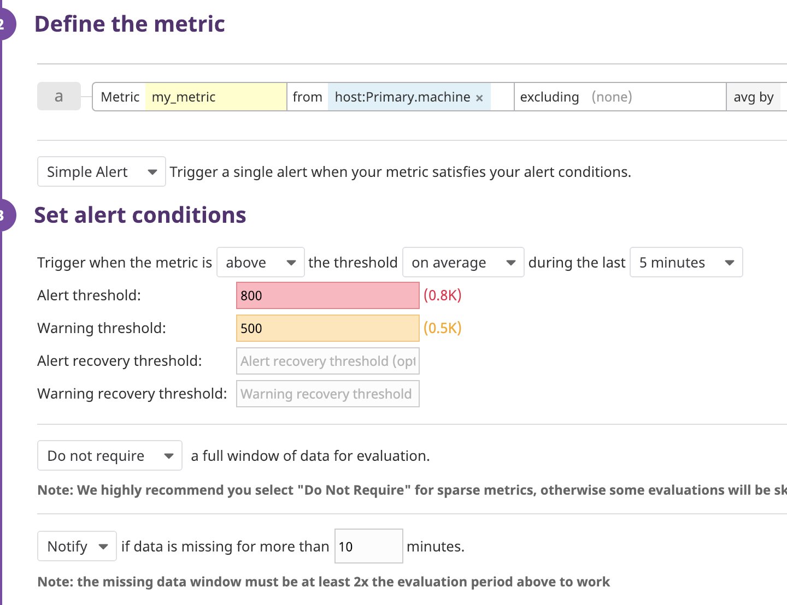

* Here's a screen shot of one of the emails that the monitor sent me followed by the email template.

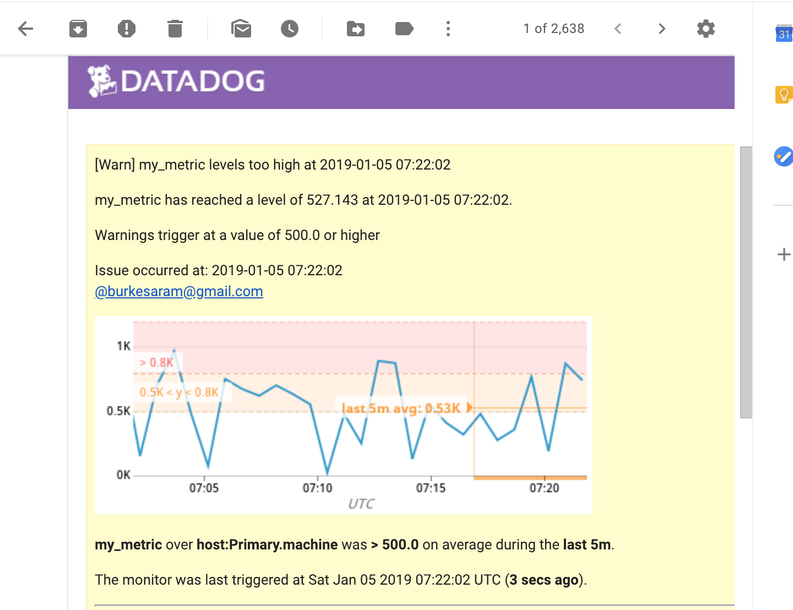

```none
TITLE: my_metric {{#is_no_data}}has no data{{/is_no_data}}{{^is_no_data}}levels too high{{/is_no_data}} at {{last_triggered_at}}

BODY:
my_metric has reached a level of {{value}} at {{last_triggered_at}}.

{{#is_warning}}Warnings trigger at a value of {{warn_threshold}} or higher{{/is_warning}}
{{#is_alert}}Alerts trigger at a value of {{threshold}} or higher{{/is_alert}}
{{#is_no_data}}No data has been detected for at least 10 minutes{{/is_no_data}}

Issue occurred at: {{last_triggered_at}}
 @burkesaram@gmail.com
```

* **Bonus Question**: Since this monitor is going to alert pretty often, you don’t want to be alerted when you are out of the office. Set up two scheduled downtimes for this monitor:

  * Below are screen shots showing scheduled downtime for weekdays from 7pm to 9am.

  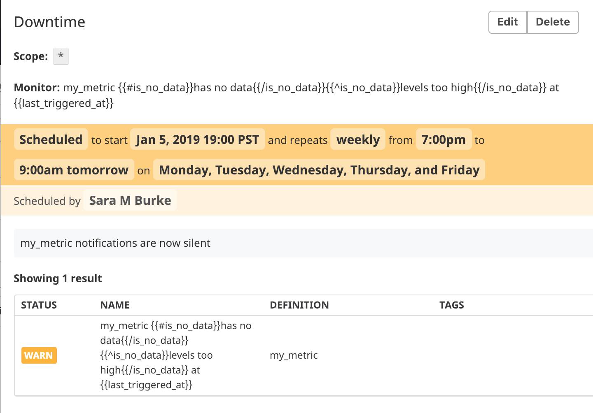

  * And another downtime scheduled for the entirety of Saturday and Sunday.

  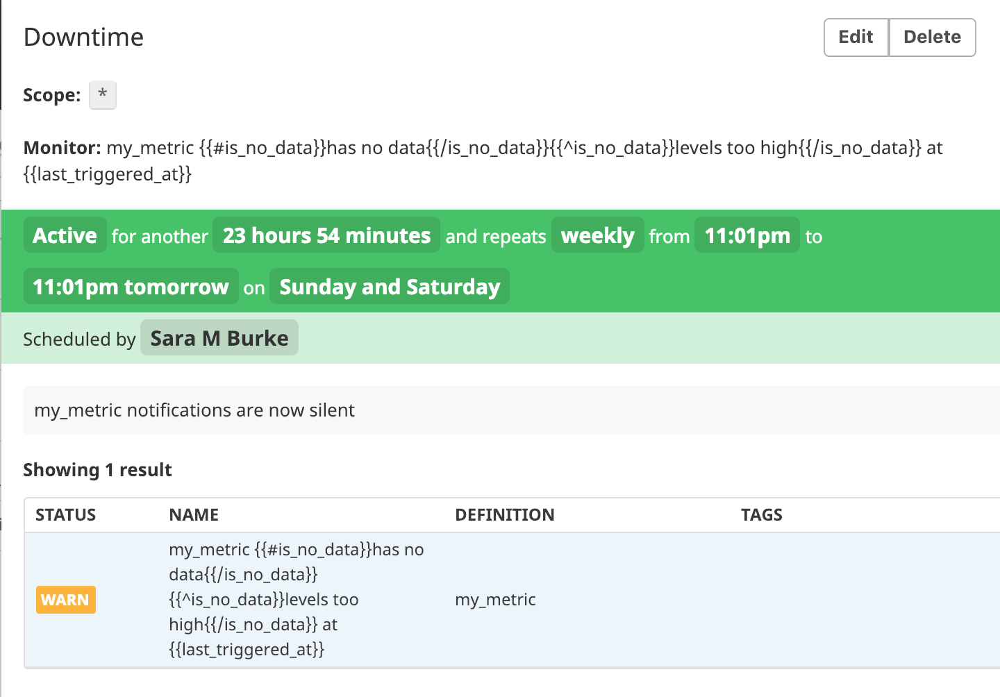

  * Last but not least, a screen shot of the notification showing that downtime has started for this monitor.

  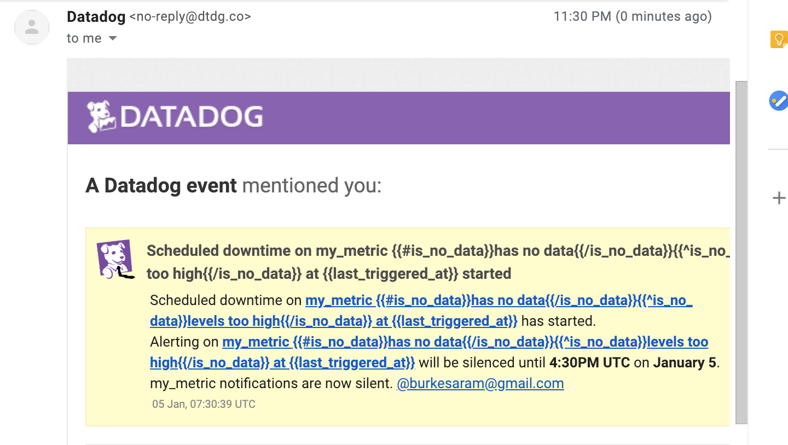

* **Potential bug:** (Sat, Jan 5 2019, ~10-11AM PST) Cannot properly scroll on edit modal in Manage Downtime tab. Initial steps: Under the Manage Downtime tab (Layer 1, main-page), select an existing scheduled downtime(Layer 2, opens right-hand-slideout), select the edit button (Layer 3, opens edit-modal).
  * This didn't appear to be an issue last night (Fri, Jan 4 2019, ~11PM PST) when I was editing downtimes.
  * Issue does NOT occur when creating a new scheduled downtime.
  * 2015 macbook pro trackpad will not scroll the L3:edit-modal.
    * Position of cursor does not change behavior.
  * Using up/down arrow keys changes selection on list of existing scheduled downtimes on the L1:main-page. Right-hand slideout appropriately changes information according to selected scheduled downtime.
  * Spacebar and shift+spacebar DOES properly scroll L3:edit-modal.
  * [esc] properly exits edit modal.
    * Trackpad scrolling now functions properly, including typical scrolling behavior based on cursor position for macOS devices. i.e. with L2:right-hand-slideout open, cursor over L2:right-hand-slideout result in no scrolling. Cursor over L1:main-page scrolls L1:main-page.
  * Reloading and shift+command+R do not resolve the issue.
  * I don't have screen recording software, so visually documenting the bug is difficult on my end.

## Collecting APM Data

This exercise took a few steps to complete, so I've numbered them for easier reading.

1. I installed Flask and ddtrace to the Vagrant box and my personal machine for IDE lib functionality.

```shell
sudo -H pip install flask
sudo -H pip install ddtrace
```

2. I modified the [datadog.yaml](docs/datadog/datadog.yaml) file and restarted the Agent.

```yaml
apm_config:
    enable:true
```

```shell
sudo service datadog-agent restart
```

3. I modified my [Vagrantfile](docs/vagrant/Vagrantfile) so that I could test the small flask app through my personal machine's browser, then reloaded Vagrant.

```yaml
config.vm.network "forwarded_port", guest:5050, host:8080
```

```shell
vagrant reload
```

4. I changed the [Flask app](docs/datadog/app.py)'s permissions to be executable and initiated instrumentation by running the app using ddtrace.

```shell
sudo chmod a+x app.py
ddtrace-run python3 app.py
```

5. Here's a screen shot collection showing successful visits to the Flask app.

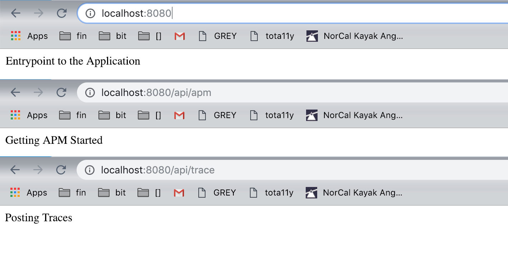

6. Evidence of the successful APM connection.

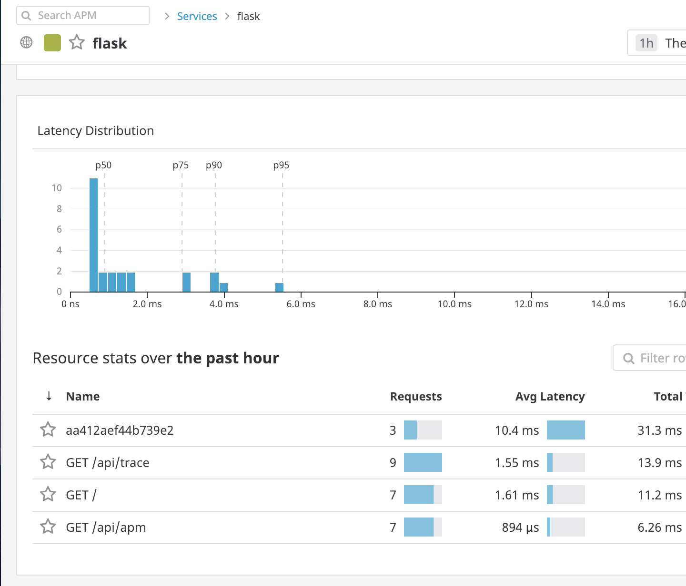

7. [Dashboard with both APM and Infrastructure Metrics.](https://p.datadoghq.com/sb/fa5a62a52-b8a4a466849b241fd97a17ae99bdacb4)

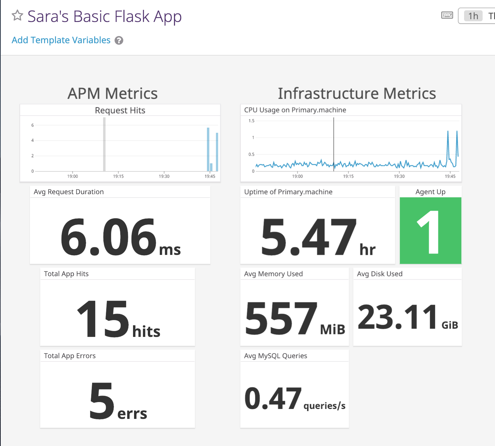

* I've included the [fully instrumented app](docs/datadog/app.py) as requested, however my instrumentation was limited to running the app with ddtrace-run. I spent some hours reading through the APM documentation and while I understand the basics, applying ddtrace inside of an application is something I will need more guidance with before becoming proficient.

* **Bonus Question**: What is the difference between a Service and a Resource?
  * Let's say I have a webapp that sends a query to a database and displays the results of that query in a browser. The service is the webapp, and a resource is the query from the webapp. A service is a collection of processes that have an end result. A resource is a part of that service which helps create that end result.

## Final Question

Is there anything creative you would use Datadog for?

I grew up in the American Midwest. While I've been living on the West Coast for nearly a decade now, I'm familiar only with bodies of fresh water. So lately, I've been learning about oceans. Currents, waves, tides, swells, sea kayaking, sailing, boating, fishing, crabbing, etc.

The National Oceanic and Atmospheric Administration (NOAA) has a series of sensor bouys they maintain across the country (world?) to monitor various conditions. There are several bouys just outside of San Francisco and within the SF Bay. I started monitoring them around the time that weather conditions were able to facilitate the [Mavericks competition](https://en.wikipedia.org/wiki/Mavericks,_California#Invitational_Surfing_Contest) (which was ultimately cancelled recently, 2018). 2018's weather conditions forecasted waves of up to 60 feet tall between Half Moon Bay and Marin with San Francisco in the middle. When the giant swells moved in, I could see the evidence in readings from the NOAA bouys. Unfortunately, the bouy feeds are difficult to read and only a few steps away from raw data.

I'd like to collect the bouy data, then track it through DataDog to improve readability of the information. Hypothetically speaking, conditionals could be applied to send notifications based on surfability (wave height, time interval between waves), small watercraft safety (wave height, strength of currents), what the tide stage is at, and even as granular as whether currents are too strong to drop crab pots.

Thanks for your time!