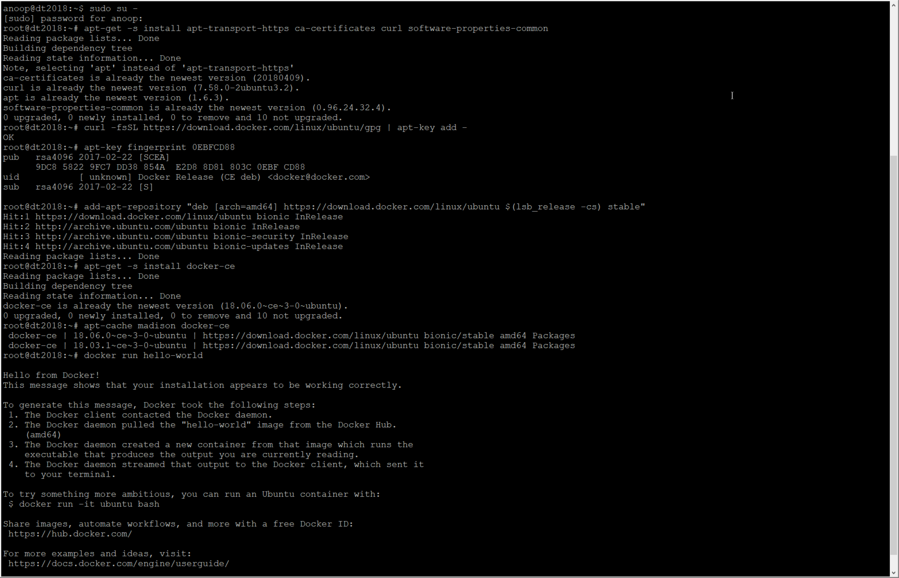
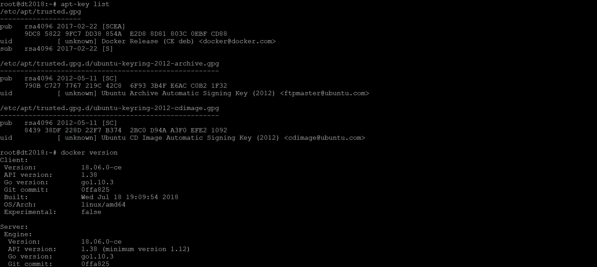

# Technical Exercise - Solutions Engineer
1. [Exercise Summary](#exercise-summary)
2. [Environment](#environment)
3. [Collecting](#collecting-metrics)
4. [Visualizing](#visualizing-data)
5. [Monitoring](#monitoring)
6. [Collecting APM Data](#collecting-apm-data)
7. [Creative Use Case](#creative-use-case)

## Exercise Summary
The objective of this exercise is to provision a Linux VM with a target application then configure metric collection, data visualization, monitoring with thresholds, collect APM data and finally suggest any interesting or creative use cases for DataDog.

I found the exercise a good introduction to getting started with DataDog and as expected from a mature product it was a straightforward process.

Since I am comfortable with the either approach I decided to move forward with Docker for Linux and the dockerized Datadog Agent image for two reasons, lower profile and an opportunity to become familiar with the dockerized agent.

## Environment

In the interests of time and ease of provisioning I chose Ubuntu 18.04.1 LTS (Bionic Beaver) with Docker CE (Docker for Ubuntu).

I followed the Official Docker instructions [1](#1) to get Docker CE installed which on a fresh Ubuntu system involves the following steps:
- Install packages to allow apt access over HTTPS
- Add Docker's GPG key & verify
- Setup the stable Docker repo to install build
- Install Docker CE
- Verify it's installed correctly by running the hello-world image.

Installation was successful and the only anomaly I noticed was that the apt-key fingerprint check included this in the output `[ unknown] Docker Release (CE deb)`. It seems safe to ignore once I confirmed it was the same result for other keys using `apt-key list` and the installed Docker version with `docker version`.

