## Collecting Metrics 


## Adding tags

* Add tags in the Agent config file and show us a screenshot of your host and its tags on the Host Map page in Datadog.

I followed along the [documentation](https://docs.datadoghq.com/getting_started/tagging/assigning_tags/) I was able to find the datadog.yaml file and make the necessary changes:

- take the comments out the 'tags' section
- change to: 
		tags: project:test,laptop:koshap,role:database

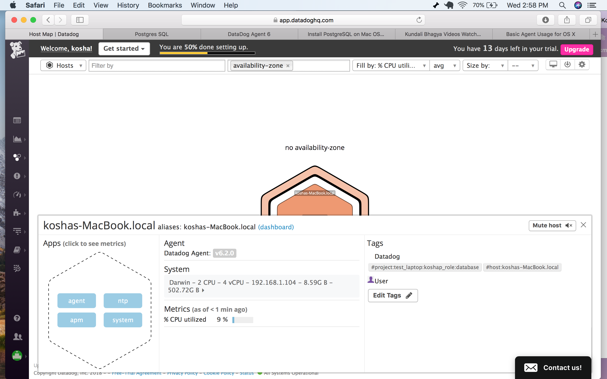


* Install a database on your machine (MongoDB, MySQL, or PostgreSQL) and then install the respective Datadog integration for that database.

I chose to use PostgreSQL as I was am pretty comfortable with it.  I already have PostgreSQL installed on my machine. 

I used  https://docs.datadoghq.com/integrations/postgres/ to follow to integrate PostgreSQL

1.	Created a read-only Datadog user using the following command line:

```
create user datadog with password '<PASSWORD>';
grant SELECT ON pg_stat_database to datadog;
```

2.	Checked the correct permissions running the following command line:

```
psql -h localhost -U datadog postgres -c \
    "select * from pg_stat_database LIMIT(1);"
    && echo -e "\e[0;32mPostgres connection - OK\e[0m" || \
    || echo -e "\e[0;31mCannot connect to Postgres\e[0m"
And entered our ‘<PASSWORD>’.
```

3.	Then, we edited the conf.d/postgres.yaml file (using this https://github.com/DataDog/integrations-core/blob/master/postgres/conf.yaml.example) and added a few tags to configure the agent and to connect it to our PostgreSQL server. 

```yaml
init_config:

instances:
   -   host: localhost
       port: 5432
       username: datadog
       password: <YOUR_PASSWORD>
       tags:
            - laptop:margot
            - project:postgres
```

4.	We restarted the agent.

```
launchctl stop com.datadoghq.agent
launchctl start com.datadoghq.agent
```

5.	We ran the `datadog-agent status` command line to make sure the PostgreSQL integration has been successfully completed.


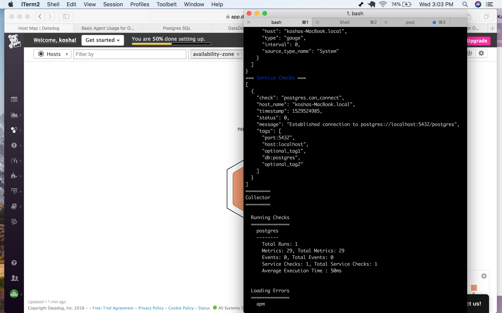

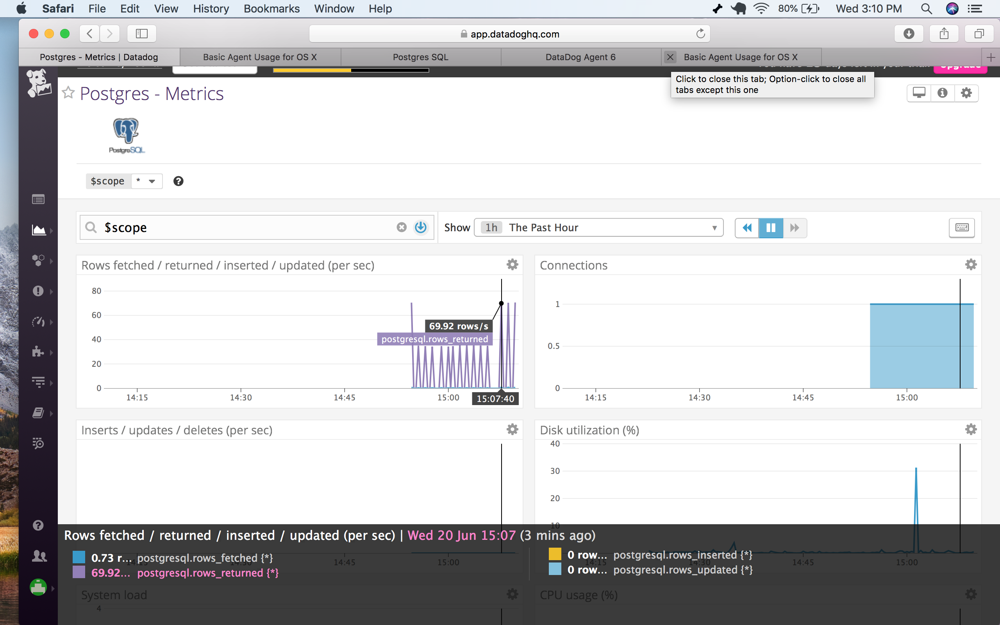


* Create a custom Agent check that submits a metric named my_metric with a random value between 0 and 1000.

Datadog custom agent checks are a way for you to get the Agent to collect metrics from your custom applications or unique systems.

Different types of check can be sent (metric, event, service), however we will here focus on implementing a gauge metric.

To get an Agent check to submit a brand-new metric, I had to create two distinct files: 

* mymetric.yaml that needs to go in `datadog-agent/conf.d`:

```yaml
init_config:

instances:
    [{}]
```

* mymetric.py that has to go in `datadog-agent/checks.d`: 

```python
from random import random
from checks import AgentCheck
class HelloCheck(AgentCheck):
    def check(self, instance):
        self.gauge('my_metric', 1000 * random())
```

After that, I restarted the Datadog Agent and executed the `datadog-agent status` command line to make sure the check had successfully been implemented.

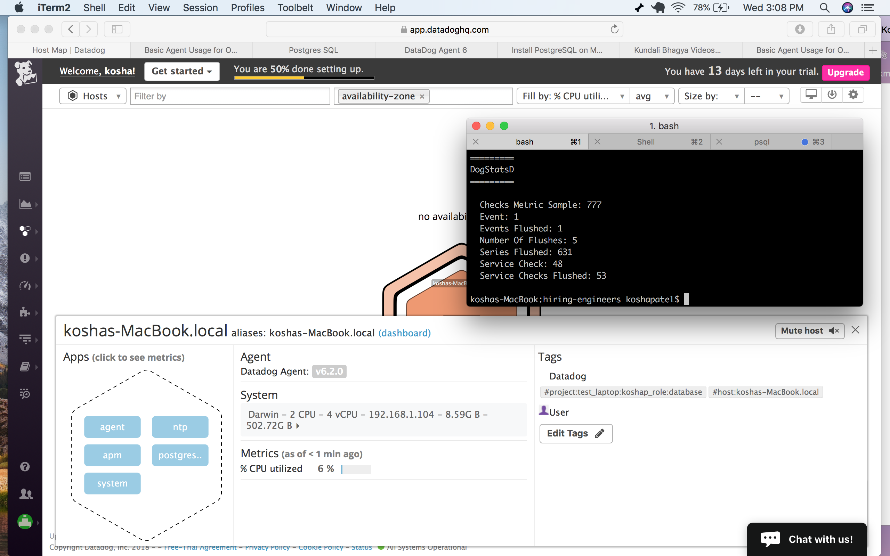


* Change your check's collection interval so that it only submits the metric once every 45 seconds.


This can be changed by modifying the check’s yaml file: you simply need to add the `min_collection_interval: nb_of_seconds` parameter at the init_config or at the instance level.

To change our check’s collection interval, I therefore slightly modified the `datadog-agent/conf.d/mymetric.yaml` file, and simply added the parameter `min_collection_interval: 45` to the configuration file.

```yaml
init_config:
  min_collection_interval: 45

instances:
    [{}]
```

After that, I restarted again the Datadog agent, and went back to the graph to make sure that the collection interval had, indeed, gone from 15-20 to 45 seconds.

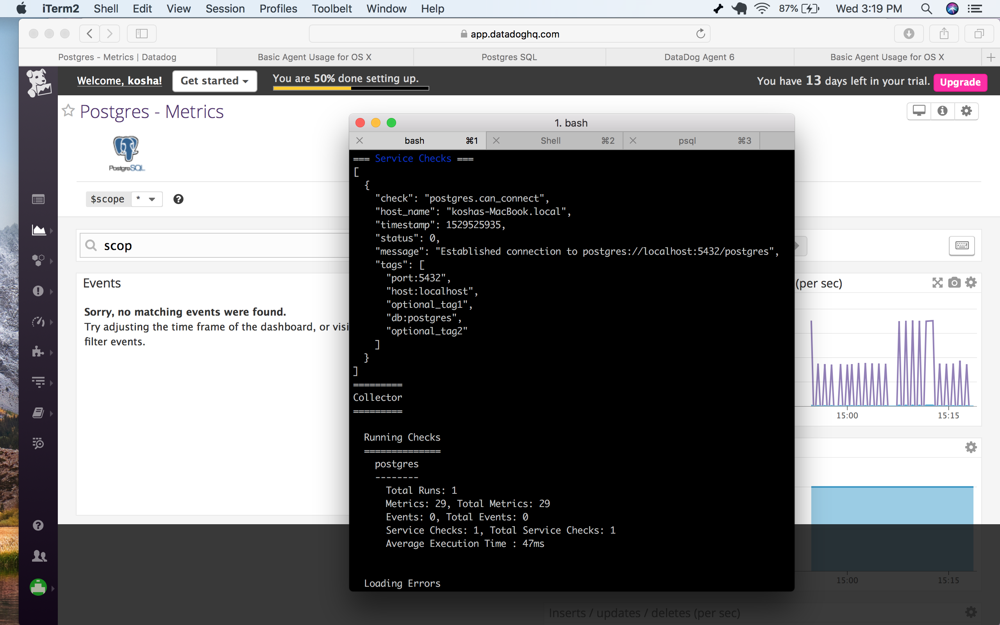

* Bonus: I changed the interval using the 'my_metric.yaml' file therefore the python file was not touched. 


##Visualizing Data:


__Utilize the Datadog API to create a Timeboard that contains:__
* __Your custom metric scoped over your host.__
* __Any metric from the Integration on your Database with the anomaly function applied.__
* __Your custom metric with the rollup function applied to sum up all the points for the past hour into one bucket.__

> Datadog allows you to create dashboards so you can quickly visualize the data you’re interested in. The application features two different types of dashboards: timeboards and screenboards. Timeboards are always scoped to the same time and have a predefined grid-like layout whereas screenboards are more flexible and customizable.

We will here focus on creating a timeboard through Datadog API.

To start using Datadog API, you first need to install Datadog. Therefore, go to your python environment and run the `pip install datadog` command line as indicated here: https://github.com/DataDog/datadogpy. 


You then need to look for your API key and to create your application key. To do so, just go to Datadog application, go to the “Integrations” section in the side bar menu, and pick the APIs tab. Just hit the button “Create Application Key” and there you go, your brand-new application key!


You then need to adapt a code snippet from here: https://docs.datadoghq.com/api/#timeboards. 
Here is what mine looks like :

```python
from datadog import initialize, api

options = {
    'api_key': <YOUR_API_KEY>,
    'app_key': <YOUR_APP_KEY>
}

initialize(**options)

{
      "graphs" : [{
          "title": "rollup",
          "definition": {
              "events": [],
              "requests": [
                  {"q": "avg:my_metric{*}.rollup(sum, 3600)"}
              ]
          },
          "viz": "timeseries"
      },{
          "title": "Postgres Anomoly",
          "definition": {
              "events": [],
              "requests": [
                  {"q": "anomalies(avg:postgresql.max_connections{*}, 'basic', 2)"}
              ]
          },
          "viz": "timeseries"
      },{
          "title": "Custom Metric",
          "definition": {
              "events": [],
              "requests": [
                  {"q": "avg:my_metric{*}"}
              ]
          },
          "viz": "timeseries"
      }],
      "title" : "Timeboard test",
      "description" : "kp",
      "template_variables": [{
          "name": "host1",
          "prefix": "host",
          "default": "host:my-host"
      }],
      "read_only": "True"
    }
```

Then, save and run the python script you just created on your terminal. It should output something like this:

```
{
    "dash": {
        "read_only": true,
        "graphs": [
            {
                "definition": {
                    "requests": [
                        {
                            "q": "avg:my_metric{*}.rollup(sum, 3600)"
                        }
                    ],
                    "events": []
                },
                "title": "rollup"
            },
            {
                "definition": {
                    "requests": [
                        {
                            "q": "anomalies(avg:postgresql.max_connections{*}, 'basic', 2)"
                        }
                    ],
                    "events": []
                },
                "title": "Postgres Anomoly"
            },
            {
                "definition": {
                    "requests": [
                        {
                            "q": "avg:my_metric{*}"
                        }
                    ],
                    "events": []
                },
                "title": "Custom Metric"
            }
        ],
        "template_variables": [
            {
                "default": "host:my-host",
                "prefix": "host",
                "name": "host1"
            }
        ],
        "description": "kp",
        "title": "Timeboard test",
        "created": "2018-06-20T21:45:48.692781+00:00",
        "id": 840679,
        "created_by": {
            "disabled": false,
            "handle": "koshapatel2@gmail.com",
            "name": "kosha patel",
            "is_admin": true,
            "role": null,
            "access_role": "adm",
            "verified": true,
            "email": "koshapatel2@gmail.com",
            "icon": "https://secure.gravatar.com/avatar/db384cd23cd26a724460808376224054?s=48&d=retro"
        },
        "modified": "2018-06-20T21:45:48.723983+00:00"
    },
    "url": "/dash/840679/timeboard-test",
    "resource": "/api/v1/dash/840679"
}
```

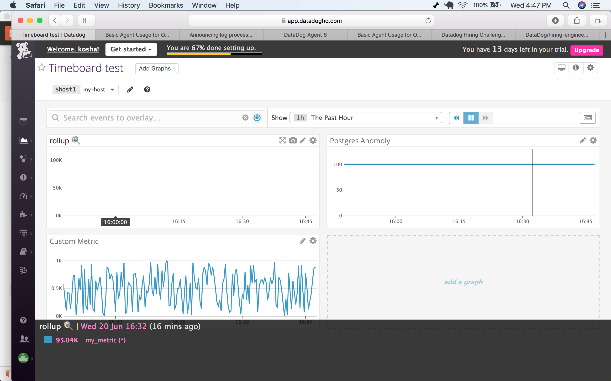

* Set the Timeboard's timeframe to the past 5 minutes

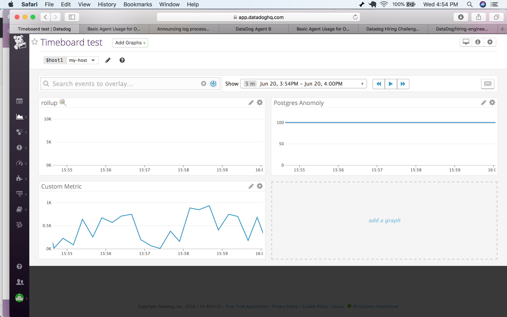
<<<<<<< HEAD

=======
>>>>>>> f407cd11260778de5f911916052ef9519b3bc937


* Take a snapshot of this graph and use the @ notation to send it to yourself.

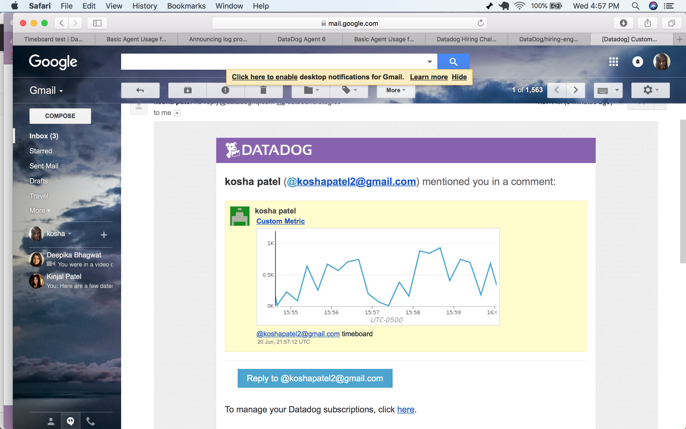


* **Bonus Question**: What is the Anomaly graph displaying?

Anomaly detection is a feature allowing you to identify metrics behaving differently than they have in the past. The anomaly graph should therefore highlight unusual data so you can quickly react if you need to.

It is not obvious in the previous graph as it displayed a constant figure (maximum number of connections to PostgreSQL), however when applied to a metric such as my_metric, we can see that the graph\ features a grey area with a blue curve, which is made up of the normal data; and a white area with red values, which is the unexpected data. 


##Monitoring Data

__Since you’ve already caught your test metric going above 800 once, you don’t want to have to continually watch this dashboard to be alerted when it goes above 800 again. So let’s make life easier by creating a monitor.__
__Create a new Metric Monitor that watches the average of your custom metric (my_metric) and will alert if it’s above the following values over the past 5 minutes:__
* __Warning threshold of 500__
* __Alerting threshold of 800__
* __And also ensure that it will notify you if there is No Data for this query over the past 10m.__

__Please configure the monitor’s message so that it will:__
* __Send you an email whenever the monitor triggers.__
* __Create different messages based on whether the monitor is in an Alert, Warning, or No Data state.__
* __Include the metric value that caused the monitor to trigger and host ip when the Monitor triggers an Alert state.__

> Datadog not only allows you to visualize your data, it also enables you to monitor it, and to be alerted when critical changes happen. There are different types of monitor that can be implemented within Datadog: host, metric, integration, process, network, event-based, and custom. 

Here we will focus on metric monitor. To create a monitor, first click “Monitors” on Datadog Application’s side bar, then hit the “+ New monitor” button, and start editing your monitor visually.

You can create different types of metric monitors (threshold, forecast or change alert, anomaly or outlier detection), you then need to define conditions, to setup notifications and you’re good to go!

In this example I decided to define a threshold alert on my_metric from our host:
-	I first set a warning in case the average of the custom metric went over the 500 threshold in the past 5 minutes.
-	I then set an alert in case the average of the custom metric went over the 800 threshold in the past 5 minutes.
-	Thirdly, I asked for a notification in case data was missing for more than 10 minutes.

I also designed a monitor’s message adapted to the type of issue: alert, warning or missing data. In the alert message, I included the host name, ip, the threshold and the value that caused the monitor to trigger. Finally, I added my email address to check the email notifications worked.

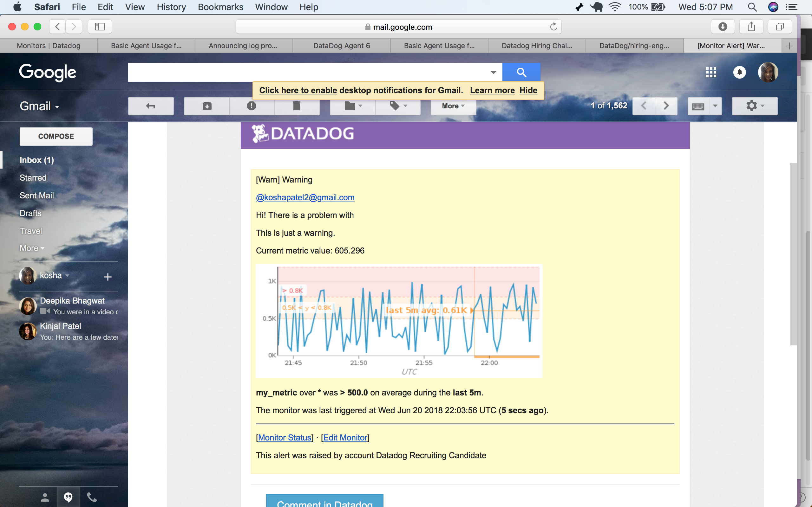

* __Bonus Question: Since this monitor is going to alert pretty often, you don’t want to be alerted when you are out of the office. Set up two scheduled downtimes for this monitor:__
	* __One that silences it from 7pm to 9am daily on M-F,__
	* __And one that silences it all day on Sat-Sun.__
	* __Make sure that your email is notified when you schedule the downtime and take a screenshot of that notification.__

> For various reasons (upgrades, maintenance, etc.), you might be willing to schedule downtimes. This Datadog feature allows you to take off systems without triggering the related monitors.

To schedule a downtime, you need to remain in the “Monitors” section of Datadog Application side bar, to click on “Manage Downtime” and to hit the “Schedule Downtime” button.

You then need to follow Datadog Application UI and…
1.	Choose what to silence
2.	Schedule the downtime
3.	Add a message for the downtime
4.	Choose who should consequently be notified

Two downtimes were scheduled and two emails informing us from a downtime scheduling were received.

-	The first one to silence our my_metric monitor from 7pm to 9am daily from Monday to Friday.

<<<<<<< HEAD
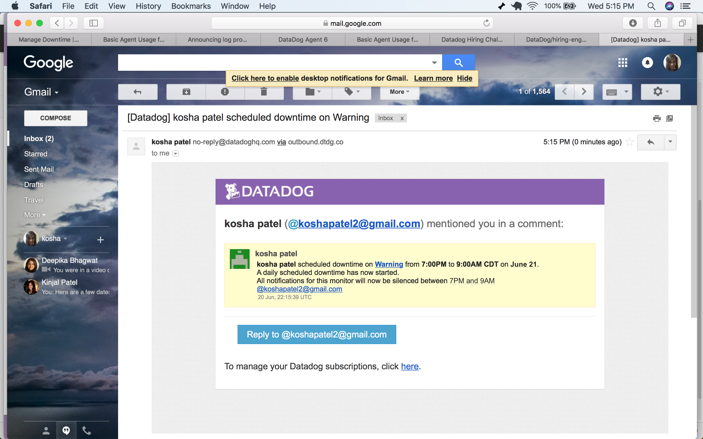

=======


>>>>>>> f407cd11260778de5f911916052ef9519b3bc937
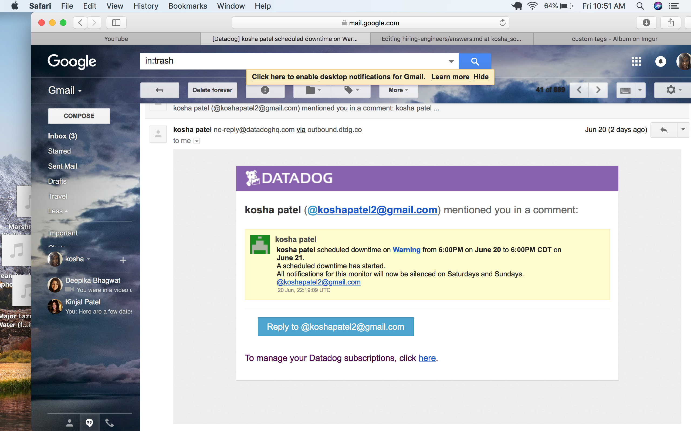


##Collecting APM Data:

Collection APM Data:

I created the following file my_app.py for my app and then instrument this using Datadog APM. First I installed the Python client and then to instrument my app I created a trace request for Python app by using the command line wrapper. To tailor the instrumentation for my app I used the Flask framework and followed the steps outlined in the documentation. I found the APM solution to be bit confusing and not very user friendly. 
http://pypi.datadoghq.com/trace/docs/#module-ddtrace.contrib.flask


```
from flask import Flask
import logging
import sys
import blinker as _
from ddtrace import tracer
from ddtrace.contrib.flask import TraceMiddleware
from flask import flask
app = flask(_name_)
traced_app = TraceMiddleware(app, tracer, service='my_app", distributed_tracing = false)
main_logger = logging.getLogger()
main_logger.setLevel(logging.DEBUG)
c = logging.StreamHandler(sys.stdout)
formatter = logging.Formatter('%(asctime)s - %(name)s - %(levelname)s - %(message)s')
c.setFormatter(formatter)
main_logger.addHandler(c)
app = Flask(__name__)
@app.route('/')
def api_entry():
   return 'Entrypoint to the Application'

@app.route('/api/apm')
def apm_endpoint():
  return 'Getting APM Started'
@app.route('/api/trace')
def trace_endpoint():
   return 'Posting Traces'
if __name__ == '__main__':
  app.run()

``` 

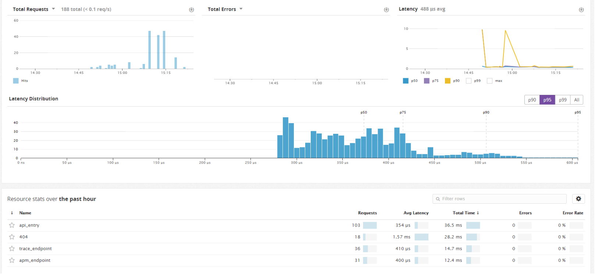

##Final Question

It would be interesting if a dog collar could collect metrics about the dog's activity, whereabouts and their health. The data could be sent to an app on the owner's phone where they could see this data. 


