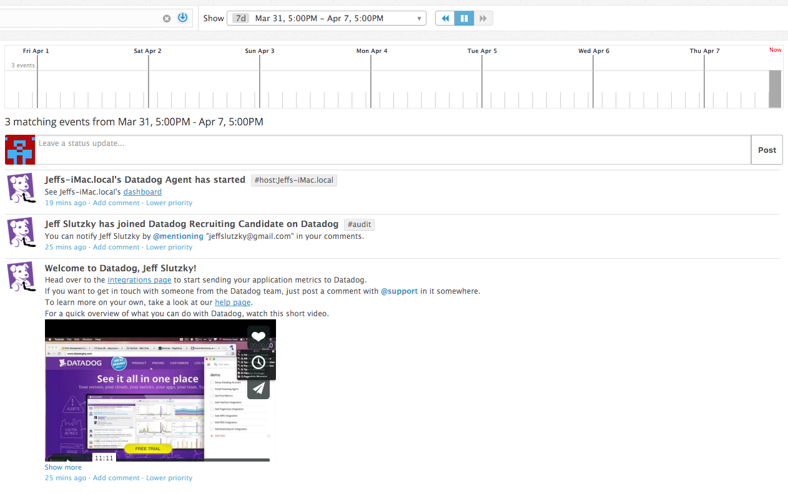
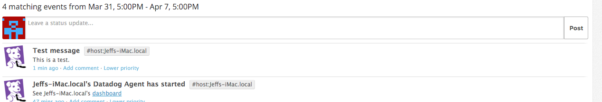
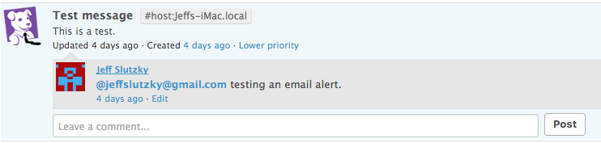
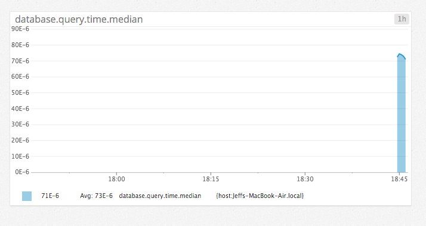
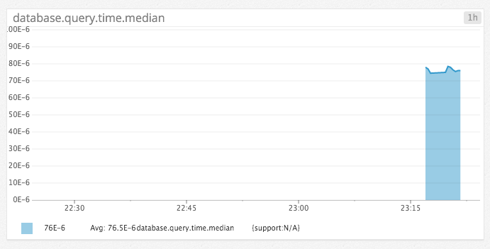
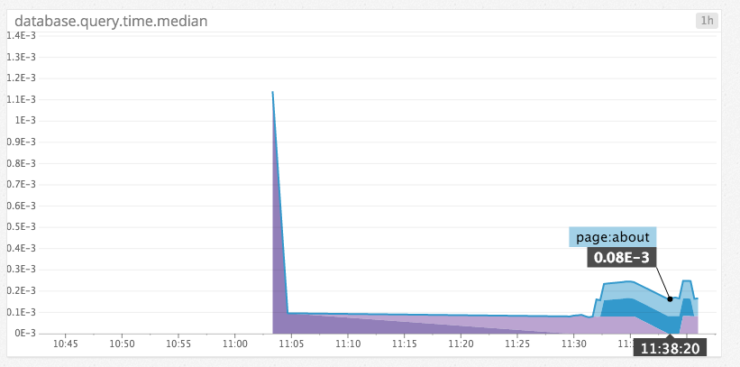
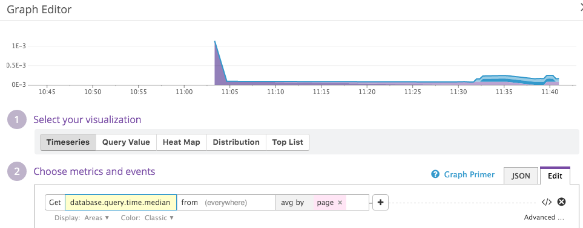
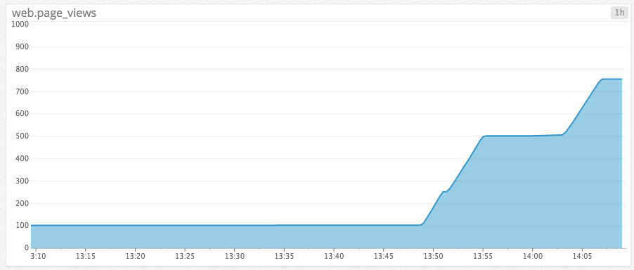
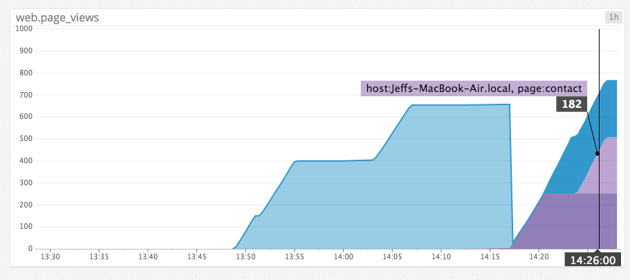
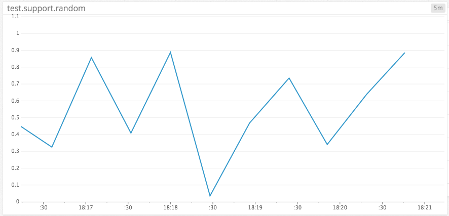

# Level 1

*Sign up for Datadog (use "Datadog Recruiting Candidate" in the "Company" field), get the agent reporting metrics from your local machine.*

*Bonus question: what is the agent?*

The agent is the software that runs on the user's computer, monitors the metrics, and sends them to Datadog. It consists of the Collector, Dogstatsd, and the Forwarder.

*Submit an event via the API.*

(See code at <a href="level1.rb">level1.rb</a>.)

*Get an event to appear in your email inbox (the email address you signed up for the account with)*

I tried to do this as follows, but I didn't receive an email in my inbox:

# Level 2

*Take a simple web app (in any of our supported languages) that you've already built and instrument your code with dogstatsd. This will create metrics.*

My app is a Rails app, so I first added the appropriate gem to my Gemfile:

    gem 'dogstatsd-ruby'

Next I added code to my sessions controller, so it would run whenever the home page is hit:

    class SessionsController < ApplicationController

      def new
        require 'statsd'
        statsd = Statsd.new
        statsd.increment('web.page_views')
      end

(See code under app/controllers/sessions_controller.rb at  https://github.com/jeffslutzky/pomodoro/commit/67f0617d36ea6ace1fe7e0f30bab00ad4ef46d98.)

*While running a load test (see References) for a few minutes, visualize page views per second. Send us the link to this graph!*

I ran a load test on my app locally with the following command:

    ab -n 10000 -c 10 http://127.0.0.1:3000/

Here is the resulting graph:

*Create a histogram to see the latency; also give us the link to the graph*

I changed my session controller's "new" method to the following, adding a "before" action to mark the start of a time interval:

    class SessionsController < ApplicationController
      before_action :get_time

      def new
        require 'statsd'
        statsd = Statsd.new
        duration = Time.now - @start_time
        statsd.histogram('database.query.time', duration)
      end

And I added the following private method that gets called by the "before" action:

    private
      def get_time
        @start_time = Time.now
      end

(See lines 2, 28-32 at https://github.com/jeffslutzky/pomodoro/commit/3a7a51595c93c9be29f97617455ece872b4af51b.)

I ran this test in Terminal:

    ab -n 3000 -c 10 http://127.0.0.1:3000/

Here is the resulting graph:

*Bonus points for putting together more creative dashboards.*

[FORTHCOMING]

# Level 3

*Using the same web app from level 2:

tag your metrics with support (one tag for all metrics)*

I adjusted my "new" method in the sessions controller by assigning a 'support' tag:

    def new
      require 'statsd'
      statsd = Statsd.new
      duration = Time.now - @start_time
      statsd.histogram('database.query.time', duration, :tags => ['support'])
    end

(See line 8 at https://github.com/jeffslutzky/pomodoro/commit/3a7a51595c93c9be29f97617455ece872b4af51b.)

Then I set the metrics on the graph via the following JSON:

    {    
      "viz": "timeseries",
      "requests": [
        {
          "q": "avg:database.query.time.median{\*} by {support}",
          "aggregator": "avg",
          "conditional_formats": [],
          "type": "area"
        }
      ]
    }

Here is the resulting graph:

Graph link: https://p.datadoghq.com/sb/1a534df4e-feac4d9ace

*tag your metrics per page (e.g. metrics generated on / can be tagged with page:home, /page1 with page:page1)*

Since my app is essentially a single-page app, I added some test "about" and "contact" pages and tagged them: https://github.com/jeffslutzky/pomodoro/commit/53a7294b5c4dd8158eeb718362b9aed1ce680584

*visualize the latency by page on a graph (using stacked areas, with one color per page)*

Here is the resulting graph:

Graph link: https://p.datadoghq.com/sb/1a534df4e-c187780a90

Here's how I created the graph:

# Level 4

*Same web app: count the overall number of page views using dogstatsd counters.*

I used the following JSON:

    {    
      "viz": "timeseries",
      "requests": [
        {
          "q": "cumsum(avg:web.page_views{host:Jeffs-MacBook-Air.local} by {host})",
          "aggregator": "avg",
          "conditional_formats": [],
          "type": "area"
        }
      ]
    }

And changed the code in my app as shown here:

https://github.com/jeffslutzky/pomodoro/commit/da6a7b7f6fd2d5e61249356387399e16f621c648

Here is the resulting graph:

Graph link: https://p.datadoghq.com/sb/1a534df4e-feac4d9ace

*count the number of page views, split by page (hint: use tags)*

I used the following JSON:

    {    
      "viz": "timeseries",
      "requests": [
        {
          "q": "cumsum(avg:web.page_views{host:Jeffs-MacBook-Air.local} by {page})",
          "aggregator": "avg",
          "conditional_formats": [],
          "type": "area"
        }
      ]
    }

I changed my code as shown here:

https://github.com/jeffslutzky/pomodoro/commit/ef9fcd89780dac27584907b3020facec7ea97d8d

*visualize the results on a graph*

Here is the resulting graph:

*Bonus question: do you know why the graphs are very spiky?*

Because I am not getting a steady stream of visitors locally unless I run the load test. So the number of visitors jumps from 0 per second to 100 per second.

# Level 5

*Write an agent check that samples a random value. Call this new metric:    test.support.random*

See code at <a href="sample.yaml">sample.yaml</a> and <a href="sample.py">sample.py</a>.

*Visualize this new metric on Datadog, send us the link.*

Here is the resulting graph:

Graph link: https://p.datadoghq.com/sb/1a534df4e-adc96c9b23
