Your answers to the questions go here.
## Prerequisites
Set up the environment
I installed the Vagrant and signed up for Datadog (I used 'Datadog Recruiting Candidate' in the Company field); I got the Agent reporting metrics from my local machine

## Collecting Metrics
1. Add tags in the Agent config file and show us a screenshot of your host and its tags on the Host Map page in Datadog.
Link: https://app.datadoghq.com/infrastructure/map?host=652858656&fillby=avg%3Acpuutilization&sizeby=avg%3Anometric&groupby=availability-zone&nameby=name&nometrichosts=false&tvMode=false&nogrouphosts=true&palette=green_to_orange&paletteflip=false&node_type=host

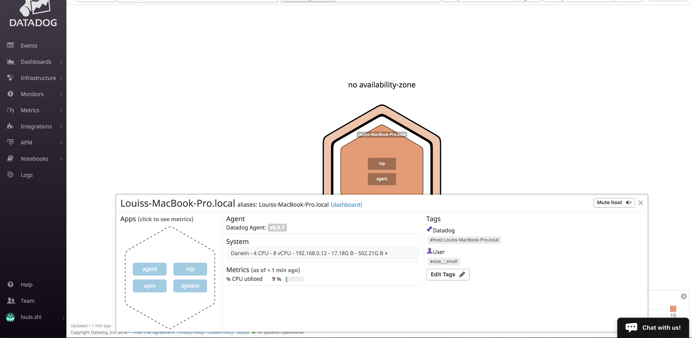

2. Install a database on your machine (MongoDB, MySQL, or PostgreSQL) and then install the respective Datadog integration for that database.
Link: https://app.datadoghq.com/account/settings#integrations

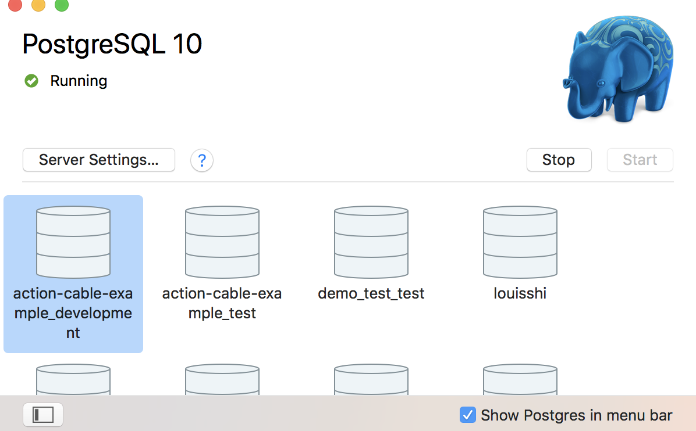
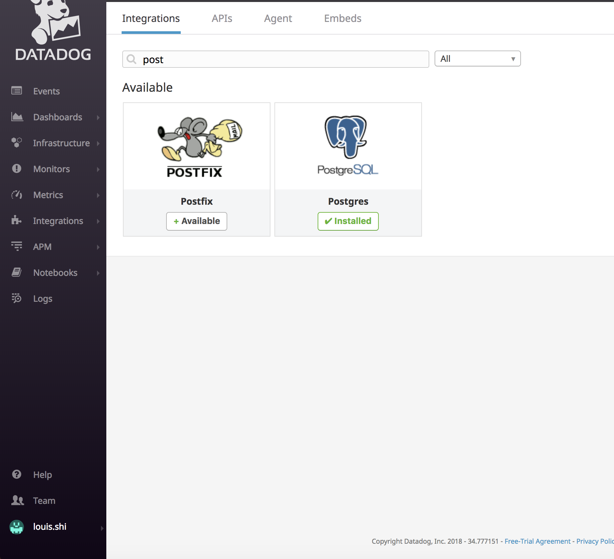

3. Create a custom Agent check that submits a metric named my_metric with a random value between 0 and 1000.

In order to create a custom Agent check, I read the documentation and created the directory checks.d and has a file called custom_check.py. I also created a custom_check.yaml
As you can see in the screenshot for the code, I generated a random value between 0 and 1000 using self.gauge to sample the metric.

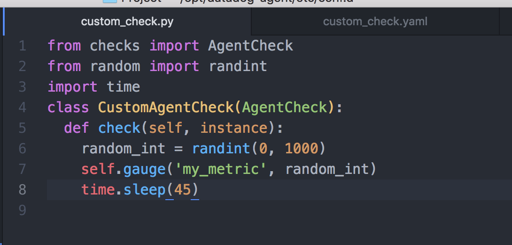

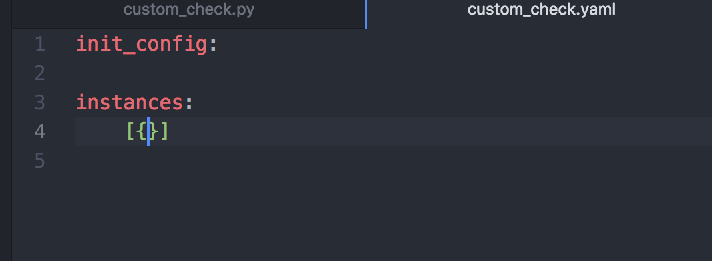

4. Change your check's collection interval so that it only submits the metric once every 45 seconds.
As you can see in the code that I used the sleep method imported from the time module, I changed the Python script to change the collection interval of 'my_metric' every 45 seconds.

Bonus Question:
Can you change the collection interval without modifying the Python check file you created?
In order to set the interval without modifying the python check file, you would just modify the custom_check.yaml file adding the min_collection_interval.

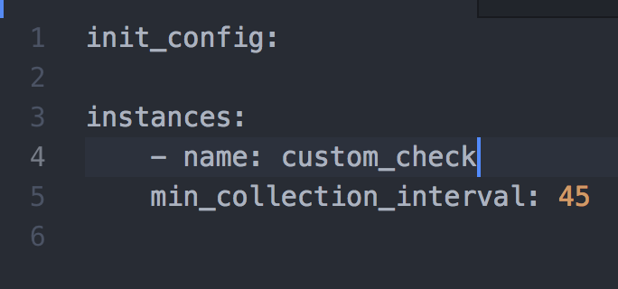

## Visualizing Data
Utilize the Datadog API to create a Timeboard that contains:
1. Your custom metric scoped over your host.
2. Any metric from the Integration on your Database with the anomaly function applied.
3. Your custom metric with the rollup function applied to sum up all the points for the past hour into one bucket.

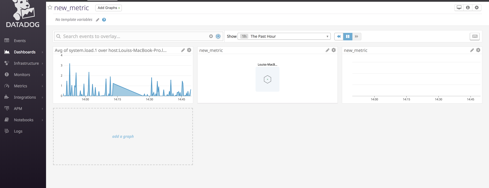

The Link for the timeboard Api is https://github.com/LShiHuskies/hiring-engineers/blob/Louis_Solutions_Engineer/assets/apiTimeBoard.rb

Bonus Question: What is the Anomaly graph displaying?
Answer: The Anomaly function shows there are unusual trends outside of the normal range of values.
The unusual trends are represented by red peaks and troughs on the graphs whereas the normal ranges are outlined in blue.

## Monitoring
Create a new Metric Monitor that watches the average of your custom metric (my_metric) and will alert if it’s above the following values over the past 5 minutes:

Warning threshold of 500
Alerting threshold of 800
And also ensure that it will notify you if there is No Data for this query over the past 10m.

Please configure the monitor’s message so that it will:

Send you an email whenever the monitor triggers.

Create different messages based on whether the monitor is in an Alert, Warning, or No Data state.

Include the metric value that caused the monitor to trigger and host ip when the Monitor triggers an Alert state.

When this monitor sends you an email notification, take a screenshot of the email that it sends you.

Answer:

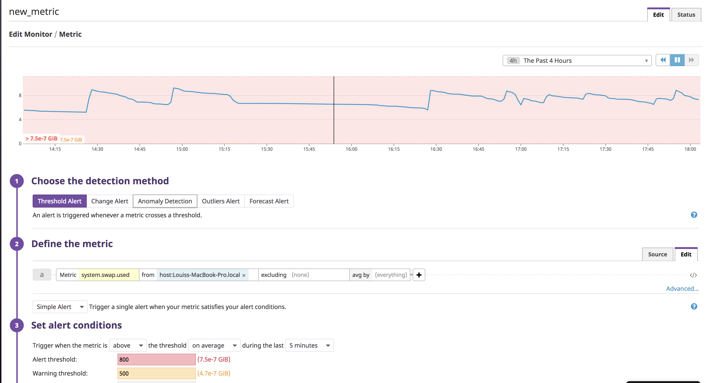
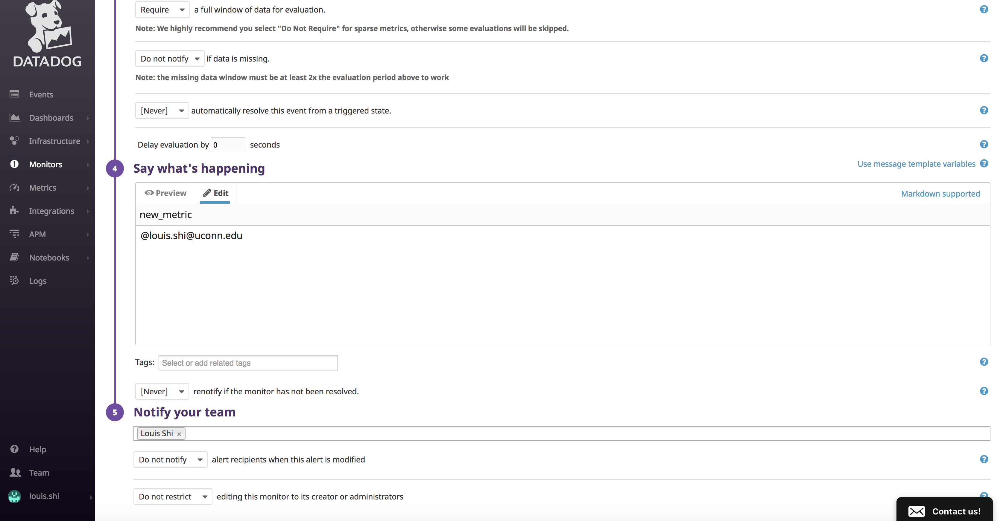
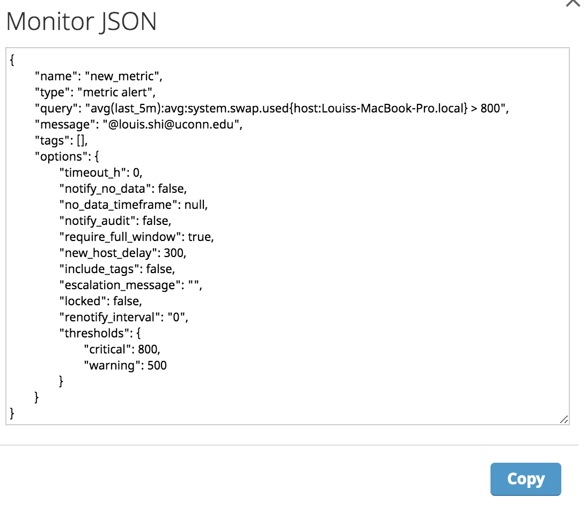
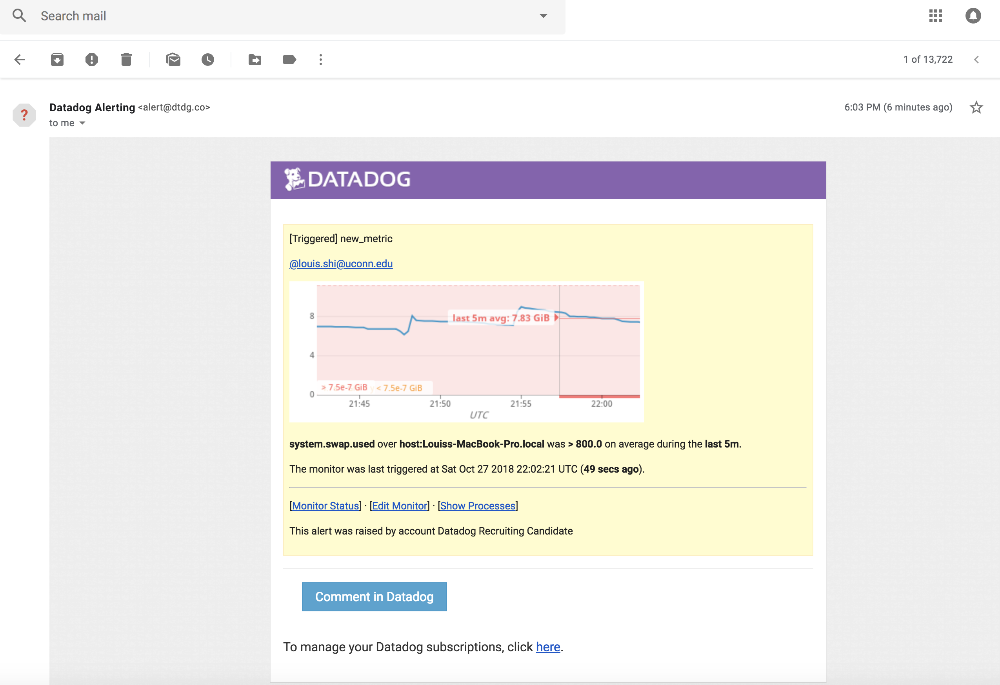

Bonus Question: Since this monitor is going to alert pretty often, you don’t want to be alerted when you are out of the office. Set up two scheduled downtimes for this monitor:

One that silences it from 7pm to 9am daily on M-F,
And one that silences it all day on Sat-Sun.
Make sure that your email is notified when you schedule the downtime and take a screenshot of that notification.

Answer: Using the User Interface, on the Monitors Page, I clicked on the Manage Downtime page and scheduled recurring silences of the Monitors for specific time periods.
One of them was the all day for Saturday and Sunday and the other one was from Monday through Friday at 7PM til 9PM.

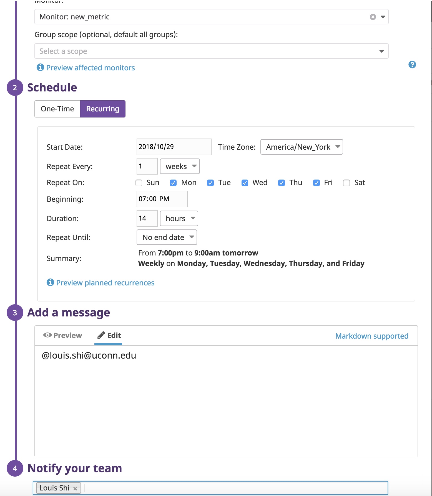
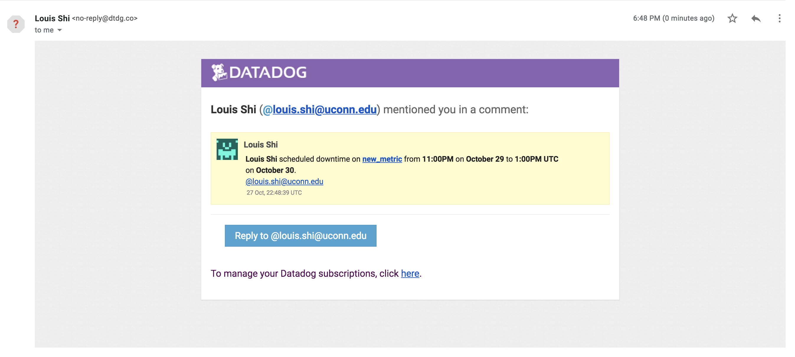

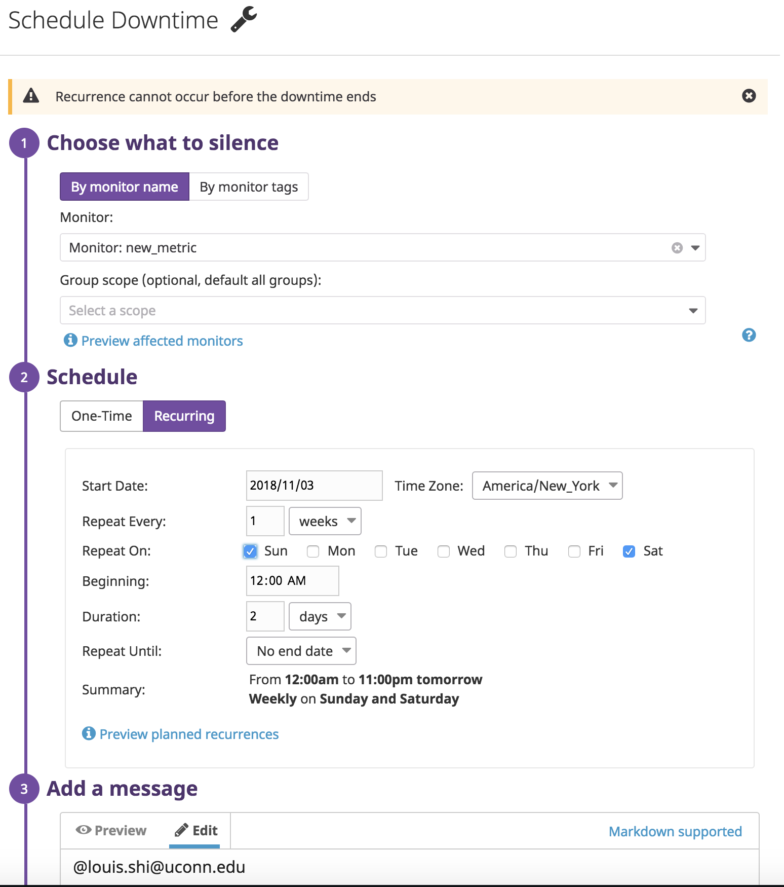
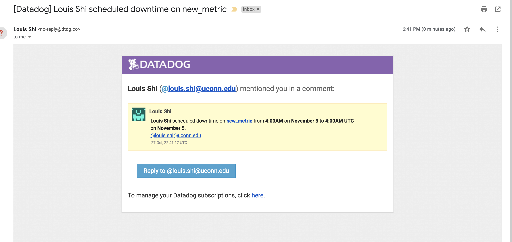

## Collecting APM Data

For instructions on how to set up tracing; the link is https://docs.datadoghq.com/tracing/setup/

1. I installed the agent.
2. I then bundle install the ddtrace gem into an existing rails app of my choice.
3. I then created the datadog.rb file under config/initializers/datadog.rb file
4. I downloaded the tracing agent.
5. I set the APM in datadog.yaml enabled: true
(include the enabled true in datadog.yaml)
6. I started the rails app

Here is a link to the Github Rails app I used to install the detrace gem and config datadog.rb
https://github.com/LShiHuskies/SpaceShooterBack/blob/master/config/initializers/datadog.rb

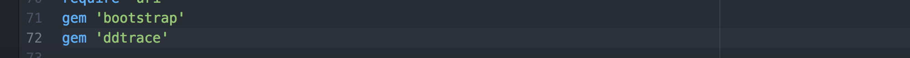
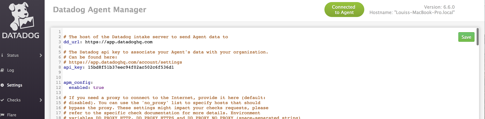
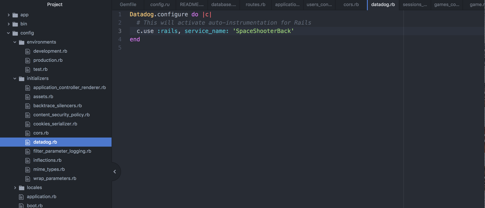

## Final Question:
Datadog has been used in a lot of creative ways in the past. We’ve written some blog posts about using Datadog to monitor the NYC Subway System, Pokemon Go, and even office restroom availability!

Is there anything creative you would use Datadog for?
As an individual who loves to watch basketball games, I would say monitoring the most ideal times to watch the sales and prices of NBA games. Such as monitoring the best times for the best seats as well as the most popular games.
