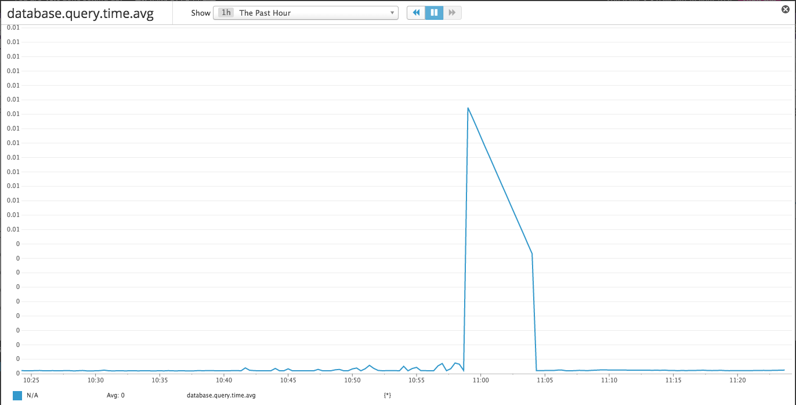
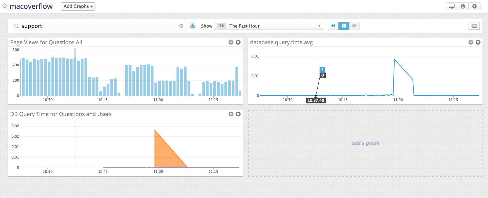
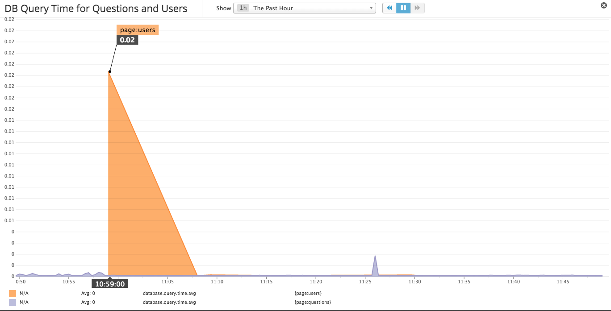
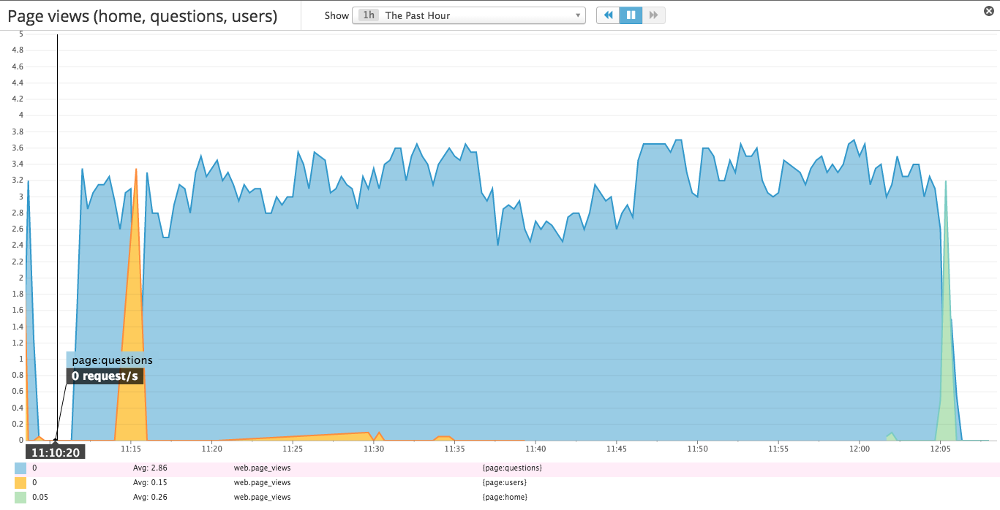
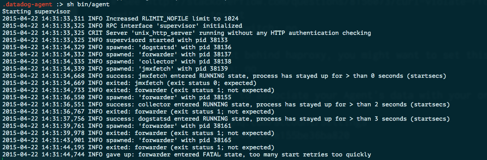

### Level One

#### Sign up for Datadog, get the agent reporting metrics from your local machine.
**Install successful**


#### Bonus Question
- The datadog agent is a piece of software that runs on your hosts collecting events and metrics for you. This allows you to better understand your systems monitoring and performance data. There are three components to the datadog agent.
  1. **The Collector** runs checks on your current machine capturing system metrics like memory and cpu.
  2. **Dogstatsd** is a statsd backend server you can send custom metrics to from an application.
  3. **The Forwarder** retrieves data from both the collector and dogstatsd and then queues it up to be sent on to Datadog.

#### Submit an event via the API

``` ruby
require 'rubygems'
require 'dogapi'

api_key = "hidden" #Normally I would mask this

dog = Dogapi::Client.new(api_key)

dog.emit_event(Dogapi::Event.new('This is my first submitted event!', :msg_title => 'Winning'))
```


#### Get an event to appear in your email inbox

**Event Emailed**

``` ruby
require 'rubygems'
require 'dogapi'

dog = Dogapi::Client.new(api_key)

dog.emit_event(Dogapi::Event.new("Here's another event to be sent to my email @rickythomas.rt@gmail.com", :msg_title => 'Datadog Event', :priority => 'normal', :alert_type=> 'success'))
```


### Level Two

#### Take a simple web app (in any of our supported languages) that you've already built and instrument your code with dogstatsd.

I built a StackOverflow like site in Rails called Macoverflow. This is a website where you can sign in and post questions about macaroni and cheese or post your homemade recipe!

- The following code is included inside a file titled datadog_helper.rb

``` ruby
module DatadogHelper

  STATSD = Statsd.new

  def self.render_page
    STATSD.increment('web.page_views')
  end
end
```

####While running a load test for a few minutes, visualize page views per second.

- I tested this on my question index page. The following code is in the Question Controller

``` ruby
class QuestionsController < ApplicationController
  before_action :set_question, only: [:show, :edit, :update, :destroy]

#GET /questions
  def index
    @questions = Question.all
    DatadogHelper.render_page
  end
```

-After running a load test on this page I was able to generate the graph below.


####Create a histogram to see the latency; also give us the link to the graph

I added the following code to my DatadogHelper Module in order to calculate the load time for all of of the questions on the page.

``` ruby
  def self.db_latency
    start_time = Time.now
    questions = Question.all
    duration = Time.now - start_time
    STATSD.histogram('database.query.time', duration)
    questions
  end
```

I also changed the index action in the Question Controller to the following:

``` ruby
#GET /questions
  def index
    @questions = DatadogHelper.db_latency
    DatadogHelper.render_page
  end
```

Here's a picture of the graph I was able to generate with this.



Here's a picture of the dashboard I've been playing around with.



### Level Three

#### Tag your metrics with support (one tag for all metrics) and tag your metrics per page

I've added support and page tags to all of my metrics (including some new ones) below.I added a check for latency when querying the db for users and also metrics to measure page views on a few other pages.

``` ruby
module DatadogHelper
  require 'statsd'

  STATSD = Statsd.new

  def self.render_questions_page
    STATSD.increment('web.page_views', :tags => ['support', 'page:questions'])
  end

  def self.render_users_page
    STATSD.increment('web.page_views', :tags => ['support', 'page:users'])
  end

  def self.render_home_page
    STATSD.increment('web.page_views', :tags => ['support', 'page:home'])
  end

  def self.questions_latency
    start_time = Time.now
    questions = Question.all
    duration = Time.now - start_time
    STATSD.histogram('database.query.time', duration, :tags => ['support', 'page:questions'])
    questions
  end

  def self.users_latency
    start_time = Time.now
    users = User.all
    duration = Time.now - start_time
    STATSD.histogram('database.query.time', duration, :tags => ['support', 'page:users'])
    users
  end
end
```

Below is a picture of the graph illustrating latency for both users and questions.



### Level Four

#### Count the overall number of page views using dogstatsd counters.

As I've already implemented counters for the home, questions, and users pages in the code above; below you can see the graph displaying the result as I ran various load tests.



#### Why are the Graphs so spiky?

The graphs are spiky because I'm having Apache Bench load test these pages (especially the questions page) with a concurrency of 100 page loads 10000 times over the course of an hour. The seperation between times the server is pinged is what causes the dips in the chart.

### Level Five

#### Write an agent check that samples a random value. Call this new metric: `test.support.random`

I followed along with the guides for writing AgentChecks in the docs and felt pretty good about it. I continued to add the following to a file titled sample_test.yaml inside of the conf.d directory

```yaml
init_config:

instances:
    [{}]
```

And also I added the following code to a file called sample_test.py in my checks.d directory


```python
import random

from checks import AgentCheck

class SampleTest(AgentCheck):
    def check(self, instance):
      random_num = random.random()
      self.count('test.support.random', random_num, tags=['support'])


```

I experimented with this file by running
**PYTHONPATH=. python checks.d/sample_check.py**

I was able to get past a few errors by installing various packages my machine was missing. Though after finally getting it to run without errors, there is seemingly no result at my metric summary on DD for the metric I am trying to see.

I realized that the guides mentioned custom checks using
**sudo -u dd-agent dd-agent check my_check**

which I tried as
**sudo -u rickythomas dd-agent check sample_check.py**
and a number of other attempts still with no success.

I realized that something strange was going on in my Agent that I had running. It appears that my forwarder is no longer booting. Which would definitely explain why my metric isn't being sent off to the datadogs site. The error is as pictured below:




### Conclusion

Though I am bummed I have yet to be able to figure out the last bit, I've had a great time working on this challenge. I really enjoyed playing with all of the charting and experimenting with the DD api in my app. I'll definitely continue using Datadogs regardless of the outcome of my application. Thanks so much for taking the time to go over this! Looking forward to meeting you.

Best,
Ricky Thomas
