1. I installed the agent on both Linux and Windows, really just to see how easy it was
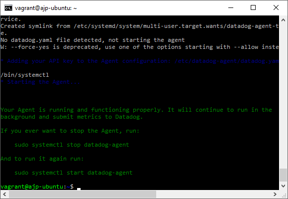
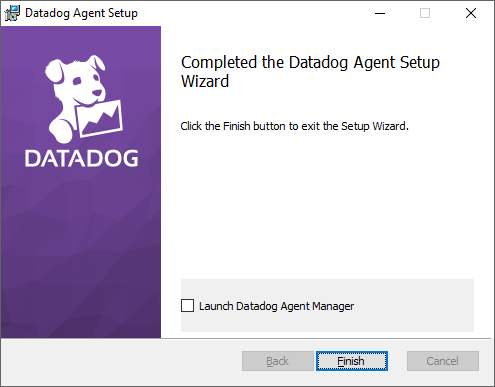

And checked that the agents were registered and collecting data
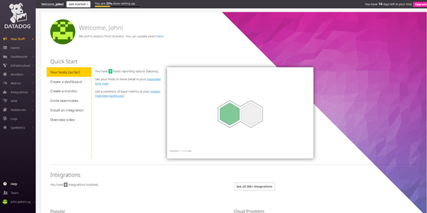
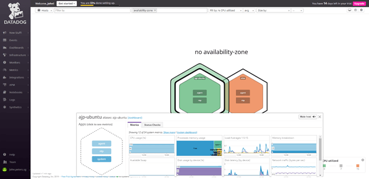
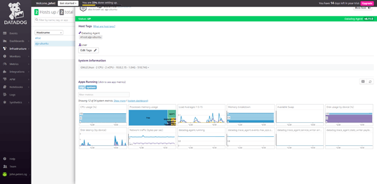

2. Added some tags to the agents configuration file
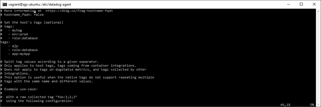

3. Verified that the tags were linked to the host
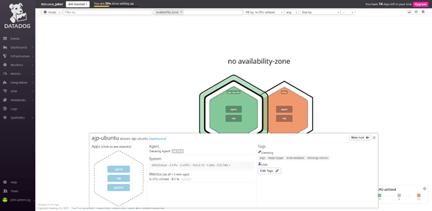

4. Installed MySQL on my Linux server and enabled it in the configuration file
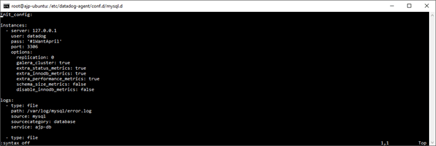

5. Verified that metrics from the MySQL integration were being collected
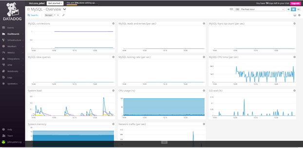

6. Created a custom agent check that submits a metric called my_metric

6.a Created the initial config file (ajp.yaml)

```python
init_config:
  instances: [{}]
```

6.b Created the custom agent check script (ajp.py)


```python
import random
try:
from checks import AgentCheck
except ImportError:
from datadog_checks.checks import AgentCheck
__version__ = "1.0.0"
class AjpCheck(AgentCheck):
def check(self, instance):
self.gauge('ajp.my_metric', random.randint(0, 1001),<br>tags=['TAG_KEY:TAG_VALUE'])
```

7. Modified the config file to change the collection interval to every 45 seconds
```python
init_config:
instances:
  - min_collection_interval: 45
```

8. Verified that the custom metric was being collected
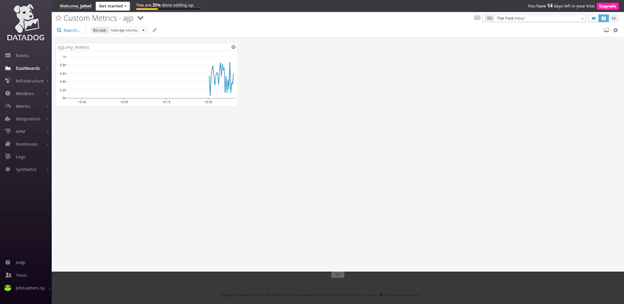

9. Utilized the Datadog API to create a custom dashboard. This requires both an API and APP key, which can be accessed/created from the setup/API screen
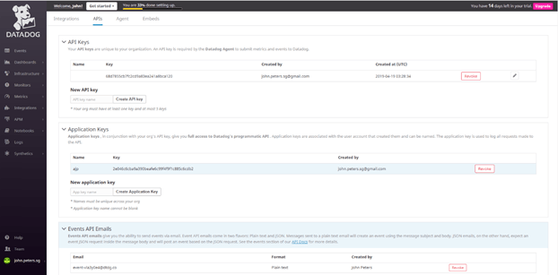

10. Created a Python script to create the custom dashboard
```python
from datadog import initialize, api

options = {
    'api_key': '68d7855cb7fc2cd9a83ea241a8bca120',
    'app_key': '2e046c6cba9a390beafe6c99f4f9f1c885c6cdb2'
}

initialize(**options)

title = 'My Custom Dashboard'
widgets = [
	{
		'definition': {
			'type': 'timeseries',
			'requests': [
				{'q': 'avg:ajp.my_metric{$host1}'}
			],
			'title': 'My Metric'
		}
	},
	{
		'definition': {
			'type': 'timeseries',
			'requests': [
				{'q':'anomalies(avg:mysql.innodb.rows_read{$host1}, "basic", "2")'}
			],
			'title': 'MySQL Metric CPU time with Anomalies enabled'
		}
	},
	{
		'definition': {
			'type': 'timeseries',
			'requests':[
				{'q':'avg:ajp.my_metric{$host1}.rollup(avg, 3600)', 'display_type':'bars'}
			],
			'title':'Average of My Metric with 1 hour rollup'}
	}
]
layout_type = 'ordered'
description = 'A custom dashboard with some selected metrics.'
is_read_only = True
notify_list = ['user@domain.com']
template_variables = [{
    'name': 'host1',
    'prefix': 'host',
    'default': 'ajp-ubuntu'
}]
resp = api.Dashboard.create(title=title,
                     widgets=widgets,
                     layout_type=layout_type,
                     description=description,
                     is_read_only=is_read_only,
                     notify_list=notify_list,
                     template_variables=template_variables)
print resp
```

11. Verified that the dashboard was created correctly
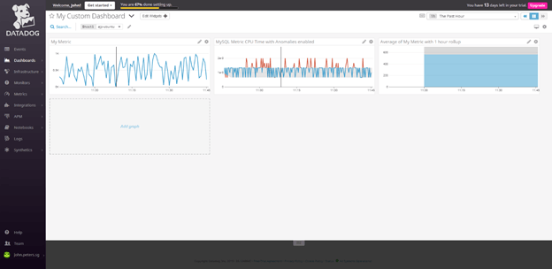

<a href="https://app.datadoghq.com/dashboard/52h-mj2-mee/my-custom-dashboard?tile_size=m&page=0&is_auto=false&from_ts=1555752705000&to_ts=1555753005000&live=false" target="_blank">Click here to view Custom Dashboard</a>

12. Changed the time interval for the dashboard to the last 5 minutes (using Alt-])
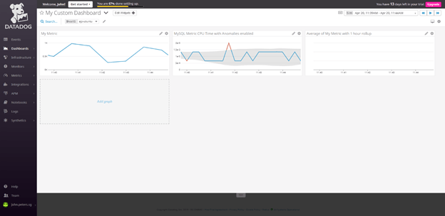

13. Took a snapshot of the MySQL metric CPU Time with anomalies enabled graph and sent it to myself using the @ notation
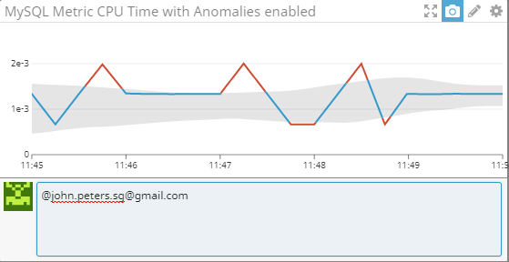

14. Verified that the notification from Datadog was received as an email
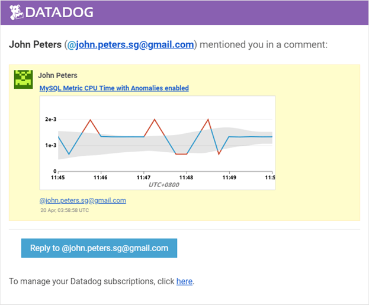

15. The anomaly chart is displaying the selected metric together with the shaded area, which is the “normal” or “expected” range for the metric based on the analysis of the historical values for the metric. Values that fall outside of this range are highlighted as anomalies, or unexpected values. The “normal” or “expected” range will depend on the algorithm used and the bounds specified.

16. Created a metric monitor to alert on my custom metric my_metric when it exceeded 500 (warning) or 800 (alert) or when there was no data being collected
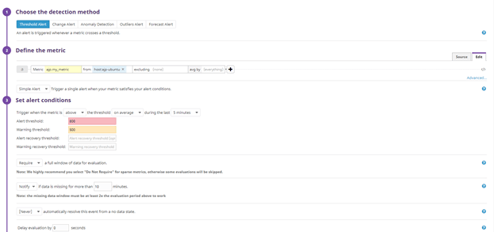

17. Configured the metric monitor to send different notification messages depending on which of the alert conditions had been observed
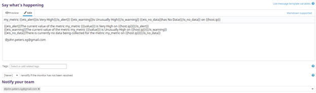

With hindsight, using conditional formatting in the monitor title may not be the most sensible option since this will be used as the name of the monitor, however it does provide easily readable email notifications.

18. Verified that the notification emails were received when the monitor was triggered
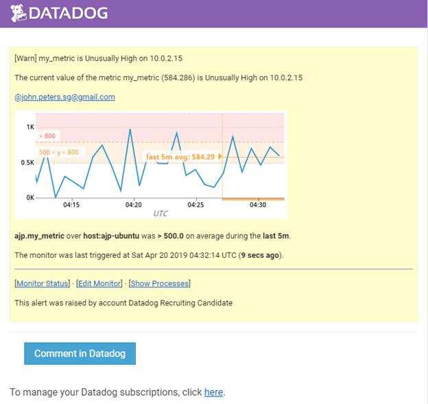

19. Created a scheduled downtime for the monitor created previously to silence the notifications between 7pm and 9am on Monday to Friday
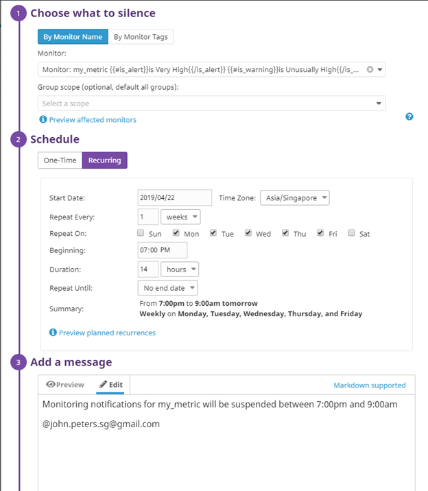

20. Created a scheduled downtime for the monitor created previously to silence the notifications all day on Saturday and Sunday
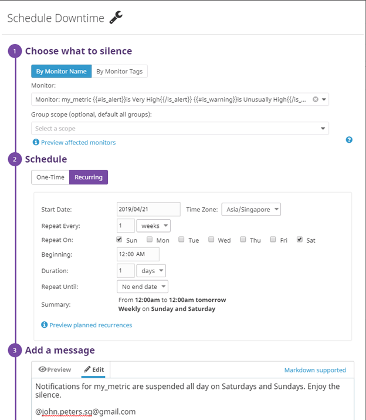

This could also have been configured as a single event on Saturday with a duration of 2 days rather than 2 events of 1 day each.

21. Verified that a notification email for the scheduled downtime was received
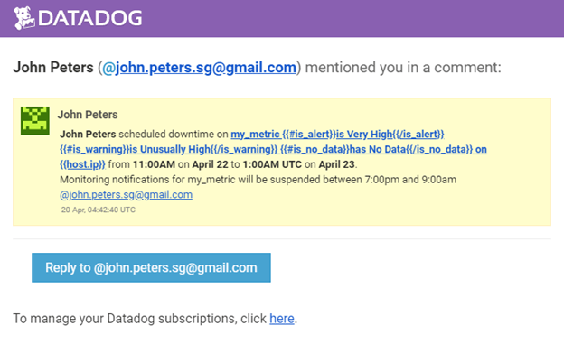

This also demonstrates the issue of using conditional formatting in the title for the monitor.

22. Deployed and instrumented a simple Flask application with the Datadog APM solution
```python
from ddtrace import patch_all, config
patch_all()
from flask import Flask
import logging
import sys
config.flask['analytics_enabled'] = True

# Have flask use stdout as the logger
main_logger = logging.getLogger()
main_logger.setLevel(logging.DEBUG)
c = logging.StreamHandler(sys.stdout)
formatter = logging.Formatter('%(asctime)s - %(name)s - %(levelname)s - %(message)s')
c.setFormatter(formatter)
main_logger.addHandler(c)

app = Flask(__name__)

@app.route('/')
def api_entry():
    return 'Entrypoint to the Application'

@app.route('/api/apm')
def apm_endpoint():
    return 'Getting APM Started'

@app.route('/api/trace')
def trace_endpoint():
    return 'Posting Traces'

if __name__ == '__main__':
    app.run(host="0.0.0.0", port=5050)
```

23. Created a custom dashboard that presents both APM metrics and related infrastructure metrics
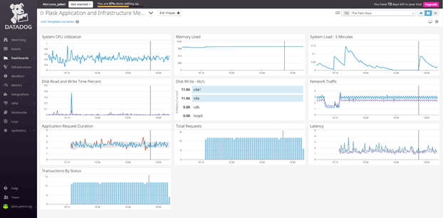

<a href="https://app.datadoghq.com/dashboard/j73-mzs-ttj/flask-application-and-infrastructure-metrics?tile_size=m&page=0&is_auto=false&from_ts=1555751700000&to_ts=1555755300000&live=true" target="_blank">Click here to view Custom Dashboard</a>

24. A service is a set of processes that do the same job, while a resource is a particular action of a service, such as an individual end-point or query.

25. In a space restricted city like Singapore, one of the perennial problems is locating a car park with available spaces in the vicinity of your destination. Most car parks already implement real-time monitoring (using sensors) of the occupation of individual lots, and so it would be interesting to utilize Datadog to combine this data to identify suitable car parks with available spaces.

