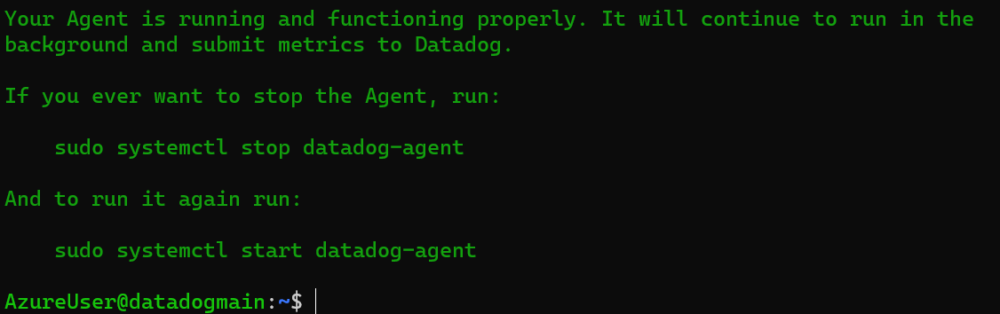
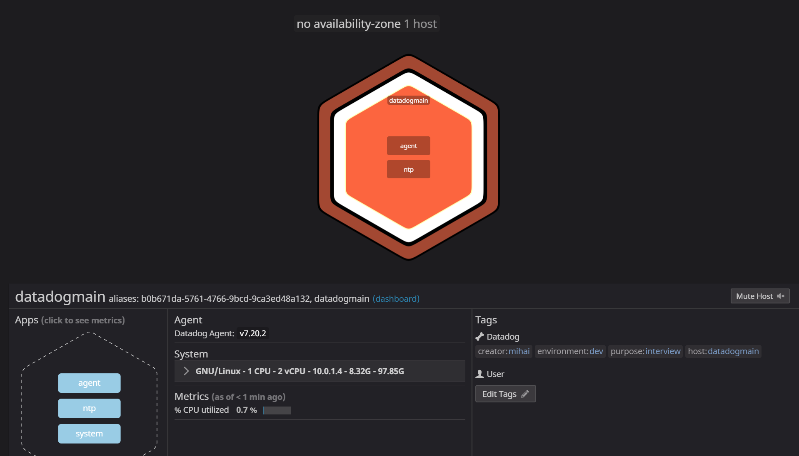
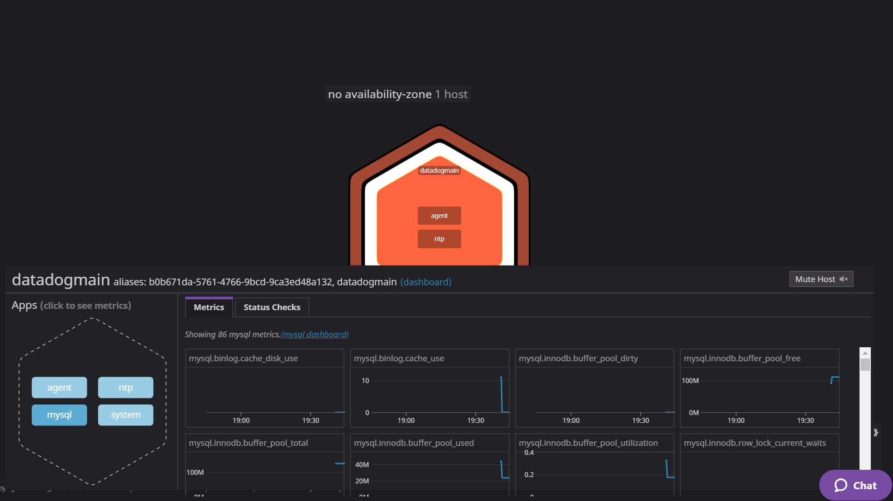
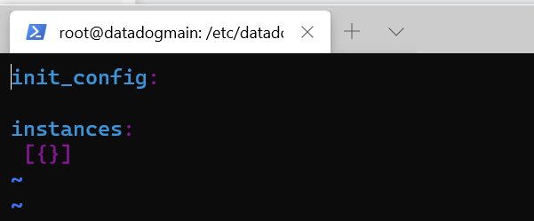
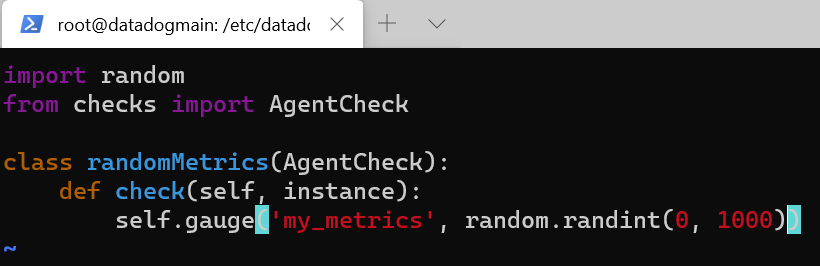
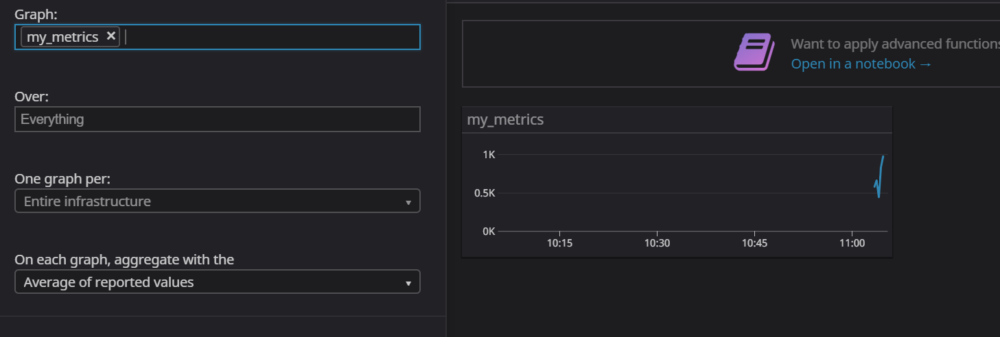
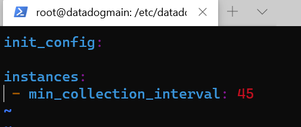

```       
       .-'`   `'-.
   _,.'.===   ===.'.,_
  / /  .___. .___.  \ \
 / /   ( o ) ( o )   \ \                                            _
: /|    '-'___'-'    |\ ;                                          (_)
| |`\_,.-'`   `"-.,_/'| |                                          /|
| |  \             /  | |                                         /\;
| |   \           /   | | _                              ___     /\/
| |    \   __    /\   | |' `\-.-.-.-.-.-.-.-.-.-.-.-.-./`   `"-,/\/ 
| |     \ (__)  /\ `-'| |    `\ \ \ \ \ \ \ \ \ \ \ \ \`\       \/
| |      \-...-/  `-,_| |      \`\ \ \ \ \ \ \ \ \ \ \ \ \       \
| |       '---'    /  | |       | | | | | | | | | | | | | |       |
| |               |   | |       |    Datadog - Mihai    | |       |
\_/               |   \_/       | | | | | | | | | | | | | | .--.  ;
                  |       .--.  | | | | | | | | | | | | | | |  | /
                   \      |  | / / / / / / / / / / / / / /  |  |/
                   |`-.___|  |/-'-'-'-'-'-'-'-'-'-'-'-'-'`--|  |
            ,.-----'~~;   |  |                  (_(_(______)|  |
           (_(_(_______)  |  |                         ,-----`~~~\
                    ,-----`~~~\                      (_(_(_______)
                   (_(_(_______)

```
# Prerequisites - Setting up the environment

- [x] Spinned up an Azure Ubuntu VM and connected to it.


- [x] Installed a Datadog agent



# Collecting Metrics

- [x] Edited the datadog.yaml file, added the tags, restarted the Datadog Agent.



- [x] Installed the MySQL database on the VM, created the datadog database user and gave it the necessary rights according to this integration documentation: https://docs.datadoghq.com/integrations/mysql/ Created a conf.yaml file and updated the necessary configurations. Restarted the MySQL database and the Datadog agent to enable MySQL monitoring.



- [x] Created a file in conf.d folder named my_metrics.yaml



- [x] Created a file in checks.d folder named my_metrics.py and added the following code as suggested here: https://docs.datadoghq.com/developers/write_agent_check/?tab=agentv6v7



- [x] Restarted the agent after which it was possible to monitor 'my_metrics' using either 'sudo service datadog-agent status' or the Metrics Explorer:



- [x] Updated the collection interval in the 'my_metrics.yaml' file to submit the metrics once every 45 seconds: 



**Bonus question**: Yes, it is possible to modify the collection interval without modifying the Python file by modifying the configuration file as it was executed above. The interval modification using the configuration file was inspired by this: https://docs.datadoghq.com/developers/write_agent_check/?tab=agentv6v7

Bonus Question Can you change the collection interval without modifying the Python check file you created?

# Visualizing Data:
