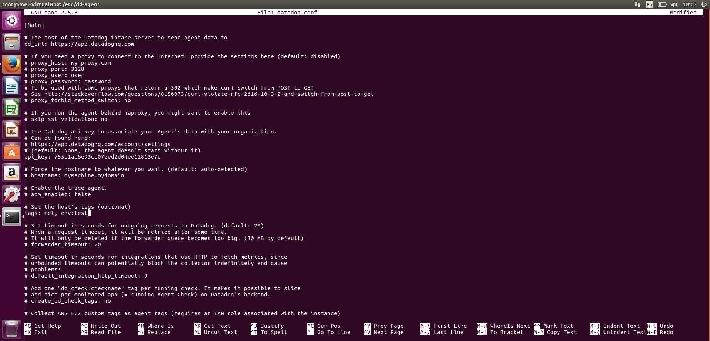
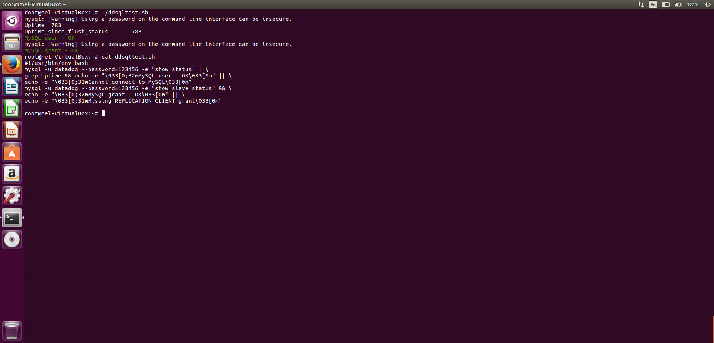
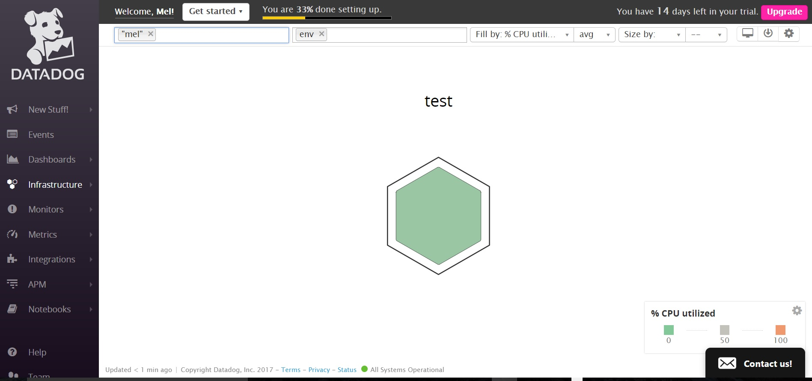
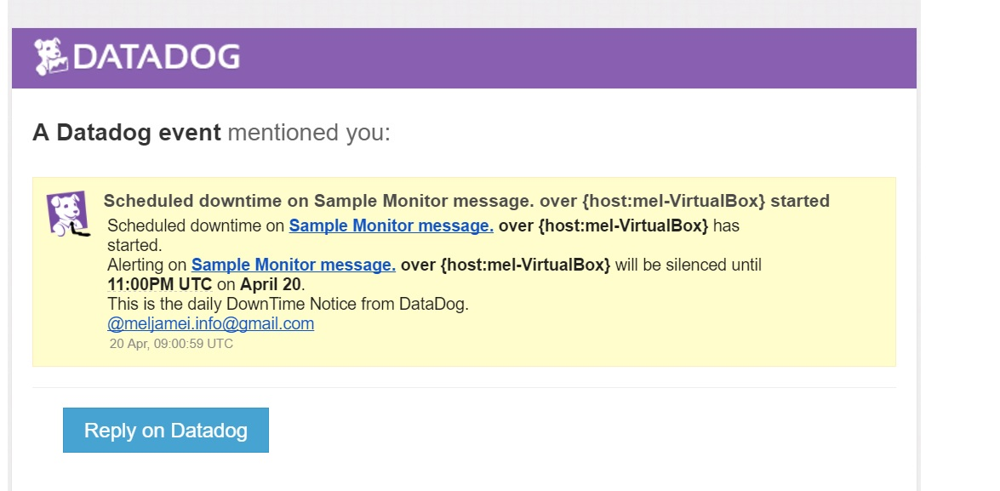

## Why work at Datadog?
Working with this product gave me an idea about the value Datadog generates for a business. During the past week I have worked with dashboards and monitored tasks which expanded my horizon on my current development workflows. I found out how an scaled app is being monitored and the important role it plays in maintaining products. I do belive that Datadog can help me get better at what I do and based on my experience I see myself helping troubleshooting clients issues.

## Bonus question: In your own words, what is the Agent?

The Agent is a process that keep doing something(collecting events and metrics) in order to meet its design objectives(to monitor data). 

## Bonus question: What is the difference between a timeboard and a screenboard?

A Timeboard: is a board which shows all graphs and they are always in a grid-like fashion and they are better for troubleshooting and correlation.

A ScreenBoard:
 is a flexible, more customizable ui which is good for a high-level view into a system. it has drag-and-drop widgets which can have a different time frame. they also can be shared as a whole live and as a read-only entity whereas TimeBoards cannot.

## These are the steps to finish this challenge:

- Started with signing up for Datadog.
- Tried to figure out how to get the Agent reporting metrics.
- Added tags in the Agent config file.

- Installed MySQL with the command:

    #aptitude install mysqld

- Checked if it's active with:

    #systemctl status mysqld

 

- Wrote a custom Agent check that samples a random value.

 

- First used nano to open files and then found vim easier to use:

    #vim datadog.conf

- Installed Python package manager: 

    #pip

- But face a problem in making random numbers with Python so I made random numbers with Ruby and wrote codes to repeat the random code: 

    #for i in `seq 1,100`; do echo $i; done

- Made a clone and a new metric, after showed me a mertic above 0.90 I made a snapshot and taged my email.

  

- Set up a monitor with multi-alert by host and gave it a descriptive monitor name and message and I got several triggered emails.  

  

- To make the notifications silence form 7pm to 9am every day I set the downtime. 

  

