Your answers to the questions go here.
# Prerequisites - Setup the environment:
I am using a [Vagrant](https://learn.hashicorp.com/collections/vagrant/getting-started) VM with an Ubuntu 18.04 server.


## Collecting Metrics:

* Add tags in the Agent config file and show us a screenshot of your host and its tags on the Host Map page in Datadog.
  - To add the tags to the host, I used the [following guide](https://docs.datadoghq.com/getting_started/tagging/assigning_tags?tab=noncontainerizedenvironments)
  - Here are the screenshots of the script from the host itself and the Host Map in the UI:
  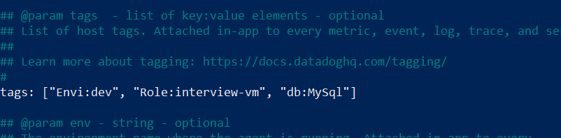
  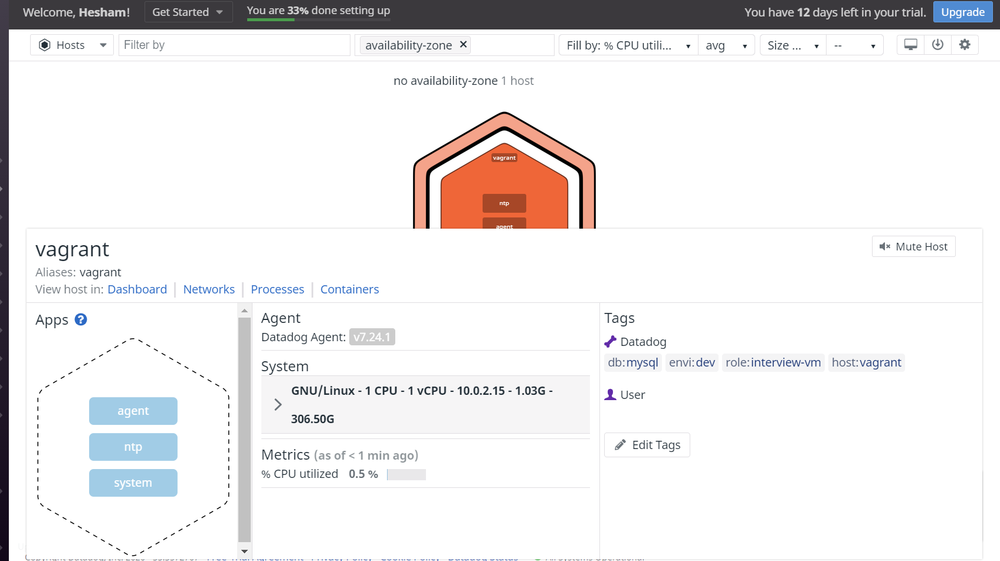
  
* Install a database on your machine (MongoDB, MySQL, or PostgreSQL) and then install the respective Datadog integration for that database.
  - I installed a MySql database on my host for this example. If you don't have MySql installed on your machine, please use the following [guide](https://www.digitalocean.com/community/tutorials/how-to-install-mysql-on-ubuntu-18-04)
  - Once MySql is installed on your machine, please use the following [guide](https://docs.datadoghq.com/integrations/mysql/?tab=host#pagetitle) to install the Datadog integration for it.
  - Here are a couple of screenshot to show that MySql and its Datadog intgerations are working on my host:
  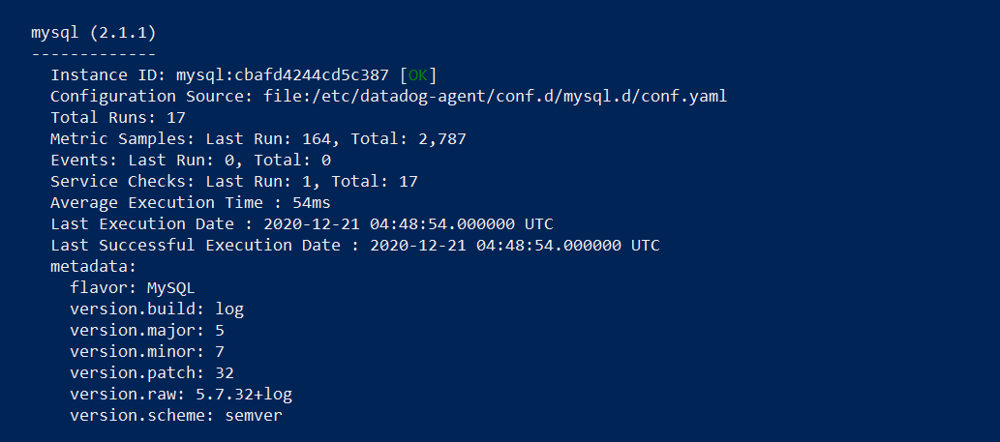
  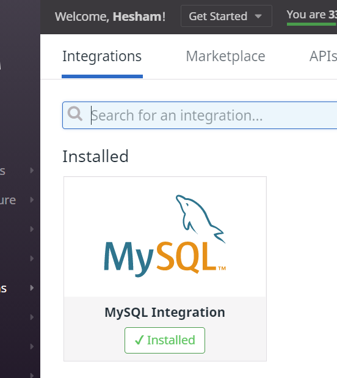
* Create a custom Agent check that submits a metric named my_metric with a random value between 0 and 1000.
  - To be able to create a custome Agent and submit my_metric I used this guide as a base [guide](https://docs.datadoghq.com/developers/metrics/agent_metrics_submission/)
  - Here's the python script that I used to submit my_metric:
  ``` python 
  import random

  from datadog_checks.base import AgentCheck

  __version__ = "1.0.0"

  class MyClass(AgentCheck):
        def check(self, instance):
                self.gauge(
                "my_metric",
                random.randint(0, 1000),
                tags=["env:dev","metric_submission_type:gauge"],
                )
  ```
  - Here is a screenshot from my host to show that the agent is running: 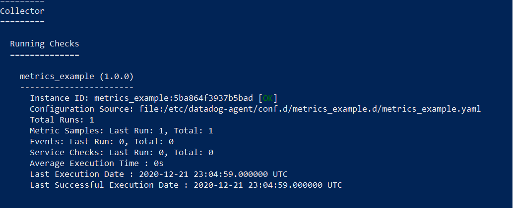
  - Here is a screenshot from the UI: 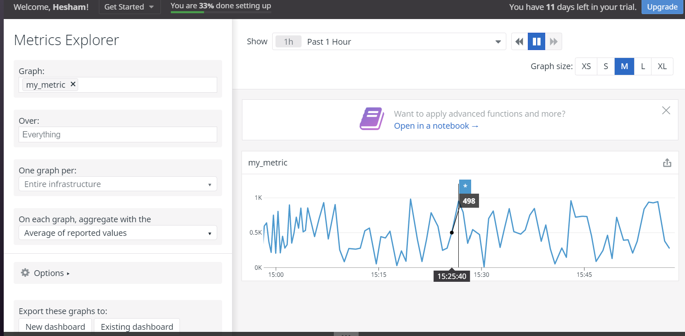
* Change your check's collection interval so that it only submits the metric once every 45 seconds.
  - I used the [collection interval](https://docs.datadoghq.com/developers/write_agent_check/?tab=agentv6v7#collection-interval) feature from the bonus question below to send my_metric every 45 seconds. Please see the following screenshot from my the yaml file on my host:
  
  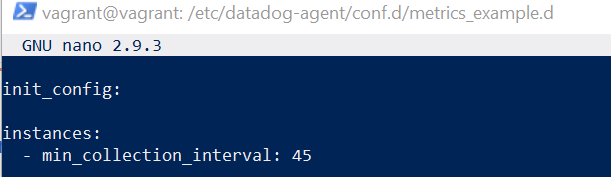
  
* **Bonus Question** Can you change the collection interval without modifying the Python check file you created?
  - Yes, you can by using the collection interval feature according to this [doc](https://docs.datadoghq.com/developers/write_agent_check/?tab=agentv6v7#collection-interval)


## Visualizing Data:

Utilize the Datadog API to create a Timeboard that contains:

* Your custom metric scoped over your host.
* Any metric from the Integration on your Database with the anomaly function applied.
* Your custom metric with the rollup function applied to sum up all the points for the past hour into one bucket
  - Here is a screenshot of the Timeboard with the 3 graphs required: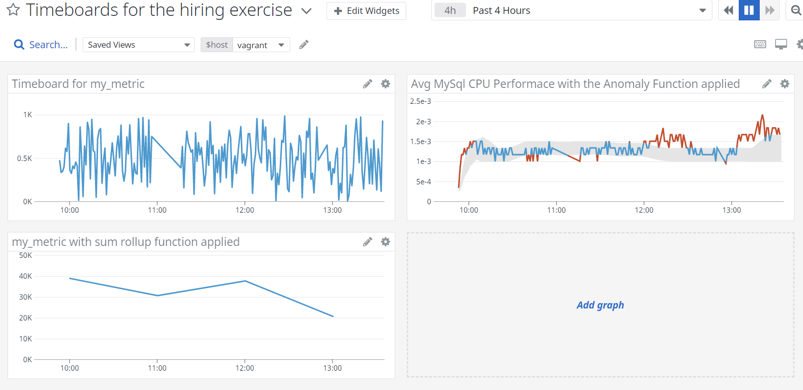
  - Note: I was not sure if the questions asked for all three metrics to be drawn in the same graph or separate graphs. I chose separated graphs because it looks better. But, if you want all metrics in the same graph you can change the script to only include one graph and add the following lines to the “requests” array of that graph: 
  ```json
  "requests": [
            {"q": "min:my_metric{host:vagrant}"}
            {"q": "anomalies(avg:mysql.performance.cpu_time{db:mysql}, 'basic', 2)"},
            {"q": "min:my_metric{host:vagrant}.rollup(sum, 3600)"}
        ],
  ```
  
Please be sure, when submitting your hiring challenge, to include the script that you've used to create this Timeboard.
  - Here is the [script](/dash.py) that I used to create this Timeboard

Once this is created, access the Dashboard from your Dashboard List in the UI:

* Set the Timeboard's timeframe to the past 5 minutes
* Take a snapshot of this graph and use the @ notation to send it to yourself.
  - Here are the screenshots of the snapshot emails from my inbox:
  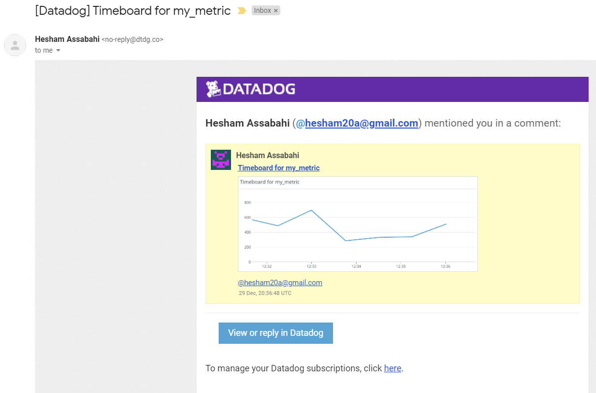
  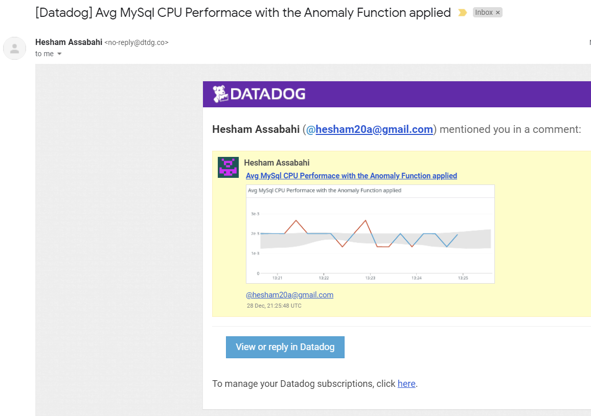
  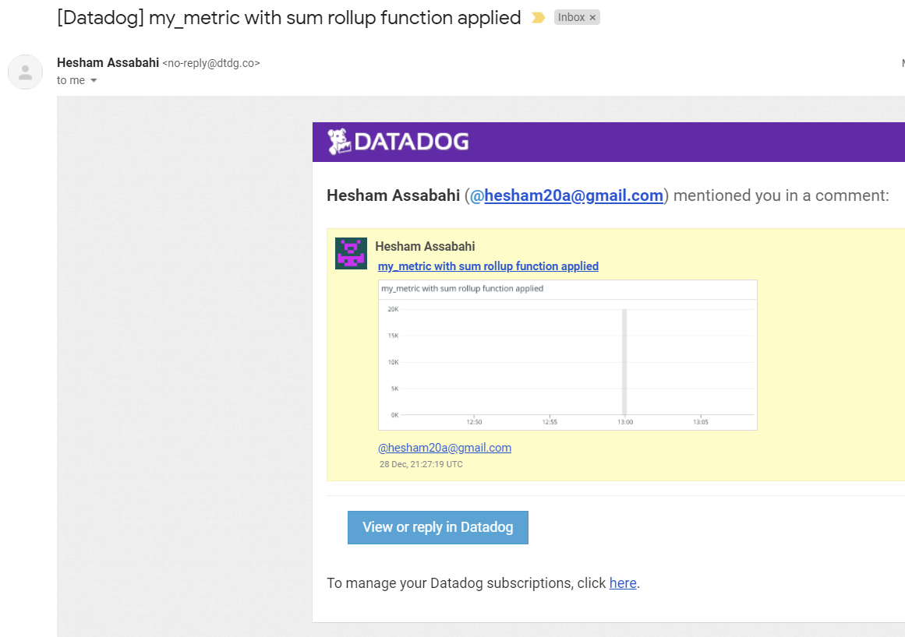

* **Bonus Question**: What is the Anomaly graph displaying?
-  The anomaly graph is displaying the behavior of the metric that we are graphing. It will show if that metric has been behaving outside the norm/it’s not predicated (color turns red) or if the metric has been behaving normally or as it’s predicated (color stays gray). The anomaly function for the anomaly graph is using anomaly detection algorithms like the SARIMA algorithm.


## Monitoring Data

Since you’ve already caught your test metric going above 800 once, you don’t want to have to continually watch this dashboard to be alerted when it goes above 800 again. So let’s make life easier by creating a monitor.

Create a new Metric Monitor that watches the average of your custom metric (my_metric) and will alert if it’s above the following values over the past 5 minutes:

* Warning threshold of 500
* Alerting threshold of 800
* And also ensure that it will notify you if there is No Data for this query over the past 10m.
  - I used [this useful guide](https://docs.datadoghq.com/monitors/monitor_types/metric/?tab=threshold) to set up the metirc monitor alerts. 
  - These couple of screenshots shows how to configure the above thersholds and the how to set the no data alert: 
  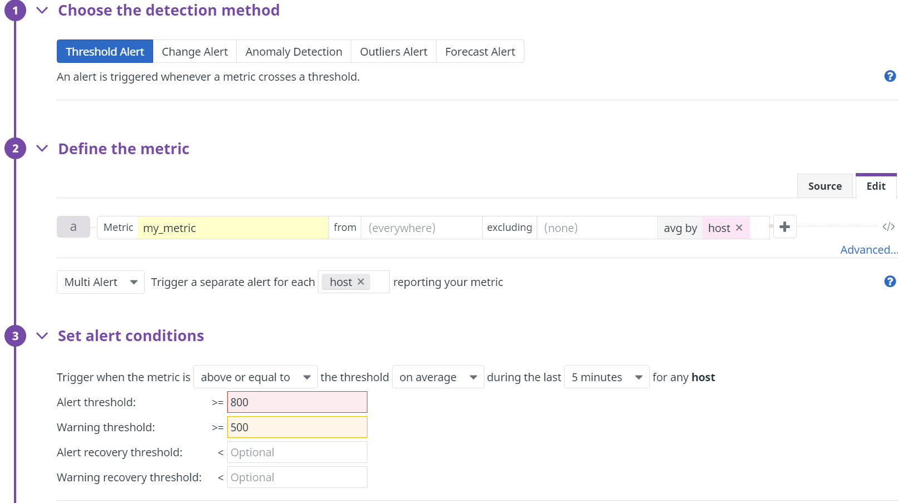
  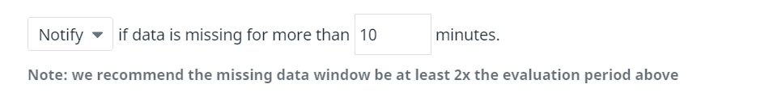

Please configure the monitor’s message so that it will:

* Send you an email whenever the monitor triggers.
* Create different messages based on whether the monitor is in an Alert, Warning, or No Data state.
* Include the metric value that caused the monitor to trigger and host ip when the Monitor triggers an Alert state.
* When this monitor sends you an email notification, take a screenshot of the email that it sends you.
  - I modified the message section to include the above conditions using [conditional variables](https://docs.datadoghq.com/monitors/notifications/?tab=is_alert#conditional-variables). To look at the logic that I used to set these alerts, please refer to this screenshots:
  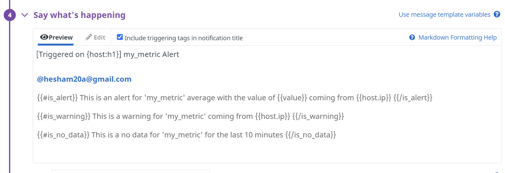 
  - The following screenshots are from all 3 types of email alerts(Alert/Warning/No Datat) from my email inbox:
  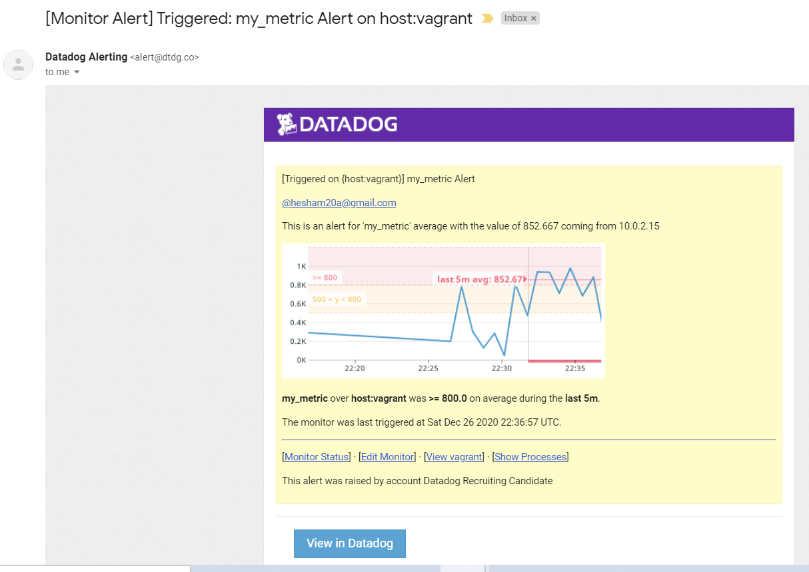 

  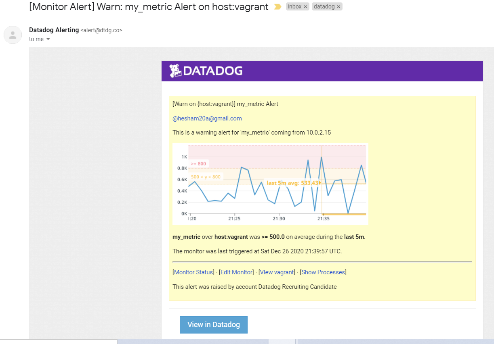 
 
  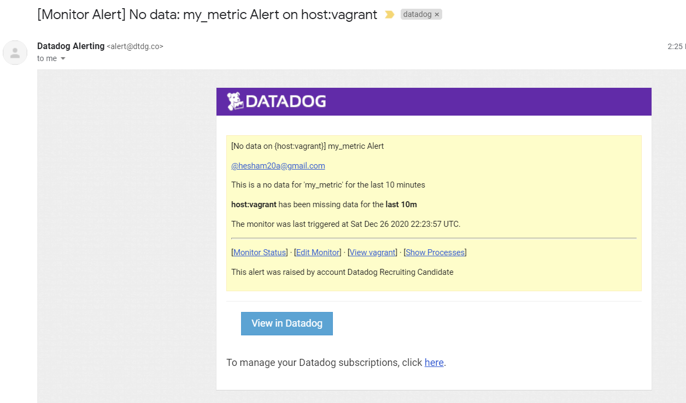 


* **Bonus Question**: Since this monitor is going to alert pretty often, you don’t want to be alerted when you are out of the office. Set up two scheduled downtimes for this monitor:
        
  * One that silences it from 7pm to 9am daily on M-F,
    - Step one: from the main menu on the UI go to Monitors --> Manage Downtime. Then click on Schedule downtime on the top right corner.
      Select the metic that you want to monitor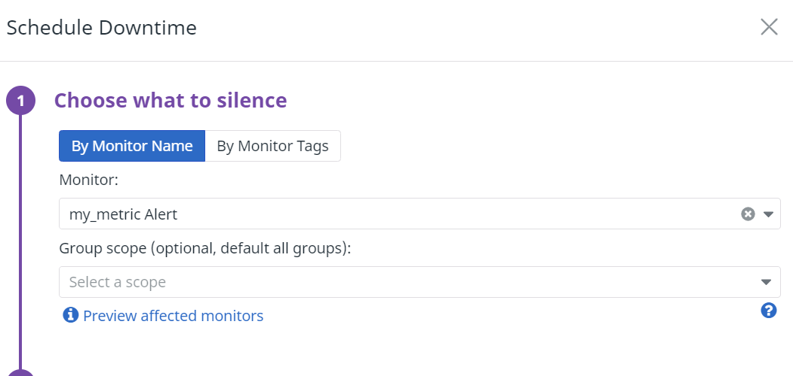
    - step two: fill the schedule 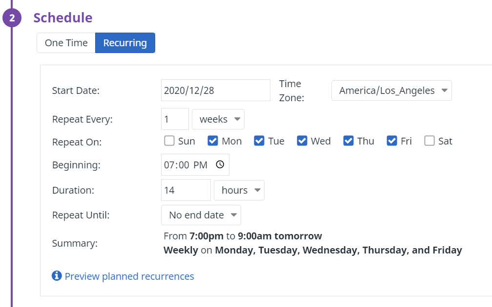
    - step three: enter the message for the notifications and select recipients 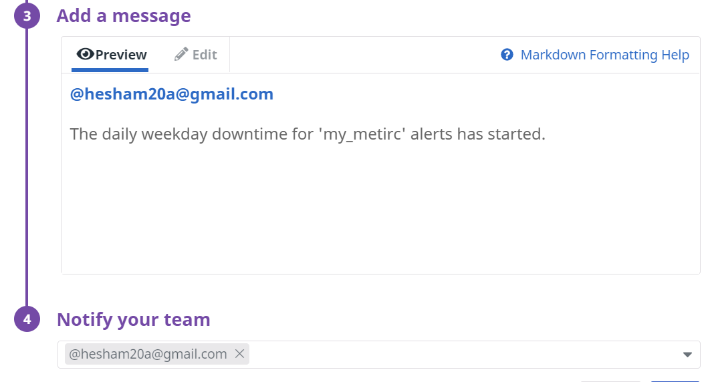
  * And one that silences it all day on Sat-Sun.
    - step one should be the same one as above
    - step two: select Sat and turn the downtime on for 2 days, so you only receive one email   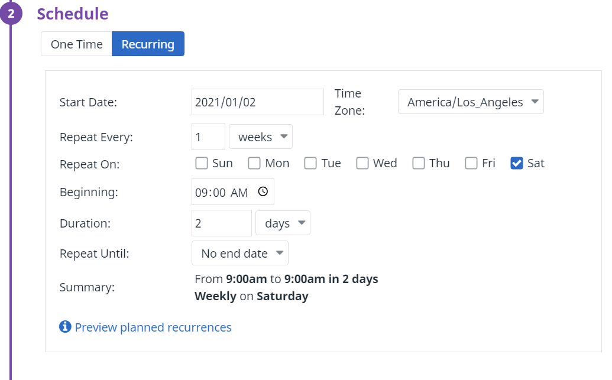
    - step three: enter the message recipients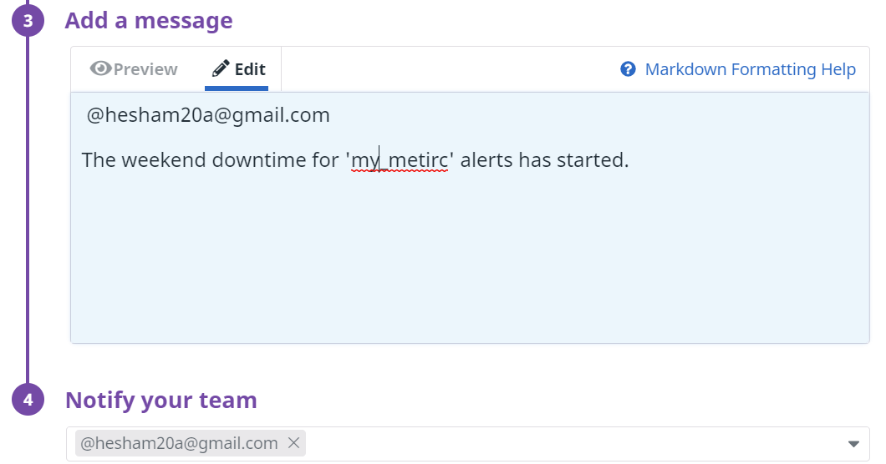
  * Make sure that your email is notified when you schedule the downtime and take a screenshot of that notification.
    - Here is the downtime email notification for M-F, 7pm to 9am:  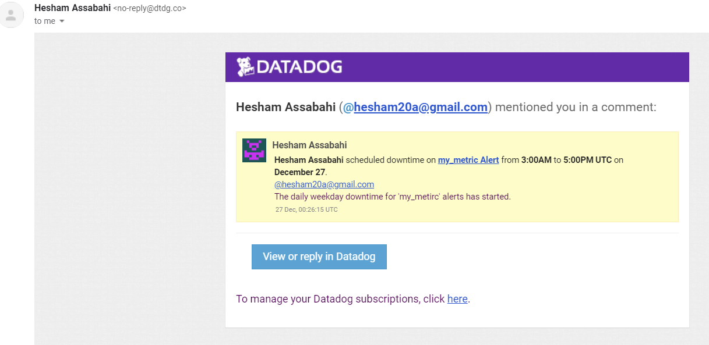
    - Here is the downtime email notification weekedend:  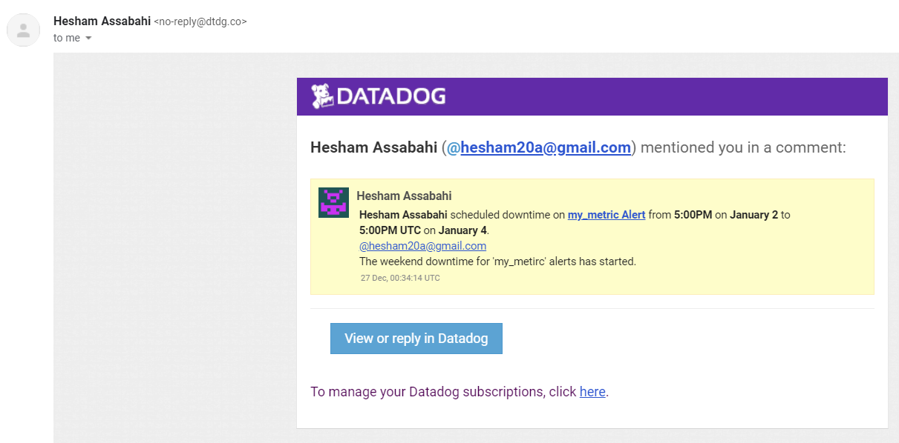


## Collecting APM Data:
   - I used the Flask application example that was given and instrumented it using Datadog’s APM solution for Python. 
   
   - I ran into a couple of issues while trying to install 'ddtrace' on my host using [this resource](https://docs.datadoghq.com/tracing/setup_overview/setup/python/?tab=containers#follow-the-in-app-documentation-recommended). Before installing ddtrace on your host please make sure to install the correct Cython files for your host( mine is Ubuntu 18.04) and install Flask using pip first. After that, install ddtrace using pip. Now, ddtrace should be up and running, you can test it by running the following command ```sh ddtrace-run ```

   - To run the Falsk application, I used the following command: 


``` sh
DD_SERVICE="flak" DD_ENV="flask" DD_LOGS_INJECTION=true DD_TRACE_SAMPLE_RATE="1" DD_PROFILING_ENABLED=true ddtrace-run python flaskapp.py
```

   - Here is a screenshot of a simple dashboard that shows both APM and infrastructure metrics.: 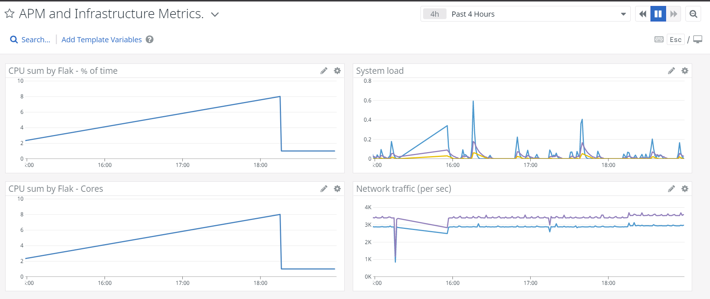

   - Here is a link to the above [dashboard](https://p.datadoghq.com/sb/ha86c4ioy7wh8zmv-44fd192d58f69ca30af4d1acb9cbff66)

   - To view the flask appliction please click [here](https://github.com/Hesham20/hiring-engineers/blob/master/flaskapp.py).


## Final Question:

Datadog has been used in a lot of creative ways in the past. We’ve written some blog posts about using Datadog to monitor the NYC Subway System, Pokemon Go, and even office restroom availability!

Is there anything creative you would use Datadog for?

   * I would like to use Datadog to monitor a mall's parking lots and spaces. I can use it to see which lots are currently busy and what’s the capacity at each lot. Due to Covid-19, contactless pickups at malls has become very popular in California. I can monitor and manage which parking spaces are occupied and if there are empty spaces next to the occupied parking space( to enforce social distancing). In addition, to help prevent crowding and the virus from spreading at the pick up locations, we can alert when a lot has reached a specific capacity. In the case of that capacity being reached, we can direct shoppers to other lots that are not as busy as the one they intended to go to when they enter the mall.
