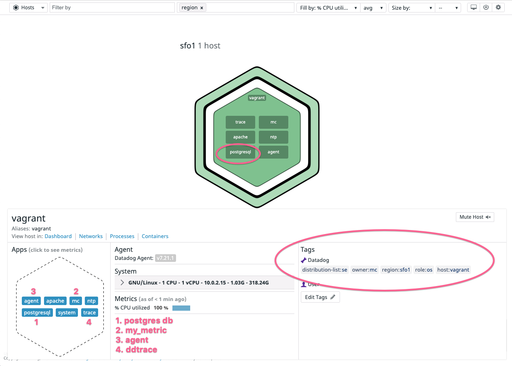
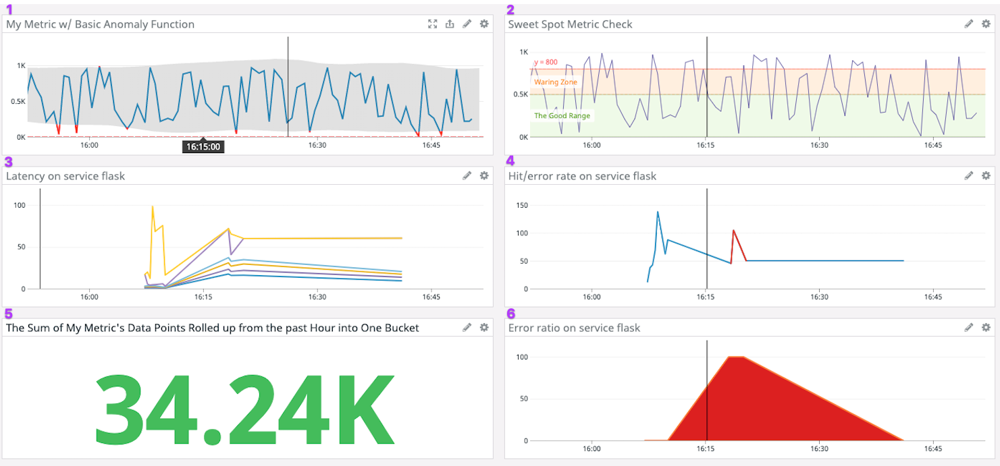
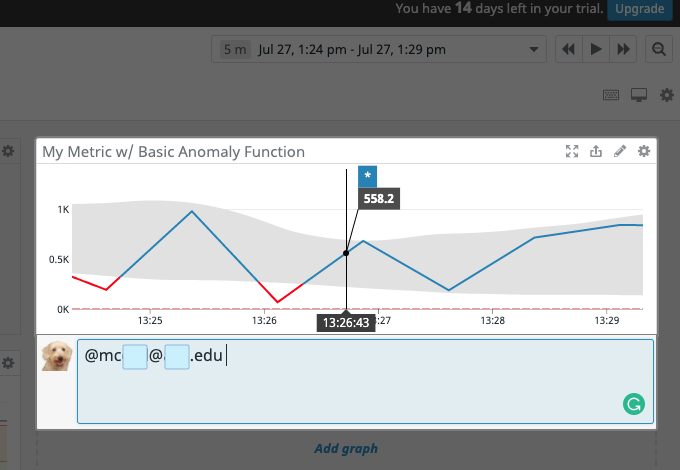
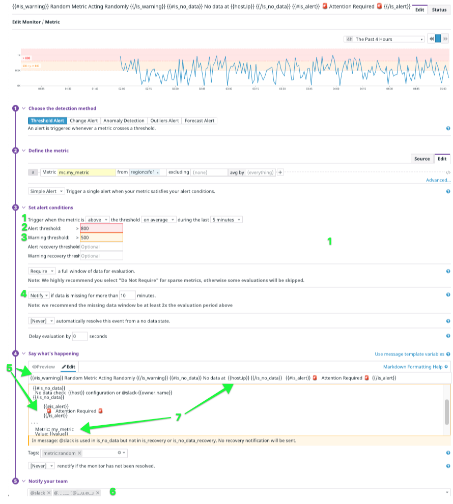
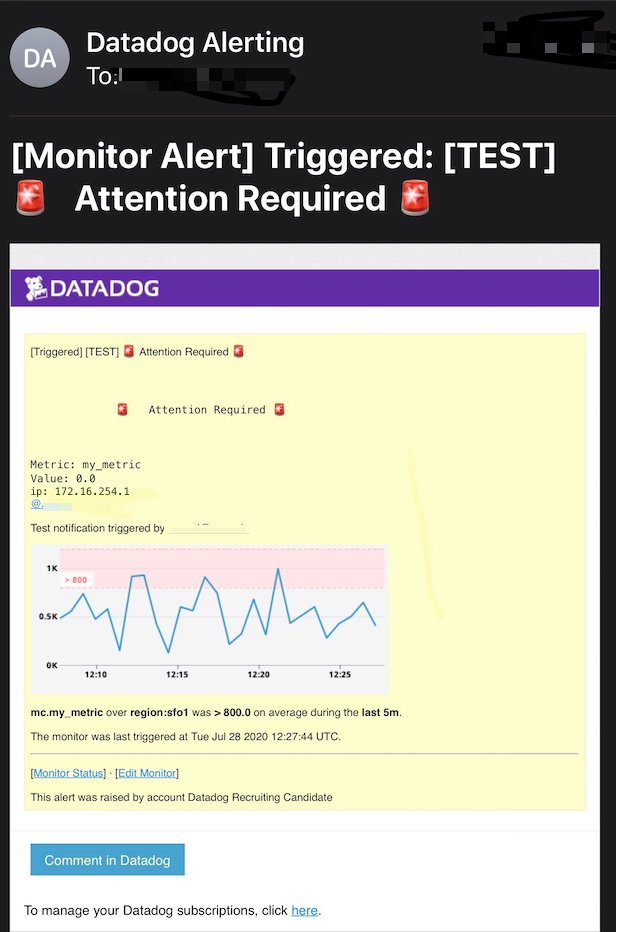
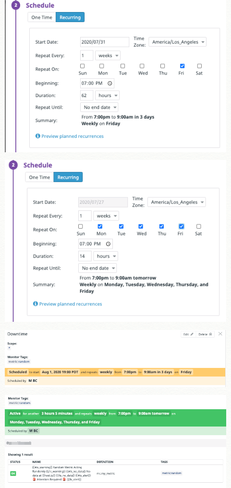
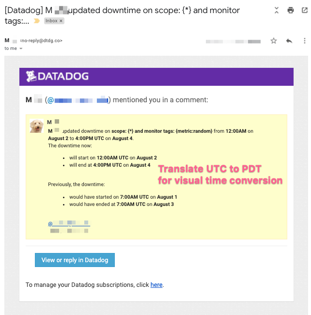

# Collecting Metrics:

**Host Map Screenshot**


 - [Tags submitted by the Agent, configured in /etc/datadog-agent/datadog.yaml](assets/tags.md)
 - An installed PostgreSQL database & dd integration

---

**Custom Agent Check**
```py
class CustomMetricCheck(AgentCheck):
    """
    CustomMetricCheck plucks a random number between 1 & 1000.
    """

    def check(self, instance):
        my_metric = random.randrange(1001)
        self.gauge(
            'mc.my_metric', 
            my_metric, 
            tags=[]
        )
```        

- Custom Agent check that submits a metric named my_metric with a random value between 0 and 1000.
- Configured collection interval for 45 seconds
- **Bonus Question:** Configure collection interval without modifying the Python check file
    - [Write Custom Check Documentation link](https://docs.datadoghq.com/developers/write_agent_check/?tab=agentv6v7#collection-interval)
      
    ```yaml
      # conf.d/custom_check.d/custom_metric_check.yaml snippet
      # 4500 milliseconds `min_collection_time` configuration

      instances:
            min_collection_interval: 45
      ```

---


# Visualizing Data:


## **Timeboard APM and Infrastructure Metrics Screenshot**

1. Database integration metric with anomaly function applied 
2. Custom metric scoped over host
3. APM request success/failure metric
4. Custom metric sum of data points rolled up for the past hour 
5. APM service latency metric
6. APM error percentage metric
7. Public Link to Timeboard: 

---

### **Timeboard Scripts** 
- [Python API Script Snippet](snippets/timeboard.py)
- `$ terraform init; terraform plan; terraform apply;`

```tf

provider "datadog" {
  api_key = var.datadog_api_key
  app_key = var.datadog_app_key
}

resource "datadog_dashboard" "ordered"  {
  title         = "Custom Metric Timeboard"
  description   = "My custom metric scoped over my host"
  layout_type   = "ordered"
  is_read_only  = true

  widget {
    query_value_definition {
      request {
        q = "sum:mc.my_metric{*}.rollup(sum, 3600)"
        aggregator = "avg"
        conditional_formats {
          comparator = ">"
          value = "100"
          palette = "green_on_white"
        }
      }
      autoscale = true
      precision = "2"
      text_align = "center"
      title = "The Sum of My Metric's Data Points Rolled up from the past Hour into One Bucket"
      time = {
        live_span = "5m"
      }
    }
  }
  
widget {
  timeseries_definition {
    request {
      q = "anomalies(avg:mc.my_metric{*}, 'basic', 2)"
      display_type = "line"
      style {
        palette = "cool"
        line_type = "solid"
        line_width = "normal" 
      }
    }
    marker {
      display_type = "error dashed"
      value = "y = 0"
      }
    title = "My  Metric  w/ Basic Anomaly Function"
    show_legend = false
    legend_size = "0"  
  }

} 

widget {
    timeseries_definition {
      request {
        q= "avg:mc.my_metric{*}.rollup(sum)"
        display_type = "line"
        style {
          palette = "purple"
          line_type = "solid"
          line_width = "thin"
        }
        metadata {
          expression = "avg:mc.my_metric{*}.rollup(sum)"
          alias_name = "My Metric Gauge" 
        }
      }
     
      marker {
        display_type = "error solid"
        label = "y = 800"
        value = "y = 800"
      }
      marker {
        display_type = "warning dashed"
        value = "501 < y < 799"
        label = " Waring Zone "
      }
       marker {
        display_type = "ok solid"
        value = "1 < y < 500"
        label = " The Good Range "
      }
      title = "Sweet Spot Metric Check"
      show_legend = false
      legend_size = "0"
      time = {
        live_span = "1h"
      }
      
      yaxis {
        min = 0
      }
    }  
}
```

---

### **Timeboard 5 minute timeframe  @ notation**


- Timeboard timeframe window adjustment command to 5 minutes  `option + ]`
- Snapshot using the @ notation notifying myself.
- **Bonus Question:** What is the Anomaly graph displaying?
  - History based. Anomaly detection display the metrics past history to see whether or not it's deviating from where the algorithm infers the metric should be. Anomaly detection uncovers a metric(s) that do not act the way it used to act
  - When considering whether to use anomaly detection reference the note under: [Should I use anomaly detection for everything?](https://docs.datadoghq.com/monitors/faq/anomaly-monitor/#should-i-use-anomaly-detection-for-everything)
    - **Note:** Understanding how an _Outlier_ is defined within Datadog is essential to comprehending Datadog's Anomaly definition because the nomenclature for _Outlier & Anomaly_ are not standardize across the industry. 
    - An **Outlier:** compares metrics that should be behaving similarly to one another. Said differently, one of these data points is not like the others.

---

# Monitoring Data

### **Creating Monitor watching the the custom metric avg**


1. Alert if metric is above the following values over the past 5 minutes:
2. Warning threshold of 500
3. Alerting threshold of 800
4. Over 10min of no data sends notif for query
5. Create different messages based on whether the monitor is in an Alert, Warning, or No Data state.
6. Sends me an email whenever the monitor triggers
7. Metric value included that caused the monitor to trigger with host ip when the Monitor triggers an Alert state.
8. Monitor email notification screenshot of the email that it sent.


 ### **Bonus Question**: Set up two scheduled downtimes for this monitor

- 

- Silent from 7pm to 9am daily on M-F
- Silent all day on Sat-Sun **And until Monday at 9AM**
- Emailed Notif Metric Monitor 
  

---

# Collecting APM Data:

- Instrumented python app using Datadog’s APM solution
- [APM and Infrastructure Metrics app.ddhq.com link](https://p.datadoghq.com/sb/uurj1fs1fj927eap-75e437c1d0eb8ba2e3aad3e2cbeb8ed1)
- [Link to screenshot of APM and Infrastructure Metrics included within Visualizing Data Dashboard from above](#Visualizing-Data). 
- **Bonus Question**: What is the difference between a Service and a Resource?

   -  <p style={{marginLeft: "150px", marginRight: "150px"}}><a style={{ textDecoration: "none" }} href="https://docs.datadoghq.com/tracing/visualization/#services" target="_blank" rel="noopener noreferrer">
          Service: APM Glossary (source):
        </a> Services are the building blocks of modern microservice architectures - broadly a service groups together endpoints, queries, or jobs for the purposes of building your application. </p>
   -    <p style={{marginLeft: "150px", marginRight: "100px"}}><a href=" https://docs.datadoghq.com/tracing/visualization/#resources" target="_blank" rel="noopener noreferrer">
          Resource: APM Glossary (source):
        </a> Resources represent a particular domain of a customer application - they are typically an instrumented web endpoint, database query, or background job.</p>


```python
#!/usr/bin/env python
from flask import Flask
import logging
import sys
from cowpy import cow
import ddtrace.profiling.auto
ddtrace.config.analytics_enabled = True

root = logging.getLogger()
root.setLevel(logging.DEBUG)
c = logging.StreamHandler(sys.stdout)
c.setLevel(logging.INFO)
formatter = logging.Formatter('%(asctime)s - %(name)s - %(levelname)s - %(message)s')
c.setFormatter(formatter)
root.addHandler(c)

app = Flask(__name__)

@app.route('/')
def api_entry(self):
    message = cow.milk_random_cow("Random message for the Entrypoint to the App")
    print(message)
    return message

@app.route('/api/apm')
def apm_endpoint():
    message = cow.Cowacter().milk('Hello from Python from Getting APM Started')
    print(message)
    return message

@app.route('/api/trace')
def trace_endpoint():
    cheese = cow.Moose(thoughts=True)
    message = cheese.milk("My witty mesage, for Posting Traces")
    print(message)
    return message

if __name__ == '__main__':
    app.run(host='0.0.0.0', port='5050')
```

---

# Is there anything creative you would use Datadog for?

In these challenging times I would like to monitor [Eviction Notices in San Francisco](https://data.sfgov.org/Housing-and-Buildings/Eviction-Notices/5cei-gny5) to assess the impact Covid-19 will have on housing. The City and County of San Francisco have 538 published open datasets [accessible here](https://datasf.org) with more data sets scheduled to be published in the future. These data sets can be accessed through a REST API and there are [developer docs](https://datasf.org/opendata/developers). These data sets combined with dogstatsD offer endless opportunities to be creative with DataDog. Whether it be, [Police Department Calls for Service
](https://data.sfgov.org/Public-Safety/Police-Department-Calls-for-Service/hz9m-tj6z), when [SF plants new street trees](https://data.sfgov.org/City-Infrastructure/Street-Tree-List/tkzw-k3nq) or [Film Locations in San Francisco](https://data.sfgov.org/Culture-and-Recreation/Film-Locations-in-San-Francisco/yitu-d5am). There's lots of data to play around with. 


