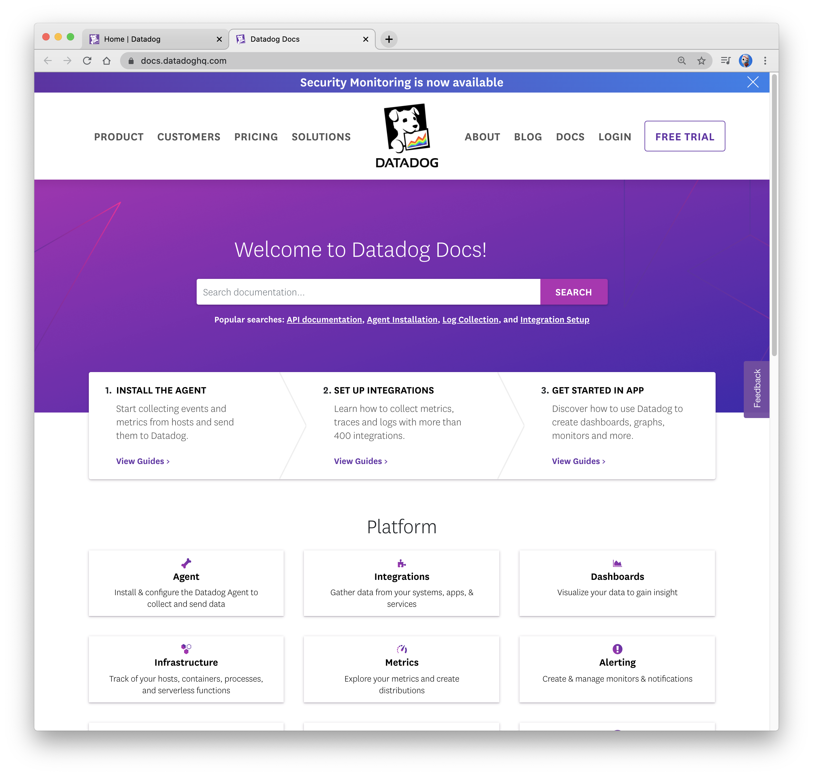
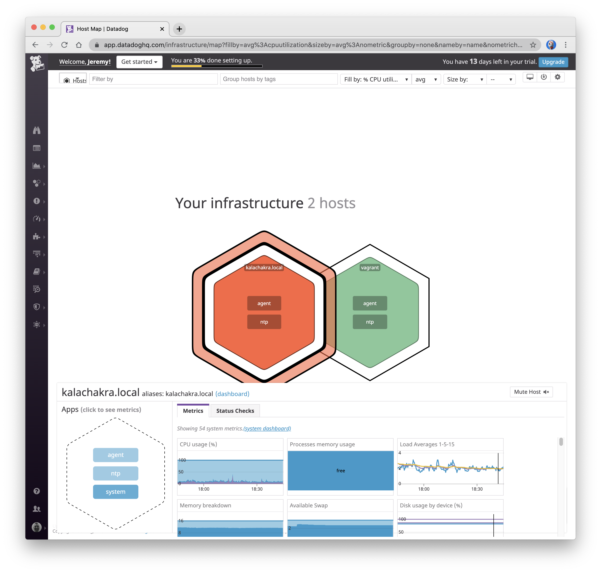
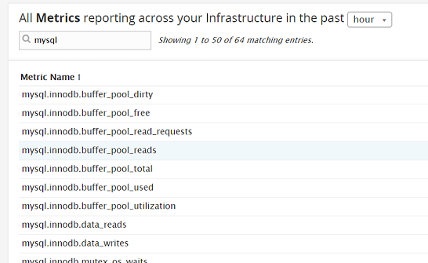
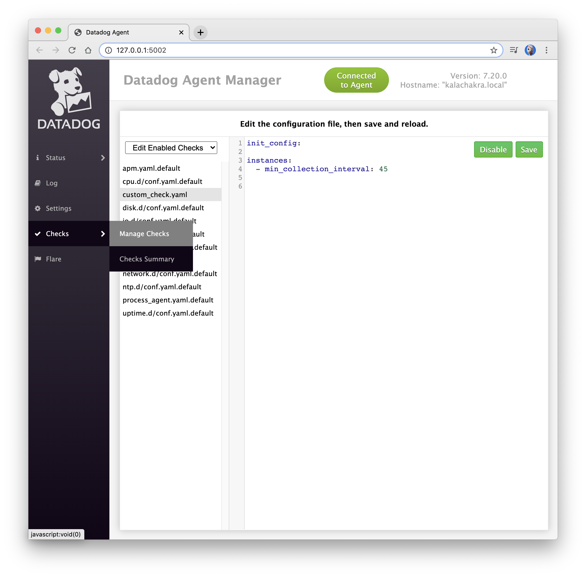
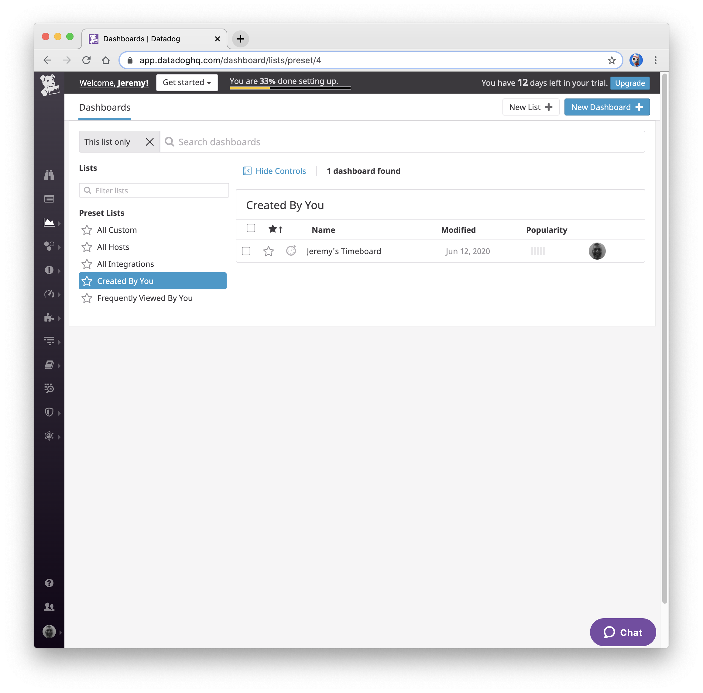
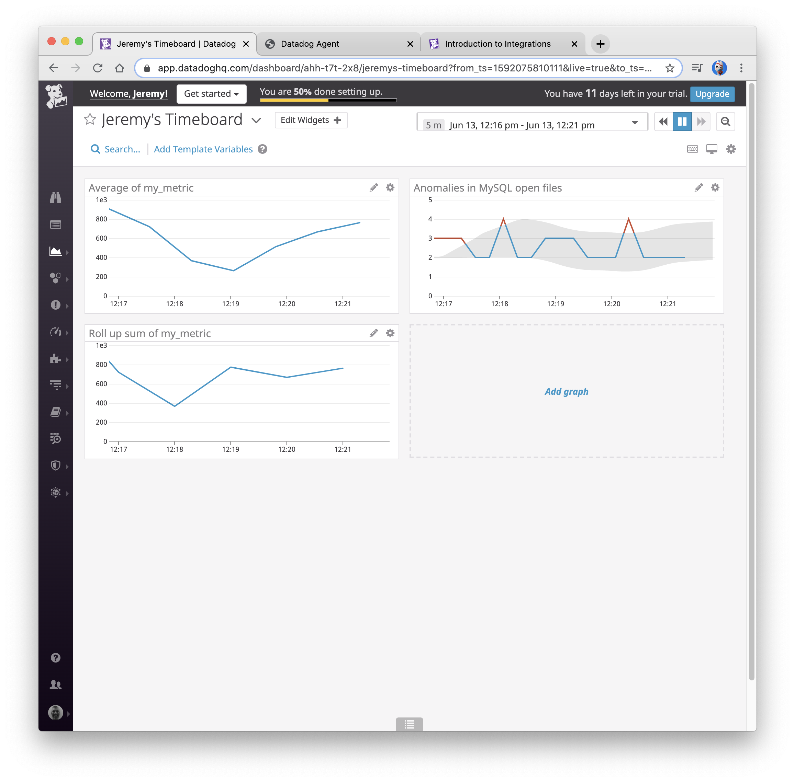

# Datadog Solutions Engineer Exercise

The intent of the exercise is to get familiar with the Datadog Platform. This document outlines the process from initial
 account setup, Agent installation, collecting metrics, visualizing and monitoring data from an array complex systems.


## Prerequisites and Environment Setup

### Read the Documentation! 
Before learning any new technology or platform, I start by reading through the main documentation to get a general 10k 
foot view of the technology. I found the [Datadog Platform Documentation](https://docs.datadoghq.com/) to be 
absolutely beautiful visually, easy to navigate, clear and concise. 


Prior to this exercise, I utilized the [Datadog YouTube Channel](https://www.youtube.com/user/DatadogHQ) to quickly 
learn from the experts/evangelists at Datadog. The [Datadog 101](https://www.youtube.com/playlist?list=PLdh-RwQzDsaOoFo0D8xSEHO0XXOKi1-5J) 
playlist allowed me to understand key concepts of the product in a short amount of time.

I suggest adding this as a resource in the main [README](README.md) under the "Other questions" section. 

### Datadog Account Creation
To sign up for a Datadog account, I navigated to the main [Datadog signup page](https://app.datadoghq.com/signup) with 
my email `jeremy.daggett@gmail.com` and provided the “Datadog Recruiting Candidate” in the “Company” field as requested.

### Host Systems
For the exercise, I used my MacBook Pro with both macOS and Ubuntu Linux to gather metrics:
```
MacBook Pro (15-inch, Late 2016)
2.7 GHz Quad-Core Intel Core i7
16 GB 2133 MHz LPDDR3

macOS Catalina - v10.15.5
Vagrant Ubuntu 18.04.4 LTS VM running with VirtualBox
``` 


## Agent Installation
The Agent installation was quite simple and allows users to get metrics pushed to Datadog almost immediately.

The following installation documents provide the commands and output for the installation of the Agent on my Host:
* [macOS Agent Installation](src/macos_agent_install.md)
* [Ubuntu Agent Installation](src/ubuntu_agent_install.md)

### Validate Reporting
After installing the Agents on both host OS', I ran a quick experiment to ensure metrics were being pushed to Datadog.

To generate load on my system, I played two YouTube videos simultaneously and watched a recorded show on Sling TV.

Additionally, I ran a duplicate finder application called [Gemini](https://macpaw.com/gemini) over my network to compare two
really large directories for duplicate files. The directories contain my various mp3 collections I've gathered over the past 30 years
and contain many duplicates.

This screenshot of the Host Dashbpard shows that metrics from the macOS host `kalachakra.local` are being reported to Datadog:


### Dashboard Links
The following links provide access to the Host Dashboard and Host Map:
* [Host Dashboard](https://app.datadoghq.com/dash/host/2591983488?live=4h&page=0)
* [Host Map](https://app.datadoghq.com/infrastructure/map?fillby=avg%3Acpuutilization&sizeby=avg%3Anometric&groupby=availability-zone&nameby=name&nometrichosts=false&tvMode=false&nogrouphosts=true&palette=green_to_orange&paletteflip=false&node_type=host&host=2591983488)


## Collecting Metrics
* Add tags in the Agent config file and show us a screenshot of your host and its tags on the Host Map page in Datadog.

  The following tags were to [`datadog.yaml`](src/datadog.yaml) config file:
  ```
  tags:
    - service:coffee-shop
    - service:coffee-shop:lat:37.747613
    - service:coffee-shop:long:-122.432123
    - version:coffee-shop:09121970
  ```

  This screenshot shows the tags that were added to the `kalachakra.local` host:

  


### Datadog Integration with MySQL
  Since MySQL was already installed on my MacBook Pro, I followed the Datadog [integration documentation for MySQL](https://app.datadoghq.com/account/settings#integrations/mysql) 
  to install the Datadog integration:
  


### Custom Agent Check 
I created a custom Agent check called [`custom_check.py`](src/custom_check.py) (inline below) for a metric called 
`my_metric` that emits a random value between 0-1000.

    ```python
    # the following try/except block will make the custom check compatible with any Agent version
    import random
    try:
        # first, try to import the base class from new versions of the Agent...
        from datadog_checks.base import AgentCheck
    except ImportError:
        # ...if the above failed, the check is running in Agent version < 6.6.0
        from checks import AgentCheck
    
    # content of the special variable __version__ will be shown in the Agent status page
    __version__ = "1.0.0"
    
    class CustomCheckmuy(AgentCheck):
        def check(self, instance):
            self.gauge('my_metric', random.randint(0,1000), tags=['host:kalachakra.local'])
    ```

I then verified the `custom_check` using the `datadog-agent` "check" command:
```commandline
~/.datadog-agent » datadog-agent check custom_check                             jeremy@kalachakra
=== Series ===
{
  "series": [
    {
      "metric": "my_metric",
      "points": [
        [
          1591984345,
          1
        ]
      ],
      "tags": [
        "TAG_KEY:TAG_VALUE"
      ],
      "host": "kalachakra.local",
      "type": "gauge",
      "interval": 0,
      "source_type_name": "System"
    }
  ]
}
=========
Collector
=========

  Running Checks
  ==============

    custom_check (1.0.0)
    --------------------
      Instance ID: custom_check:d884b5186b651429 [OK]
      Configuration Source: file:/opt/datadog-agent/etc/conf.d/custom_check.yaml
      Total Runs: 1
      Metric Samples: Last Run: 1, Total: 1
      Events: Last Run: 0, Total: 0
      Service Checks: Last Run: 0, Total: 0
      Average Execution Time : 0s
      Last Execution Date : 2020-06-12 10:52:25.000000 PDT
      Last Successful Execution Date : 2020-06-12 10:52:25.000000 PDT


Check has run only once, if some metrics are missing you can try again with --check-rate to see any other metric if available.
```

### Changing the Collection Interval
I added the `min_configuration_interval` field in the [custom_check.yaml](src/custom_check.yaml) file, as per the
[main documentation](https://docs.datadoghq.com/developers/write_agent_check/?tab=agentv6v7) listed in 
the References section of the main [README.md](README.md):
```
init_config:
 
instances:
  - min_collection_interval: 45
```

**Bonus Question** Can you change the collection interval without modifying the Python check file you created?

You can also change the collection interval directly [custom_check.yaml](src/custom_check.yaml) file.
Using the Datadog Agent GUI, I modified the interval directly and restarted the agent to pick up the new 
collection interval:

 
 
## Visualizing Data

To visualize the metrics, I needed to create a Timeboard using the Datadog Python API with the following:
* My custom metric `my_metric` scoped over the host `kalachakra.local`
* The number of MySQL Open Files `mysql.performance.open_files` using the anomaly function.
* A rollup function applied `my_metric` to sum up all the points for the past hour.

I created a script called [`create_timeboard.py`](src/create_timeboard.py) to create the Timeboard.

After creating the Dashboard with the API, I was able to see it the UI's Dashboard List:


Since we only need to look at the past 5 minutes of collection, I was able to change the range by selecting the drop 
down menu. I took a snapshot of my timeboard and using the @ notation, I sent it to myself: 


The Timeboard [Jeremy\'s Timeboard](https://app.datadoghq.com/dashboard/ahh-t7t-2x8/jeremys-timeboard) can be accessed 
in my Datadog environment.

Additionally, I downloaded the [Timeboard JSON](Jeremy'sTimeboard--2020-06-12T22_30_06.json) for additional 
reference.

To answer the bonus question, the anomaly in the graph of 2 standard deviations from normal data points. The `anomalies()` algorithm provides a gray band overlay on the metric 
that shows the expected behavior data collected in the past.ww


## Monitoring Data


## Collecting APM Data


## Final Question
