Your answers to the questions go here.

#### Dmitry Verich

#### Datadog Support Engineer - At Home Task

#### Table of Contents

[Level 1 - Collecting your Data](#level-1---collecting-your-data)

[Level 2 - Visualizing your Data](#level-2---visualizing-your-data)

[Level 3 - Alerting on your Data](#level-3---alerting-on-your-data)

#### Level 1 - Collecting your Data

* Sign up for Datadog (use "Datadog Recruiting Candidate" in the "Company" field), get the Agent reporting metrics from your local machine.

Signed up for the Datadog free 14 day trial using "Datadog Recruiting Candidate" in the "Company" field.

Was deciding between running the Datadog Agent on my Windows machine or a Vagrant Ubuntu VM.

Installed the Windows Agent using the "ddagent-cli-latest.msi" Windows Installer Package, which is available from https://app.datadoghq.com/account/settings#agent/windows

Installed the Ubuntu Agent in a Vagrant Ubuntu VM using the instructions provided on https://app.datadoghq.com/account/settings#agent/ubuntu

The Agent started reporting metrics on "DESKTOP-H32PT9T", my local machine, and "precise64", the Ubuntu VM, to Datadog.

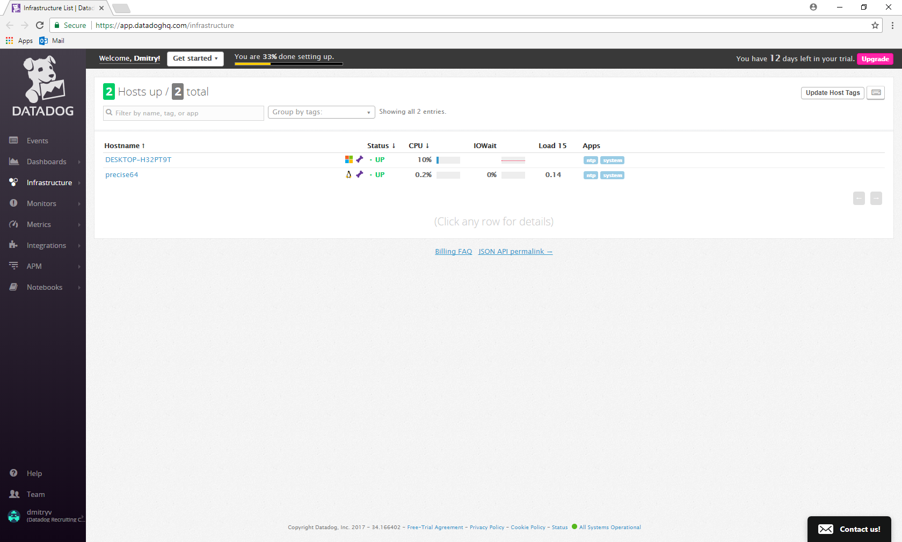

In the end, decided on using the Windows Agent for this exercise as I am more familiar with Windows OS.

* Bonus question: In your own words, what is the Agent?

In brief, the Datadog Agent is a piece of software that needs to be installed on the user's host machine to gather user determined metrics which will then be sent to Datadog for collection. These metrics can then be monitored by the user via the Datadog platform.

* Add tags in the Agent config file and show us a screenshot of your host and its tags on the Host Map page in Datadog.

Changed the hostname of my local machine to HOMEPC in the config file and added a name:homepc tag.

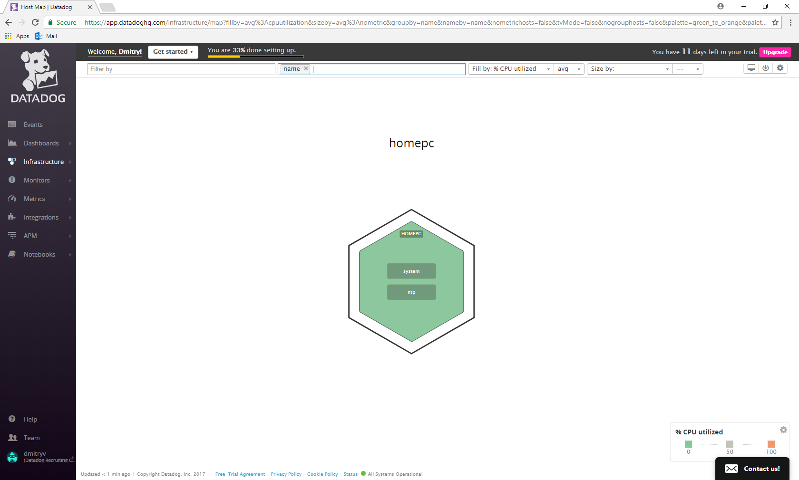

* Install a database on your machine (MongoDB, MySQL, or PostgreSQL) and then install the respective Datadog integration for that database.

Installed PostgreSQL using the installer available from https://www.enterprisedb.com/downloads/postgres-postgresql-downloads#windows

Followed the instructions on https://app.datadoghq.com/account/settings#integrations/postgres to install the Datadog PostgreSQL integration.

Restarted the Datadog Agent and it started collecting metrics on postgresql.

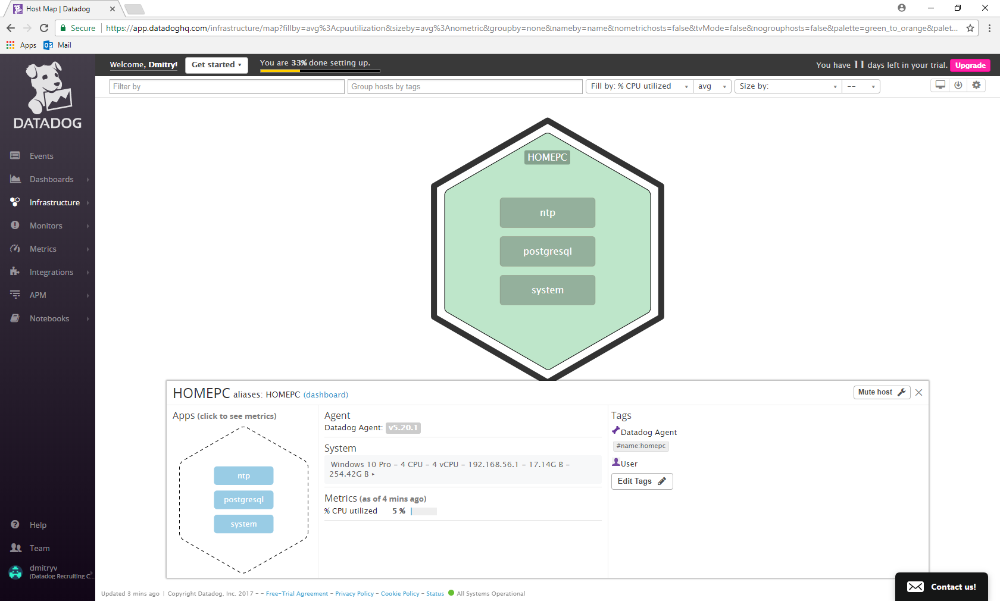

* Write a custom Agent check that samples a random value. Call this new metric: test.support.random

Wrote a custom Agent check that samples a random value. Used the instructions available on https://docs.datadoghq.com/guides/agent_checks/ to assist me in writing this custom Agent check. The custom check can be seen below:

```python
import random

from checks import AgentCheck
class RandomCheck(AgentCheck):
    def check(self, instance):
        self.gauge('test.support.random', random.random())
}
```

#### Level 2 - Visualizing your Data

* Since your database integration is reporting now, clone your database integration dashboard and add additional database metrics to it as well as your test.support.random metric from the custom Agent check.

Cloned the PostgreSQL integration dashboard. Added two additional PostgreSQL metrics along with the test.support.random metric from the custom Agent check.

Link to timeboard: https://app.datadoghq.com/dash/411191/postgres---overview-cloned?live=true&page=0&is_auto=false&from_ts=1512278418416&to_ts=1512282018416&tile_size=m

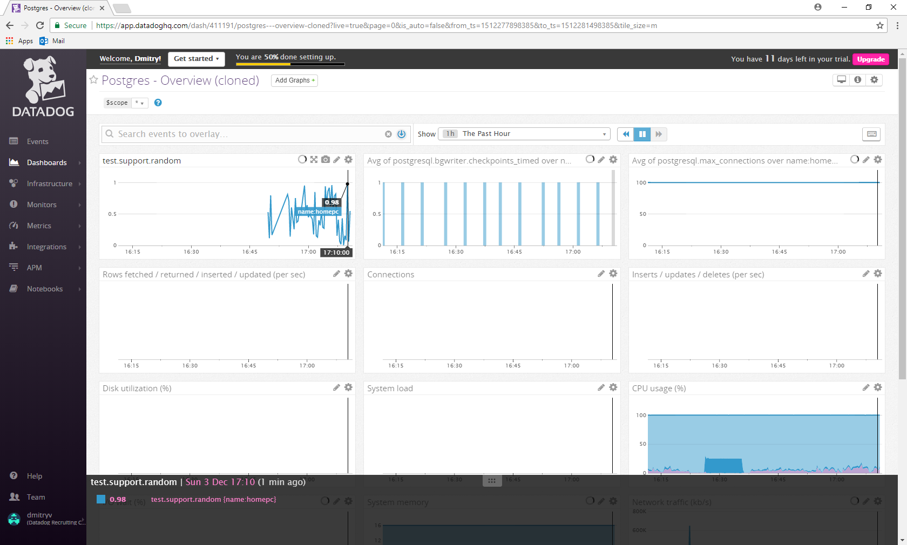

* Bonus question: What is the difference between a timeboard and a screenboard?

Timeboards and screenboards are two types of dashboards available at Datadog. The key differences between them can be summarised in that a timeboard is designed for troubleshooting and a screenboard is designed for visualisation and sharing. All graphs on a timeboard are scoped to the same time whereas the widgets on a screenboard can show different time frames. Further, a screenboard can be shared as a whole, whereas on a timeboard, only individual graphs can be shared.

A more detailed explanation on the differences between a timeboard and a screenboard can be found here: https://help.datadoghq.com/hc/en-us/articles/204580349-What-is-the-difference-between-a-ScreenBoard-and-a-TimeBoard-

* Take a snapshot of your test.support.random graph and draw a box around a section that shows it going above 0.90. Make sure this snapshot is sent to your email by using the @notification

Used the "Annotate this graph" option to highlight the test.support.random metric going above 0.90 and used the @dmitryv@live.com.au functionality to notify myself via email. Did not actually receive an email in relation to this event. I would hazard a guess that mentioning yourself does not trigger an email as opposed to being mentioned by someone else or by an event such as a monitor alert.

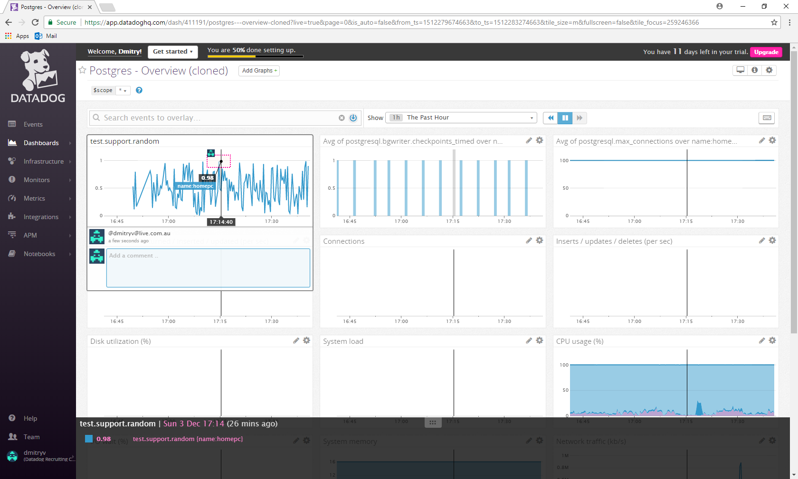

#### Level 3 - Alerting on your Data

Since you've already caught your test metric going above 0.90 once, you don't want to have to continually watch this dashboard to be alerted when it goes above 0.90 again. So let's make life easier by creating a monitor.

* Set up a monitor on this metric that alerts you when it goes above 0.90 at least once during the last 5 minutes

* Bonus points: Make it a multi-alert by host so that you won't have to recreate it if your infrastructure scales up.

* Give it a descriptive monitor name and message (it might be worth it to include the link to your previously created dashboard in the message). Make sure that the monitor will notify you via email.

Selected the "More actions" option in the top right hand corner of the test.support.random graph and then selected "Create Monitor". Created a RandomCheck Threshold Monitor. Made it a multi-alert configured to report on each monitored host. Screenshots of the Monitor configuration can be seen below:

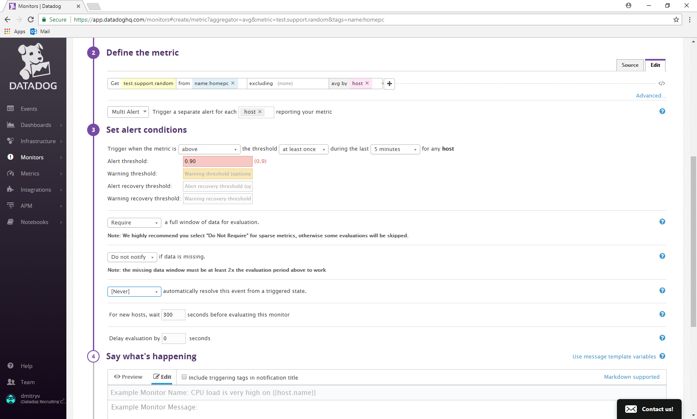

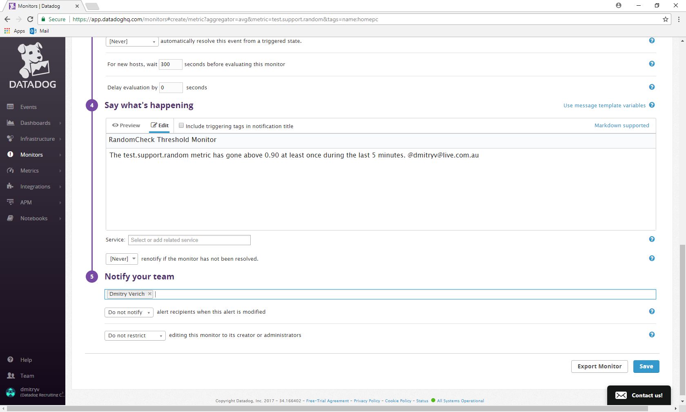

* This monitor should alert you within 15 minutes. So when it does, take a screenshot of the email that it sends you.

The screenshot of the email from Datadog Alerting is below:

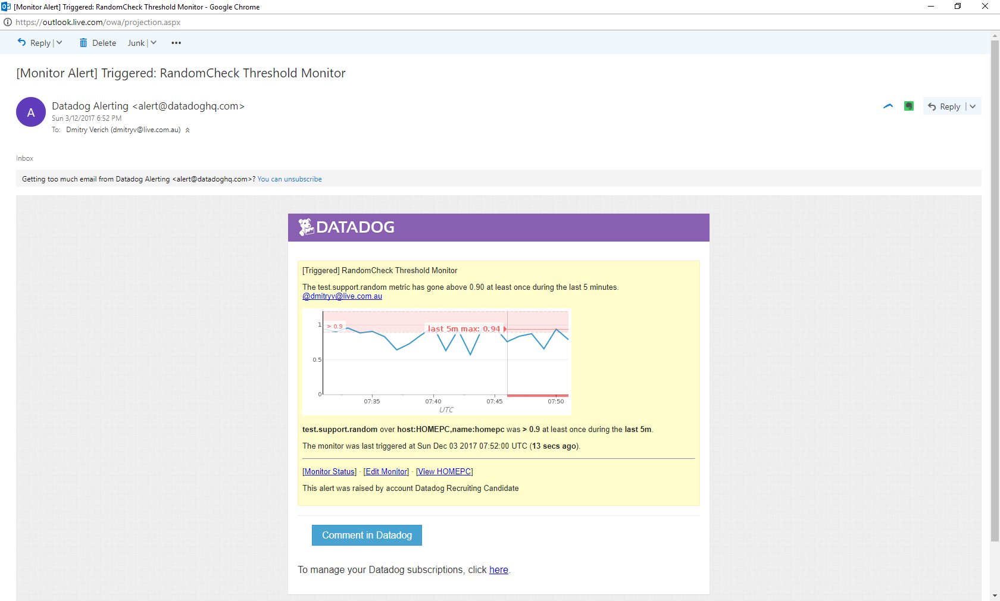

* Bonus: Since this monitor is going to alert pretty often, you don't want to be alerted when you are out of the office. Set up a scheduled downtime for this monitor that silences it from 7pm to 9am daily. Make sure that your email is notified when you schedule the downtime and take a screenshot of that notification.

Scheduled daily recurring downtime for the RandomCheck Threshold Monitor and configured it to notify me via email when it occurs. Screenshots of the downtime configuration and the email notification can be found below:

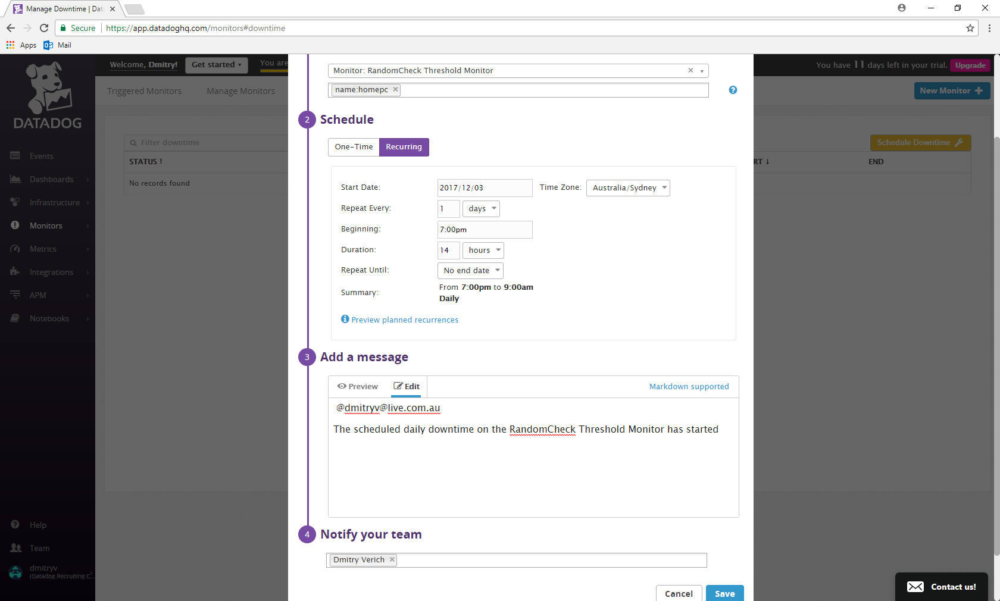

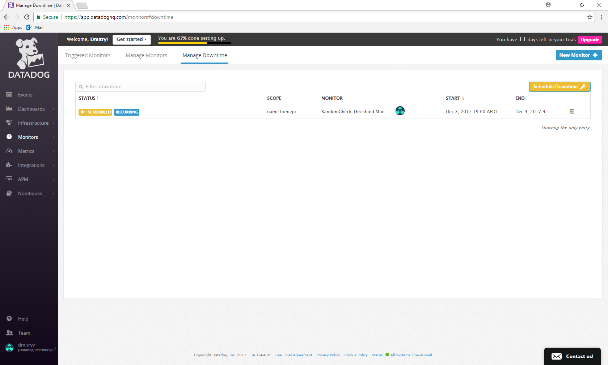

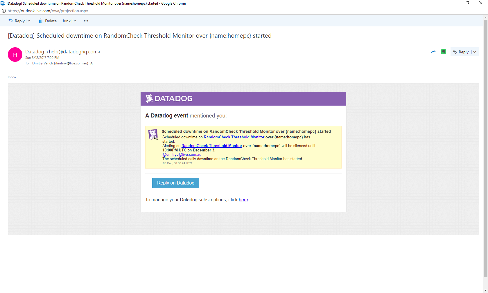
