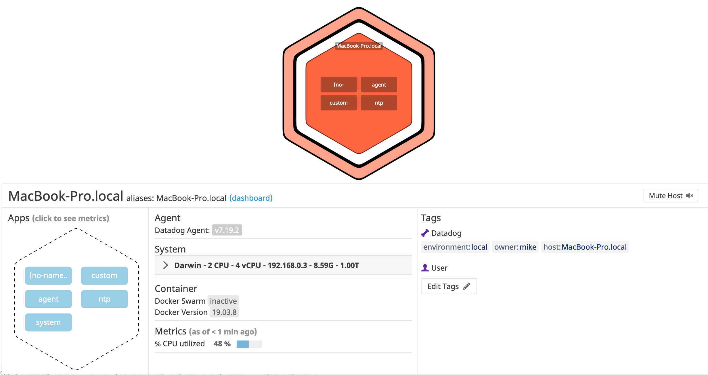
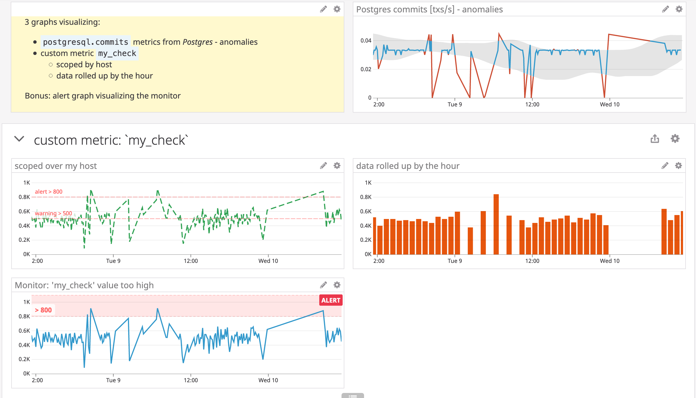

# Sales Engineer Candidate Tech Excercise - Mike Wendler

## Setup

I used the email address `dd.sales-engineer@mike-wendler.com` for the Datadog trial account.

Of all available options (host/containerized) I chose to install the agent natively on my Macbook which was the fastest way to get going (and worked like a charm).

## I. Collecting Metrics

A screenshot of my global tags (defined in the _datadog.yaml_ configuration file):

Here is a [copy of the current datadog.yaml file](metrics/datadog.yaml) - (with the API key removed 😉)

**Bonus Question**:
The collection interval is defined in the check's [_configuration file_](checks/custom_my_check.yaml), not the [Python check file](checks/custom_my_check.py). So, yes, it can be changed without affecting the Python check file.

## II. Visualizing Data

The [timeboard](https://datadoghq.eu/dashboard/5pb-jme-k7n)

was created using this [shell script](dashboard/create_dashboard.sh).
It depends on _curl_ and requires to be called with the [_api_ and _app_ keys](https://datadoghq.eu/account/settings#api) as parameters, e.g.

    `./create_dashboard.sh db47... 086a...`

The snapshot of my custom check graph:

**Bonus Question**:
The anomaly function in a timeseries widget shows the actual timeseries data plus a grey band visualizing expected behaviour based on past data.

## III. Monitoring Data

Created a [monitor](https://datadoghq.eu/monitors/169419) to notify me

* if the data is > 500 (_warning_) 

* if the data is > 800 (alert) 

* or if there is no data at all (_no data_) 

**Bonus Question**:

* a [scheduled downtime](https://datadoghq.eu/monitors#downtime?id=11631312) for weekday nights
* a [scheduled downtime](https://datadoghq.eu/monitors#downtime?id=12062938) for weekends
* notification of a scheduled downtime: 

## IV. Collecting APM Data

The [custom apm demo app](apm/custom_flask_app.py) instrumented for APM.

A [demo APM timeboard](https://datadoghq.eu/dashboard/xcj-cwf-2b7)

**Bonus Question**:
* _Service_: A computing building block of a comprising application that provides a coherent functionality to clients. Typically groups endpoints, queries to data providers (e.g. a database), or jobs etc. A service often serves _resources_. (Services in Datadog APM are visualized in the [services list view](https://datadoghq.eu/apm/services) or the [services map](https://datadoghq.eu/apm/services)).

* _Resource_: A (part of a) domain of an application. Typically something like an instrumented web endpoint, database query, or job result. A resource is often served by a _service_.

(These definitions are somewhat specific to (Datadog) APM. In other contexts (e.g. _domain driven design_ or _REST_) these terms might be defined slightly differently)

**Final Question**:

* I could picture
    * a custom check for my ssh and/or docker agent and a monitor to alert me if they aren't up any longer
    * using the new banking APIs to feed my account balance into a dashboard and a monitor if the balance falls below a threshold
    * accessing the 'who is on-call' data from OpsGenie and visualize this on a widget (I can not think of a way how to achieve this currently though)

**Final Remarks**:

* when creating a schedule downtime the year was set to 2021 by default ... noticed this only after a while and found this awkward
* I like to have alert graphs on dashboards. Why is there no link to the underlying monitor details page?
* the JSON format occasionally is a bit inconsistent. I usually create a widget manually and then export the result. Pasting the exported widget definition into my [dashboard.json file](dashboard/dashboard.json) led to errors in some cases and needed to be tweaked.

And yes: this _was_ fun!

 I may even have more fun still and try out a few things differently after submitting:
* use the docker agent
* integrate neo4j (which is in this extras package)
* provide the dashboard by means of Terraform
* add logging to the check and app
* send metrics from a Kotlin app
* ...

---

2020-06-10
