# Setting up account

```
tom@tinux ~/go/src/github.com/tutley/ddapp $ docker run -d --name dd-agent -v /var/run/docker.sock:/var/run/docker.sock:ro -v /proc/:/host/proc/:ro -v /sys/fs/cgroup/:/host/sys/fs/cgroup:ro -e DD_API_KEY=4b95c86418ff04b87fd79f2831944a46 datadog/agent:latest
Unable to find image 'datadog/agent:latest' locally
latest: Pulling from datadog/agent
10586f17040d: Pull complete
1bbf3c141571: Pull complete
2a307fe4b0d1: Pull complete
48ecd332de65: Pull complete
d0ca466cea29: Pull complete
7207c124080d: Pull complete
6115fa1f68a8: Pull complete
a826bd62347f: Pull complete
Digest: sha256:13c2f8ef32444dad83890a2183640785b514f0285d47c888d886da44bfce3ce7
Status: Downloaded newer image for datadog/agent:latest
27bdcf0e1696c37cd9e1c8109adf2f7c8a0ada118e9722470c6cdd9d4ea07a67
tom@tinux ~/go/src/github.com/tutley/ddapp $ docker ps
CONTAINER ID IMAGE COMMAND CREATED STATUS PORTS NAMES
27bdcf0e1696 datadog/agent:latest "/init" 35 seconds ago Up 33 seconds (health: starting) 8125/udp, 8126/tcp dd-agent
```

# Collecting Metrics

At this point I decided to go with a docker-compose file (included). It sets up the Datadog agent as well as a Mongo database. The config files are included in the datadog directory. I experimented with this quite a bit so I thought I would skip screenshotting all of that. Try the docker-compose file for yourself!

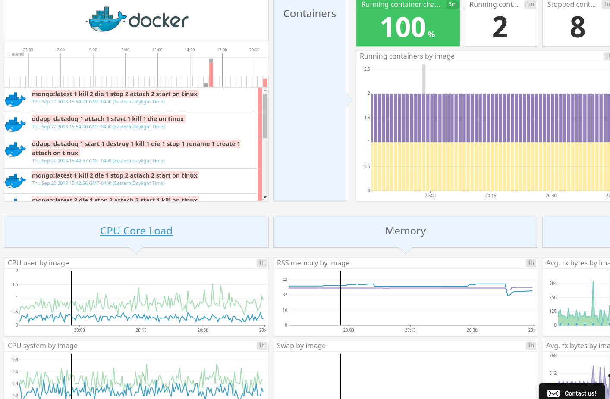

### Tags

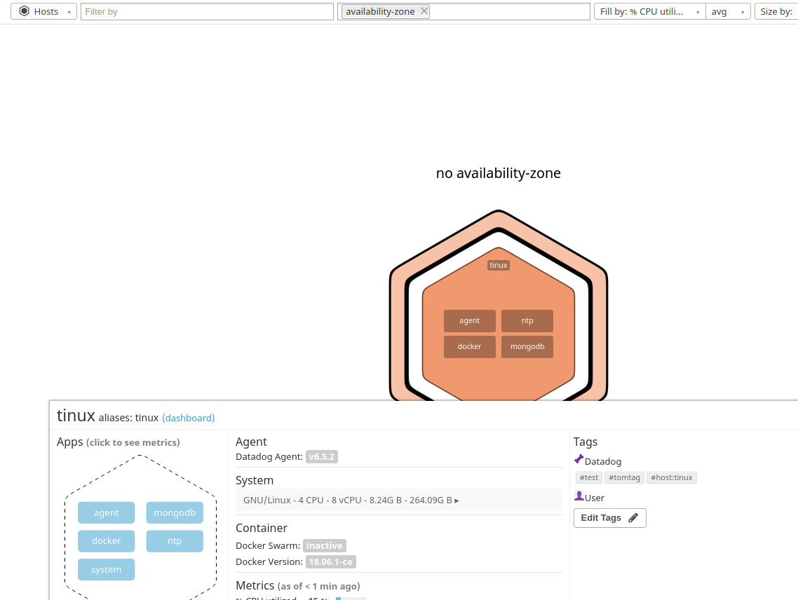

### Mongo

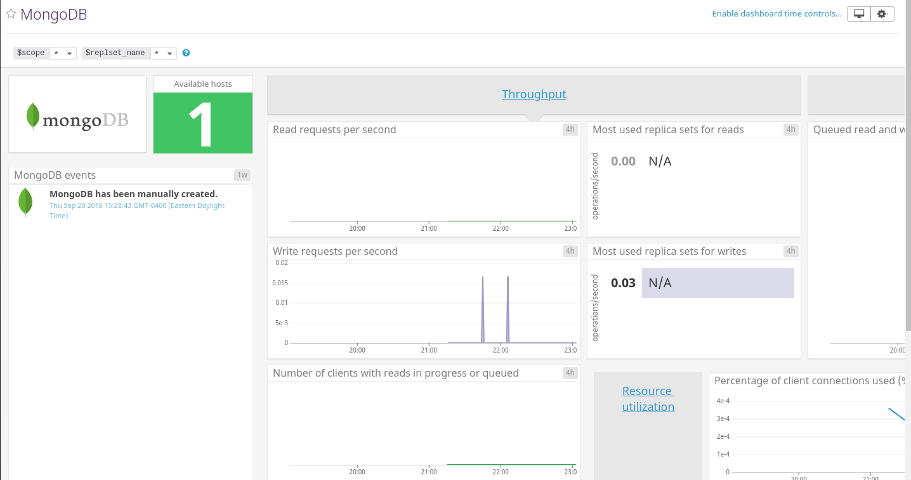

### Custom Agent

See datadog/mymetric.py

### Bonus Question

Yes, you can change the interval by using the min_collection_interval setting in the yaml file.

# Visualizing Data

The script I used is in maketb.sh. I just used curl.

[Custom Timeboard](https://app.datadoghq.com/dash/922497/test-visualizations?live=true&page=0&is_auto=false&from_ts=1537494987724&to_ts=1537498587724&tile_size=m)

### Timeboard at 5 minute timeframe

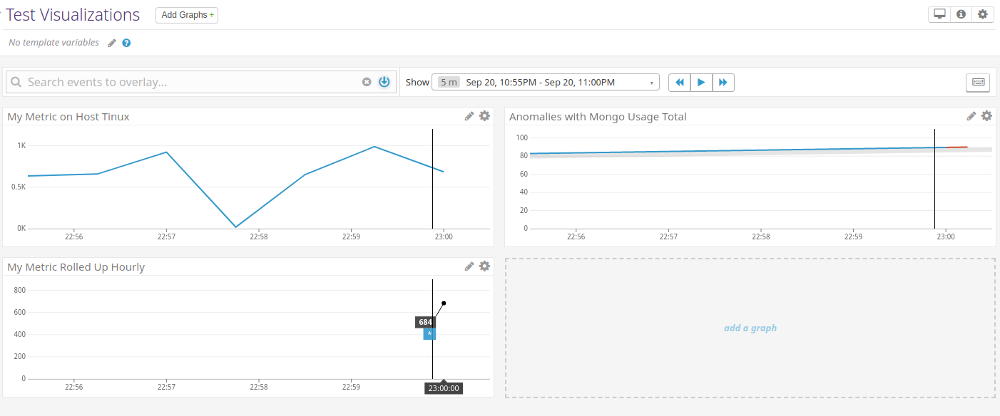

### Snapshot

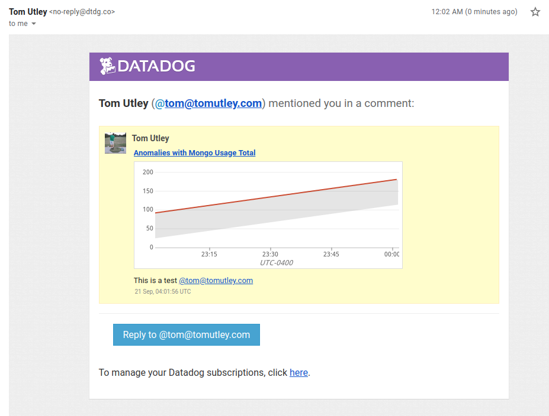

### Bonus Question

The Anomaly graph is displaying the metric mongodb.usage.total.count along with indications of when this value is outside of a "normal" range, as indicated by a grey channel on the graph and a red line when the value is outside of this channel. In this case, the channel is 2 standard deviations from the average.

# Monitoring Data

### Setting up the Monitor

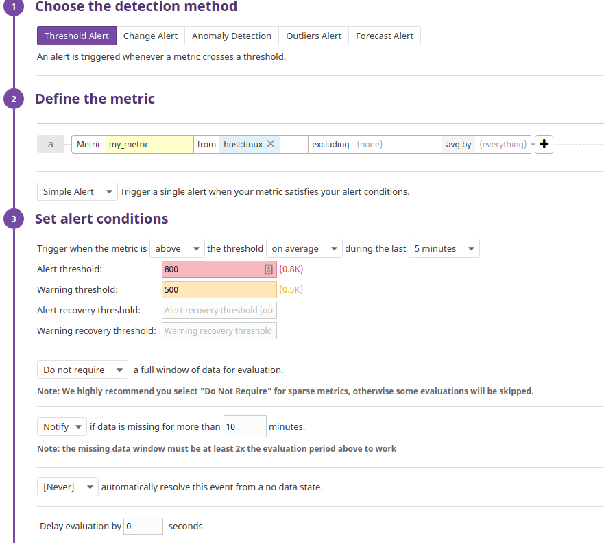

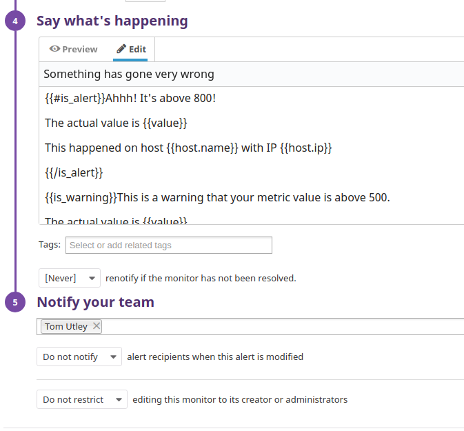

### Email Notification

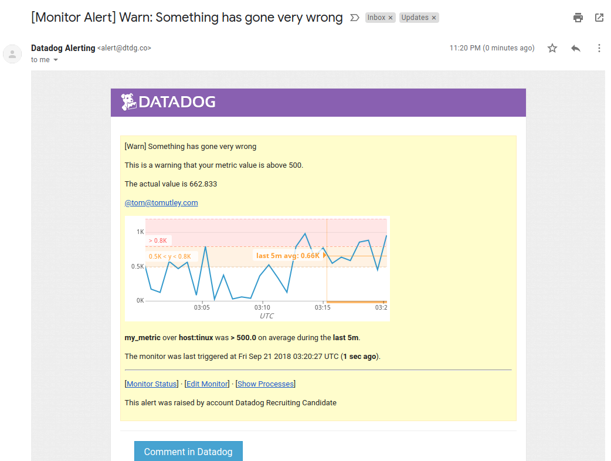

### Bonus Question

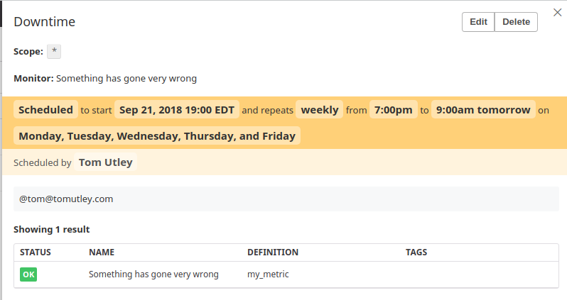

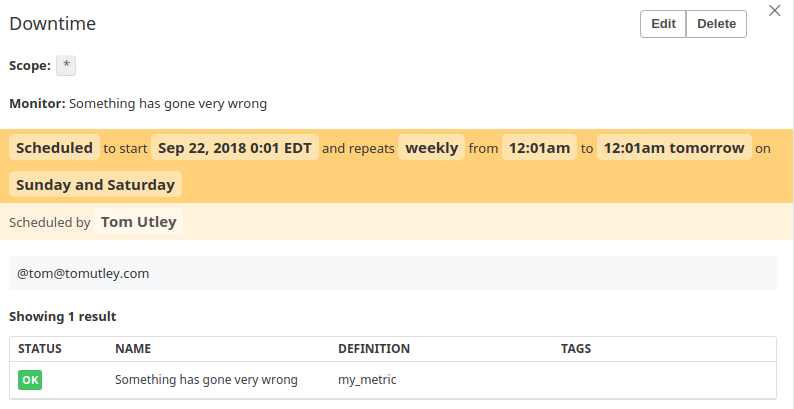

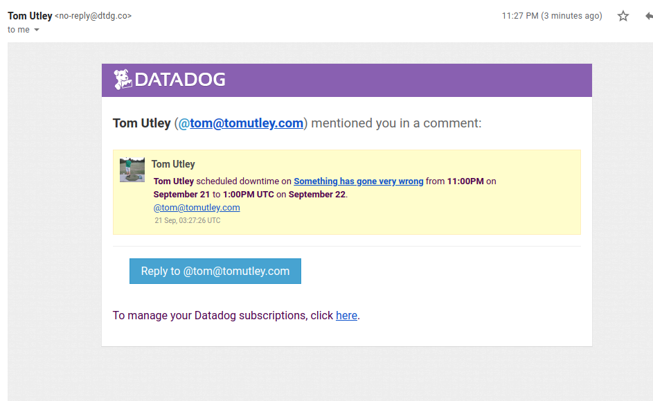

# Collecting APM Data

See main.go for the application used.

[Custom APM Dashboard](https://app.datadoghq.com/dash/922512/custom-apm?live=true&page=0&is_auto=false&from_ts=1537498642676&to_ts=1537502242676&tile_size=m)


### Bonus Question

A service is a piece of software that offers an interface to perform some set of functionality whereas a resource is an individual piece of functionality of a service. In terms of web apis, a service is the software that responds to API requests, and a resource is an individual API endpoint that is offered by the service. For example, if you create a web app the api service might be running on api.example.com, but the login resource is going to be available for post requests on api.example.com/login. Note: microservices break the monolith service into multiple smaller services grouped around logical areas of functionality, but they still contain one or more resources.

# Final Question

I can think of a lot of creative uses for Datadog as the general idea of identifying trends or patterns in data can apply to pretty much anything in life, but to stick to just one: I think it would be interesting to use Datadog in conjunction with one or more cryptocurrency exchanges to identify profitable arbitrage opportunities in the "wild wild west" of all the various alt-coins. In other words, over the last few years thousands of alternative cryptocurrencies (alternative to the market leader: Bitcoin) have popped up and their value fluctuates wildly. It fluctuates in terms of US dollars and it also fluctuates in terms of Bitcoins, and those fluctuations don't always sync up. So sometimes a particular alt-coin might be worth more in terms of Bitcoin then that same amount of Bitcoin might be worth in US dollars.

Long story short, it would be cool to feed all the data about those alt-coins into Datadog, run some anomaly detection functions, and spot the coins to buy and sell.
