Your answers to the questions go here.

## Prerequisites - Setup the environment

- [x] Sign up for Datadog (use “Datadog Recruiting Candidate” in the “Company” field).
- Successfully signed up for Datadog on https://app.datadoghq.com/signup
- [x] Get the Agent reporting metrics from your local machine.
- In order to get the Datadog Agent reporting metrics from my local machine, I first install the Agent directly in my local machine (macOS) without VB or containers. 

- **Datadog Agent installation.**
- After selecting macOS as the platform for installation (R1), I follow the installation instructions (R2). On my terminal, I run the following command which includes my Datadog API key.

`$ DD_API_KEY=xxxxxxxxxxxxxxxxxxxxxxxxxx bash -c "$(curl -L https://raw.githubusercontent.com/DataDog/datadog-agent/master/cmd/agent/install_mac_os.sh)"`

- The installation runs automatically, and prompts the following success message:

*Your Agent is running properly. It will continue to run in the background and submit metrics to Datadog. You can check the agent status using the ##datadog-agent status## command or by opening the webui using the ##datadog-agent launch-gui## command. If you ever want to stop the Agent, please use the Datadog Agent App or the launchctl command. It will start automatically at login.*

- **Datadog agent status.** 
- I check the Datadog agent status running the following command in terminal.\
`$ datadog-agent status`\
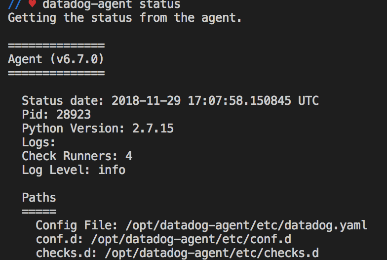

- **Datadog agent GUI.** 
- In order to access the agent's GUI, I run the following command in the terminal.\
`$ datadog-agent launch-gui`
- The GUI successfully opens on http://127.0.0.1:5002/
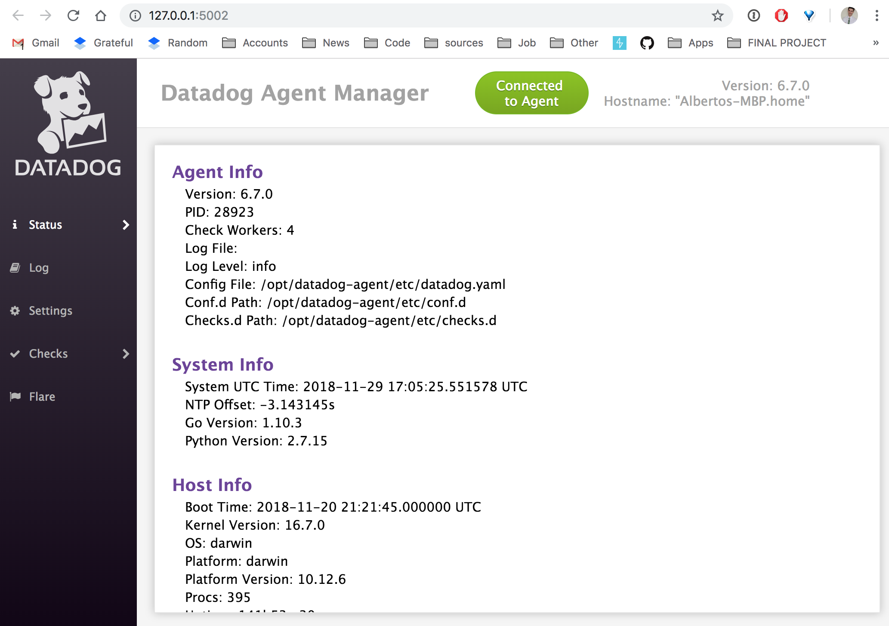

***RESOURCES***
- R1 Datadog agent documentation: https://docs.datadoghq.com/agent/basic_agent_usage/osx/
- R2 Datadog Agent Installing on macOS documentation: 
https://app.datadoghq.com/account/settings#agent/mac

***

## Collecting Metrics
- [x] Add tags in the Agent config file and show us a screenshot of your host and its tags on the Host Map page in Datadog.

- As detailed in documentation (R3), the configuration files and folders for the Agent are located in *~/.datadog-agent/datadog.yaml*.
In order to access the Agent configuration files, I run\
`$ vim ~/.datadog-agent/datadog.yaml` or 
`$ sublime ~/.datadog-agent/datadog.yaml`

- Once inside the file, I add tags following the documentation. First, I uncomment the tags-section code and add *key:value* tags following the documentation guidelines (R4, R5) modifying the code as follows:\
`tags: region:USEast, role:localmachine`\
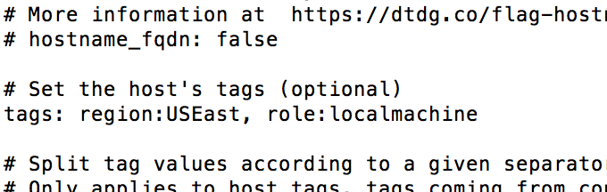

- After saving the changes in the file, the changes are also visible (and editable) from the Agent GUI.\

- Then, I restart the agent following the Agent commands documentation (R6). In the terminal, I run the following stop/start commands.\
`$ launchctl stop com.datadoghq.agent`\
`$ launchctl start com.datadoghq.agent`

- After restarting the agent, I check the tags are showing on the host map page.\
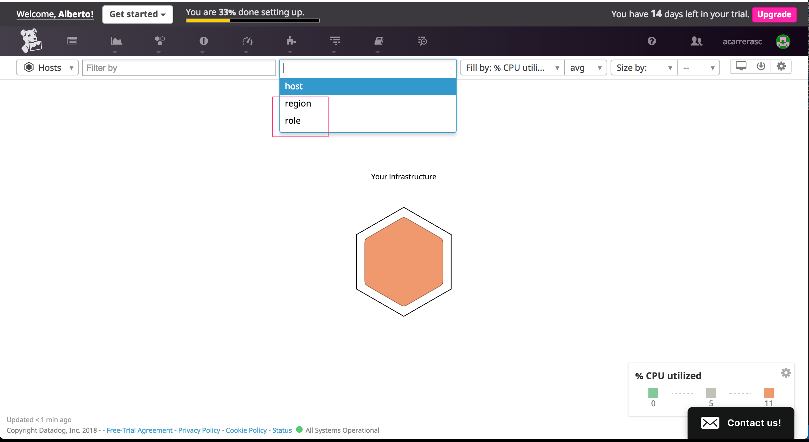
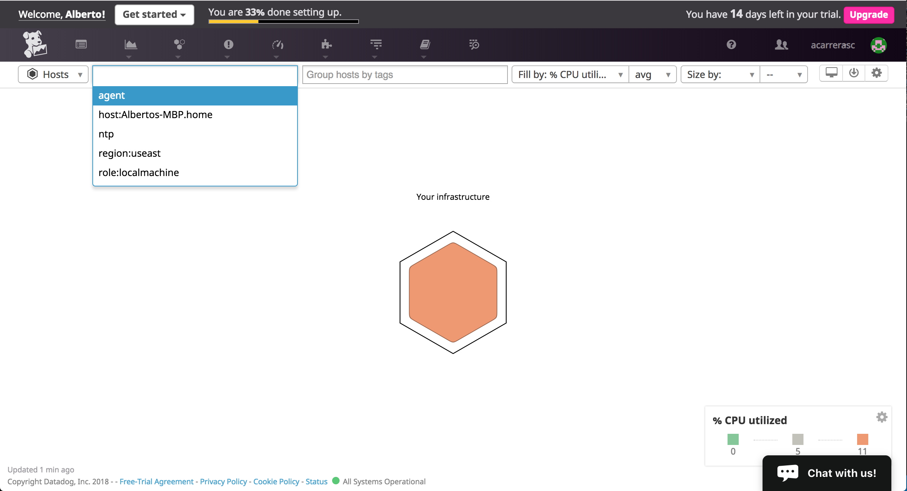

- [x] Install a database on your machine (MongoDB, MySQL, or PostgreSQL) and then install the respective Datadog integration for that database.

- **PostgreSQL installation and monitoring**
- I check that PostgreSQL is already installed running the following commands in terminal\
`$ psql --version` \ 
which prompts *psql (PostgreSQL) 10.5*

- I select the PostgreSQL integration in the documentation (R7) and follow the guidelines.
- I run PostgreSQL `$ psql` and then follow the documentation for installing the integration for the database (R8, R9).
- I first prepare PostgreSQL by running the following command in the terminal by granting the Agent with permission to monitor PostgreSQL\
`$ create user datadog with password 'albertodatadog';`\
`$ grant pg_monitor to datadog;`

- To verify the correct permissions, I run the following command:\
`$ psql -h localhost -U datadog postgres -c \ "select * from pg_stat_database LIMIT(1);" && echo -e "\e[0;32mPostgres connection - OK\e[0m" || \ || echo -e "\e[0;31mCannot connect to Postgres\e[0m"`\
which prompts *Postgres connection - OK* in the message.
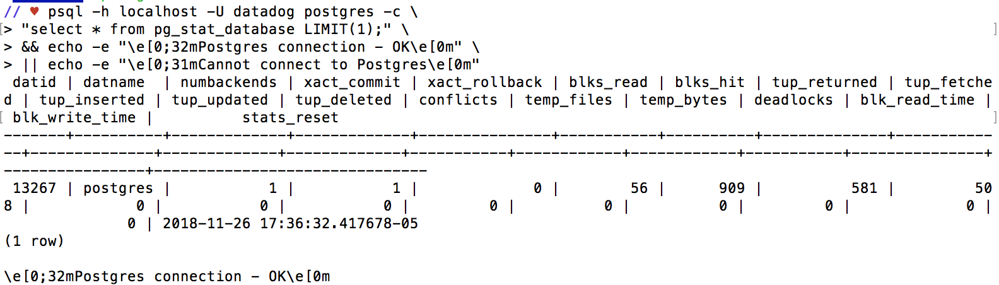

- **Setting metrics collection**
- To configure the Agent to collect PostgreSQL metrics, I first find the configuration files for the database (R10).
- For macOs, I access the PostgreSQL configuration folder in the terminal:\
`$ cd ~/.datadog-agent/conf.d/postgres.d/`
- In order to activate it, I change the file name from *conf.yaml.example* to *conf.yaml*
- Then, I open it \
`$ vim conf.yaml` \
and add tags to the file
*tags: database:postgresql*
- I restart the Agent as described before. 
- Then, I check the agent status in the terminal `$ datadog-agent status`. Now, under *Running checks*, there is also PostgreSQL.
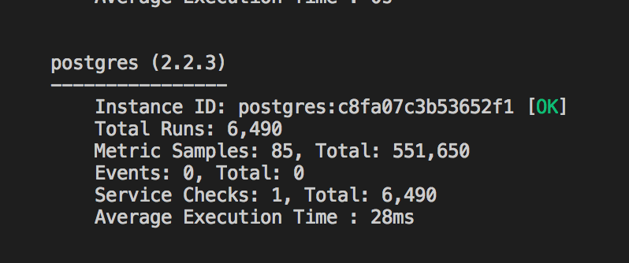
Postgres also shows on host map page.
- The Metric is now accessible in the UI (*Metrics >> Explorer* selecting `postgresql.connection` (or any other metric starting with *postgresql*) in the field *Graph*). https://app.datadoghq.com/metric/explorer
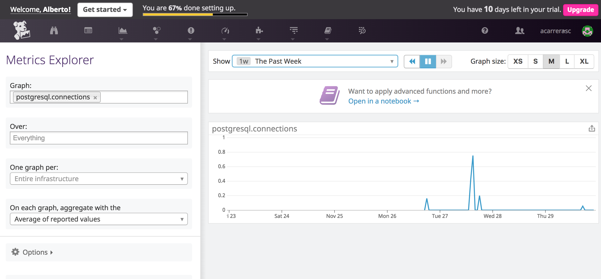

- [x] Create a custom Agent check that submits a metric named my_metric with a random value between 0 and 1000.

- In order to create a custom agent check, I follow the documentation (R11) and create 2 files *my_metric.py* and *my_metric.yaml* inside the following folders */etc/dd-agent/checks.d* and */etc/dd-agent/conf.d* respectively\
I run the following commands:\
`$ cd ~/.datadog-agent/checks.d/`\
`$ touch my_metric.py`\
`$ cd ~/.datadog-agent/conf.d/`\
`$ touch my_metric.yaml`\

- I check that Python is already installed running the following commands in terminal\
`$ python --version`\ 
which prompts *Python 2.7.10*

- I edit the agent check file as follows:\
`$ sublime my_metric.py`\ 
Code *my_metric.py* file:\
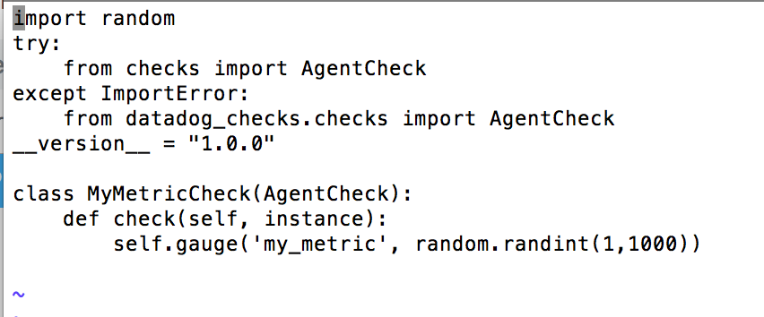

- [x] Change your check's collection interval so that it only submits the metric once every 45 seconds.
- I edit the agent check file as follows:
`$ vim my_metric.yaml`\ 
Code *my_metric.yaml* file:\
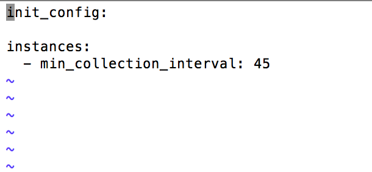

- The Metric is now accessible in the UI (*Metrics >> Explorer* selecting `my_metric` in the field *Graph*). https://app.datadoghq.com/metric/explorer
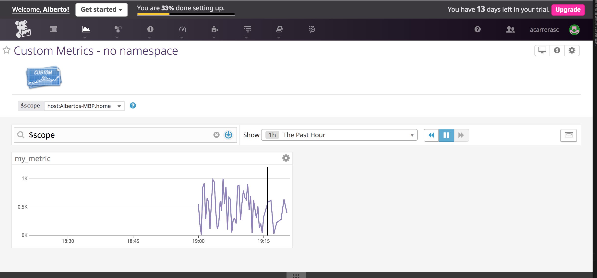
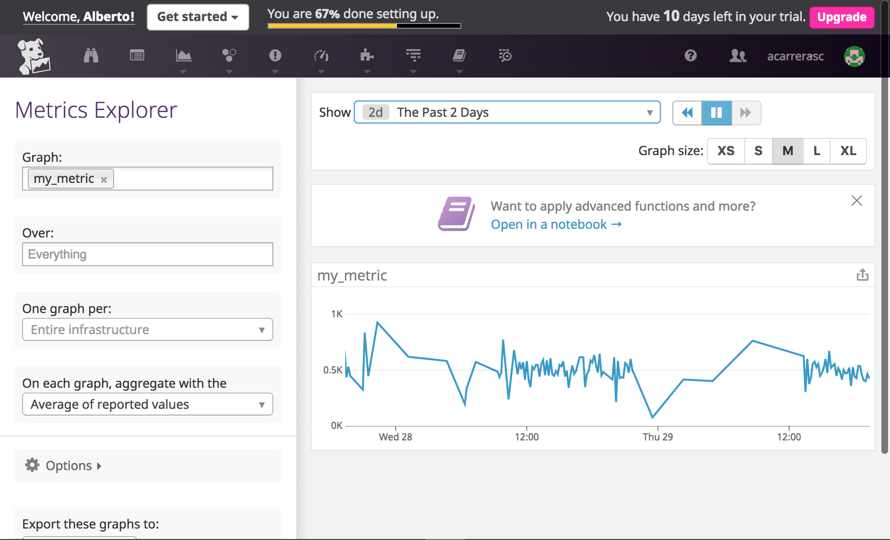

***RESOURCES***
- R3 Datadog Agent Usage on macOS documentation: https://docs.datadoghq.com/agent/basic_agent_usage/osx/?tab=agentv6
- R4 Tags documentation: https://docs.datadoghq.com/tagging/
- R5 Assigning tags documentation: https://docs.datadoghq.com/tagging/assigning_tags/?tab=go#configuration-files
- R6 Agent command documentation: https://docs.datadoghq.com/agent/faq/agent-commands/?tab=agentv6
- R7 Integrations documentation: https://docs.datadoghq.com/integrations/
- R8 PostgreSQL integration documentation: 
https://docs.datadoghq.com/integrations/postgres/
- R9 How to collect and monitor PostgreSQL data with Datadoghttps://www.datadoghq.com/blog/collect-postgresql-data-with-datadog/
- R10 Agent configuration directories.
https://docs.datadoghq.com/agent/faq/agent-configuration-files/?tab=agentv6#agent-configuration-directory
- R11 Custom Agent check documentation: https://docs.datadoghq.com/developers/write_agent_check/?tab=agentv6

### Bonus Question
Can you change the collection interval without modifying the Python check file you created?

***

## Visualizing Data

- [x] Utilize the Datadog API to create a Timeboard that contains:
1. Your custom metric scoped over your host.
2. Any metric from the Integration on your Database with the anomaly function applied.
3. Your custom metric with the rollup function applied to sum up all the points for the past hour into one bucket
NOTE: Please be sure, when submitting your hiring challenge, to include the script that you've used to create this Timeboard.

- In order to create a timeboard through the Datadog API, I create a Ruby app (folder *hiring-engineers/ruby-datadog-api-script*) and add the Datadog gem to its Gemfile (gem "dogapi").
- After running `$ bundle install` to install the dependencies, I write the script for creating a Timeboard with 3 graphs following the documentation guidelines in Ruby (R12).
- The script requires an API and an App Key which can be found in https://app.datadoghq.com/account/settings#api. The API key exists but I create the required application key. I add the keys to the script (file  *hiring-engineers/ruby-datadog-api-script/bin/run.rb*). The script only contains 3 variables: title, description, and graphs. 
- I use documentation (R12, R13) to define the variable graphs and each of the 3 different graphs in it. Each graphs is defined with its own query.
- The rollup metric is represented using bars while the other two metrics are represented using line graphs (R15).
- After executing the script running `$ ruby run.rb` in the terminal, the terminal prompts Datadog's API response. 
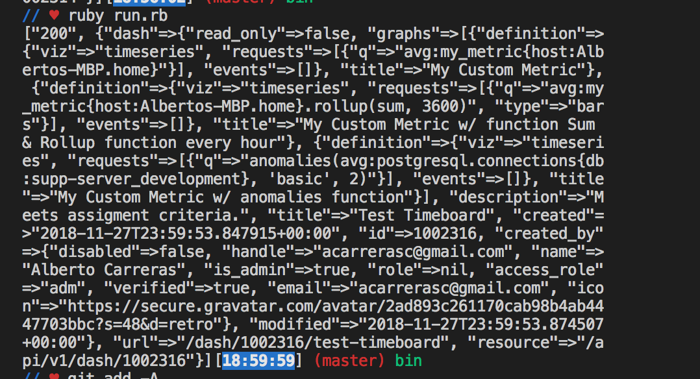
- The timeboard is now available in the UI (Dashboard >> Dashboard list) https://app.datadoghq.com/dashboard. 
- To access it, select the given timeboard name (title = *Test timeboard*).
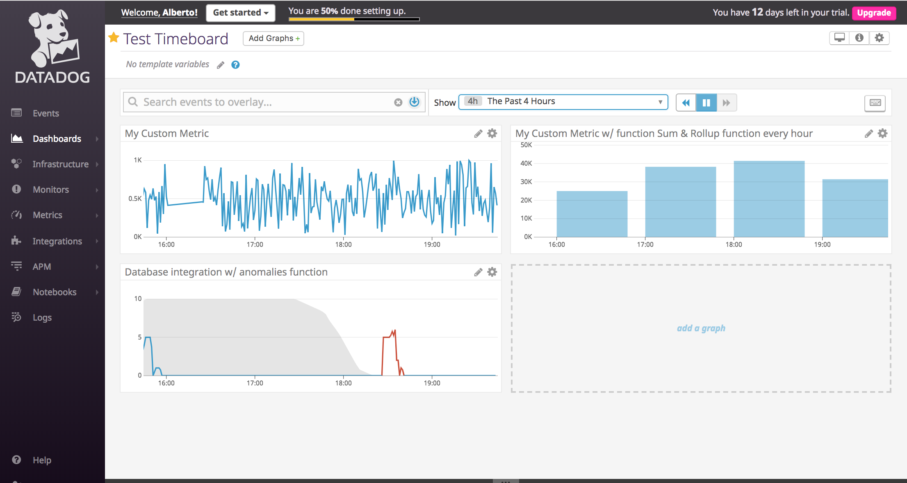

- [x] Once this is created, access the Dashboard from your Dashboard List in the UI:
1. Set the Timeboard's timeframe to the past 5 minutes.
2. Take a snapshot of this graph and use the @ notation to send it to yourself.

- From the Timeboard UI, I follow the next steps to email a 5-minute timeframe of any of my custom metrics:\
- First, I select the timeframe with the cursor on the same graph so the graph zooms in to the selected time area.
- Then, I click on the snapshot icon. A new communication window opens. I enter @ and select my email address followed by a message.
- The notification gets to my email.
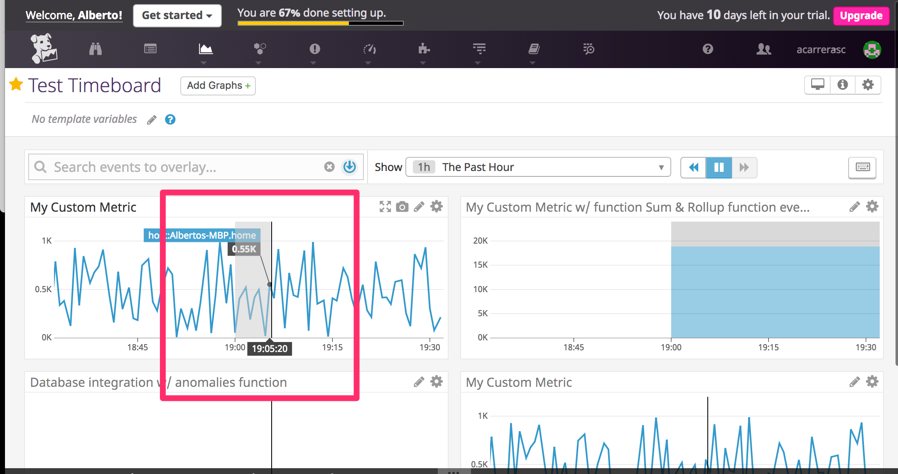
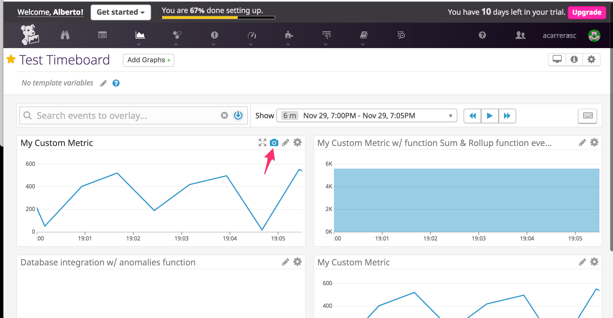
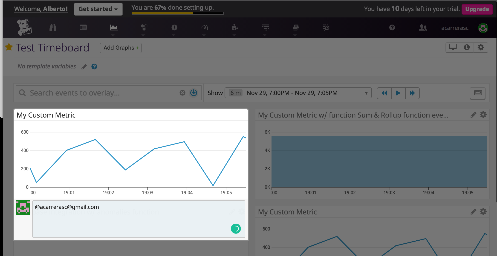
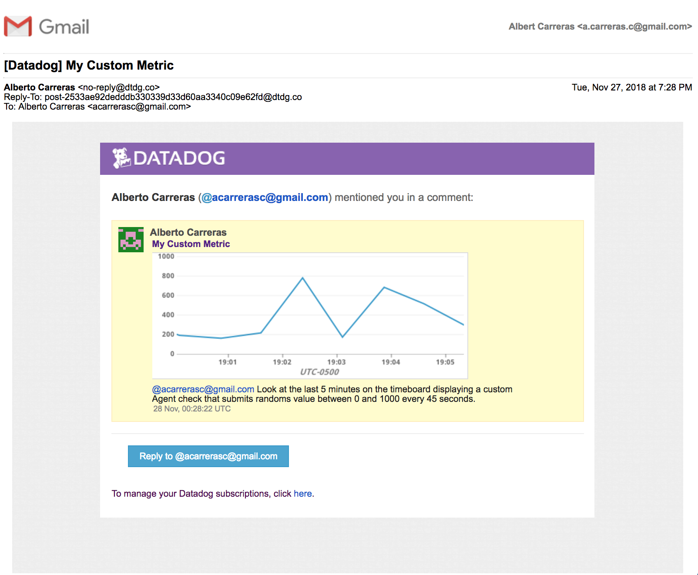

### Bonus Question
What is the Anomaly graph displaying?
(R16) The graph with the function anomaly applied is used for detecting values that are observed outside of the expected values. Once these non-expected values are detected by the algorithm, they are highlighted for our close attention.
In our timeboard, I apply the anomaly function to the postgreSQL database on the connections metric. As observed in the anomalies graph, each connection is highlighted in red because the pattern is no connections at all.
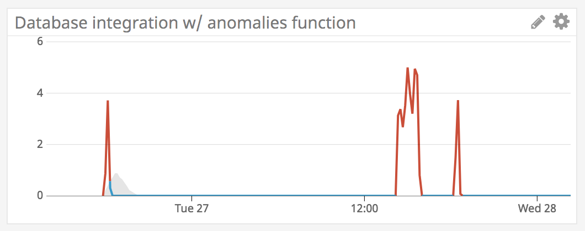

***RESOURCES***
- R12 Datadog API documentation in Ruby >> Timeboards https://docs.datadoghq.com/api/?lang=ruby#timeboards
- R14 Graphing documentation https://docs.datadoghq.com/graphing/
- R15 Timeseries graphs https://www.datadoghq.com/blog/timeseries-metric-graphs-101/
- R16 Anomaly monitor
 https://docs.datadoghq.com/monitors/monitor_types/anomaly/
***

## Monitoring Data
- [x] Create a new Metric Monitor that watches the average of your custom metric (my_metric) and will alert if it’s above the following values over the past 5 minutes:
1. Warning threshold of 500
2. Alerting threshold of 800
3. And also ensure that it will notify you if there is No Data for this query over the past 10m.

- Clicking on the Gear icon on the top right corner of *my_metric* graph, I can select *Create Monitor*.
- I define the monitor following the guidelines (R16) on each process step as follows:
1. Detection method: Threshold Alert
2. Metric: avg: my_metric{host:Albertos-MBP.home}
3. Alert conditions: I enter the values required (800/500) for each threshold and select Notify for the option *if data is missing for more than*.
4. Notification template: I write the following notication template following the documentation guidelines (R17):
@acarrerasc@gmail.com 
*Host {{host.ip}}.*
*{{#is_alert}} Your metric is too high! The monitored average value for the last 5 minutes: {{value}} (Above {{threshold}}) {{value}}	{{/is_alert}}*
*{{#is_warning}} Your metric is high! The monitored average value for last 5 minutes was:  {{value}} (Above {{warn_threshold}}) {{/is_warning}}*
*{{#is_no_data}} There was No Data for Your metric over the past 10m. {{/is_no_data}}*
5. I select my user from the user list.

- [x] Please configure the monitor’s message so that it will:

1. Send you an email whenever the monitor triggers.
2. Create different messages based on whether the monitor is in an Alert, Warning, or No Data state.
3. Include the metric value that caused the monitor to trigger and host ip when the Monitor triggers an Alert state.
4. When this monitor sends you an email notification, take a screenshot of the email that it sends you.

### Bonus Question
Since this monitor is going to alert pretty often, you don’t want to be alerted when you are out of the office. Set up two scheduled downtimes for this monitor: One that silences it from 7pm to 9am daily on M-F,And one that silences it all day on Sat-Sun. Make sure that your email is notified when you schedule the downtime and take a screenshot of that notification.
- On the *Edit* page for the monitor, I click on the upper tab *Manage Downtime* and schedule 2 different downtimes following documentation (R18).
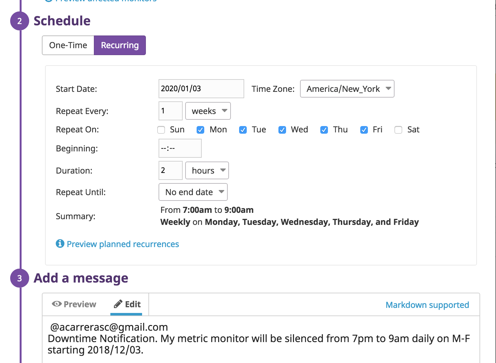
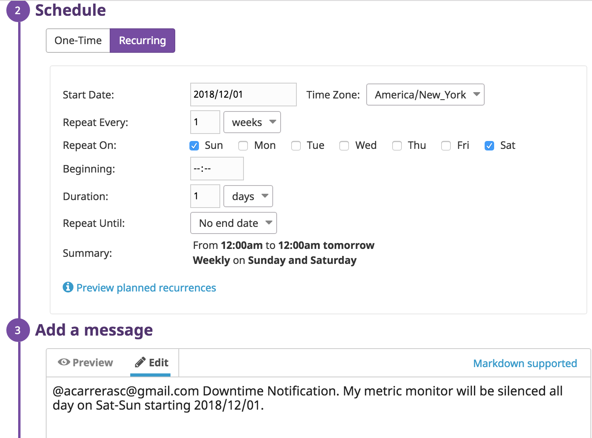

- I receive notifications for both scheduled downtimes.
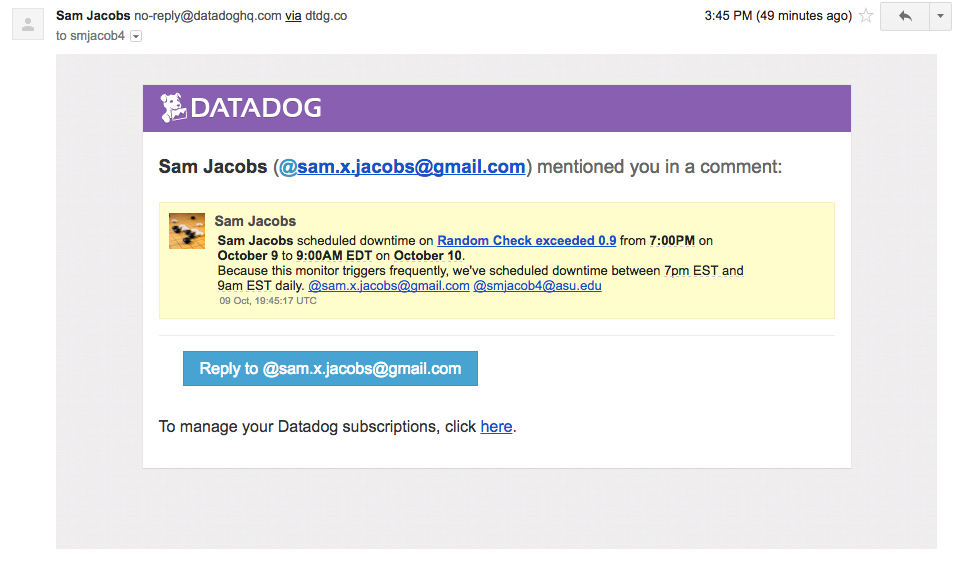

***RESOURCES***
- R16 Metric monitor documentation https://docs.datadoghq.com/monitors/monitor_types/metric/
- R17 Notifications documentation https://docs.datadoghq.com/monitors/notifications/?tab=is_alertis_warning#variables
- R18 Downtime documentation https://docs.datadoghq.com/monitors/downtimes/

***

## Collecting APM Data
- [x] Given the following Flask app (or any Python/Ruby/Go app of your choice) instrument this using Datadog’s APM solution. 

1. Provide a link and a screenshot of a Dashboard with both APM and Infrastructure Metrics.
2. Please include your fully instrumented app in your submission, as well.

- **Trace Agent installation and configuration**
- First, I install the Datadog's macOS Trace Agent following the documentation for macOS (R18, R19).
- I run into some issues with the latest OSX Trace Agent release, so I follow the Development alternative (R19). 
- I download and install Go.
- I install macOS Trace Agent running the following code in the terminal.\
`$ go get -u github.com/DataDog/datadog-trace-agent/...`
- Then within the newly created folder *src/github.com/DataDog/datadog-trace-agent*, I run\
`$ make install`
- Then within the folder *bin*, I run\
`$./trace-agent -config /opt/datadog-agent/etc/datadog.yaml`
- I configure the *datadog.yaml* main configuration file enabling trace collection according to guidelines (R18): 
- I access the file and uncomment lines 628 & 630 (`apm_config:
  enabled: true`)\
`$ sublime ~/.datadog-agent/datadog.yaml`

- **Application instrumentation**
- In order to instrument an application, I first create a Rails app without database or test framework (folder *hiring-engineers/instrumented-app*) and I instrument the Rails application based on documentation (, R21)\
`$ rails new instrumented-app -T --skip-active-record`
- In Gemfile, I add `gem 'ddtrace'` and run `$ bundle install` to install the dependencies.
- I create a new file within the *config/initializers* folder \
`$ cd config/initializers/`\
`$ touch datadog-tracer.rb`
- I add the basic configuration code to the new configuration file.\
`$ sublime datadog-tracer.rb` \
Code *datadog-tracer.rb* file:\
`Datadog.configure do |c|`\
    `c.use :rails, service_name: 'my-rails-app'`\
`end`
- I write routes and controllers to reproduce the Flask app given (folder *hiring-engineers/instrumented-app*). I start the app server running in the terminal `$ rails server`
- I restart the agent and the application metrics are now accessible in the UI (*APM >> Services* selecting `my-rails-app`). https://app.datadoghq.com/apm/services
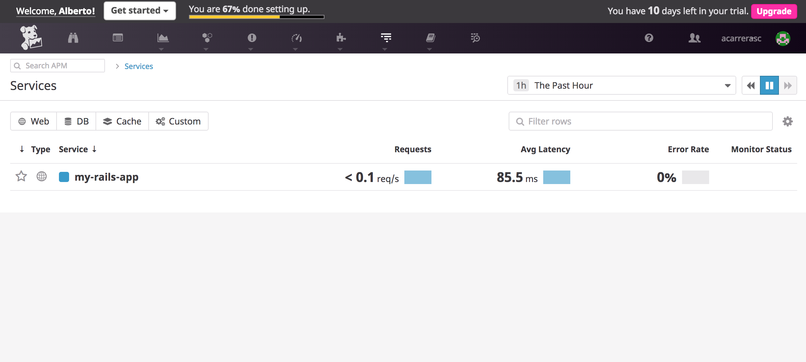
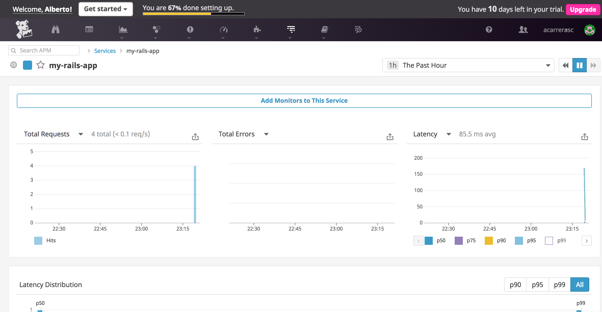

- **Dashboard with both APM and Infrastructure Metrics**
- I create a new shareable dashboard ((*Dashboard >> New Dashboard >> Screenboard)
- The open url: https://p.datadoghq.com/sb/cb5a9291f-093662e91fa4007a91c1ea4bf7a12bbe) 
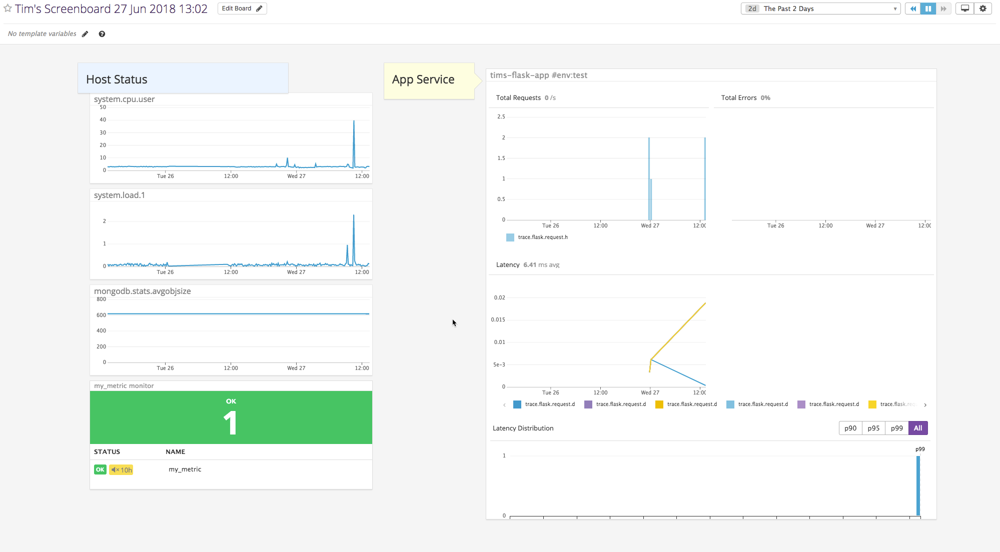

### Bonus Question
What is the difference between a Service and a Resource? 
**Answer**
(R22, R23) Datadog API provides metrics from your instrumented application at different levels. Two of them are services and resources. 
An application may have different services, each of them consisting of a set of processes that work together to perform a specific job or feature set.  Basic applications might consist of a webapp service and a database service. On the other hand, resources are the queries to those services. For instance, in our basic Rails app, the following URL *http://localhost:3000/api/trace* contains the resource */api/trace*. For databases, SQL queries would be resources of the database service. 

***RESOURCES***
from https://app.datadoghq.com/apm/install#
- R18 APM Setup documentation https://docs.datadoghq.com/tracing/setup/?tab=agent630
- R19 Datadog APM agent documentation https://github.com/DataDog/datadog-trace-agent
- R20 Latest APM agent release https://github.com/DataDog/datadog-trace-agent/releases/tag/6.7.0
- R21 Tracing Rails applications 
https://docs.datadoghq.com/tracing/setup/ruby/#quickstart-for-rails-applications
- R22 APM introduction documentation https://docs.datadoghq.com/tracing/visualization/
- R23 APM article https://help.datadoghq.com/hc/en-us/articles/115000702546-What-is-the-Difference-Between-Type-Service-Resource-and-Name-

### Final Question
Datadog has been used in a lot of creative ways in the past. We’ve written some blog posts about using Datadog to monitor the NYC Subway System, Pokemon Go, and even office restroom availability! Is there anything creative you would use Datadog for?

I have an environmental/occupational risk prevention background. A great use for the Datadog platform would be monitoring the performance of installed solar panels. It would be ideal to track their general performance and having monitors to identify production thresholds or performance anomalies. Companies could also  used screenboards to display these metrics on shared spaces (i.e. kWh, gCO2eq/kWh)

Another great application of Datadog would be for monitoring environmental metrics in facilities such as temperature, lighting, CO2 levels, electric consumption, etc. with data collected from installed sensors. 