```       
       .-'`   `'-.
   _,.'.===   ===.'.,_
  / /  .___. .___.  \ \
 / /   ( o ) ( o )   \ \                                            _
: /|    '-'___'-'    |\ ;                                          (_)
| |`\_,.-'`   `"-.,_/'| |                                          /|
| |  \             /  | |                                         /\;
| |   \           /   | | _                              ___     /\/
| |    \   __    /\   | |' `\-.-.-.-.-.-.-.-.-.-.-.-.-./`   `"-,/\/ 
| |     \ (__)  /\ `-'| |    `\ \ \ \ \ \ \ \ \ \ \ \ \`\       \/
| |      \-...-/  `-,_| |      \`\ \ \ \ \ \ \ \ \ \ \ \ \       \
| |       '---'    /  | |       | | | | | | | | | | | | | |       |
| |               |   | |       |    Datadog - Mihai    | |       |
\_/               |   \_/       | | | | | | | | | | | | | | .--.  ;
                  |       .--.  | | | | | | | | | | | | | | |  | /
                   \      |  | / / / / / / / / / / / / / /  |  |/
                   |`-.___|  |/-'-'-'-'-'-'-'-'-'-'-'-'-'`--|  |
            ,.-----'~~;   |  |                  (_(_(______)|  |
           (_(_(_______)  |  |                         ,-----`~~~\
                    ,-----`~~~\                      (_(_(_______)
                   (_(_(_______)

```
# Prerequisites - Setting up the environment

- [x] Spinned up an Azure Ubuntu VM and connected to it.


- [x] Installed a Datadog agent


# Collecting Metrics

- [x] Edited the datadog.yaml file, added the tags, restarted the Datadog Agent.


- [x] Installed the MySQL database on the VM, created the datadog database user and gave it the necessary rights according to this integration documentation: https://docs.datadoghq.com/integrations/mysql/ Created a conf.yaml file and updated the necessary configurations. Restarted the MySQL database and the Datadog agent to enable MySQL monitoring.


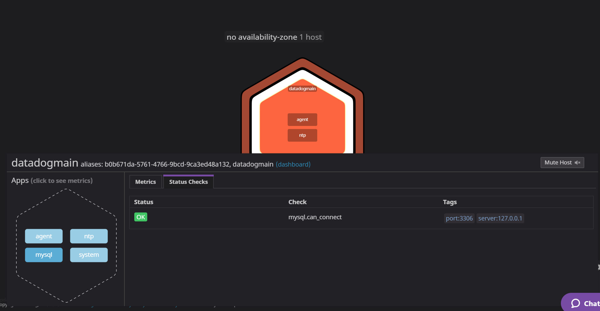

- [x] Created a file in conf.d folder named my_metrics.yaml


- [x] Created a file in checks.d folder named my_metrics.py and added the following code as suggested here: https://docs.datadoghq.com/developers/write_agent_check/?tab=agentv6v7


- [x] Restarted the agent after which it was possible to monitor 'my_metrics' using either 'sudo service datadog-agent status' or the Metrics Explorer:

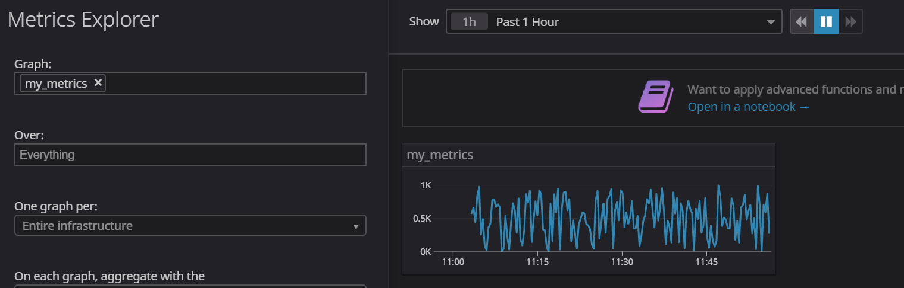

- [x] Updated the collection interval in the 'my_metrics.yaml' file to submit the metrics once every 45 seconds: 


**Bonus question**: Yes, it is possible to modify the collection interval without modifying the Python file by modifying the configuration file as it was executed above. It's also possible to modify the collection interval using the UI.

# Visualizing Data:

- [x] Created an API and Application key through the Datadog portal and wrote a script that collected the following metrics:
* Custom metric from the exercise earlier
* Percentage of CPU time spent in user space by MySQL annomalies
* Custom metric's roll up for the past hour


```
from datadog import initialize, api

options = {
    'api_key': '67923c3202becb1bf292d7055535373f',
    'app_key': 'd0acbe013adbcb3a5d416a623a983abd9cc6cc73',
    'api_host': 'https://api.datadoghq.eu'
}

initialize(**options)

title = 'Timeboard Technical Exercise'
widgets = [{
    'definition': {
        'type': 'timeseries',
        'requests': [
            {'q': 'avg:my_metrics{host:datadogmain}'}
        ],
        'title': 'Custom Metric scoped over host'
    }
},

{
    'definition': {
        'type': 'timeseries',
        'requests': [
            {'q': "anomalies(avg:mysql.performance.user_time{host:datadogmain}, 'basic', 3)"}
        ],
        'title': 'MySQL CPU Time'
    }
},

{
    'definition': {
        'type': 'query_value',
        'requests': [
            {'q': 'avg:my_metrics{host:datadogmain}.rollup(sum,3600)'}
        ],
        'title': 'Custom Metric roll up for past hour'
    }
}


]


layout_type = 'ordered'
description = 'A dashboard with memory info.'
is_read_only = True
notify_list = ['user@domain.com']


api.Dashboard.create(title=title,
                     widgets=widgets,
                     layout_type=layout_type,
                     description=description,
                     is_read_only=is_read_only,
                     notify_list=notify_list)
```
- [x] Executed the Python script:

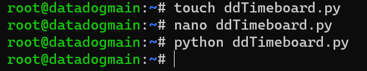

- [x] The new dashboard appeared in the list:

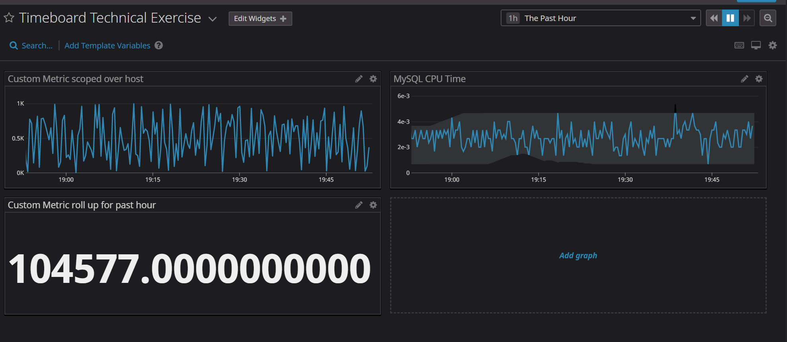

- [x] Set the Timeboard's timeframe to the past 5 minutes:

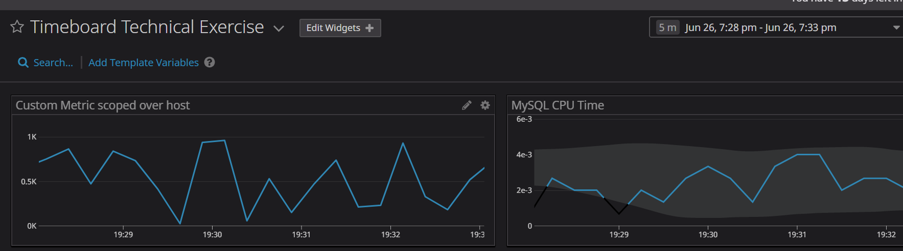

- [x] Took a snapshot of the graph and annotated myself

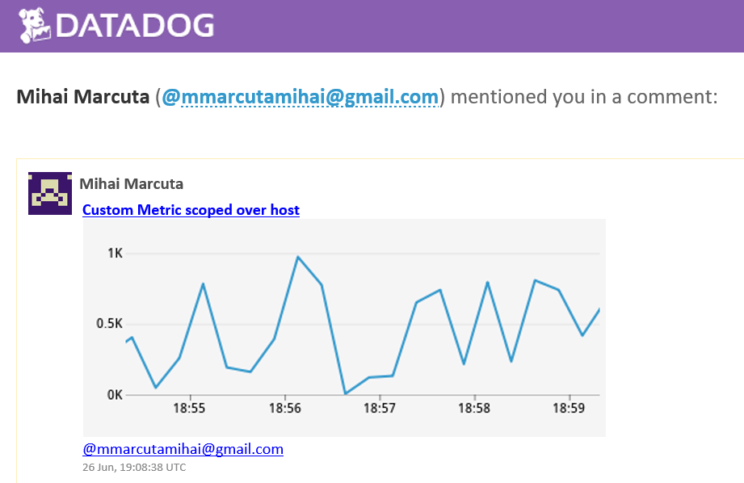

**The Dashboard can be visualised here**: https://p.datadoghq.eu/sb/9fytqflfopx31kcm-6ff4e2824402fe5b64a8640310f3f40b

**Bonus question**: The Anomaly graph leverages the anomaly detection algorithm which determines when a metric behaves differently compared to the past. In the context of this exercise, the anomaly graph was applied to the percentage of CPU time spent in user space by MySQL and it allows to monitor anomalies within the boundary that I set (3). Any behaviour that doesn't align with the usual patterns will be highlighted to me.

# Monitoring Data:

- [x] Created a New Monitor that monitors the custom metric 'my_metrics' with the following settings:
* Warning threshold of 500
* Alerting threshold of 800
* And also ensured that it will notify you if there is No Data for this query over the past 10m.

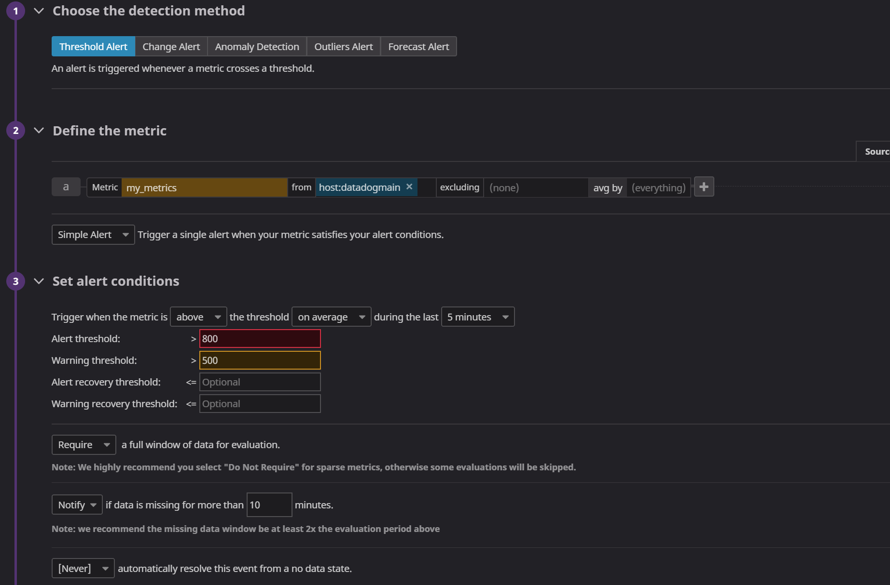

- [x] Configured monitor's message so it will:
* Send me an email whenever the monitor triggers.
* Create different messages based on whether the monitor is in an Alert, Warning, or No Data state.
* Included the metric value that caused the monitor to trigger and host ip when the Monitor triggers an Alert state.

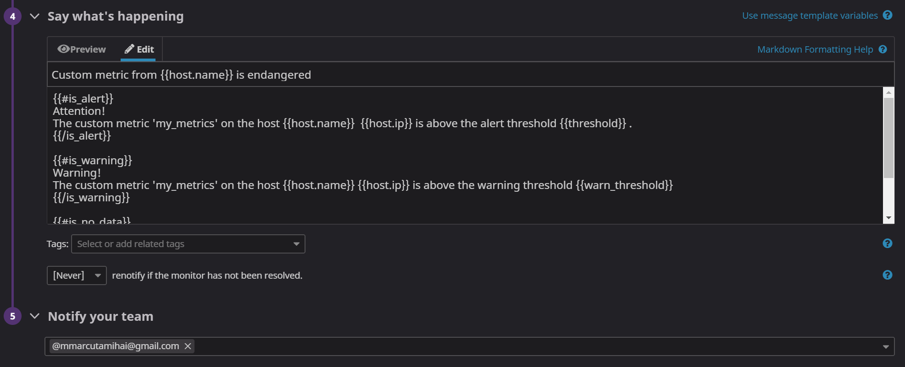

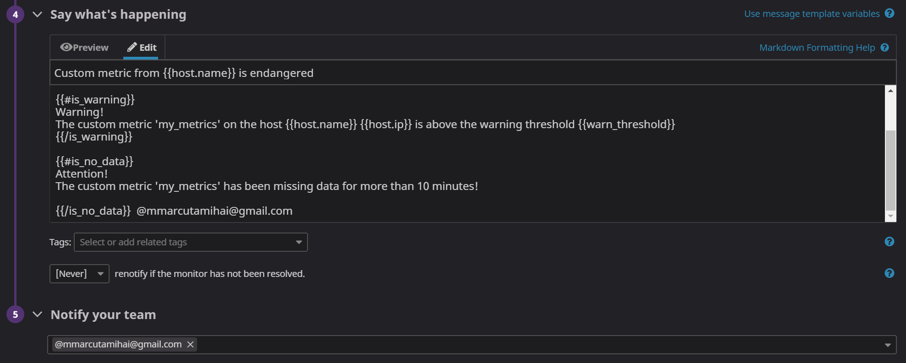

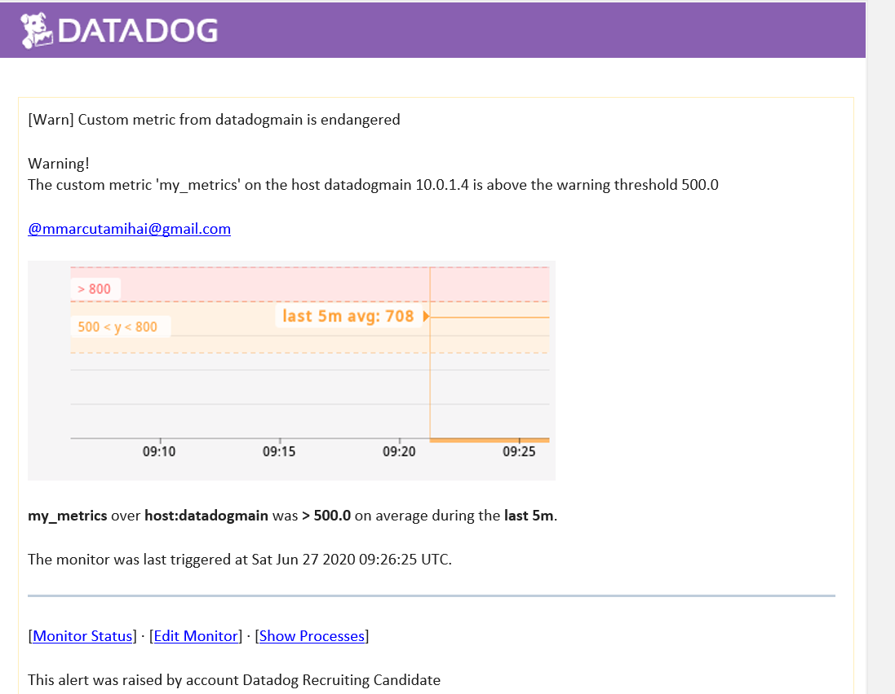

**Bonus question**: Set up two scheduled downtimes for this monitor:

* One that silences it from 7pm to 9am daily on M-F

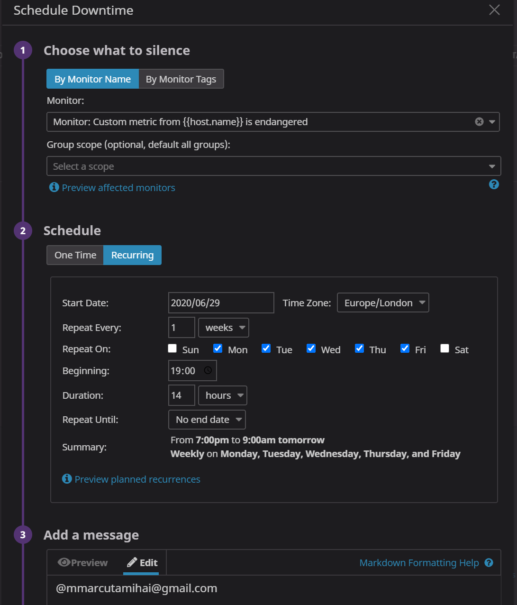

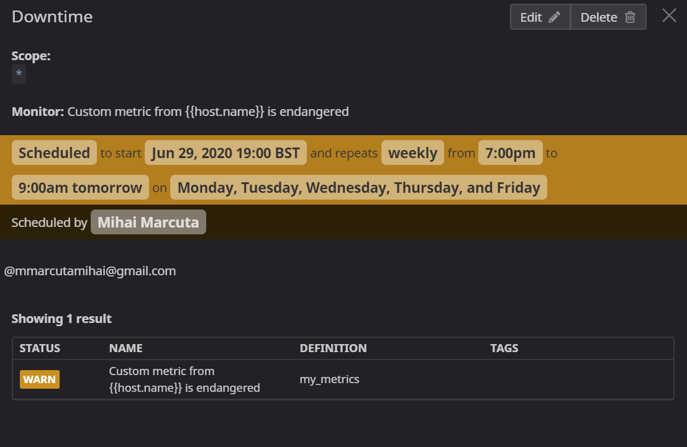


* And one that silences it all day on Sat-Sun.

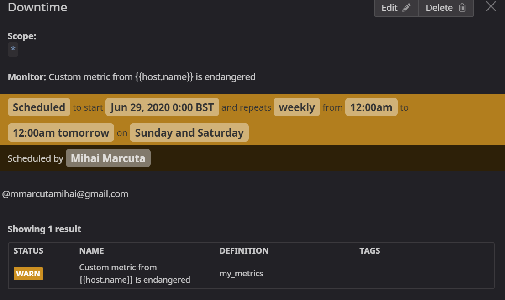

* Email downtime notification (please igonore the difference in time compared to the screenshot above, I am currently in a different timezone):

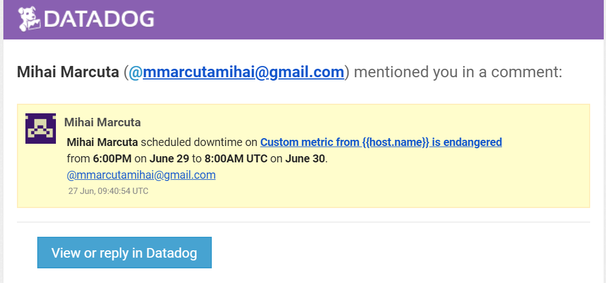


# Collecting APM Data:

- [x] PIP Installed Flask and DDTrace on the VM, configured the Flask app code and executed it using ddtrace command (couldn't install DDTrace without updating Cython and Python tools first):

```
from flask import Flask
import logging
import sys

# Have flask use stdout as the logger
main_logger = logging.getLogger()
main_logger.setLevel(logging.DEBUG)
c = logging.StreamHandler(sys.stdout)
formatter = logging.Formatter('%(asctime)s - %(name)s - %(levelname)s - %(message)s')
c.setFormatter(formatter)
main_logger.addHandler(c)

app = Flask(__name__)

@app.route('/')
def api_entry():
    return 'Entrypoint to the Application'

@app.route('/api/apm')
def apm_endpoint():
    return 'Getting APM Started'

@app.route('/api/trace')
def trace_endpoint():
    return 'Posting Traces'

if __name__ == '__main__':
    app.run(host='127.0.0.1', port='5050')
```
