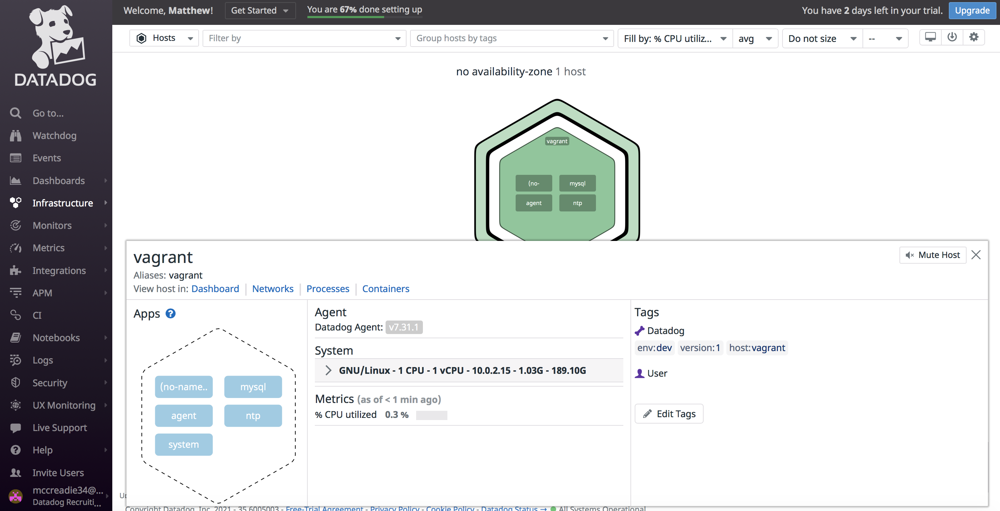

# DataDog Hiring Exercise - Sales Engineer NYC
#### Matt McCreadie
###### November, 2021
Thank you again for the opportunity to complete this exercise and progress through the interview process. I had my work cut out for me between juggling closing out a strong October in my current role and training for the NYC Marathon coming up last weekend, but I had a ton of fun learning and diving right into the product.
</br></br>

</br></br>
Let's walk through this exercise as if I am presenting to a customer.
</br>
</br>

## Prerequisites - Setting up the Environment

I installed the latest version of Vagrant Ubuntu and installed Virtual Box by following [these instructions](https://learn.hashicorp.com/collections/vagrant/getting-started). Once installed, I ran the following commands;
</br></br>
Initialize Vagrant.
</br>
```
vagrant@vagrant:~$ vagrant init hashicorp/bionic64
```
</br></br>
Initialize Vagrant.
</br>
```
vagrant@vagrant:~$ vagrant up
```
</br></br>
SSH into the machine using `vagrant ssh`.
</br></br>

## Collecting Metrics

I editted the API key and added tags in the `datadog.yaml` file within the `/etc/datadog-agent` directory.
</br></br>
Change directory to access config file.
</br>
```cd etc/datadog-agent```
</br></br>
Open config file for editting mentioned above.
</br>
```sudo vi datadog.yaml```
</br></br>

</br></br>
Tags appeared in the Datadog UI (shown below).
</br></br>

</br></br>
I then installed mySql via the command-line using the one-step install command below.
</br>
```DD_AGENT_MAJOR_VERSION=7 DD_API_KEY=f8462f0c39ce8a293fe6adc19654d325 DD_SITE="datadoghq.com" bash -c "$(curl -L https://s3.amazonaws.com/dd-agent/scripts/install_script.sh)"```
</br></br>
Once mysql was installed, I setup the database with the following;
</br></br>
Open mysql via the command-line.
</br>
```sudo mysql -u root```
</br></br>
Create a database user for the Datadog Agent.
</br>
```mysql> CREATE USER 'datadog'@'localhost' IDENTIFIED BY '<UNIQUEPASSWORD>';```
</br></br>
Grant the user the following privileges only.
</br>
```mysql> GRANT REPLICATION CLIENT ON *.* TO 'datadog'@'localhost' WITH MAX_USER_CONNECTIONS 5;```
</br></br>
```mysql> GRANT PROCESS ON *.* TO 'datadog'@'localhost';```
</br><br>
```mysql> GRANT SELECT ON performance_schema.* TO 'datadog'@'localhost';```
</br></br>
I then renamed the conf.yaml.example file to conf.yaml and added the following edits;
</br>
```yaml
init_config:

instances:
  - server: 127.0.0.1
    user: datadog
    pass: "<YOUR_CHOSEN_PASSWORD>" # from the CREATE USER step earlier
    port: "<YOUR_MYSQL_PORT>" # e.g. 3306
    options:
      replication: false
      galera_cluster: true
      extra_status_metrics: true
      extra_innodb_metrics: true
      extra_performance_metrics: true
      schema_size_metrics: false
      disable_innodb_metrics: false
```
</br><br>
Restart datadog-agent.
</br>
```sudo service datadog-agent restart```
</br></br>
Confirm mysql connection by looking for ```mysql``` under Checks section.
</br>
```sudo datadog-agent status```
</br></br>

## Custom Agent Check

I created a new directory named ```custom_check.d``` by executing ```mkdir custom_check.d``` (this goes within ```conf.d```).
</br>
Created new file named ```custom_check.yaml``` by executing ```touch custom_check.yaml```.
</br>
Added the following code to ```custom_check.yaml``` file. 
</br></br>
(This code also changes your check's collection interval so that it only submits the metric once every 45 seconds.

</br></br>
```yaml
init_config:
  
instances:
        - min_collection_interval: 45
```
</br></br>
I then created a python file in ```checks.d``` named ```custom_check.py``` and editted that file to include the following
</br>
```python
# the following try/except block will make the custom check compatible with any Agent version
try:
    # first, try to import the base class from new versions of the Agent...
 from datadog_checks.base import AgentCheck
except ImportError:
    # ...if the above failed, the check is running in Agent version < 6.6.0
    from checks import AgentCheck

# content of the special variable __version__ will be shown in the Agent status page
__version__ = "1.0.0"

#class HelloCheck(AgentCheck):
    #def check(self, instance):
        #self.gauge('hello.world', 1, tags=['TAG_KEY:TAG_VALUE'] + self.instance.get('tags', []))


import random
from checks import AgentCheck
class RandomCheck(AgentCheck):
 def check(self, instance):
   self.gauge('my_metric', random.randint(0, 1000))
```

</br></br>
Bonus Question: I was able to edit the collection interval; I did so by editting the yaml file (rather than the python file I created) by editting the min_collection_interval to be 45.
</br></br>

</br></br>

## Visualizing the Data

I began by installing the DataDog python package.
</br></br>
```pip install datadog```
</br></br>
Create new file named ```timeboard.py``` within ```/etc/python```
</br></br>
Added the following code
</br></br>
```python
from datadog import initialize, api

options = {
    'api_key': '',
    'app_key': ''
}

initialize(**options)

title = 'Datadog Exercise Timeboard'
widgets = [{
    'definition': {
        'type': 'timeseries',
        'requests': [
             {'q': 'avg:my_metric{*}'}
        ],
        'title': 'Custom Metric Scoped Over Host'
    }},
    {
    'definition': {
        'type': 'timeseries',
        'requests': [
            {'q': 'anomalies(avg:mysql.performance.open_files{*}, "basic", 2)'}
        ],
         'title': 'MySql mysql.performance.open_files Anomaly Funtion'
        }},
    {
    'definition': {
        'type': 'timeseries',
        'requests': [
            {'q': 'sum:my_metric{*}.rollup(sum, 3600)'}
        ],
        'title': 'My_metric rolled up.'
    }
    }]
layout_type = 'ordered'
description = 'My_Metric scoped over host.'
is_read_only = True
notify_list = ['mccreadie34@gmail.com']
template_variables = [{
    'name': 'host1',
    'prefix': 'host',
    'default': 'my-host'
}]

api.Dashboard.create(title=title,
                     widgets=widgets,
                     layout_type=layout_type,
                     description=description,
                     is_read_only=is_read_only,
                     notify_list=notify_list,
                     template_variables=template_variables)
```
</br></br>
I created three timeboards by executing the folowing two commands. The timeboards show my_metric scoped over the host, any anomalies within the mysql.performance.open_files metric outside of two stand deviations, and my_metric rolled up to sum all the points for the past hour into one bucket.
</br></br>

```export DD_SITE="datadoghq.com" DD_API_KEY="<API-KEY>" DD_APP_KEY="<APP-KEY>"```
</br>
```python "example.py"```
</br></br>
Here's a screenshot of the email I received including a snapshot of one of the graphs.
</br></br>

</br></br>
Linking below to the dashboard in the DataDog UI.
</br>
[Collecting Metrics - Timeboard](https://app.datadoghq.com/dashboard/s2d-shp-ud2/datadog-exercise-timeboard?from_ts=1636169951234&to_ts=1636170251234&live=true)
</br></br>
Bonus Question: The anomaly Function is triggering on any value outside of 2 standard deviations.
</br></br>

### Monitoring Data

I set up Warning, Alert and No Data email notifications to keep watch of ```my_metric```.
</br></br>

Configuring Email Notifications; Warning, Alert and No Data</br>

</br></br>
Email Triggered and Sent</br>

</br></br>
Email sent after scheduling weeknight downtime</br>

</br></br>
Email sent after scheduling weekend downtime</br>


### Collecting APM Data

As the last piece of this exercise, we instrumented the following Flask App using DataDog's APM solution.
</br></br>
Install ddtrace
</br>
```pip install ddtrace```
</br></br>
Create new file within ```/etc/python/``` named ```flaskApp.py```. This file contains the following Flask app;
</br></br>
```python
from ddtrace import tracer
from flask import Flask
import logging
import sys

# Have flask use stdout as the logger
main_logger = logging.getLogger()
main_logger.setLevel(logging.DEBUG)
c = logging.StreamHandler(sys.stdout)
formatter = logging.Formatter('%(asctime)s - %(name)s - %(levelname)s - %(message)s')
c.setFormatter(formatter)
main_logger.addHandler(c)

app = Flask(__name__)

@app.route('/')
def api_entry():
    return 'Entrypoint to the Application'

@app.route('/api/apm')
def apm_endpoint():
    return 'Getting APM Started'

@app.route('/api/trace')
def trace_endpoint():
    return 'Posting Traces'

if __name__ == '__main__':
    app.run(host='0.0.0.0', port='5050')
```
</br></br>
Ran that file using the following command.
</br></br>
```ddtrace-run python flaskApp.py```
</br></br>
Run ```curl 127.0.0.1:5050```. This curl command is sending traces and data to the DataDog UI to visualize metrics at the time of the request.
</br></br>
Here's a few screenshots and a link for review;
</br></br>

</br></br>

</br></br>

</br></br>

</br></br>

</br></br>
[Link to Traces](https://app.datadoghq.com/apm/traces?query=env%3Adev&cols=core_service%2Ccore_resource_name%2Clog_duration%2Clog_http.method%2Clog_http.status_code&historicalData=true&messageDisplay=inline&sort=desc&streamTraces=true&start=1636083895436&end=1636170295436&paused=false)
</br></br>
Bonus Question: Service vs Resource
</br></br>
Service; Services are the building blocks of modern microservice architectures - broadly a service groups together endpoints, queries, or jobs for the purposes of building your application.
“Flask”, in my project for example.
</br></br>
Resource; Resources represent a particular domain of a customer application - they are typically an instrumented web endpoint, database query, or background job.
This would relate to the trace metrics that are encompassed by the Flash service mentioned above, in my project for example.
</br></br>

### Final Question

Final Question:
</br></br>
As I mentioned earlier, I've been pretty active in the fitness space with marathons, IronMan races, etc. I am a big user of wearable technology as well, specifically Whoop's wearable tech.
</br></br>
I absolutely love the product, but I recently ran into an issue where my hardware could not connect to the app on my phone/ data was not feeding to the software. There wasn't much visibility to my hardware/software from their support team and I had to download logs for them to review.
</br></br>
A creative application of DataDog might be to leverage DataDog's IoT solution to help minimize downtime for Whoop's userbase. As wearable tech gets more complex and more user's rely on this for their sport, fitness and overall health, keeping downtime minimized and ensuring function of their applications will be more important than ever.
</br></br>

### Thank you

Thank you again for the consideration, and I look forward to more opportunity with DataDog!</br></br>
