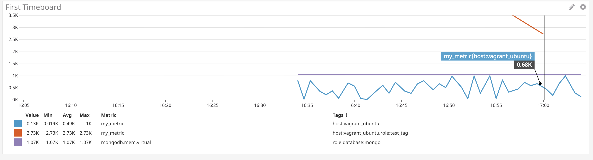
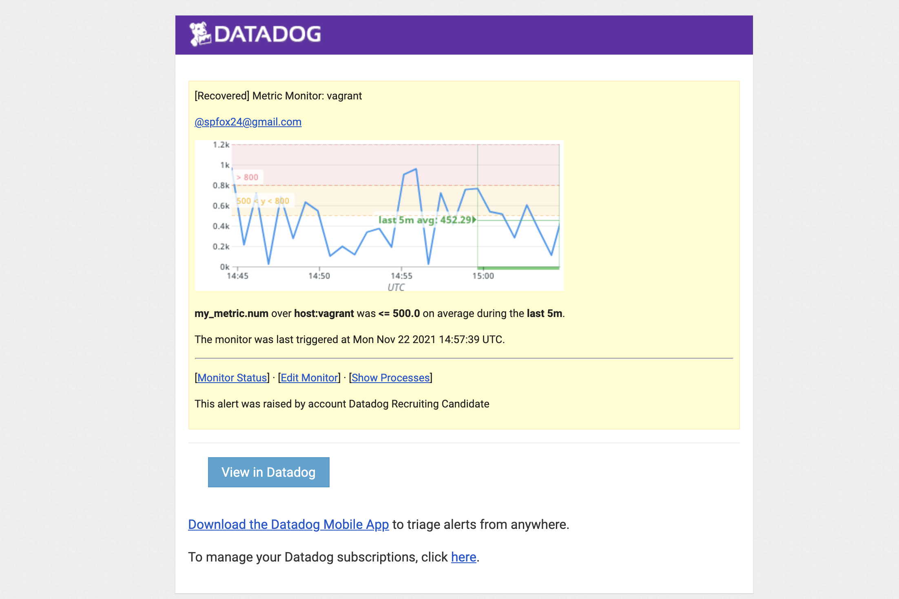
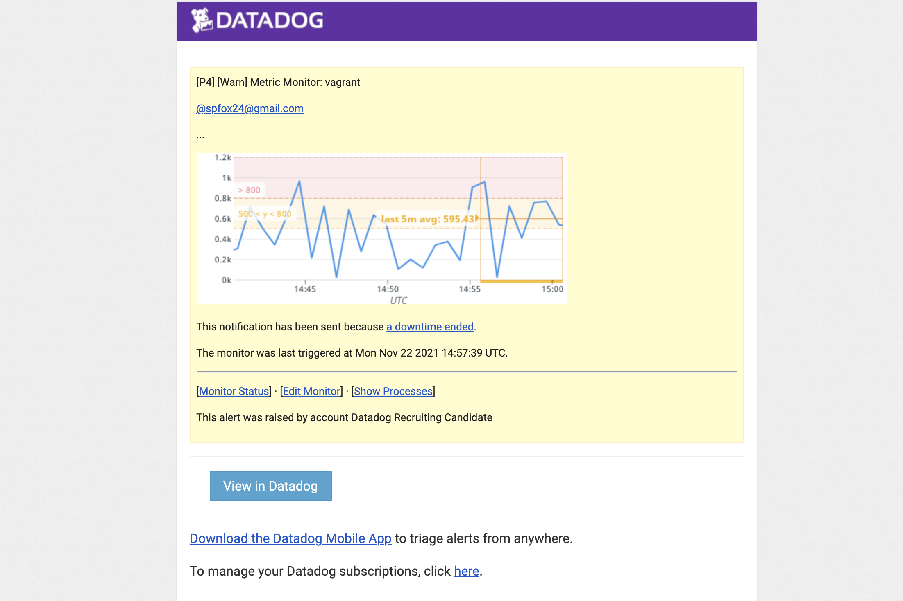
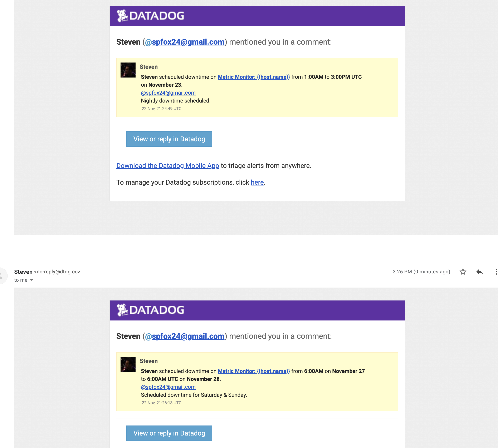
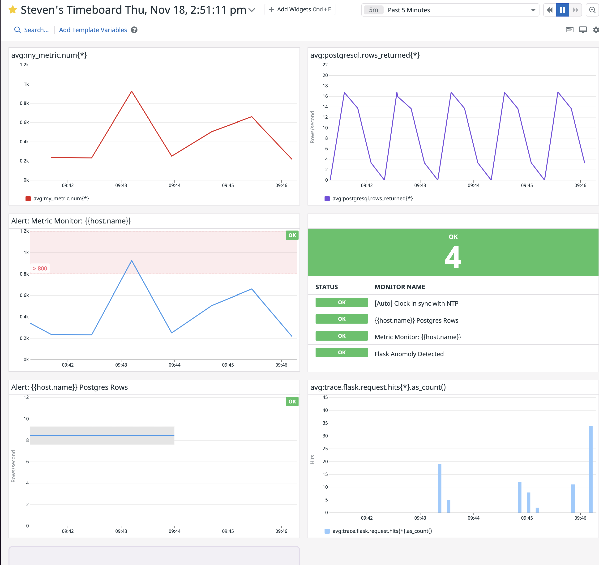

Your answers to the questions go here.

## Collecting Metrics:
**Bonus Question**
* Yes, by adding min_collection_interval: 45 to the instance level of the .yaml file associated with the .py for the metric.

## Visualizing Data:
**Bonus Question** 
* Anomoly detection on the graph is connected to a PostgreSQL database showing the amount of rows in the said database. Anomoly detection can tell between normal and abnormal metric trends based off of previous data point accrued over time. Then alert if there is an abnormal detection.

## Monitoring Data:

**Bonus Question**

## Collecting APM Data:
[APM Dashboard](https://app.datadoghq.com/dashboard/5zd-pe7-2dx/stevens-timeboard-thu-nov-18-25111-pm?from_ts=1637683991751&to_ts=1637684291751&live=true)

**Bonus Question**
* A Service is the entity in which you can create a Resource.

## Final Question:
With the holiday season upon us one tradition that never gets old is going to see all of the Christmas lights around the neighborhoods. The biggest problem with Christmas lights is that if one light goes out it can be a killswitch for the entire string of lights. With the IoT integrating into the lighting space, being able to trigger alerts through Datadog for lighting outages before they occur would be something that could be utilized in order to keep the Christmas cheer at a maximum. Also being able to source the direct light that is causing any downtime would be a faster diagnosis thus preventing any prolonged timeline with no lights.