# Getting up and running with Datadog

For this project you'll need:

- A clean Ubuntu 16.04 Xenial install
- Root privileges
- A web browser
- A Datadog Account
- A text editor 
- A web browser


Let's begin with a fresh install of Ubuntu 16.04. Run `sudo apt-get update -y` followed by  `sudo apt-get upgrade -y` to ensure all default packages are up to date.

You'll need root privileges throughout this tutorial, so run `sudo su` in the terminal now to escalate to root.

## Installing the Datadog Agent

First, you'll need to install the Datadog agent, so head over to the [Datadog API](https://app.datadoghq.com/account/settings#api) to locate and copy your API key, then run hop into a terminal and run the following command to execute the agent installation script:

`DD_API_KEY=<YOUR_API_KEY> bash -c "$(curl -L https://raw.githubusercontent.com/DataDog/datadog-agent/master/cmd/agent/install_script.sh)"`

After a few moments you'll see a message letting you know the agent has been installed and is running:

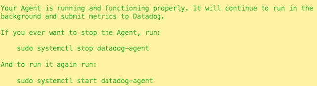

## Tagging your agent host

It's important to utilize good resource organization practices by tagging them using key:value pairs. To tag your host you'll need to edit the `datadog-agent.yaml` file, so open `/etc/datadog-agent/datadog.yaml` in your terminal.

Once the file is opened, find the line pertaining to host tags:

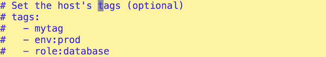

Go ahead and edit the existing tags or make your own:

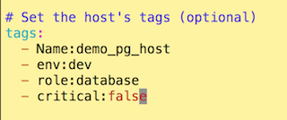

Save and close your editor after editing the tags, then run `service datadog-agent restart` to update the host with your new tags.

After a moment run `service datadog-agent status` to ensure the agent is running as it should. 

Now head to the [Infrastructure Map](https://app.datadoghq.com/infrastructure/map) to get view a visual representation of your host and see its tags. You may encounter a message telling you that WebGL is required:

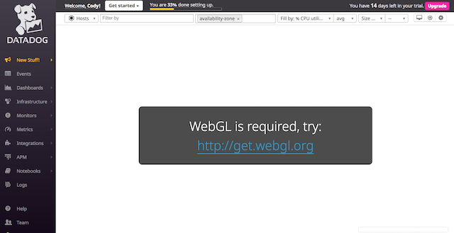

I get this notification because I use a locked-down version of Firefox that doesn't allow WebGL, but Safari displays the map for me:

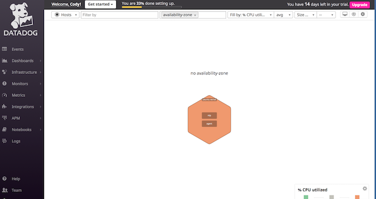

Clicking on the ubuntu-xenial host I can see which apps are running, some system information, and my newly created tags:

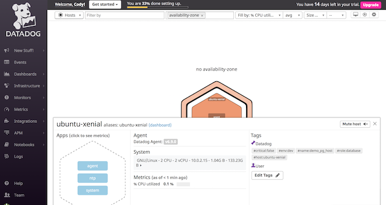

Now that the agent is installed and the host tags are set up, it's time to install PostgreSQL version 10.

## Installing Postgres

Per the [Postgres documentation](https://www.postgresql.org/download/linux/ubuntu/) you need to create a file in your `apt` sources list for the Postgres repository and add a link to the repository within that file. Run `touch /etc/apt/sources.list.d/pgdg.list` to create the file, and `sh -c 'echo "deb http://apt.postgresql.org/pub/repos/apt/ xenial-pgdg main" >> /etc/apt/sources.list.d/pgdg.list'` to add the repository link.

Next, import the repository's signing key with  `wget --quiet -O - https://www.postgresql.org/media/keys/ACCC4CF8.asc | apt-key add -` and run `apt-get update -y` to update your system accordingly. Now install Postgres with `apt-get install postgresql-10 -y`. Confirm that all packages are installed by running `dpkg -l | grep postgres`:

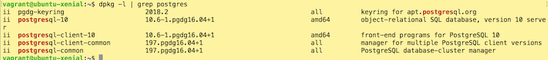

Fire up the Postgres service with `service postgresql start` and confirm it's running with `ps -ef | grep postgres`:

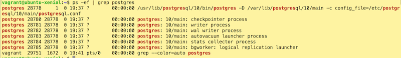

Now that the Postgres service is up and running, create a database from which metrics will be pulled. Run `su postgres` in the terminal to assume the postgres user. 

Now enter the Postgres console by running the `psql` command. Note the change to the prompt in your terminal:

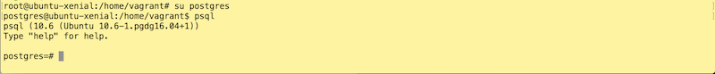

Create a new database by running the `CREATE DATABASE` command:

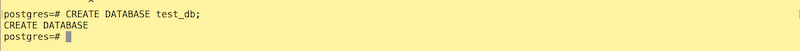


## Configuring the Datadog Postgres Integration

Datadog ships with a pre-made integration for Postgres which once configured will provide real-time metrics and monitoring for the database. To begin the configuration process, create a read-only Postgres user named datadog with `CREATE USER datadog WITH PASSWORD 'your_secure_password';`
and give the datadog user access to pg_monitor with `GRANT pg_monitor TO datadog;`

Now that the datadog user has been granted read access to the database, hit CTRL+Z to get out of the Postgres console, then type `exit` twice to get back to the root user.

Create a configuration file to store the database information and credentials by first copying the sample configuration to a new file with `cp /etc/datadog-agent/conf.d/postgres.d/conf.yaml.example /etc/datadog-agent/conf.d/postgres.d/conf.yaml`, then open the new file in your text editor.

Uncomment the the `username`, `password`, and `dbname` lines and enter datadog as the user, the password you just created, and the name of the database you created. Save and exit, then restart the Datadog agent with `service datadog-agent restart`. After a few moments run `cat /var/log/datadog/agent.log | grep postgres` to see that some checks have been performed and completed:

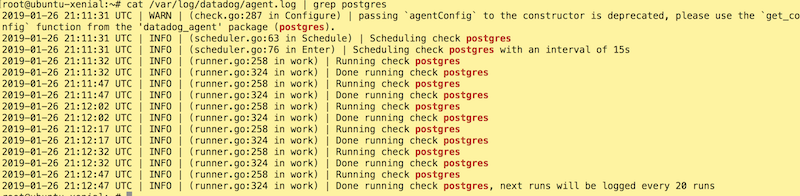

Head over to the [Infrastructure List](https://app.datadoghq.com/infrastructure) to confirm the Postgres integration is running:

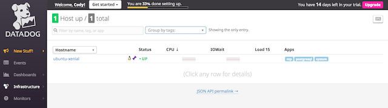

You can dig a little deeper by clicking on your host and scrolling to the bottom of the dashboard, where you'll see an active Postgres connection:

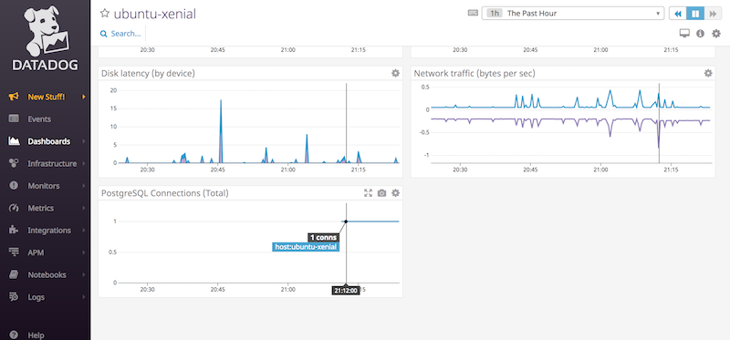

## Creating a custom check

Perhaps you have a unique system or you'd just like to create checks for metrics you define. First, let's create a configuration file called `demo_check.yaml` with 
`touch /etc/datadog-agent/conf.d/demo_check.yaml`.

Next, create and edit a Python file -- also named `demo_check` -- in the `checks.d` directory to create the check itself. For this example, `demo_check` will have a custom metric `my_metric`, a gauge which returns a random number between 0 and 1000. Create a new file in the `checks.d` directory with `touch /etc/datadog-agent/checks.d/demo_check.py` and open it in your text editor to add the following code:

```python
import random
# the following try/except block will make the custom check compatible with any Agent version
try:
    # first, try to import the base class from old versions of the Agent...
    from checks import AgentCheck
except ImportError:
    # ...if the above failed, the check is running in Agent version 6 or later
    from datadog_checks.checks import AgentCheck

# content of the special variable __version__ will be shown in the Agent status page
__version__ = "1.0.0"


class TestCheck(AgentCheck):
    def check(self, instance):
        self.gauge('my_metric', random.randint(0, 1001))
```


Save and exit the file, then restart the Datadog agent with `service datadog-agent restart`.

Run `datadog-agent check my_metric` and you'll get in response some JSON that shows `my_metric` returning a random number:

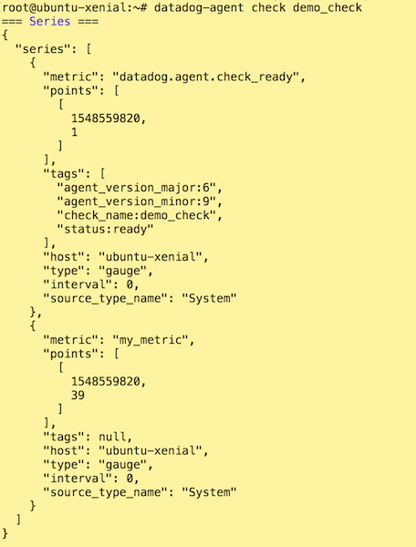

`demo_check` is running every 15 seconds as all checks do by default:

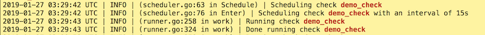

You can change the interval to 45 seconds by opening `/etc/datadog-agent/conf.d/demo_check.yaml` and adding:

```
init_config:

instances:
  - min_collection_interval: 45
```

The demo_check configuration looks like this:

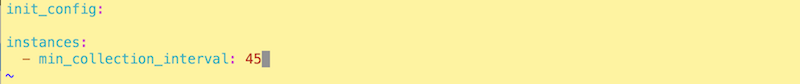

Save and close the file, then run `service datadog-agent restart` to update the service with the new configuration. Now run `cat /var/log/datadog/agent.log | grep demo_check` to see the new collection interval:

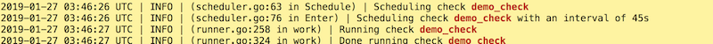

__Bonus Question__

One of the takeaways from editing the `demo_check.yaml` configuration is that you need not change `min_collection_interval` from within the Python file, rather you can do so on a per-instance basis by setting `min_collection_interval` in the yaml file instead.

## Creating a Timeboard with the Datadog API

To glean visual insights from our `my_metric` check, look for anomalous metrics coming from our database, or perform computations on metrics to customize the data on your dashboard, use the `Timeboard` endpoint from the [Datadog API](https://docs.datadoghq.com/api/?lang=python#timeboards)

We're going to use Python3 to create a script to:

- Scope `my_metric` over the `ubuntu-xenial` host

- Look for anomalies in the number of rows returned in the database created earlier

- Use a rollup function to add up the last hour's data points from the `my_metric` check

First, go to your [Datadog account's API page](https://app.datadoghq.com/account/settings#api) to generate an Application Key to give the script access to the Datadog API. Scroll down to Application Keys, enter a name for your new key, then click Create Application Key.


Next, install pip3 and the required libraries:

`apt-get install python3-pip`

`pip3 install datadog datadog_checks_base prometheus_client`


Now create a file called `demo_timeboard` in your preferred directory with `touch demo_timeboard.py`, open the file in your text editor, and add your API and App keys.


```python

from datadog import initialize, api
  
options = {
    'api_key': '<YOUR_API_KEY>',
    'app_key': '<YOUR_APP_KEY>'
}

initialize(**options)

title = "My Timeboard"
description = "Timeboard for my_metric and Postgres."
graphs = [{
    "definition": {
        "events": [],
        "requests": [
            {"q": "my_metric{host:ubuntu-xenial}"}
            ],
        "viz": "timeseries"
    },
    "title": "my_metric"
},

{
    "definition": {
        "events":[],
        "requests": [
            {"q": "anomalies(avg:postgresql.rows_returned{host:ubuntu-xenial}, 'basic', 1, direction='above')"}
            ],
        "viz": "timeseries"
        },
    "title": "Postgres rows returned"

},

{

    "definition": {
        "events":[],
        "requests": [
            {"q": "my_metric{host:ubuntu-xenial}.rollup(sum, 3600)"}
            ],
        "viz": "timeseries"
        },
    "title": "Sum of all points for my_metric over the last hour"

}]

template_variables = [{
    "name": "ubuntu-xenial",
    "prefix": "host",
    "default": "host:ubuntu-xenial"
}]

read_only = True
api.Timeboard.create(title=title,
                     description=description,
                     graphs=graphs,
                     template_variables=template_variables,
                     read_only=read_only)
```


A few things to note about this code:

- The line `{"q": "my_metric{host:ubuntu-xenial}"}` denotes a request query for `my_metric` on the `ubuntu-xenial` host.

- `{"q": "anomalies(avg:postgresql.rows_returned{host:ubuntu-xenial}, 'basic', 1, direction='above')"}` -- This query looks for anomalies in the database within the scope of the `ubuntu-xenial` host. Specifically, it's checking to see if the number of rows returned is one standard deviation above the normal value observed in the past. `basic` denotes the algorithm used to detect anomalies, which as the name implies is the most basic of the three detection algorithms available:

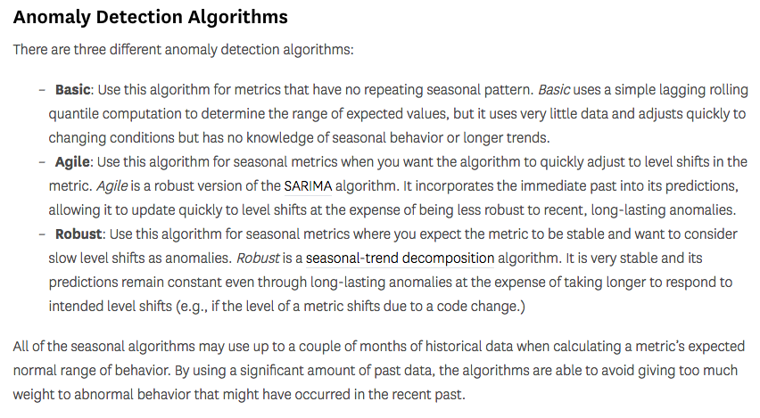

- `{"q": "my_metric{host:ubuntu-xenial}.rollup(sum, 3600)"}` -- This query seeks the sum of all points returned in the last hour for `my_metric`, scoped over the `ubuntu-xenial` host. The `rollup` function aggregates data over a time period you specify. You can choose to aggregate by average (`avg`), maximum (`max`), minimum (`min`), or sum (`sum`). For the example you'll want the sum of all points for the last hour, thus the call to `rollup(sum, 3600)` on `my_metric`.

- `"viz": "timeseries"` -- All of these graphs use a timeseries to visualize the data, which will show the evolution of a given metric over a time window you define. There are numerous [options for data visualization](https://docs.datadoghq.com/graphing/dashboards/widgets/).

Save and close the editor and run `python3 demo_timeboard.py` to execute the script. 


## Viewing the new timeboard

Head to the [Dashboard list](https://app.datadoghq.com/dashboard/lists) and click on the newly created timeboard. You'll see the three graphs defined in your script. Looking at the __Postgres rows returned__ graph, you can see an increase in the number of rows returned beginning at the 23:00 mark, with the anomalous data showing in red:


At the top right of the timeboard you'll see the available default time intervals. You can customize these time intervals by pressing alt+] to decrement or alt+[ to increment the interval, all the way down to a five minute window. Depending on your browser you may have issues with the decrement/increment feature -- it didn't work on my locked-down version of Firefox, but worked flawlessly on Safari.

## Taking a snapshot of a graph

Perhaps you find something on a graph that sticks out and you'd like to notify other members of your team. Hover your mouse over the graph to locate the camera icon:

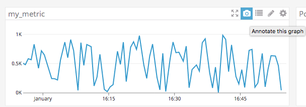

Click the camera, and a text box will appear. Enter a comment and use `@` to mention a member of your team. Once you've finished, press return and a notification will appear letting you know a screenshot has been created. The team member you mentioned in your comment will receive an email containing the comment, the name of the graph in question, and the screenshot of the graph:

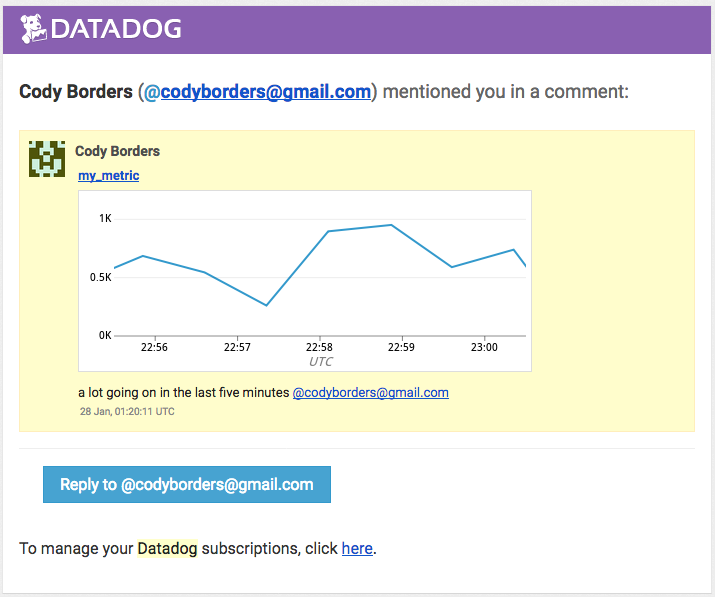

__Bonus Question__

The anomaly graph is displaying the variance in the behavior of a metric at a specific point compared to previously observed points. As shown above there are three different algorithms available to detect these variances.

# Monitoring Data

With [Datadog Monitors](https://docs.datadoghq.com/monitors/) you can automate the process of checking metrics and sending alerts to your team when necessary. In this example you'll create a monitor that:

- Creates an alert when `my_metric` returns an average value over 500 over the last five minutes
- Creates a warning and emails it to team members when `my_metric` returns an average value over 800 over the last five minutes
- Notifies you if `my_metric` hasn't returned any data in the last ten minutes
- Silences itself after business hours and on weekends

Start by going to the [Manage Monitors](https://app.datadoghq.com/monitors/manage) and click on __New Monitor__ at the top right of the screen. When given the option to select a monitor type, click Metric.

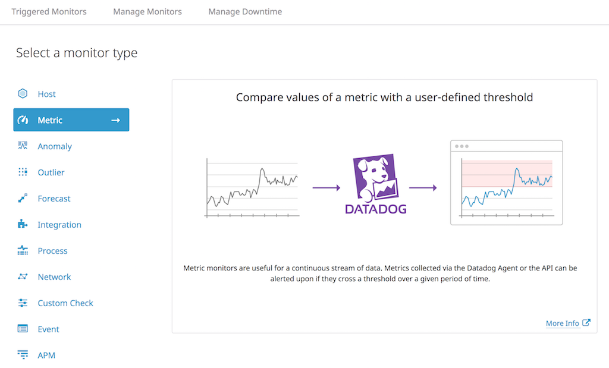

Select __Threshold Alert__, then choose `my_metric` for the metric to be monitored, and `host:ubuntu-xenial` as the host from which metrics will be pulled. Set the alert conditions as follows:

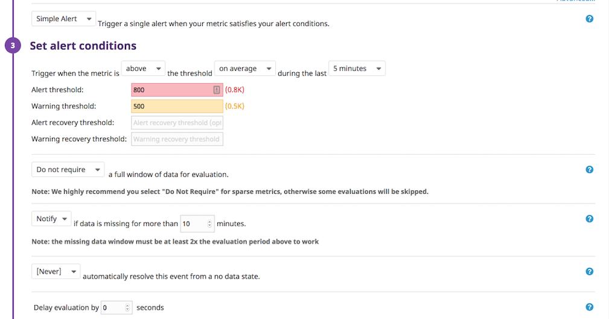

Next, navigate to __Say what's happening__ to create monitor messages and notify team members:

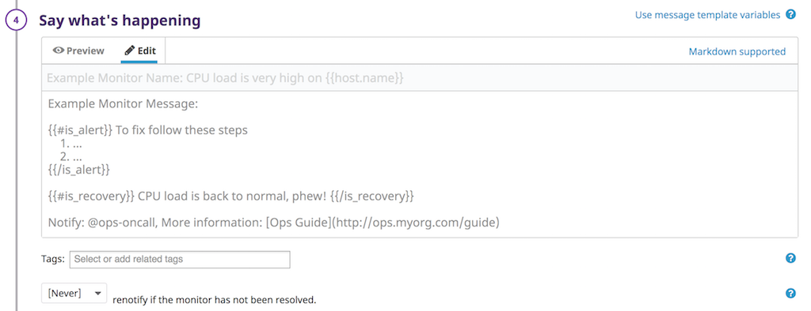

Use template variables and conditional statements to state the cause of the alert and email team members:

```
{{#is_alert}} 

@codyborders@gmail.com my_metric is returning a value of {{value}} for the host at {{host.ip}}.

{{/is_alert}}

{{#is_warning}}

@codyborders@gmail.com my_metric is returning a value above the warning threshold!

{{/is_warning}} 

{{#is_no_data}}

@codyborders@gmail.com  my_metric hasn't returned any data for the last 10 minutes.

{{/is_no_data}}

```

You can choose from a variety of conditional statements:

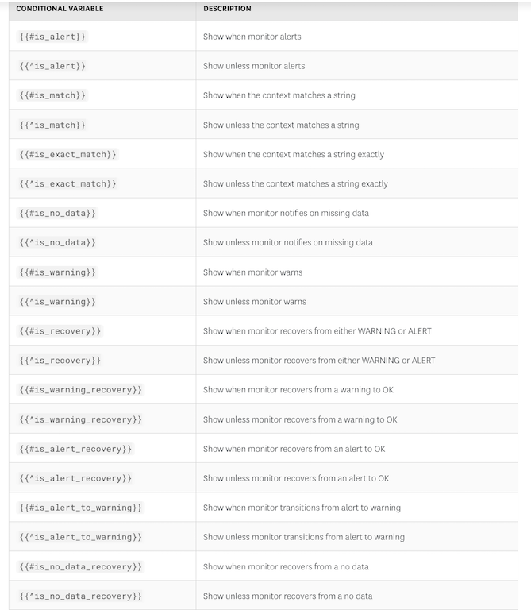

Finally, press Save to finish creating your monitor.

When an alert is triggered the team member(s) you've tagged will receive an email:

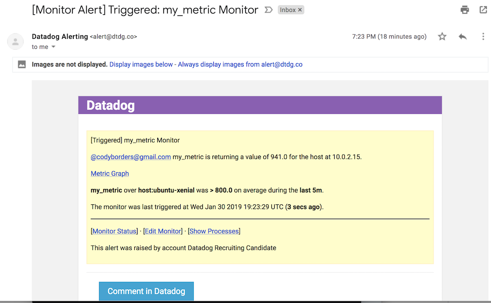

To schedule downtime for your monitor, go to [Manage Downtime](https://app.datadoghq.com/monitors#/downtime) and click __Schedule Downtime__. Choose your monitor, then modify the schedule according to your needs. Choose team member(s) to notify of the new downtime schedule and leave them a message, then press Save.

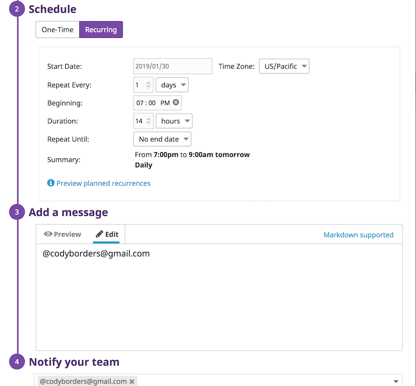

The team members you've tagged will receive an email notification regarding the new downtime:

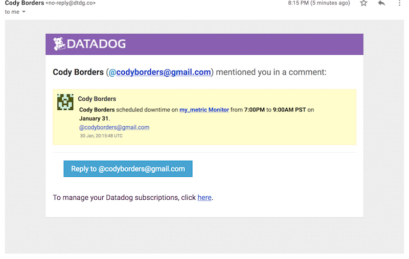

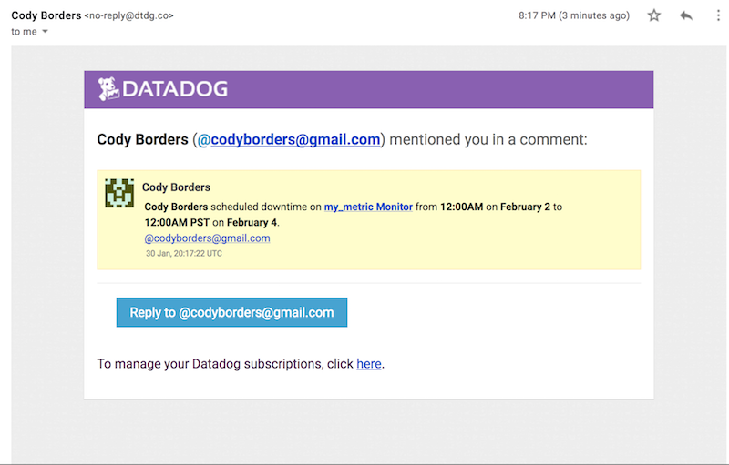

# Collecting APM Data

With __Application Performance Monitoring__ you can gain insight into the performance of your application's services, resources, traces, and spans. In this tutorial you'll create a small Python Flask application to gain an understanding of how APM monitors traces on your services. To get started using APM you'll need to enable trace collection within the `datadog.yaml` configuration file. Open `/etc/datadog-agent/datadog.yaml` in a text editor, search for `apm_config`, then add the following:

```
apm_config:
  enabled: true
  env:<ENVIRONMENT>

  analyzed_spans:
    flask|flask.request: 1

```

Save and close your editor, then run `service datadog-agent restart` to apply the configuration changes followed by `service datadog-agent status` to ensure everything is running properly. In a directory of your choice create a file with `touch app.py` and open it in your editor. Add this code for the sample app:

```python
from flask import Flask
import logging
import sys

# Have flask use stdout as the logger
main_logger = logging.getLogger()
main_logger.setLevel(logging.DEBUG)
c = logging.StreamHandler(sys.stdout)
formatter = logging.Formatter('%(asctime)s - %(name)s - %(levelname)s - %(message)s')
c.setFormatter(formatter)
main_logger.addHandler(c)

app = Flask(__name__)

@app.route('/')
def api_entry():
    return 'Entrypoint to the Application'

@app.route('/api/apm')
def apm_endpoint():
    return 'Getting APM Started'

@app.route('/api/trace')
def trace_endpoint():
    return 'Posting Traces'

if __name__ == '__main__':
    app.run(host='0.0.0.0', port='5050')
```

Save and close your editor, then run `pip3 install ddtrace` to install the command line wrapper for Python, then start the app with `ddtrace-run python3 app.py`. Open a second terminal tab and use the following commands to start APM and post some traces:

`curl 192.168.7.191:5050`

`curl 192.168.7.191:5050/api/apm`

`curl 192.168.7.191:5050/api/trace`

Now visit your [APM Services](https://app.datadoghq.com/apm/services) and you should see your sample app. Click on the name of the app to see the metrics:

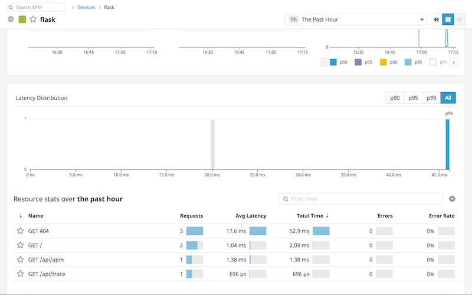

Following a similar process to creating a timeboard, we can create a publicly shareable screenboard with our APM and infrastructure graphs:

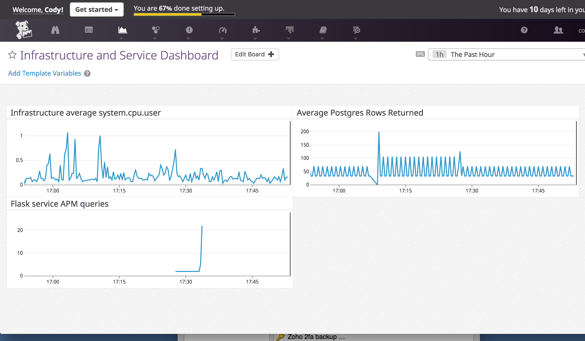

You can view my dashboard here: https://p.datadoghq.com/sb/h4trbx2raberedej-45866e4080259a6b5dcc0b82cdcb4d14

__Bonus Question__

A service is a group of processes that perform a task, such as web app that uses a Model/View/Controller architecture. A resource is a given action taken on a service, such as the route that directs a request to a respective controller in an MVC framework.


## Final Question

I would use Datadog to manage large fleets of vehicles, such as trucking companies. Utilizing logs provided by OBD2 and tire pressure sensors I'd gather metrics on each vehicle such as miles driven, oil/coolant temperatures, fuel consumption, tire pressure, and the dates & types of service the vehicle is coming due for, and send these as custom metrics to Datadog. I'd create monitors to watch for anomalous metrics and send alerts to the technicians who service the vehicles. The goal would be to detect potential mechanical failures and stay on top of maintenance to make the vehicles more reliable and cut the cost per mile to operate them.

