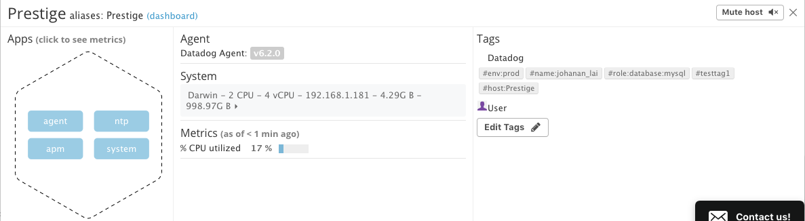
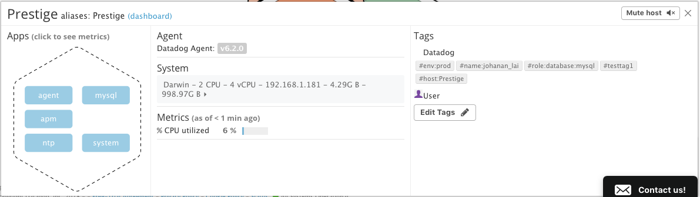
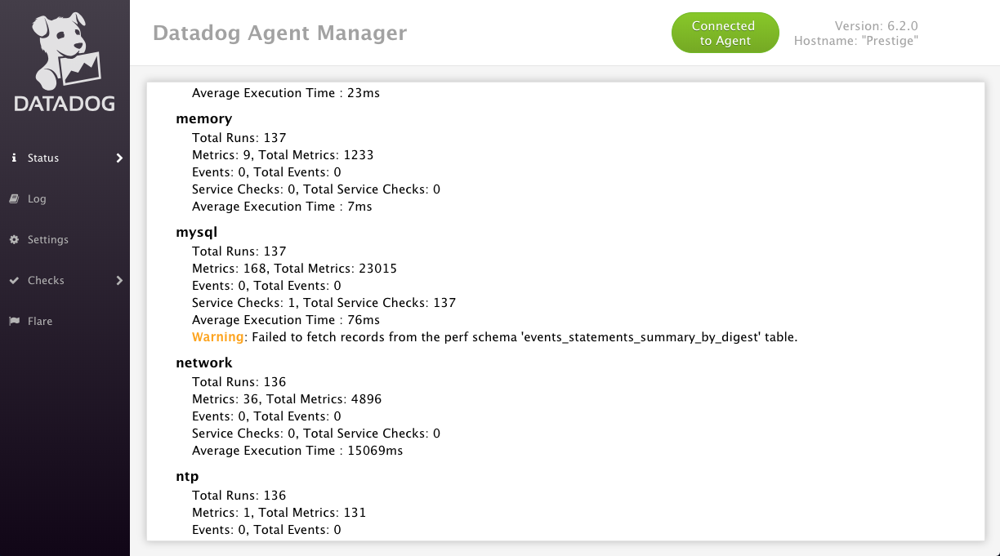
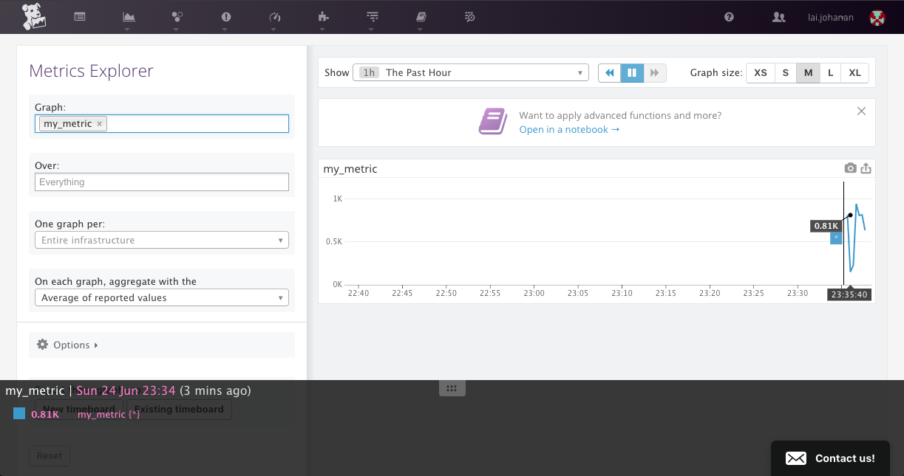
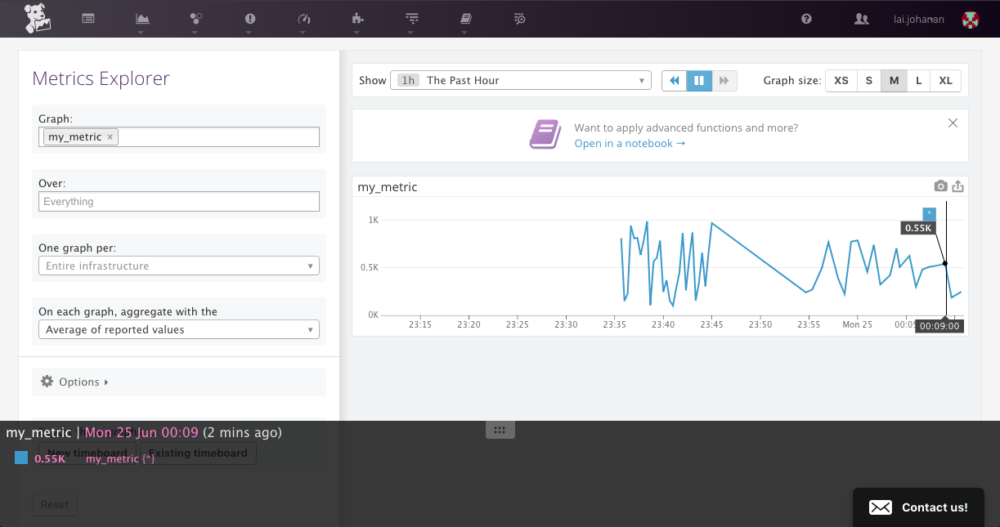

# Answers

## Prerequisites
I chose to use Docker since containers are much more lightweight than VMs; to do this, I created a container using the `datadog/agent` image, and followed Datadog's [setup documentation](https://docs.datadoghq.com/agent/basic_agent_usage/docker).

Afterwards, I installed Datadog Agent v6 on my host machine, which runs OS X.

## Collecting Metrics

### Adding tags and visualizing on the Host Map page
To add host tags, I edited the config file at `~/.datadog-agent/datadog.yaml` (which is a symlink to the real location in `/opt/datadog-agent/`) and added the following lines:

```
tags:
  - testtag1
  - env:prod
  - name:johanan_lai
  - role:database:mysql
```

I then checked the my Host Map page on Datadog to make sure that I could properly see the tags I added.



### Installing a database and Datadog integration

For this part, I chose to use MySQL; I spun up a MySQL instance with

```
docker run --name mysql01 -e MYSQL_ROOT_PASSWORD=password -p 3306:3306 -d mysql:5.6
```

and used `telnet localhost 3306` to ensure that the Datadog Agent would be able to connect to my container.

Then, I connected to my MySQL container and set up the server according to the instructions [here](https://docs.datadoghq.com/integrations/mysql/). However, the agent gave me an error saying that it "Can't connect to MySQL server". I tried:

* Using different MySQL versions/images
* Changing the `server` IP in the `conf.yaml` file from `127.0.0.1` to `localhost`, `172.17.0.1`
* Granting all privileges to the `datadog` user as a last resort

but to no avail.

After a lot of struggling and research, I found out that this was an issue specific to Docker - I had to change all instances of `localhost` to the IP address endpoint of my MySQL container, which I got promptly using `docker inspect mysql01`.

For example, instead of

```
mysql> GRANT PROCESS ON *.* TO 'datadog'@'localhost';
```

I used

```
mysql> GRANT PROCESS ON *.* TO 'datadog'@'172.17.0.1';
```

To confirm that the agent was now correctly getting metrics from my MySQL container, I checked the status of the agent with `datadog-agent status | grep mysql`, double-checking by looking at whether it showed up on both the Host Map page and the agent web UI.





### Creating a custom Agent check and changing the interval

The last part of this section required me to write a custom agent check. I headed over to the [agent documentation](https://docs.datadoghq.com/developers/agent_checks/) which showed a simple example which I modified to send a random value between 0 and 1000. To do this, I needed to create two files, `conf.d/mymetric.yaml` and `checks.d/mymetric.py`.

For `conf.d/mymetric.yaml`:

```
init_config:

instances:
    [{}]
```

For `checks.d/mymetric.py`:

```
from checks import AgentCheck
from random import randint

class MyMetricCheck(AgentCheck):
    def check(self, instance):
        self.gauge('my_metric', randint(0, 1000))
```

I quickly checked that this was working by filtering by `my_metric` in the web UI:



I also needed to change the collection interval to be at least 45 seconds, which I did by modifying `conf.d/mymetric.yaml`:

```
init_config:

instances:
    - min_collection_interval 45
```

This way, I did not need to change the Python check file and hardcode sending a metric exactly every 45 seconds.

Once again, I verified that the interval had correctly changed by checking the graph in the web UI:



## Visualizing Data

To be completed

