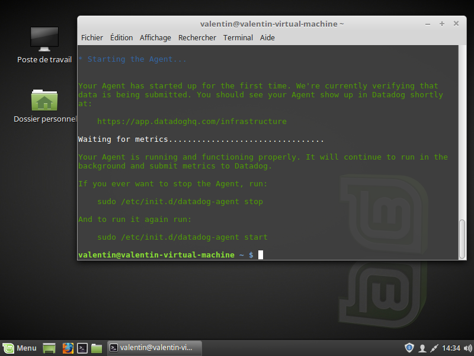
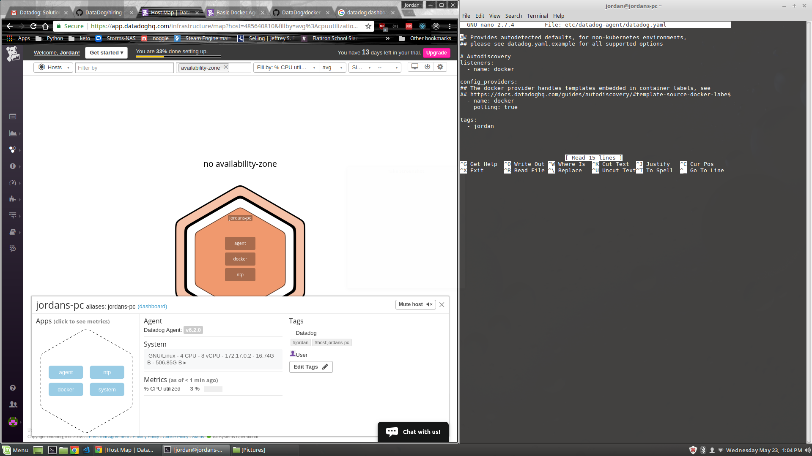
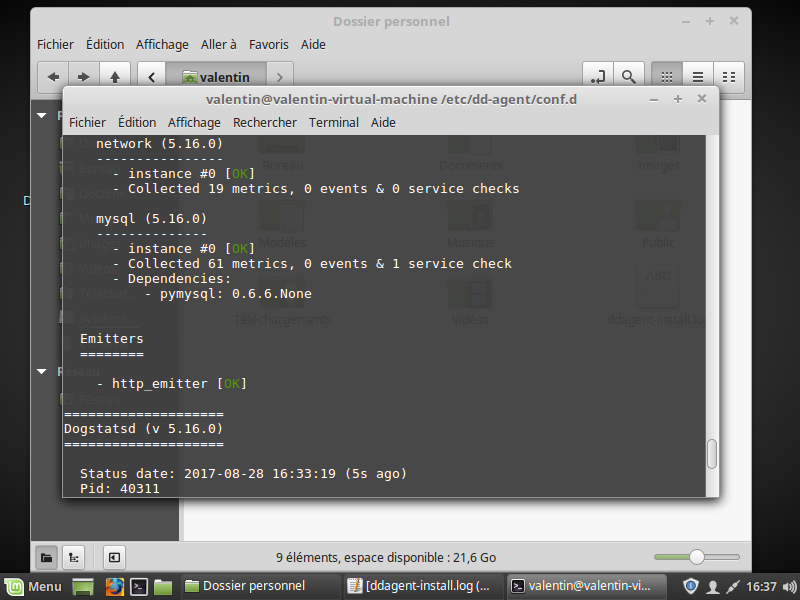
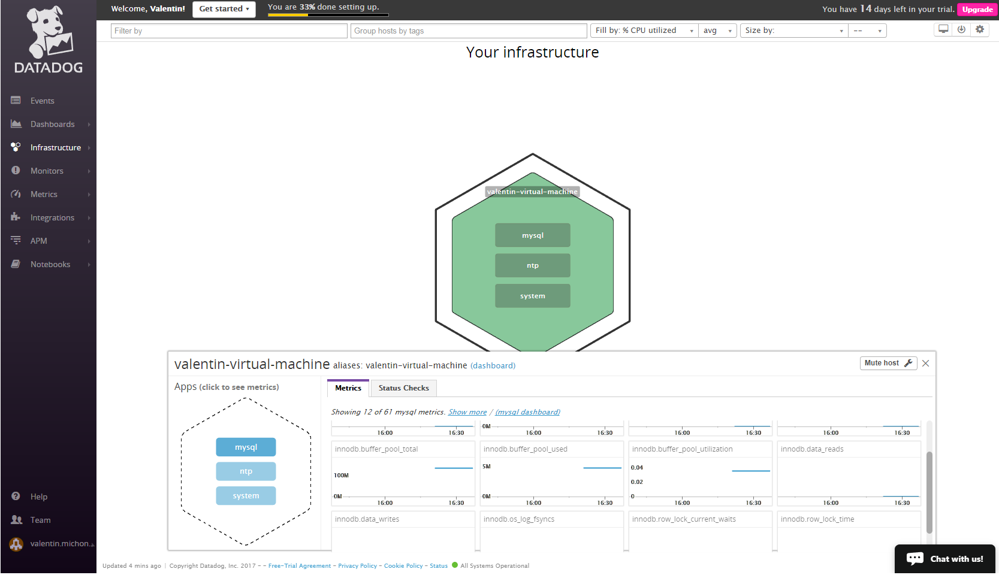
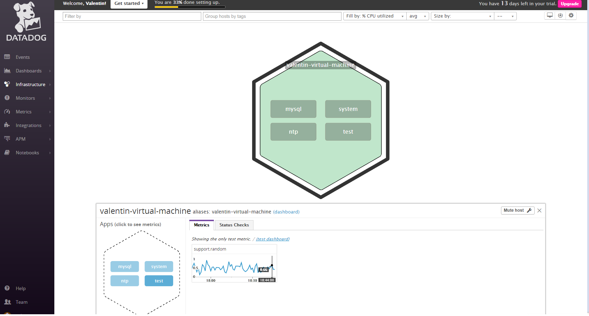
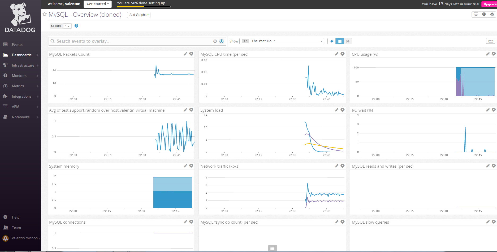
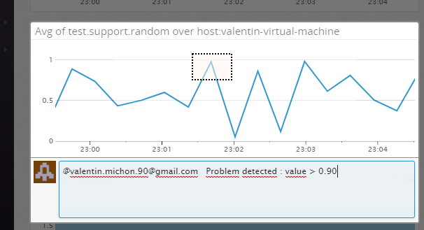

Your answers to the questions go here.

--== LEVEL 1 : Collecting your Data ==--

-- Agent Installation --

-- Bonus Question --

The Datadog Agent is a program running on the background of a host autonomously.
His job is to collect informations about the host and to send them to the DataDog Cloud where they can be see with the web platform.

-- Tag Addition --

-- Database Installation --

A Mysql base has been installed and the Datadog integration for it has been successfully configured.

-- Random Agent Check --

The files doing the check are in the directory code-files, and are named randomCheck.py and randomCheck.yaml

Here are the checks visible on the platform.

--== Level 2 - Visualizing your Data ==--

-- Database dashboard --

As seen above, the MySQL dashboard has been cloned and the graph representing the custom Agent Check metrics over time.

-- Bonus Question --

A timeboard is used to compare informations over time, it's composed of different graph, having all the same X axis of a selected lenght. A timeboard is thus used to put in parallel different metrics and to help define if there is some correlation between them.

The purpose of a screenboard is to get in one sight different informations, not necessarily connected and time-related.
It can be for instance a current value of a metric or a picture.
This kind of board is more used to share information as well, that's why it's layout can be customise.

-- Snapshot and notifications --

On the screenshots below, we can see the snapshot being taken and then, the notification recieved on my Event page.

