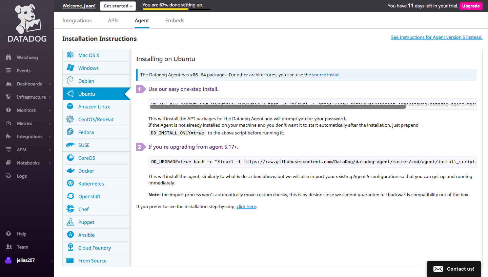
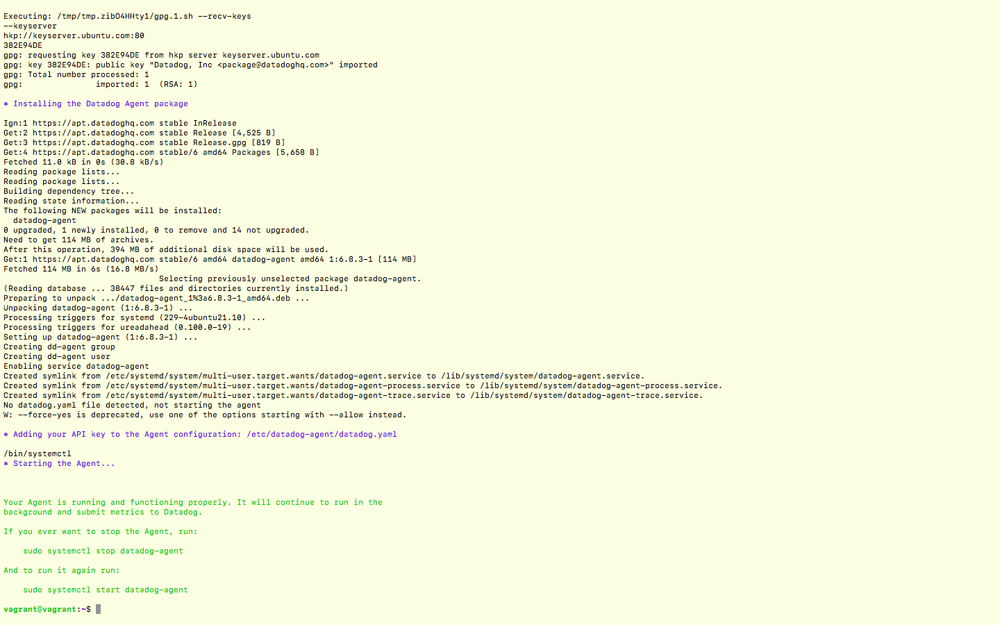
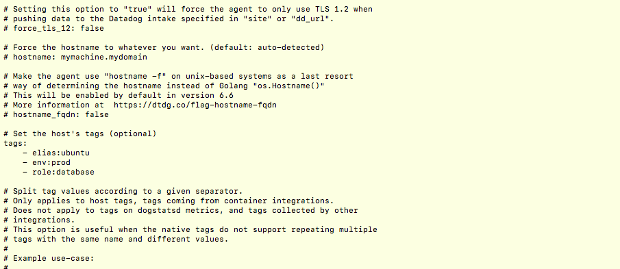
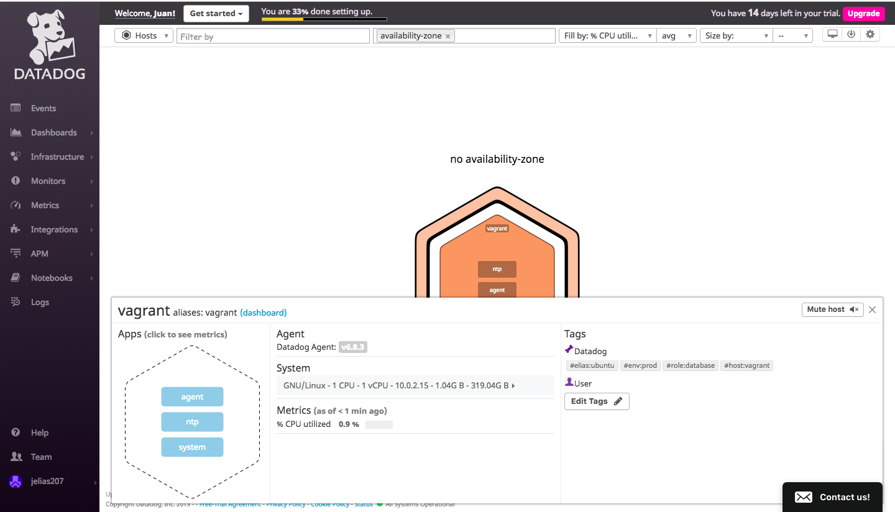
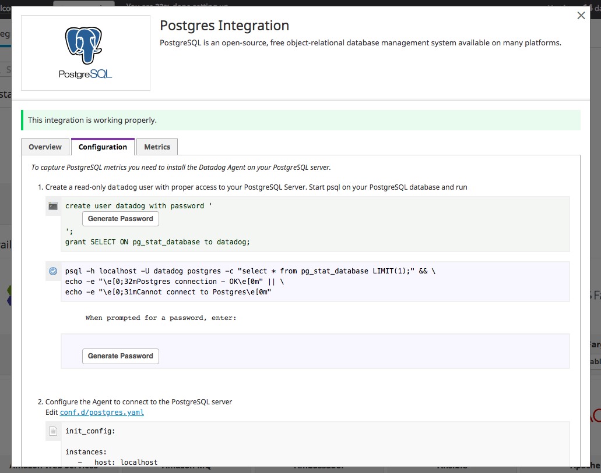
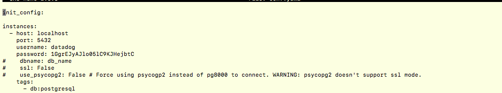
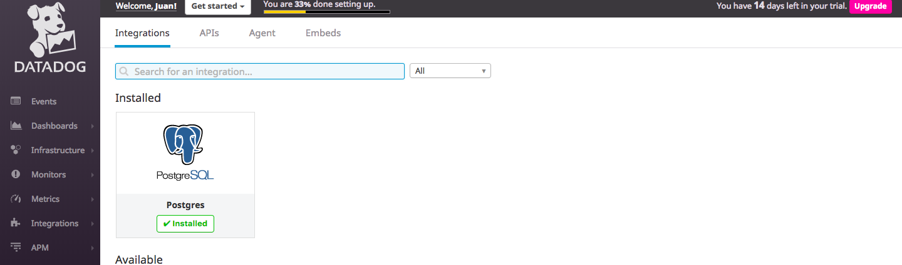

# Prerequisites - Setup the environment

To complete this exercise I had to download both [Vagrant](https://www.vagrantup.com/downloads.html) and [VirtualBox](https://www.virtualbox.org/wiki/Downloads)

After downloading both of these programs I had to install them. Using the Vagrant [Docs](https://www.vagrantup.com/intro/getting-started/project_setup.html) I figured out the commands to install them were:

1. Make a directory (which I already have one since I have this repo.)
2. `vagrant init bento/ubuntu-16.04` to create a Ubuntu 16.04 VM
3. `vagrant up` to start the VM
4. `vagrant ssh` to use the VM

After vagrant has finished installing, I signed up for Datadog and I navigated to the Integrations Tab --> Agent Tab --> Ubuntu Tab.

In this tab  you will see that Datadog gives you a on line command to type into your terminal to install the client.
`DD_API_KEY={YOUR_API_KEY} bash -c "$(curl -L https://raw.githubusercontent.com/DataDog/datadog-agent/master/cmd/agent/install_script.sh)"`

After you've typed this into the terminal that's running Vagrant, your terminal should look like this :

# Collecting Metrics

## Add tags in the Agent config file and show us a screenshot of your host and its tags on the Host Map page in Datadog.

I didn't really know what a tag was or how to implement it so I had to check out the [Tag Docs](https://docs.datadoghq.com/tagging/assigning_tags/?tab=go) which showed me how to  implement a tag using the terminal.

1. You have to `cd ..` until you hit the root directory of the VM.
2. Then navigate to `/etc/datadog-agent` . In this directory you'll find a file named `datadog.yaml`.
3. Vagrant has a built in editor named nano that we can use. We can open the file with `sudo nano datadog.yaml` You need to include the `sudo` or else you won't have permissions to change the file!

These are my tags :

Upon saving these changes , you have to restart the agent using `sudo service datadog-agent restart`. After you've restarted the agent, you can go to the Datadog web application and click the Infrastructure then click Host Map to see your tags.

This is how it should appear :

## Install a database on your machine (MongoDB, MySQL, or PostgreSQL) and then install the respective Datadog integration for that database.

The database I chose to install was PostgreSQL since I have experience using this the most . To install Postgresql on Ubuntu I simply had to refer to the [PostgreSQL docs](https://www.digitalocean.com/community/tutorials/how-to-install-and-use-postgresql-on-ubuntu-18-04). Here I was able to find the commands needed to install and run PostgreSQL.

1. `sudo apt-get update`
2. `sudo apt-get install postgresql postgresql-contrib`

Now that I've downloaded and installed PostgreSQL I can now head over to the Datadog web applications and look under Integrations to find PostgreSQL.

The directions on the Integration told to me to do the following steps :

1. create user datadog with password ( press the generate password key and your password will show up)
2. grant SELECT ON pg_stat_database to datadog;
3. I then had to navigate to `/etc/datadog-agent/conf.d/postgres.d` where I found the `conf.yaml.example` file.
4. I opened the editor using `sudo nano conf.yaml.example` and made some changes.

5. I then pressed `control x ` and nano asked me to save. I clicked yes and then renamed the file `conf.yaml` since it's no longer an example and something I need to use.

6. I restarted the Datadog Agent and ran a status check by running `sudo datadog-agent status`, and the PostgreSQL integration check was successful.

After that I went back into the browser and finished installing the PostgreSQL Integration.

