## SETUP

Once Logged in the first thing you need to do is setup the Datadog Agent.
I will show the steps required on a Mac OS.

Click on Agent Installation and choose Mac OS.
Copy the script provided and run in your terminal.

```
DD_API_KEY=<YOUR_API_KEY> bash -c "$(curl -L https://raw.githubusercontent.com/DataDog/datadog-agent/master/cmd/agent/install_mac_os.sh)"
```
This will start the download for the latest agent.
You can start/stop/restart your Datadog Agent from the menu bar by clicking on the dog bone logo.
Once downloaded the you can run the agent at login or on boot up.
By default the agent runs at Login.
if you want to run the agent on boot up you can run the following script:

```
sudo cp '/opt/datadog-agent/etc/com.datadoghq.agent.plist.example' /Library/LaunchDaemons/com.datadoghq.agent.plist
sudo launchctl load -w /Library/LaunchDaemons/com.datadoghq.agent.plist
```

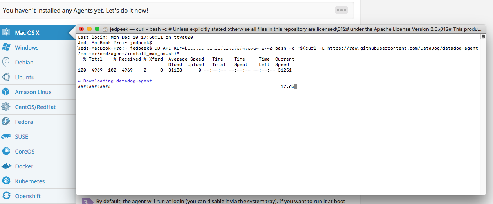

Once downloaded you should have your localhost reporting to Datadog. You can view your host map and check to make sure that your reporting information.

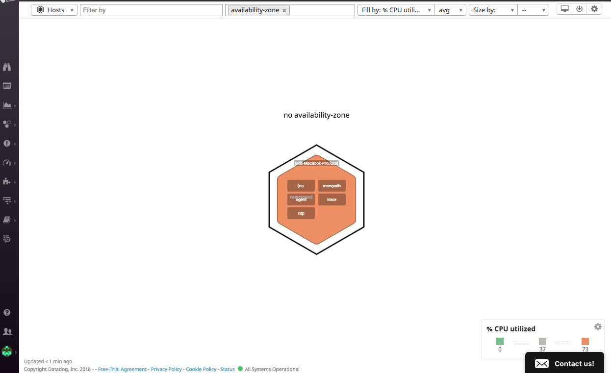

At this point you can also run ```datadog-agent status``` in the terminal to make sure your agent is up and running
This will give you information on the environment your agent is running on and other helpful information.
You should see something similar to this:

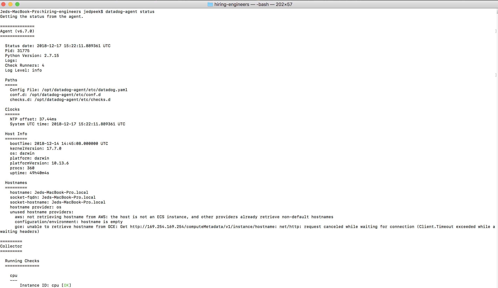


## COLLECTING METRICS
**Custom tags screenshot**
You can add custom tags to track your infrastructure. To do this locate your datadog.yaml file
mine is located in (/Users/<username>/.datadog-agent/datadog.yaml).
You can follow the format provided in the example. Tags should be provided as <key>:<value> pair.


**MongoDB installed and mongo/conf.yaml filed created**

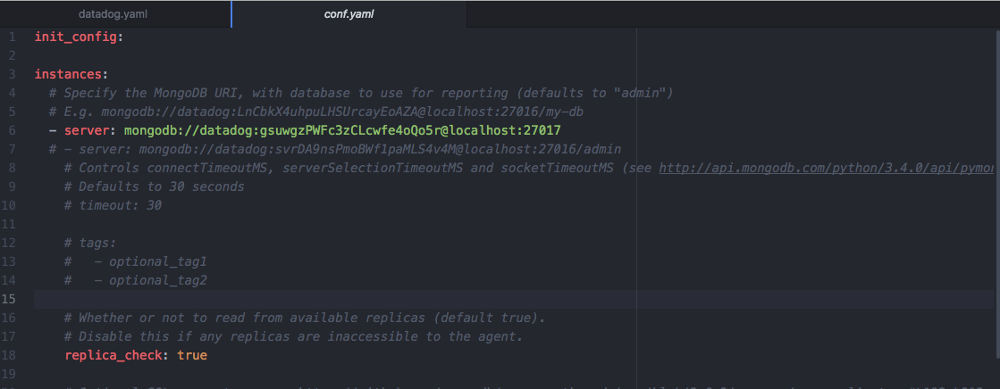

**my_metric created**

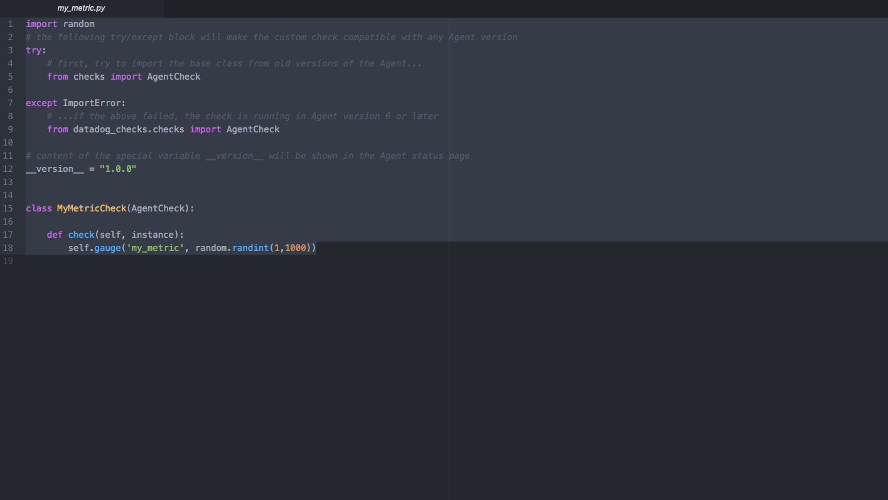


**Collection interval set to 45 using my_metric.yaml file**

By changing your metrics yaml file you can customize the collection interval using min_collection_interval.

```
init_config:

instances:
  - min_collection_interval: 45
  ```

## VISUALIZING DATA

[API Dashboard](https://app.datadoghq.com/dash/1021540/apimetrics?tile_size=m&page=0&is_auto=false&from_ts=1545081000000&to_ts=1545084600000&live=true)

Ruby Script used to build/update Dashboard with Datadog API: [dog_api](dog_api.rb)

1. my_metric scoped over Jeds-MacBook-Pro.local
```
"q": "avg:my_metric{host:Jeds-MacBook-Pro.local}"

```

2. Available MongoDb Connections
```
"q" => "anomalies(avg:mongodb.connections.available{server:mongodb://datadog:_localhost:27017}, 'basic', 2)"
```

3. All Custom Metric points for last hour
```
"q" => "sum:my_metric{host:Jeds-MacBook-Pro.local}.rollup(sum, 3600)"
```


**What is the Anomaly graph displaying?**

The anomaly graph is displaying a blue line representing the number of MongoDB connections available. The blue line is buffered by a gray area representing the acceptable area of deviation from the average number of connections. If the number of connections is greater than or less than the gray area, the size of which is controlled by the bounds parameter, the line will turn red representing an anomaly in the data. After a period of having a large number of connections to the Mongo database the anomaly graph has shifted representing a change in the expected behavior.


## MONITORING DATA

Thresholds can be set on a metric to either warn you to keep and eye on it or alert you that something more serious is happening. These can be set using the Datadog monitoring tools.
Here we have an example of a notification message for the my_metric metric. Using a monitor you can have a single message that varies depending on what type of notification needs to be sent.
If the monitor is triggered with an alert, all contents in between {{#is_alert}} and {{/is_alert}} will be sent to the specified team member(s). The same is true for {{is_warning}} and {{is_no_data}}.

```
{{#is_alert}}ALERT threshold of {{threshold}} exceeded. My_Metric has reached {{value}} {{/is_alert}}
{{#is_warning}}WARNING threshold of {{warn_threshold}} exceeded. My_Metric has reached {{value}} {{/is_warning}}
{{#is_no_data}}My_Metric data missing{{/is_no_data}}
My_Metric was last triggered at: {{last_triggered_at}}
@jedpeek@gmail.com
```

In this example an alert threshold of 800 was set. If my_metric exceeds 800 @jedpeek@gmail.com will receive an email that reads:

**ALERT**

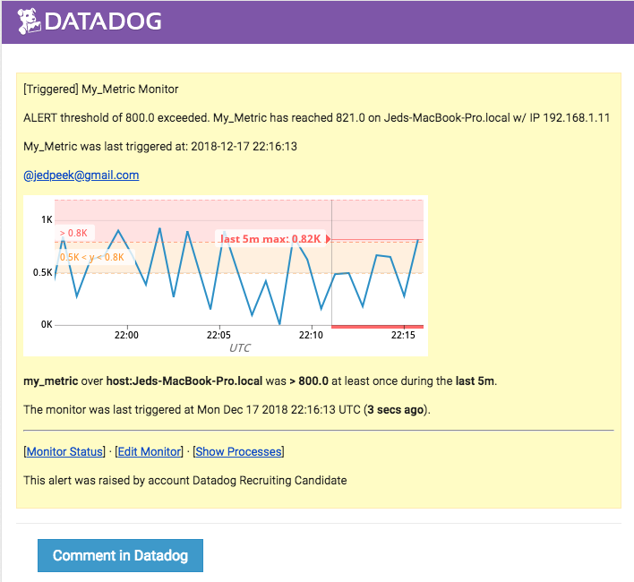

**WARNING**

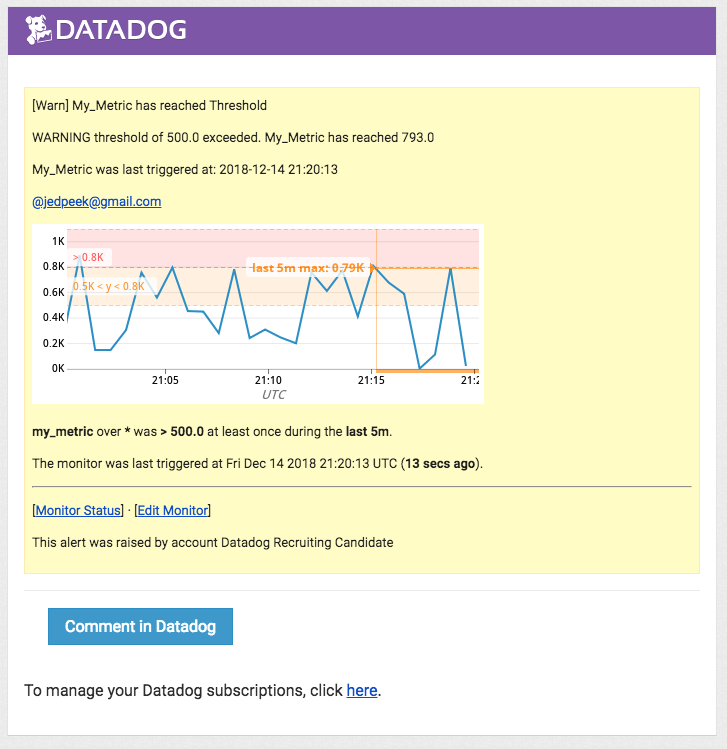

**Setting Downtimes**

Downtimes can also be set so you are not bothered during your time off. Here are examples of daily and weekend downtimes.

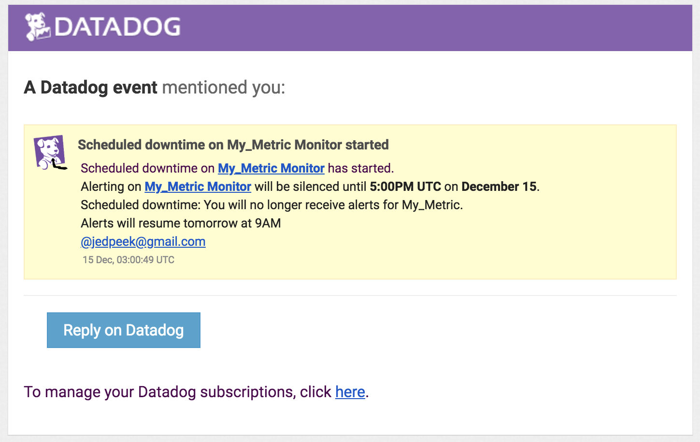

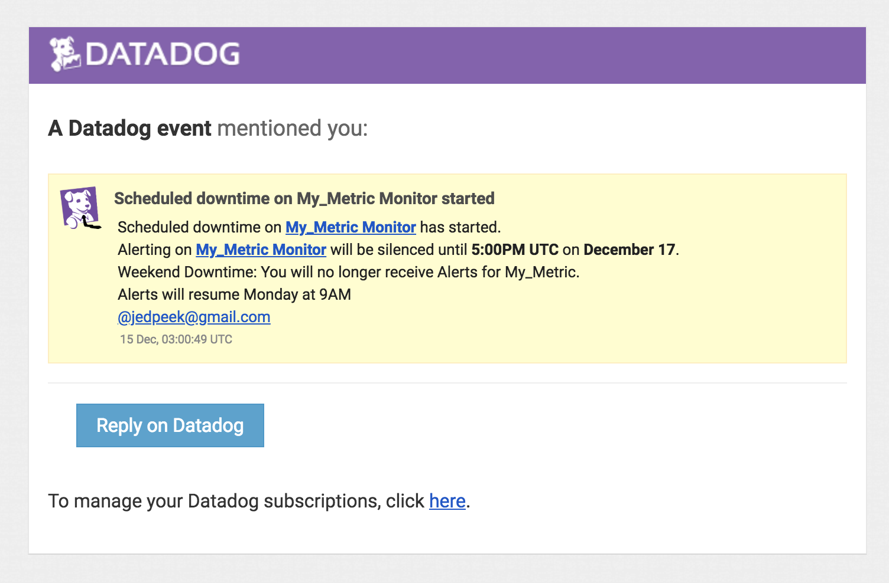


## COLLECTING APM DATA

Since we're running on MacOS we need to install a separate [Trace Agent](https://github.com/DataDog/datadog-trace-agent#run-on-osx) to collect APM data for our applications.
Once you've downloaded the files([Download Here](https://github.com/DataDog/datadog-trace-agent/releases/tag/6.7.0)) you need to get the trace agent up and running. You can do this from the terminal by moving into the directory that the trace agent is located (I moved mine into my Datadog agent file) and run a script similar to this: ``` sudo ./trace-agent-darwin-amd64-6.7.0 -config /Users/jedpeek/.datadog-agent/datadog.yaml ```

This if for trace agent 6.7.0. Make sure you use the path to your datadog.yaml file following -config.
Since this is a sudo command it will also require your system password.

Once your Trace Agent is up and running you should receive an output similar to this

[Datadog Trace Output](DATADOG_SCREENSHOTS/DD_TRACE_OUTPUT.png)

Once your trace agent is up and running you'll need to setup your application to start communicating with Datadog.
I used a simple Rails application and configured it using the ddtrace gem. Add the ddtrace gem to your gemfile and run bundle install. Then create a config/initializers/datadog.rb file and insert the following:

```
require 'ddtrace'
Datadog.configure do |c|
  # This will activate auto-instrumentation for Rails
  c.use :rails
end
```

Once you have your app up and running you should begin to see both service and resource level metrics being tracked under the APM services tab.

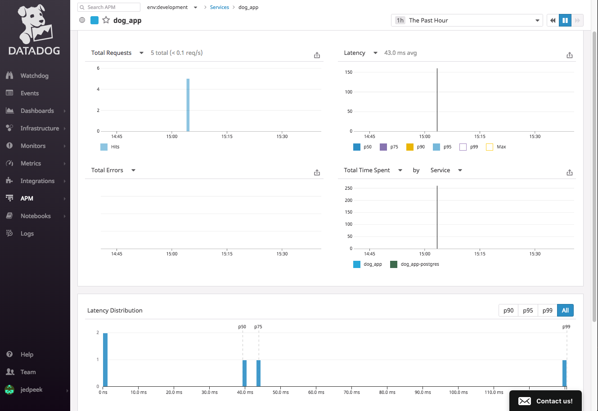

Here we have both APM and Infrastructure metrics on a single dashboard.

[APM and Infrastructure Dashboard](https://app.datadoghq.com/dash/1022589/infrastructure-and-apm?tile_size=m&page=0&is_auto=false&from_ts=1545080940000&to_ts=1545084540000&live=true)

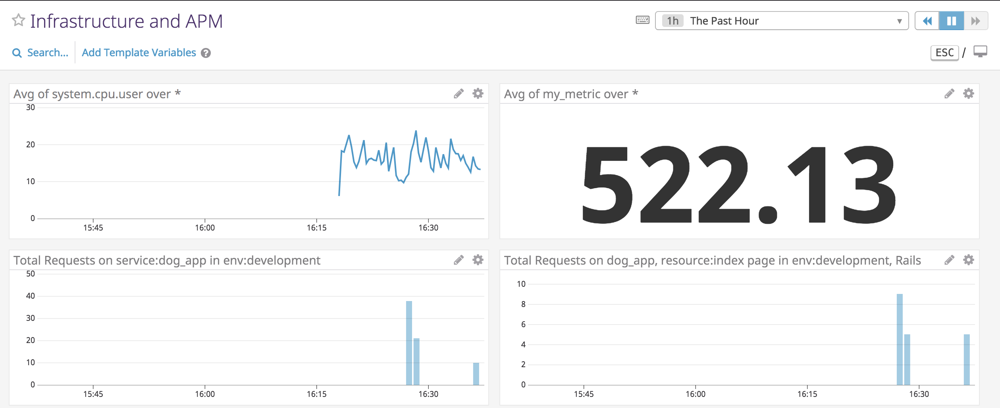

**What is the difference between a Service and a Resource?**
A service is a set of processes that do a job. Examples include web applications and databases.
A resource is an action that takes place inside a service. Examples include routes in a web app and database queries. In the above example dashboard I have two timeseries, one tracking all requests on my web application (service metrics) and one tracking just my index root path (Resource metrics).

## CREATIVE USES

As someone who has always been a fan of gardening but was not gifted with a green thumb, building a raspberry Pi connected to Datadog alerts would give me the help I need. Alerts would be triggered whenever the plants being monitored need to be watered (soil moisture too low) or they are not getting enough sun.
Tools needed for the job:

1. A Raspberry Pi

2. Solar Panel - Using a solar panel for both powering the raspberry Pi and tracking the amount of direct sunlight on the plants would take care of one of the major aspects of gardening, choosing the right placement for your plants. [SunControl for Raspberry Pi](https://www.kickstarter.com/projects/sunair/suncontrol-diy-solar-power-for-the-raspberry-pi-ar)

3. A Moisture gauge. These can be found at any gardening or home store (or Amazon). [Moisture Meter](https://www.amazon.com/Moisture-Gardens-Sensor-Flowers-Vegetable/dp/B07DL1V4V9/ref=asc_df_B07DL1V4V9/?tag=hyprod-20&linkCode=df0&hvadid=242120314056&hvpos=1o16&hvnetw=g&hvrand=2686245420727738238&hvpone=&hvptwo=&hvqmt=&hvdev=c&hvdvcmdl=&hvlocint=&hvlocphy=9031341&hvtargid=pla-486737576574&psc=1)

5. A Reed switch to gather to attach to our moisture gauge (I have an old one from a cycling speedometer).
