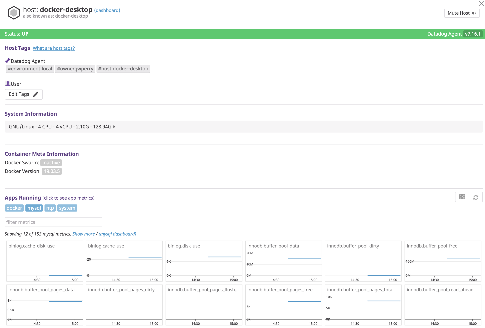
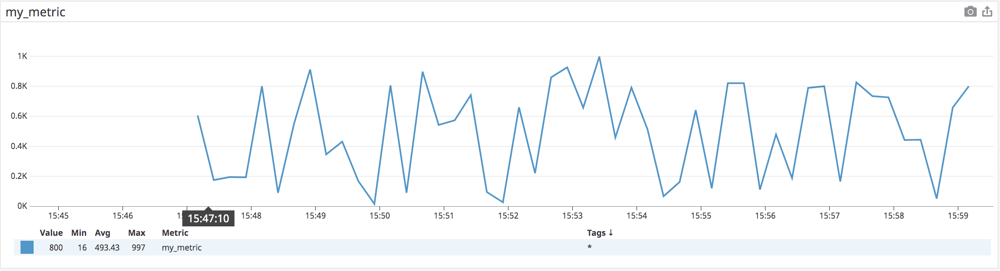
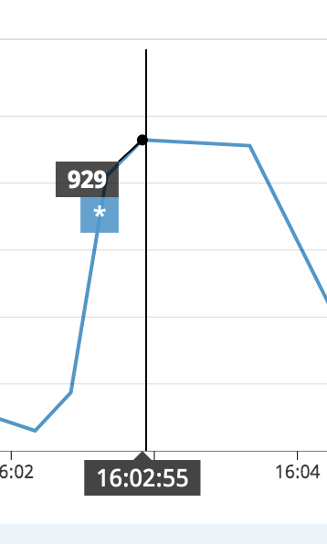
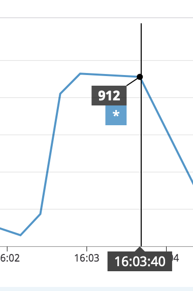
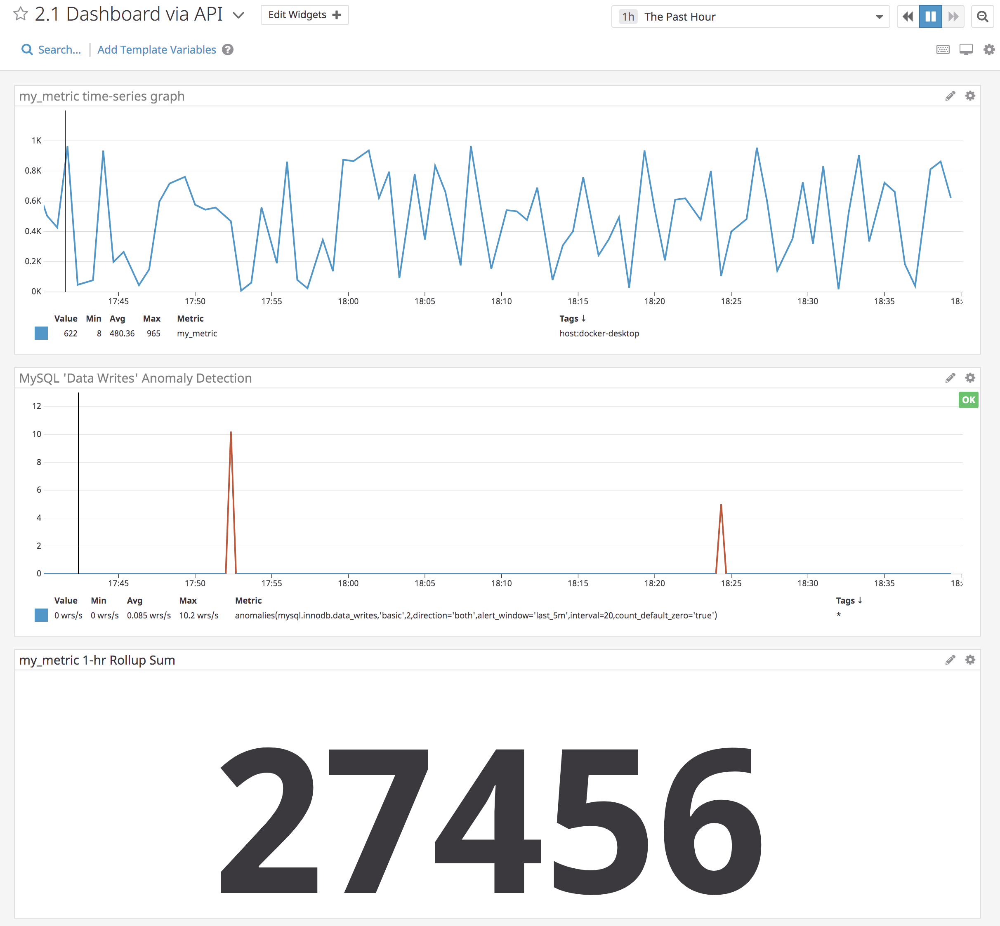
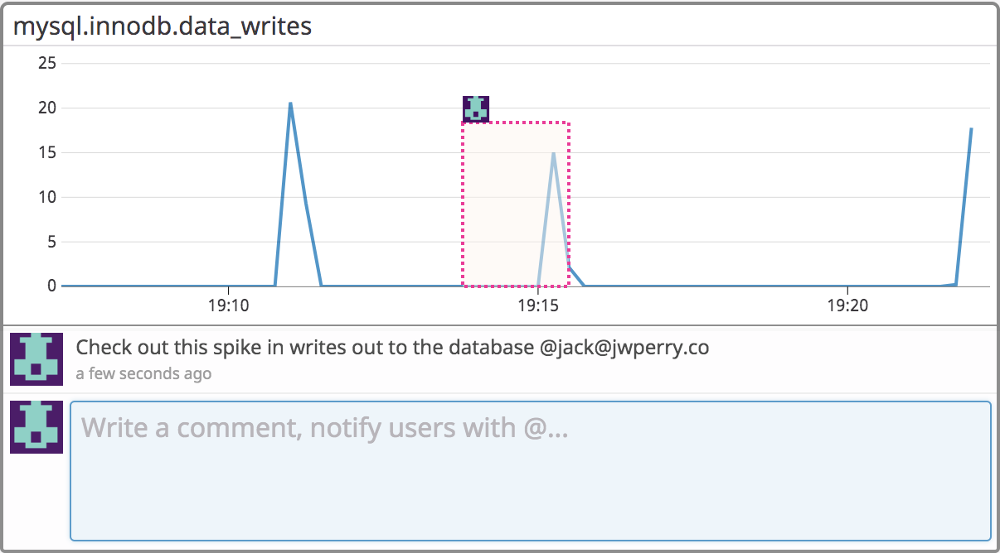
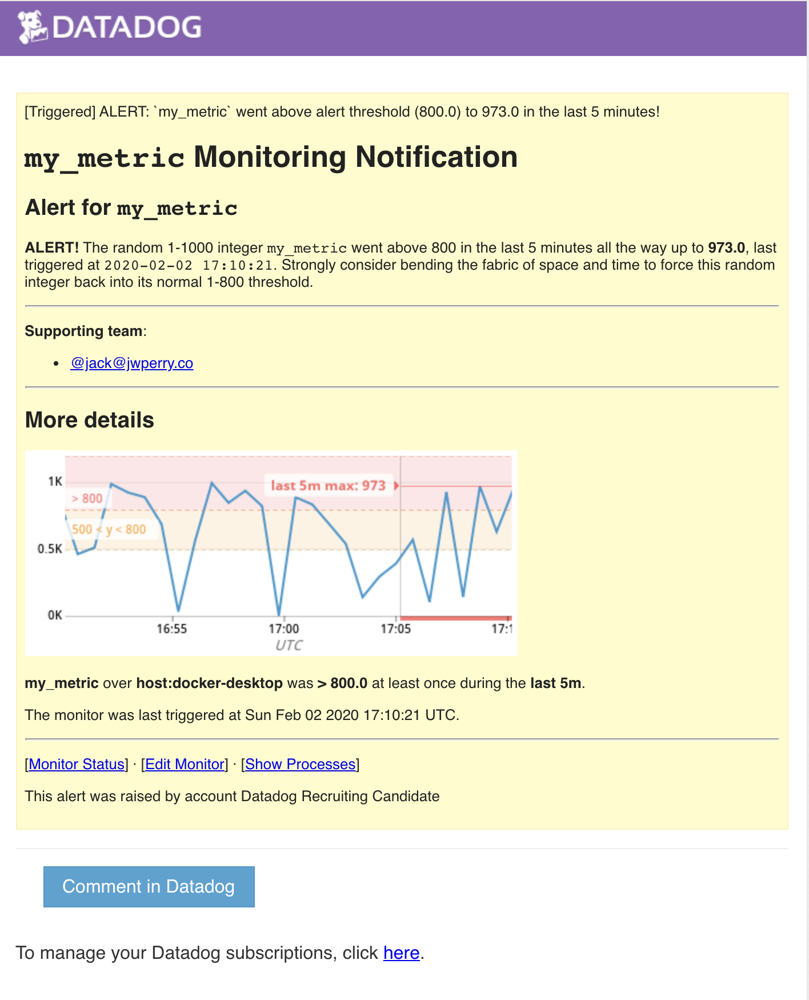
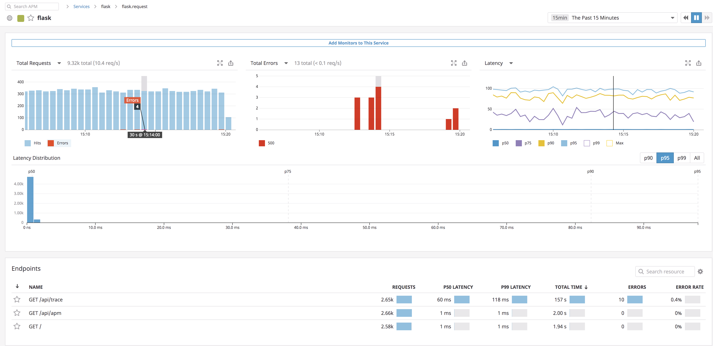
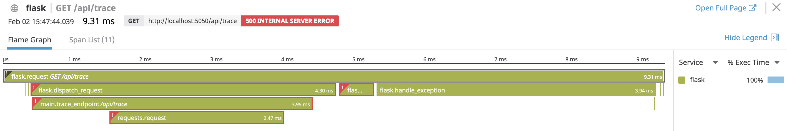

# Datadog Sales Engineer Hiring Assignment
**Author**: Jack Perry

___

## Prerequisites - Setup the environment
I'm reasonably comfortable with Docker, so I opted to follow the [Docker Agent](https://docs.datadoghq.com/agent/docker/?tab=standard) documentation to get a Docker Agent up and running.

The command I used to start up the container is in [`run_datadog_docker.sh`](run_datadog_docker.sh) ([`docker_ssh`](docker_ssh.sh) is just the command I used to SSH into the Docker Agent's container).

___

## 1 Collecting Metrics

> 1.1 Add tags in the Agent config file and show us a screenshot of your host and its tags on the Host Map page in Datadog.

**Key documentation**:
* [Assigning Tags](https://docs.datadoghq.com/tagging/assigning_tags/?tab=agentv6v7)
* [Agent Configuration Files](https://docs.datadoghq.com/agent/guide/agent-configuration-files/?tab=agentv6v7)

Tags can be assigned easily to Datadog Agents by adding/modifying a few lines in their `datadog.yaml` config files. In addition to the reserved tags (`host`, `device`, `source`, and `service`), I figured two more might be useful:

* `owner` to indicate who owns/manages the Agent
* `environment` to indicate the environment in which that particular Agent is running

The sky is the limit with tags. They're used nearly everywhere in the Datadog platform to [provide further granularity to dashboards, monitors, and more](https://docs.datadoghq.com/tagging/#using-tags). This hiring assignment didn't have me spinning up multiple Datadog Agents. But if it did, tags would allow me to easily differentiate between Agents throughout the assignment.

Contents of `/etc/datadog-agent/datadog.yaml`:
```yaml
## Provides autodetected defaults, for vanilla Docker environments,
## please see datadog.yaml.example for all supported options

# Autodiscovery settings for vanilla Docker
listeners:
  - name: docker
config_providers:
  - name: docker
    polling: true
    poll_interval: 1s
tags:
  - owner:jwperry
  - environment:local

# Enable APM by setting the DD_APM_ENABLED envvar to true, or override this configuration
apm_config:
  enabled: false
  apm_non_local_traffic: true

# Use java container support
jmx_use_container_support: true
```

After adding these tags to `datadog.yaml`, I restarted the Agent's Docker container and saw the changes propagate to my host in the Host Map:

")

> 1.2 Install a database on your machine (MongoDB, MySQL, or PostgreSQL) and then install the respective Datadog integration for that database.

**Key documentation**:
* [Integrations > MySQL](https://docs.datadoghq.com/integrations/mysql/#setup)

Time to give my Agent some more infrastructure to report on! I went ahead with MySQL by installing MySQL Community Server 8.0.19 and creating a database called `datadog_db`. Following the MySQL Integration instructions was straightforward and just required creation of a config file for MySQL (`/etc/datadog-agent/conf.d/mysql.d/conf.yaml`). 

Since my Datadog agent was running in a Docker container, I configured the server as `host.docker.internal`, rather than the `127.0.0.1` recommended in the documentation (though I may have just been able to use port mapping to successfully use `127.0.0.1`).

Contents of `/etc/datadog-agent/conf.d/mysql.d/conf.yaml`:
```yaml
init_config:

instances:
- server: host.docker.internal
  user: datadog
  pass: 'password'
  port: 3306
  options:
      replication: false
      galera_cluster: true
      extra_status_metrics: true
      extra_innodb_metrics: true
      extra_performance_metrics: true
      schema_size_metrics: false
      disable_innodb_metrics: false
```

After another Agent restart, I could see a new app running labeled `mysql` along with dozens of new metrics:



> 1.3 Create a custom Agent check that submits a metric named my_metric with a random value between 0 and 1000.

**Key documentation**:
* [Writing a custom agent check](https://docs.datadoghq.com/developers/write_agent_check/?tab=agentv6v7)

This is really where doors started opening in my head. While this assignment had me reporting perhaps the simplest possible metric from a Python script (integer between 0-1000), I could imagine potential uses for custom checks, like process/memory information via the `os` library.

To implement the simple 0-1000 check, I created a "test_check" prefixed with `custom_` (per best practices in the documentation) by first adding a `custom_test_check.yaml` config file to the `conf.d` directory of the Agent:

Contents of `/etc/datadog-agent/conf.d/custom_test_check.yaml`:
```yaml
instances: [{}]
```

And then I added a `.py` file to the `checks.d` directory with the **same name** (`custom_test_check.py`):

```python
from random import randint

try:
    from datadog_checks.base import AgentCheck
except ImportError:
    from checks import AgentCheck

__version__ = "1.0.0"

class HelloCheck(AgentCheck):
    def check(self, instance):
        random_gauge = randint(0, 1000)
        self.gauge('my_metric', random_gauge, tags=['check_group:test'])
```

More tags, too!

With another Agent restart, I immediately started seeing `my_metric` reporting within Datadog in the Metrics Explorer:



The time-series graph is exactly what we should expect, bouncing randomly between its 0-1000 bounds every 15 seconds (the default reporting period).

> 1.4 Change your check's collection interval so that it only submits the metric once every 45 seconds.

Tweaking the minimum collection interval of a custom check was as simple as modifying the `.yaml` configuration file already created in the task above.

Revised contents of `/etc/datadog-agent/conf.d/custom_test_check.yaml`:
```yaml
init_config:

instances:
  - min_collection_interval: 45
```

After another Agent restart, the `my_metric` reporting interval changed in the same graph as above from 15 seconds to 45 seconds. Two screenshots showing the timestamps of subsequent checks illustrate the updated, longer interval:

 

> 1.5 **Bonus Question** Can you change the collection interval without modifying the Python check file you created?

I'll be honest -- after a search through the [`datadog_checks_base` documentation](https://datadog-checks-base.readthedocs.io/en/latest/?badge=latest), the [Writing a custom Agent check](https://docs.datadoghq.com/developers/write_agent_check/?tab=agentv6v7) documentation, and some Google searches, this was already the only way I could find to change the minimum collection interval of a custom check. It's very helpfully and prominently explained in the Write a Custom Check documentation. 

___

## 2 Visualizing Data

> 2.1 Utilize the Datadog API to create a Timeboard that contains...
> * Your custom metric scoped over your host
> * Any metric from the Integration on your Database with the anomaly function applied
> * Your custom metric with the rollup function applied to sum up all the points for the past hour into one bucket

**Key documentation**:
* [Anomaly Monitor](https://docs.datadoghq.com/monitors/monitor_types/anomaly/)
* [API Reference: Create a Monitor (Python)](https://docs.datadoghq.com/api/?lang=python#create-a-monitor)
* [API Reference: Create a Dashboard (Python)](https://docs.datadoghq.com/api/?lang=python#create-a-dashboard)

Now we're starting to put everything together in one place. Dashboards can glue application teams together, empower DevOps teams, and delight customers. This particular exercise hardly got my feet wet.

I opted to use the **Python** API to generate these items for our Timeboard (with help from the documentation mentioned above). While this end result in this exercise could've been accomplished using the Datadog UI, the API offers a powerful and flexible tool to scale Datadog monitoring to hundreds or thousands of Agents, metrics, visualizations, and more. I could deploy applications that automatically generate new monitors and dashboards for themselves, for example, drastically speeding up application delivery time. Similarly, I could batch-update Dashboards programmatically.

Two of the items on the timeboard are fairly self explanatory. One simply shows `my_metric` over time, and another shows anomalies in another metric (database writes). The third, though, is quite different -- it's just the result of a math equation! Dashboards aren't all graphs and visualizations. In many cases, a big, bold, summary statistic conveys important information faster and more prominently than another visualization could. In this case, I essentially sum `my_metric` checks over the past hour.

To see how I created this particular Timeboard, refer to [`code/2.1/timeboard.py`](code/2.1/timeboard.py). [Here's a link to the dashboard](https://app.datadoghq.com/dashboard/jaf-7v3-m9t/21-dashboard-via-api), and here are the results:



Since no application is actually using the database (resulting in the vast majority of MySQL metrics flatlined by 99% of the time), I artificially created "anomalies" by creating a dummy table with an auto-incrementing primary key and spamming it occasionally with `INSERT`s.

> 2.2 Once this is created, access the Dashboard from your Dashboard List in the UI:
> * Set the Timeboard's timeframe to the past 5 minutes
> * Take a snapshot of this graph and use the @ notation to send it to yourself.
> * **Bonus Question**: What is the Anomaly graph displaying?

Anomalies are hardly ever a good thing (at least in the IT infrastructure and DevOps sense). Thanks to anomaly monitoring and share features, responding in near real time to an anomalous event is simple and easy.

**Note**: *From the Dashboard, I was able to set the timeframe for all widgets to that last 5 minutes by manually grabbing 5-minute portions of the screen (and ensuring results were coming in "live", rather than stuck in "paused"). However, I wasn't able to find the **Annotate** feature from within that dashboard. Following along in the [Sharing documentation](https://docs.datadoghq.com/dashboards/sharing/), while all of the graphs on my Timeboard had the "pencil" icon, it only led to Sharing options for the two `my_metric` graphs -- not the MySQL Anomaly graph. I have a feeling this is due to the MySQL Anomaly graph being from a **monitor** rather than a **metric**.*
")

That said, I was able to annotate any of the graphs in the **Metrics Explorer**, and it was ridiculously easy. Point, click, drag, type a comment/mention. That's the kind of simplicity I would really appreciate when an important service I own appears to be on fire and I'm trying to quickly engage my team. For example:



In theory, the **Anomaly graph** is displaying a few things:
    1. Some metric (in this case, `mysql.innnodb.data_writes`)
    2. A trigger window (in gray) indicating the acceptable bounds for a metric over time
        - This trigger window is generated by one of [three anomaly detection algorithms](https://docs.datadoghq.com/monitors/monitor_types/anomaly/#anomaly-detection-algorithms)
    3. Anomalies (in red), if present
        - i.e. any data points outside of the gray trigger window

In practice, the unrealistic, low-volume data set doesn't really show off those three things particularly well for the `mysql.innnodb.data_writes` metric.

___

## 3 Monitoring Data

> 3.1 Since you’ve already caught your test metric going above 800 once, you don’t want to have to continually watch this dashboard to be alerted when it goes above 800 again. So let’s make life easier by creating a monitor.
> Create a new Metric Monitor that watches the average of your custom metric (my_metric) and will alert if it’s above the following values over the past 5 minutes:
> * Warning threshold of 500
> * Alerting threshold of 800
> * And also ensure that it will notify you if there is No Data for this query over the past 10m.

> Please configure the monitor’s message so that it will:
> * Send you an email whenever the monitor triggers.
> * Create different messages based on whether the monitor is in an Alert, Warning, or No Data state.
> * Include the metric value that caused the monitor to trigger and host ip when the Monitor triggers an Alert state.
> * When this monitor sends you an email notification, take a screenshot of the email that it sends you.
> * **Bonus Question**: Since this monitor is going to alert pretty often, you don’t want to be alerted when you are out of the office. Set up two scheduled downtimes for this monitor:
>   * One that silences it from 7pm to 9am daily on M-F,
>   * And one that silences it all day on Sat-Sun.
>   * Make sure that your email is notified when you schedule the downtime and take a screenshot of that notification.

**Key documentation**:
* [Monitors > Metric Monitor](https://docs.datadoghq.com/monitors/monitor_types/metric/?tab=threshold)
* [Alerting > Notifications](https://docs.datadoghq.com/monitors/notifications/?tab=is_alertis_warning#message-template-variables)
* [Alerting > Downtimes](https://docs.datadoghq.com/monitors/downtimes/)

With the vast array of data available from various hosts, Agents, and more with different tags, etc., Datadog provides automated ways to filter out the noise and proactively extract the data we deem important. While `my_metric` is just a random number out of our control, I can imagine plenty of more realistic candidates for monitoring, like the MySQL database write operations tracked in the Timeboard above.

Using the documentation above, I set up monitoring for our random `my_metric` that sends out notifications when it inevitably reports over the `500` and `800` thresholds. Notification setup provides enough flexibility via template variables to produce concise, information-rich, and actionable notifications based on a number of events (in this case, a metric reporting above a threshold at least once).

And since we should be just as concerned about "troublesome" data being reported as we should about *no data being reported at all*, this `is_no_data` scenario is captured in this notification as well.

Here's the notification summary/title (set up for one of three conditions: alert status, warning status, or no-data status):

```markdown
{{#is_alert}}ALERT: `my_metric` went above alert threshold ({{threshold}}) to {{value}} in the last 5 minutes!{{/is_alert}}{{^is_alert}}{{^is_no_data}}WARNING: `my_metric` went above warning threshold ({{threshold}}) to {{value}} in the last 5 minutes!{{/is_no_data}}{{/is_alert}}{{#is_no_data}}NO DATA: `my_metric` hasn't reported for 10 minutes!{{/is_no_data}}
```

And the notification body, configured similarly:

```markdown
# `my_metric` Monitoring Notification

{{#is_alert}}{{^is_no_data}}##Alert for `my_metric`

**ALERT!** The random 1-1000 integer `my_metric` went above 800 in the last 5 minutes all the way up to **{{value}}**, last triggered at `{{last_triggered_at}}`. Strongly consider bending the fabric of space and time to force this random integer back into its normal 1-800 threshold.{{/is_no_data}}{{/is_alert}}

{{^is_alert}}{{^is_no_data}}##Warning for `my_metric`

**Warning**: the random 1-1000 integer `my_metric` has crept up above 500 all the way up to **{{value}}**, last triggered at `{{last_triggered_at}}`. Monitor this carefully before it creeps all the way up into "alert" territory!{{/is_no_data}}{{/is_alert}}

{{#is_no_data}}##No data for `my_metric`

**NO DATA!** Uh oh. Looks like there's been no data reported for this metric in the last 10 minutes. Have you tried turning it off and back on again?{{/is_no_data}}

___

**Supporting team**:

* @jack@jwperry.co 

___
## More details
```

Just a few minutes later, `my_metric` reported a value that met "Alert" conditions (800-1000):

Result:


Considering how frequently this alert is expected to fire off, Datadog mercifully provides flexible, transparent "downtime" scheduling. While downtime can be scheduled ad-hoc, for this exercise, I configured recurring downtime for weekdays outside working hours and weekends:

 

___

## 4 Collecting APM Data

> 4.1 Given the following Flask app (or any Python/Ruby/Go app of your choice) instrument this using Datadog’s APM solution
> **Bonus Question**: What is the difference between a Service and a Resource?

**Note**: *It's here that I had to tear down the Docker app hosting my Datadog Agent so that I could add `DD_APM_ENABLED=true` and port mappings to the `docker run` script (`run_datadog_docker.sh`). In hindsight, I realize now I could've just stopped the container and tweaked both environment variables and port mappings from IntelliJ's Docker tool (among other ways). I then could have simply restarted the container without losing the changes made to the Datadog Agent in the previous parts of this exercise (adding `my_metric`, MySQL database checks). **As a result, no more live data is being reported as a result of changes made earlier in this exercise**. Probably a moot point since I'll tear all this down after exercise completion regardless.*

**Key documentation**:
* [APM & Distributed Tracing](https://docs.datadoghq.com/tracing/)
* [Tracing Python Applications](https://docs.datadoghq.com/tracing/setup/python/)
* [APM Glossary & Walkthrough](https://docs.datadoghq.com/tracing/visualization/)

The Datadog Python API made it dead simple to enable tracing for this sample Flask app (documentation above). After installing the `ddtrace` library, I simply ran the Python app with `ddtrace-run` (see [`code/4/run.sh`](code/4/run.sh)). I decided to spice things up a bit though to better illustrate Datadog's tracing capabilities. I created a script ([`code/4/request_generator.py`](code/4/request_generator.py)) to generate requests to each of the three endpoints in [`code/4/main.py`](code/4/main.py). Then I tweaked the `/api/apm` endpoint in `main.py` to call out to a "dummy" service dependency ([`code/4/dummy_dependency.py`](code/4/dummy_dependency.py)). This dummy service would fail randomly by returning a `500` response to the main Flask app and add a variable amount of latency to the whole process.

[Link to **Flask** APM](https://app.datadoghq.com/apm/service/flask/flask.request?end=1580675399533) (the interesting bits occur between 14:36:00 2-Feb - 16:36:00 2-Feb)



While this setup wasn't sophisticated enough to highlight other Datadog features like metric correlation, it was enough to show off its core tracing feature (in this case, for an "Error"):



In a broad (likely oversimplified) sense, *resources* make up *services*, which make up *applications*. Resources offer the most granular insight into how the various components, or "domains," of a service are performing. A Flask application ("service"), for example, has many "resources", e.g. a request-handling resources, a user-exception handling resource, authorization resource, etc. This Flask service in turn is (likely) part of a broader application's microservice architecture."

___

## 5 Final Question

> Datadog has been used in a lot of creative ways in the past. We’ve written some blog posts about using Datadog to monitor the NYC Subway System, Pokemon Go, and even office restroom availability!
> Is there anything creative you would use Datadog for?

I'd genuinely like to try using Datadog to supplement a home automation project I started last summer. In a nutshell, my top-floor bedroom in an old triplex gets hot as all hell on sunny summer days. I'm not blessed with central air, so I have a window AC unit. The goal of this project was, using a Wemo "smart outlet" I had on hand, create a way to automatically and remotely manage my bedroom's ambient temperature. I also wanted an excuse to play around with AWS services.

Right now, I'm just using a Raspberry Pi to poll internal temperature every minute and report that value to an AWS Lambda. The Lambda then polls the [Dark Sky API](https://darksky.net/dev) for external weather conditions and writes all that out to S3. The Lambda function has logic to consider the moving-average internal temperature over time, along with whether the AC is on (via Wemo outlet), to determine whether to turn the AC on.

I'd primarily use Datadog for reporting and analytics. The Python script running on the Raspberry Pi and the Lambda function are prime candidates for application performance monitoring and alerting. If any of these services stopped reporting, for example, I could get an email notification from Datadog. I could even set up a webhook to turn on my AC remotely "just in case" to prevent my bedroom from rocketing up to 100 degrees.

Definitely overkill. But that's why it's worth doing, right?  