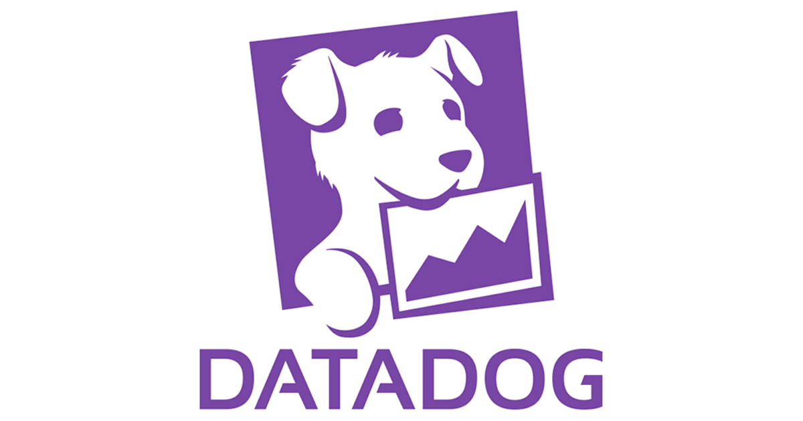

# Introduction to Datadog - Ryan Donat
Its all about the data.

## Topics:
* Collecting Metrics
  * How can we use Datadog to collect metrics from our host? 
* Visulizing Data
  * Once we have collected Metrics, how can we use Datadog to visulize them?
* Monitoring Data
  * After the data have been visualized, how do you set up Monitors so that someone does not need to be watching the dashboard indefinitely for anomolies?
* Collecting APM Data
  * Now that we are collecting, visulizing, and monitoring our data and metrics, what else is there? Application Performance Monitoring lets you deep dive into your application's performance.
  
**NOTE:** As always, documentation is our friend, throughout this tutorial there will be many references and quotes to and from documentation that explains these topics in greater depth.

## Collecting Metrics:

### Datadog provides three main types of integrations that allow us to collect metrics:

* Agent-based integrations are installed with the Datadog Agent and use a Python class called check to define the metrics to collect.
* Authentication (crawler) based integrations are set up in the Datadog App where you provide credentials for obtaining metrics with the API. These include popular integrations like Slack, AWS, Azure, and PagerDuty.
Library integrations use the Datadog API to allow you to monitor applications based on the language they are written in, like Node.js, or Python.

### Example of Authentication based integration:
* TASK: Install a database on your machine (MongoDB, MySQL, or PostgreSQL) and then install the respective Datadog integration for that database. View metrics available via that integration.
* Here we have authorized Datadog to access all of the metrics that AWS already catpures for our use in Datadog
* https://docs.datadoghq.com/integrations/amazon_web_services/?tab=allpermissions#installation
* 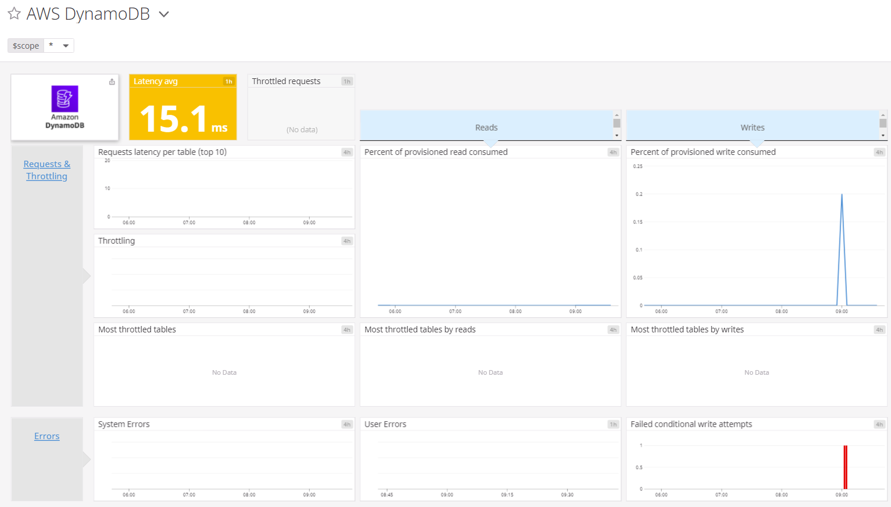

### Agent based integrations with custom Checks:
* TASK: Create a custom Agent check that submits a metric named my_metric with a random value between 0 and 1000.
* Custom checks are well suited to collect metrics from custom applications or unique systems. However, if you are trying to collect metrics from a generally available application, public service, or open source project, it is recommended that you create a full fledged Agent Integration.
* https://docs.datadoghq.com/agent/
* https://docs.datadoghq.com/developers/write_agent_check/?tab=agentv6

#### Ceate the custom Agent check configuration file.
``` 
vim /etc/datadog_agent/conf.d/custom_metric.d/custom_metric.yaml
```

  * Add necessary parameters.
```
instances: [{}]
```

  * Create the python method that contains the funtionality of the custom check.
``` 
vim /etc/datadog_agent/checks.d/custom_metric.py
```

```python 

# SOURCE: https://docs.datadoghq.com/developers/write_agent_check/?tab=agentv6\#overview

import random

# the following try/except block will make the custom check compatible with any Agent version
try:
    # first, try to import the base class from old versions of the Agent...
    from checks import AgentCheck
except ImportError:
    # ...if the above failed, the check is running in Agent version 6 or later
    from datadog_checks.checks import AgentCheck

# content of the special variable __version__ will be shown in the Agent status page
__version__ = "1.2.5"


class RandIntCheck(AgentCheck):
    def check(self, instance):
        self.gauge('custom.my_metric', random.randint(0, 1000), tags=['random:1000'])
 ```


  * Custom checks are well suited to collect metrics from custom applications or unique systems. However, if you are trying to collect metrics from a generally available application, public service, or open source project, it is recommended that you create a full fledged Agent Integration.
  * https://docs.datadoghq.com/developers/write_agent_check/?tab=agentv6
  * https://docs.datadoghq.com/agent/
* SUBTASK: Change your check's collection interval so that it only submits the metric once every 45 seconds.

``` 
vim /etc/datadog_agent/conf.d/custom_metric.d/custom_metric.yaml
```

```python 
init_config:
instances:
     - min_collection_interval: 45
 ```
  * https://docs.datadoghq.com/developers/write_agent_check/?tab=agentv6#collection-interval
* **Bonus Question** Can you change the collection interval without modifying the Python check file you created?

### How do we keep all of the data comming into Datadog from many different host organized?
* TASK: Add tags in the Agent config file and show us a screenshot of your host and its tags on the Host Map page in Datadog.
  * Tags are a way of adding dimensions to metrics, so they can be filtered, aggregated, and compared in Datadog visualizations. Using tags enables you to observe aggregate performance across a number of hosts and (optionally) narrow the set further based on specific elements. In summary, tagging is a method to observe aggregate data points.
  * Typically, it’s helpful to look at containers, VMs, and cloud infrastructure at the “service” level in aggregate. For example, it’s more helpful to look at CPU usage across a collection of hosts that represents a service, rather than CPU usage for server A or server B separately. Containers and cloud environments regularly churn through hosts, so it is critical to tag these to allow for aggregation of the metrics you’re getting.
  * You can create tags within the host's configuration file.
  
``` vim /etc/datadog-agent/datadog.yaml```

  * 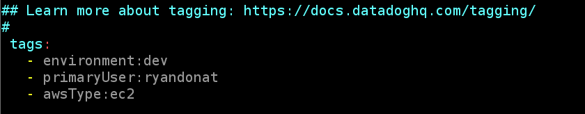
  * Once you have the tags on your Host, you will be able to view those tags in the Host Map.
    * 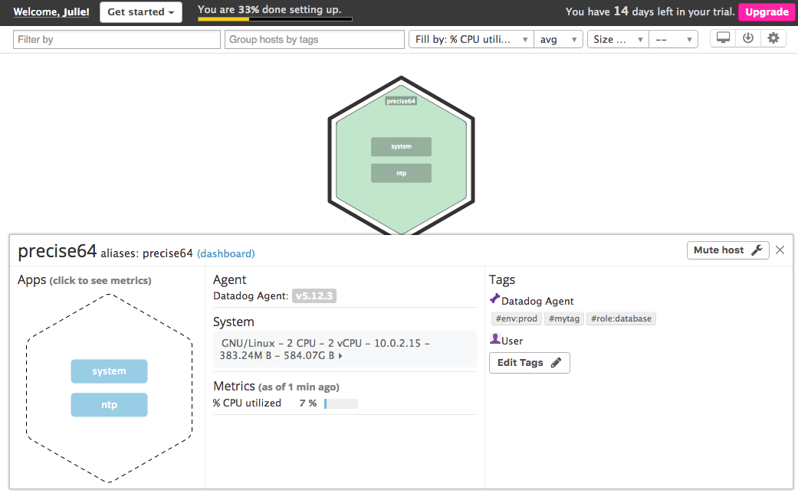
  * https://docs.datadoghq.com/tagging/

## Visualizing Data:

TASK: Utilize the Datadog API to create a Timeboard that contains:

* SUBTASK: Visualize your custom metric scoped over your host.
  * Scoping a metric over a host is a great way to see what is happening on a specific host.
  * 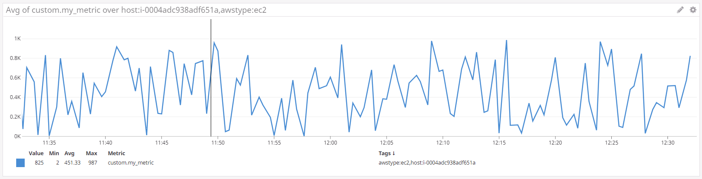
* SUBTASK: Visualize any metric from the Integration on your Database with the anomaly function applied.
  * You can apply anomonly detection to different metrics, that will help you notice that something is out of the ordinary. Here we see the peaks are drawn in <span style="color:red">RED</span> because they are anomalous to the previous data.
  * 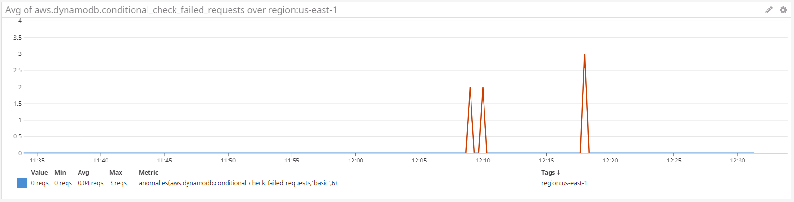
  * Here is an example the anomaly fuction applied to my_metric, this is a little easier to see what is happening here. The graph has the greyed area indicating the expected range of the metrics value, and highlights in RED when the metric breaks that range.
  * 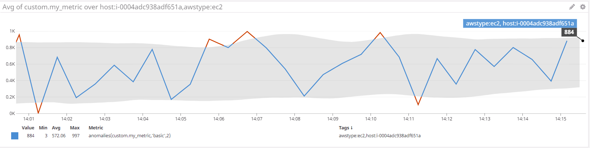
* SUBTASK: Visualize your custom metric with the rollup function applied to sum up all the points for the past hour into a rolling summation.
  * You can create custom functions to help provide the easiest visuals to analyse. Here we are creating a "rollup" of the sumation of one hours worth of my_metric, this may be helpful when you are not worried about the minute to minue changes that a gauge datatype can return, but the larger picutre of the trend of that gauge.
  * _avg:custom.my_metric{*}.rollup(sum, 3600)_
  * 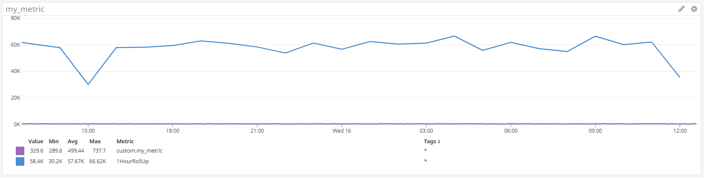

The items above were completed though the Datadog GUI, but it is also possible to create, update, and destroy Dashboards via the Datadog API with Python, Ruby, and Curl.
* Here is an example using Python.

``` pip install datadog```

```python 
from datadog import initialize, api
options = {
        'api_key': '***************************59571'
        }
initialize(**options)
title = 'Dashboard from py API'
widgets =[{
    'definition': {
        'type': 'timeseries',
        'requests': [
            {'q': 'avg:custom.my_metric{*}'}
            ],
        'title': 'Raw my_metric'
        }
    },
    {
    'definitions': {
        'type': 'timeseries',
        'requests': [
            {'q': 'anomalies(avg:aws.dynamodb.conditional_check_failed_requests{*}', 'basic', 2, direction='above', 'alert_window='last_5m', interval=30, count_default_zero='true' by {host})'}
            ],
            'title': 'DynamoDB Anomaly'
            }
    },
    {
    'definitions': {
        'type': 'query_value',
        'request': [
            {'q': "avg:custom.my_metric{*}.rollup(sum, 3600)"}
            ],
        'title': '1 Hour Rolling Sum'
        }
    }]
    
layout_type = 'ordered'
description = 'Ryan Donat used a Python program utilizing the datadog dashboard API to create this Dashboard.'
is_read_only = False
notify_list = ['ryan.e.donat@gmail.com']
template_variables = [{}]
api.Dashboard.create(title=title,
    widgets=widgets,
    description=description,
    is_read_only=is_read_only,
    notify_list=notify_list,
    template_variables=template_variables)
```

* SUBTASK: Visualize set the Timeboard's timeframe to the past 15 minutes
  * You can change the timeframe of the Timeboard that you are looking at, 15minutes - 1 mounth, you can even set specific date ranges.
* SUBTASK: Take a snapshot of this graph and use the @ notation to send it to yourself.
  * If you find something curious you can take a "Snapshot" of the graph, write a comment and send it to specific users that may be interested.
    * 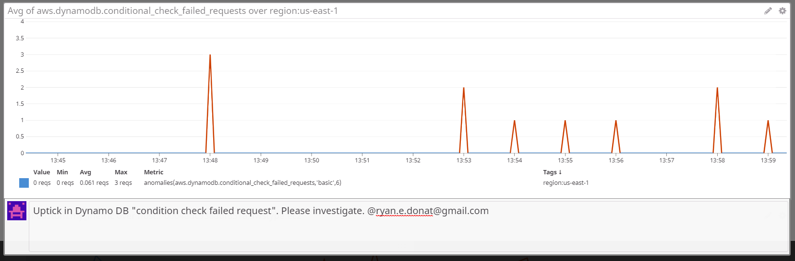
* **Bonus Question**: What is the Anomaly graph displaying?
  * Anomaly detection is an algorithmic feature that identifies when a metric is behaving differently than it has in the past, taking into account trends, seasonal day-of-week, and time-of-day patterns. It is well-suited for metrics with strong trends and recurring patterns that are hard to monitor with threshold-based alerting.
  * In our example of anomaly detection above we are looking at the metric aws.dynamodb.conditional_check_failed_requests, and using prior data to identify if any of the current behavior is anomalous.
  * https://docs.datadoghq.com/monitors/monitor_types/anomaly/#overview

## Monitoring Data

TASK: Create a new Metric Monitor that watches the average of your custom metric (my_metric) and will alert if it’s above the following values over the past 5 minutes:

* Warning threshold of 500
* Alerting threshold of 800
* And also ensure that it will notify you if there is No Data for this query over the past 10m.

This functionality can all be configured in the Manage Monitors simply
* 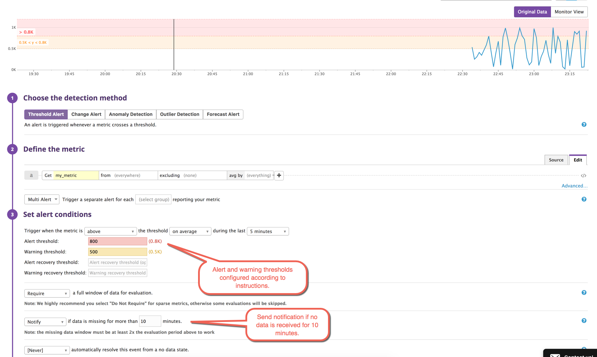
* Which boils down to this query
  * avg(last_5m):avg:custom.my_metric{host:i-0004adc938adf651a} > 800
When the monitor is up and running you will be able to view the Status and History to get an understanding on the behavior of the metric and when and for how long it has moved outside the green zone.
  * https://docs.datadoghq.com/monitors/monitor_types/metric/?tab=threshold
* 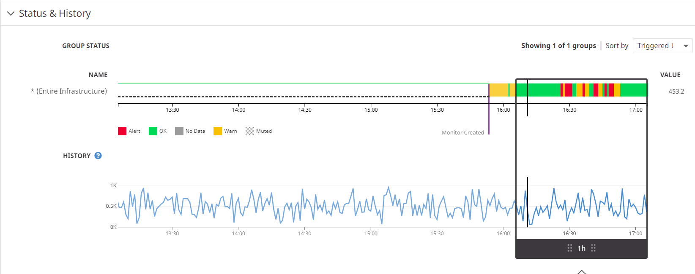
* 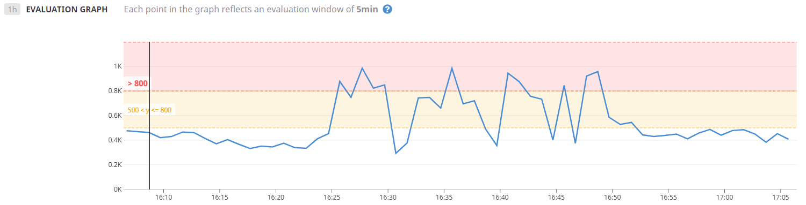

SUBTASK: Please configure the monitor’s message so that it will:
* Send you an email whenever the monitor triggers.
* Create different messages based on whether the monitor is in an Alert, Warning, or No Data state.
* Include the metric value that caused the monitor to trigger and host ip when the Monitor triggers an Alert state.

Being able to configure the monitor notification messages is a power tool that ensures that when emails are going out, they are only going to ge specific group needed, and they will contain all of the important information for the task to be addressed immediatly.
* Here we are using Condition Variables as well as Message Template Variables to pass in the values that triggered the alert/warning to the email notification that is being sent out.

```
{{#is_alert}} ALERT, custom.my_metric exceeded alert threshold of 800, reported value: {{value}} {{/is_alert}}

{{#is_warning}} WARNING, custom.my_metric exceeded alert threshold of 500, reported value my_metric: {{value}} {{/is_warning}} 

@ryan.e.donat@gmail.com
```

* SUBTASK: When this monitor sends you an email notification, take a screenshot of the email that it sends you.
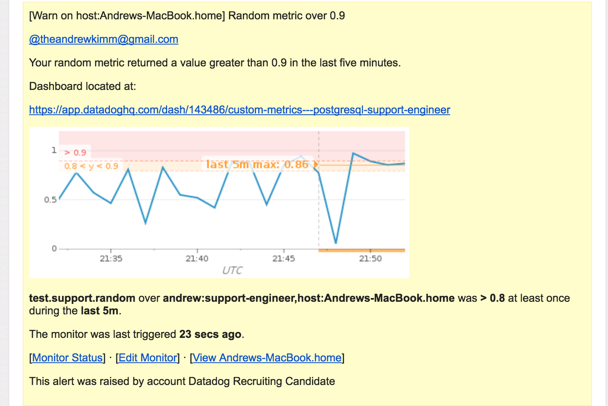

* **Bonus Question**: Since this monitor is going to alert pretty often, you don’t want to be alerted when you are out of the office. Set up two scheduled downtimes for this monitor:
  * One that silences it from 7pm to 9am daily on M-F,
  * And one that silences it all day on Sat-Sun.
  * Make sure that your email is notified when you schedule the downtime and take a screenshot of that notification.
  
Wheather it is a reoccuring maintenance or low priority monitor that is not important after dark, you can schedule downtime for a monitor which will mute if from sending out notifications during the specified timeframe.
* https://docs.datadoghq.com/monitors/downtimes/
* 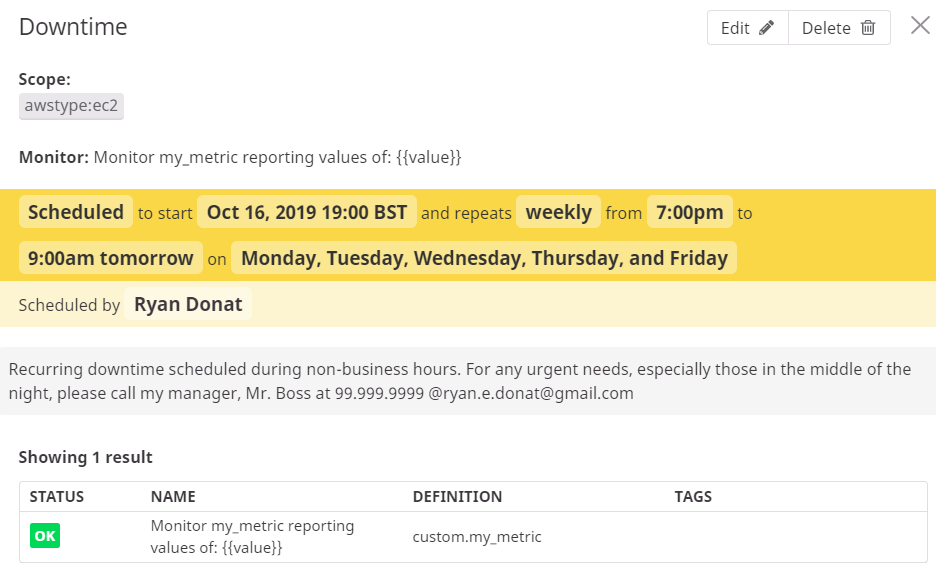
* The user Ryan Donat is on the list to be notify when downtime is Scheduled. He is sent an email to inform him.
 * 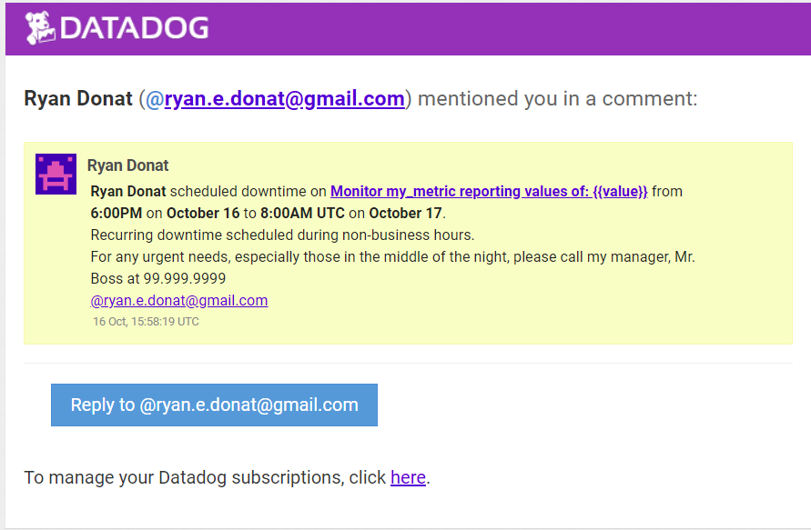

## Collecting APM Data:

TASK: Given the following Flask app (or any Python/Ruby/Go app of your choice) instrument this using Datadog’s APM solution:

```python
from flask import Flask
import logging
import sys

# Have flask use stdout as the logger
main_logger = logging.getLogger()
main_logger.setLevel(logging.DEBUG)
c = logging.StreamHandler(sys.stdout)
formatter = logging.Formatter('%(asctime)s - %(name)s - %(levelname)s - %(message)s')
c.setFormatter(formatter)
main_logger.addHandler(c)

app = Flask(__name__)

@app.route('/')
def api_entry():
    return 'Entrypoint to the Application'

@app.route('/api/apm')
def apm_endpoint():
    return 'Getting APM Started'

@app.route('/api/trace')
def trace_endpoint():
    return 'Posting Traces'

if __name__ == '__main__':
    app.run(host='0.0.0.0', port='5050')
```

**Note**: Using both ddtrace-run and manually inserting the Middleware has been known to cause issues. Please only use one or the other.

To run and monitor this Flask application first we need to install the prerequisites.

```
pip install flask
pip install ddtrace
```

Then run the python application:

```
ddtrace-run python myFlaskApp.py
```

Once running we can hit the endpoints with the commands:

```
curl localhost:5050/api/apm
curl localhost:5050/api/trace
```

After these commands have run the system will make the services tab under APM avaiable.
Here is what the APM Services data will look like:
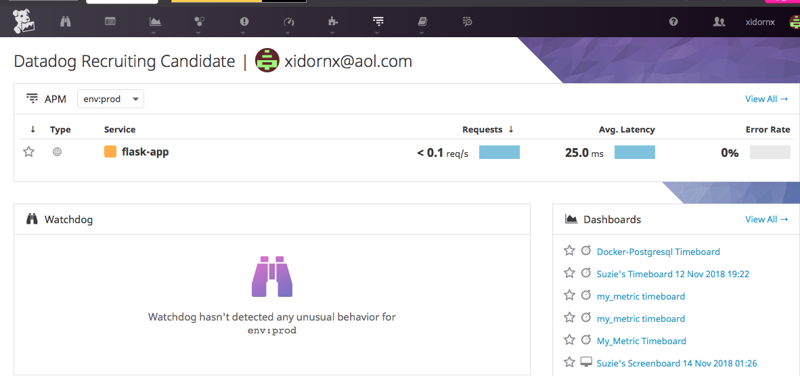
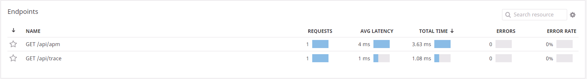


We can see all of the APM data comming into the APM dashboard but how can we add these graphs one of our pre-built dashboards?
SUBTASK: Provide a link and a screenshot of a Dashboard with both APM and Infrastructure Metrics.
* For the APM data that you want on one of you dashboard, you need to take the Export action on the graph and export it to the desired dashboard.
* Here we can see our APM metric for number of requests.
  * 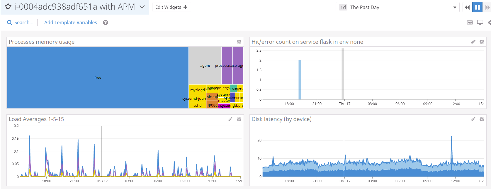

* **Bonus Question**: What is the difference between a Service and a Resource?


## Final Question:

Datadog has been used in a lot of creative ways in the past. We’ve written some blog posts about using Datadog to monitor the NYC Subway System, Pokemon Go, and even office restroom availability!

Is there anything creative you would use Datadog for?

* Monitoring and Visualizing Blood Sugar levels for people with diabetes. The heathcare industry is trying to keep up quickly changing technology, but often fall well behind of the curve. I have a few friends who have Diabetus and their monitoring solutions all seem archaic. Luckly there are now technologies that can continuously monitor ones blood sugar levels and update some cloud application via WiFi. If that infrastructure is there, we can integrate those web applications with datadog. This could give an individual real power over monitoring their blood sugar levels with powerful tools like anomoly detection, and Monitor notifications to keep a friend or family member in the loop. I would be curiuos to sese a metric gauge on someones blood sugar, and then apply the Anomalies function like we did in this excecise. Could we get the parameters into a place that the anomalies would be correctly reported around insulin spikes when the individual injects, blood sugar spikes when somebody eats, if the individual keeps a stong habit, the anomaly detection may be able to find a useful pattern.
  * Although Datadog is not designed just to monitor just one host, its power comes in with monitoring many host. Thinking into a dystopian future where Health Privacy does not exist. Maybe a school district monitors all of the diabetic children, with the goal of keeping them healthy and focused on learning. The school district would be able to monitor many children over many different school. At this level they would be able to identify trends based on hosts within a specific school, or host with a specific teach. These trends could be used to help fix any issues with blood sugar levels those kids are having. I think I have watched too much of the tv show Black Mirror.


## Parting Thoughts:
I have been told that the 100th employee for datadog Dublin was hired recently. Assuming whoever gets hired for this role would bump the office up to 101 employees, and assuming its okay to relate said employees to dogs, I in my professional experiance believe that while the office maintains 101 employees, they should all be nicknamed the "101 Dalmatians"


Image source: https://www.bigw.com.au/product/disney-movie-collection-101-dalmatians/p/680409/
