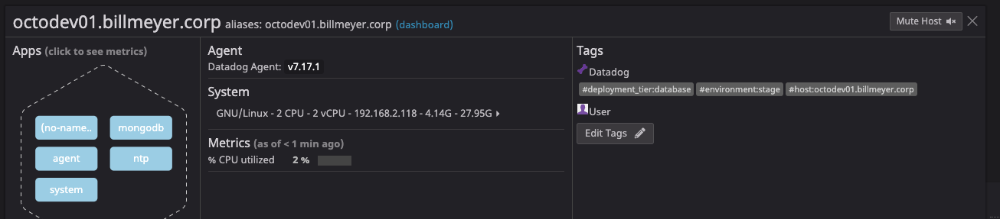
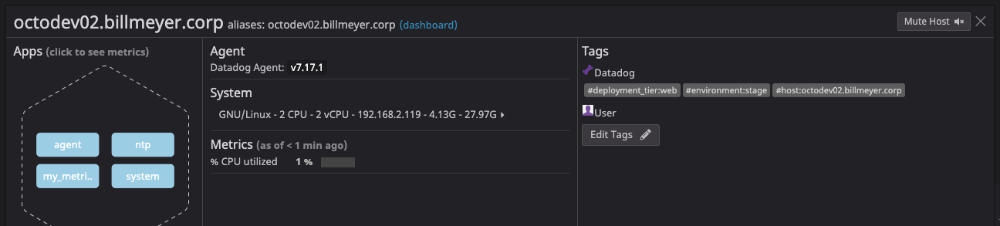
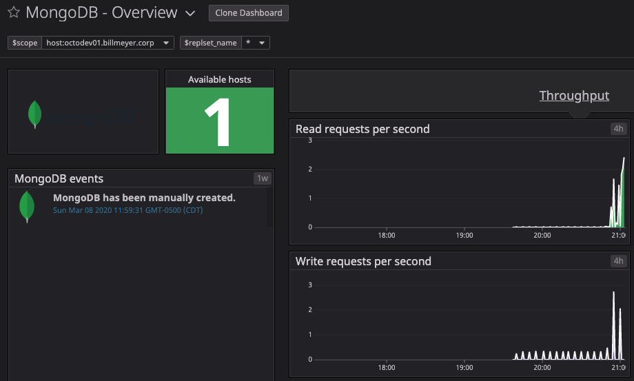
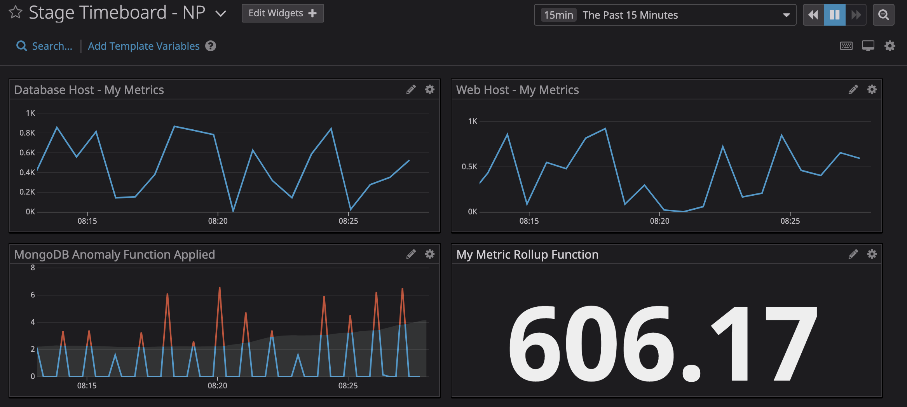
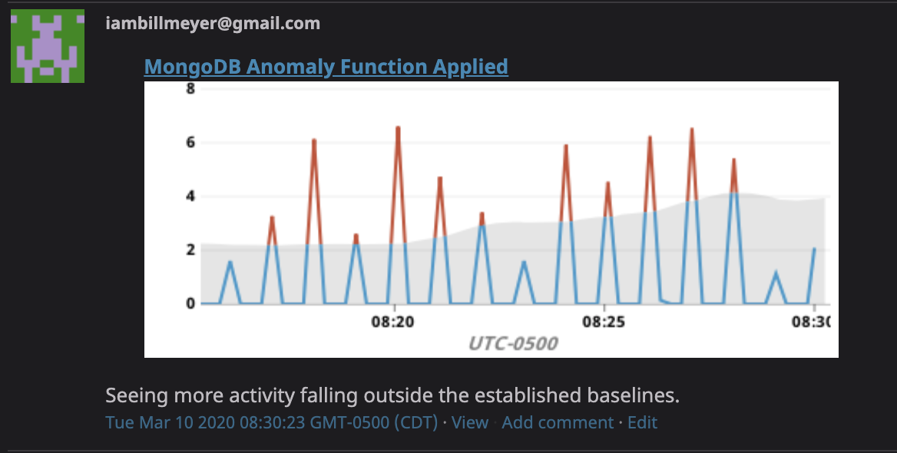
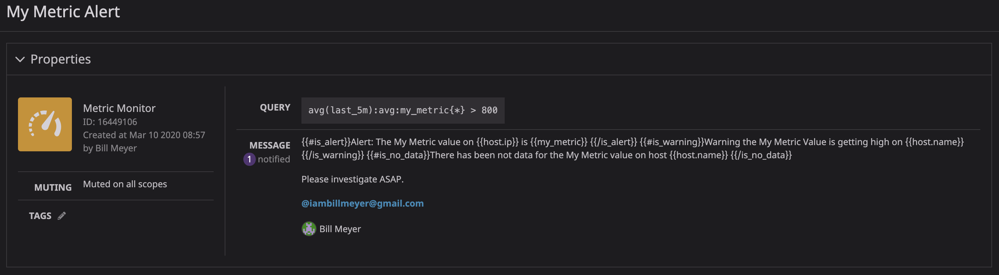
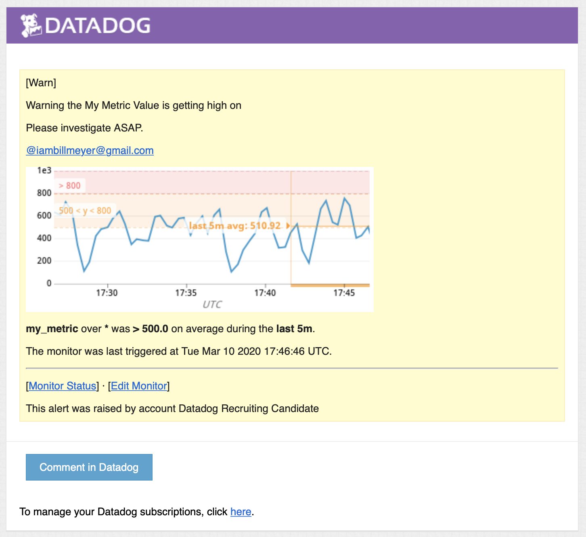
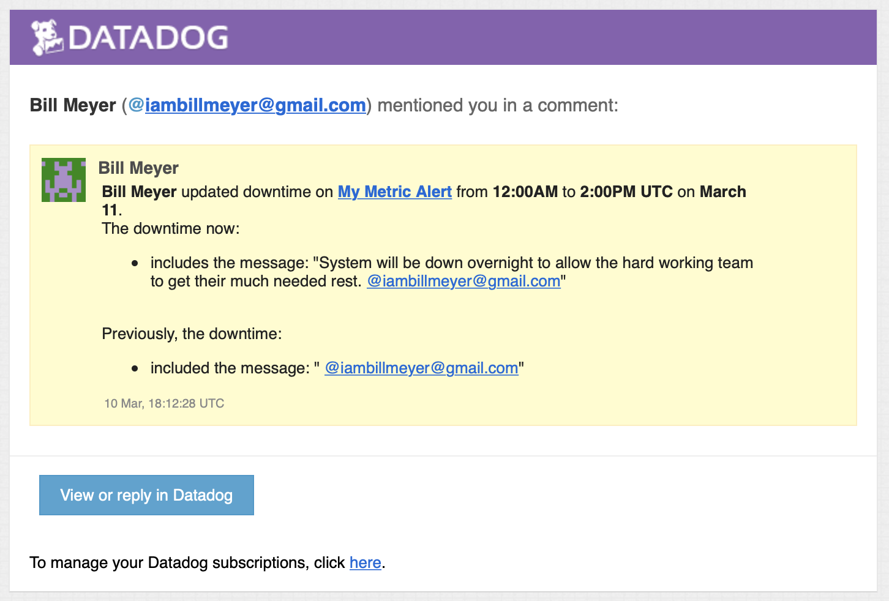
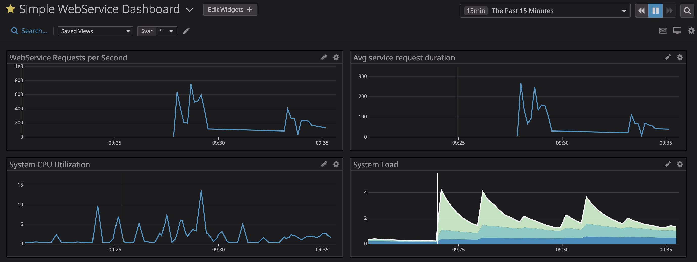

Your answers to the questions go here.


# Prerequisites - Setup the environment

1. I signed up for a Datadog account using the __Datadog Recruiting Candidate__ in the __Company__ field.

2. I have two Linux VMs named `octodev01` and `octodev02` for the purpose of this exercise.

3. To install the Datadog agent, I navigated to [https://app.Datadoghq.com/account/settings#centos]() and followed the instructions for Step 1 - New installation.

# Collecting Metrics:

_* Add tags in the Agent config file and show us a screenshot of your host and its tags on the Host Map page in Datadog._

1. On `octodev01`, I added two tags:

    ```yaml
        - environment:stage
        - deployment_tier:database
    ```

    reflecting the test environment designation and the intended purpose of the host is a database server.



2. On `octodev02`, I added two tags:

```yaml
    - environment:stage
    - deployment_tier:web
```

    reflecting the test environment designation and the intended purpose of the host is an application server.



## MongoDB Integration

_Install a database on your machine (MongoDB, MySQL, or PostgreSQL) and then install the respective Datadog integration for that database._

1. Started by following the online instructions [https://docs.Datadoghq.com/integrations/mongo/]() to configure my MongoDB instance.

2. Generated some synthetic read activity to verify metrics were appearing in the Datadog dashboard:



## Custom Agent

_Create a custom Agent check that submits a metric named my_metric with a random value between 0 and 1000._

1. Created a python script named `mymetric.py` with:

    ```python
    import random

    try:
        from checks import AgentCheck
    except ImportError:
        from Datadog_check.check import AgentCheck

    __version__ = "0.0.9"

    class MyMetric(AgentCheck):
        def check(self, instance):
            self.gauge('my_metric', random.randint(1,1001))
    ```

    to generate the metric.

2. Deployed `mymetric.py` to `octodev01:/etc/Datadog-agent/checks.d/`.

3. Configured the Datadog Agent to run the script by creating a configuration file named `mymetric.yaml` with:

    ```yaml
    init_config:

    instances:
      - min_collection_interval: 45
    ```

4. Created a new direct for my custom metric on `octodev01` at `/etc/Datadog-agent/conf.d/mymetric.d` and deployed `mymetric.yaml` into it.    

5. Restarted the agent with:

    ```bash
    $ sudo systemctl restart Datadog-agent
    ```
 
6. Confirmed the metric worked correctly with:

    ```bash
    $ sudo -u dd-agent Datadog-agent check mymetric
    === Series ===
    {
    "series": [
        {
        "metric": "my_metric",
        "points": [
            [
            1583806513,
            121
            ]
        ],
        "tags": [],
        "host": "octodev01.billmeyer.corp",
        "type": "gauge",
        "interval": 0,
        "source_type_name": "System"
        }
    ]
    }
    =========
    Collector
    =========

    Running Checks
    ==============

        mymetric (0.0.9)
        ----------------
        Instance ID: mymetric:5ba864f3937b5bad [OK]
        Configuration Source: file:/etc/Datadog-agent/conf.d/mymetric.d/mymetric.yaml
        Total Runs: 1
        Metric Samples: Last Run: 1, Total: 1
        Events: Last Run: 0, Total: 0
        Service Checks: Last Run: 0, Total: 0
        Average Execution Time : 0s


    Check has run only once, if some metrics are missing you can try again with --check-rate to see any other metric if available.
    ```

* **Bonus Question** Can you change the collection interval without modifying the Python check file you created?

    Yes as this is done inside of `/etc/Datadog-agent/conf.d/mymetric.d/mymetric.yaml` by setting `min_collection_interval` to `45` and restarting the agent.

# Visualizing Data:

_Utilize the Datadog API to create a Timeboard that contains:_

_* Your custom metric scoped over your host._
_* Any metric from the Integration on your Database with the anomaly function applied._
_* Your custom metric with the rollup function applied to sum up all the points for the past hour into one bucket_

1. I created `timeboard.py` that would be used to create the new Timeboard.  I populated it as:

    ```python
    #!/usr/bin/python
    from datadog import initialize, api

    options = {
    'api_key': 'xxxxc973',
    'app_key': 'xxxxbf7f'
    }

    initialize(**options)

    title = "Stage Timeboard - NP"
    description = "Stage Timeboard for the National Parks app deployment."
    graphs = [
    {
    "title": "Database Host - My Metrics",
    "definition": {
    "requests": [
        {
        "q": "avg:my_metric{host:octodev01.billmeyer.corp}",
        "type": "line",
        "style": {
            "palette": "dog_classic",
            "type": "solid",
            "width": "normal"
        },
        "conditional_formats": [],
        "aggregator": "avg"
        }
    ],
    "autoscale": "true",
    "viz": "timeseries"
    }
    },
    {
    "title": "Web Host - My Metrics",
    "definition": {
    "requests": [
        {
        "q": "avg:my_metric{host:octodev02.billmeyer.corp}",
        "type": "line",
        "style": {
            "palette": "dog_classic",
            "type": "solid",
            "width": "normal"
        },
        "conditional_formats": [],
        "aggregator": "avg"
        }
    ],
    "autoscale": "true",
    "viz": "timeseries"
    }
    },
    {
    "title": "MongoDB Anomaly Function Applied",
    "definition": {
    "viz": "timeseries",
    "requests": [
        {
        "q": "anomalies(avg:mongodb.opcounters.queryps{*}, 'basic', 2)",
        "type": "line",
        "style": {
            "palette": "dog_classic",
            "type": "solid",
            "width": "normal"
        },
        "conditional_formats": [],
        "aggregator": "avg"
        }
    ],
    "autoscale": "true"
    }
    },
    {
    "title": "My Metric Rollup Function",
    "definition": {
    "viz": "query_value",
    "requests": [
        {
        "q": "avg:my_metric{*}.rollup(sum, 60)",
        "type": "line",
        "style": {
            "palette": "dog_classic",
            "type": "solid",
            "width": "normal"
        },
        "conditional_formats": [],
        "aggregator": "avg"
        }
    ],
    "autoscale": "true"
    }
    }]

    api.Timeboard.create(title=title, description=description, graphs=graphs)
    ```

_Once this is created, access the Dashboard from your Dashboard List in the UI:_

_* Set the Timeboard's timeframe to the past 5 minutes_

The lowest timeframe I was able to find was a 15 minute window.



_* Take a snapshot of this graph and use the @ notation to send it to yourself._



* **Bonus Question**: What is the Anomaly graph displaying?

    The anomaly graph is used to distinguish between normal and abnormal behavior captured in the metrics. In my example, I am watching the number of queries per second submitted to MongoDB and using the anomalies function to filter out abnormal metrics that fall outside the normal baselines.

    I would need to further play around comparing between the __Basic__, __Agile__, and __Robust__ algorithms that would be suit my real-world interactions.

# Monitoring Data

_Create a new Metric Monitor that watches the average of your custom metric (my_metric) and will alert if it’s above the following values over the past 5 minutes_

I created a new monitor definition with the specified requirements:

* Warning threshold of 500
* Alerting threshold of 800
* And also ensure that it will notify you if there is No Data for this query over the past 10m.

I configured the monitor's message such that it will:

* Send you an email whenever the monitor triggers.
* Create different messages based on whether the monitor is in an Alert, Warning, or No Data state.
* Include the metric value that caused the monitor to trigger and host ip when the Monitor triggers an Alert state.

Here's a screenshot of the monitor definition:



as well as an JSON export of it:

```json
{
	"id": 16449106,
	"name": "My Metric Alert",
	"type": "metric alert",
	"query": "avg(last_5m):avg:my_metric{*} > 800",
	"message": "{{#is_alert}}Alert: The My Metric value on {{host.ip}} is {{my_metric}} {{/is_alert}}\n{{#is_warning}}Warning the My Metric Value is getting high on {{host.name}} {{/is_warning}}\n{{#is_no_data}}There has been not data for the My Metric value on host {{host.name}} {{/is_no_data}}\n\nPlease investigate ASAP.\n\n@iambillmeyer@gmail.com",
	"tags": [],
	"options": {
		"notify_audit": false,
		"locked": false,
		"timeout_h": 0,
		"silenced": {},
		"include_tags": true,
		"no_data_timeframe": 10,
		"require_full_window": true,
		"new_host_delay": 300,
		"notify_no_data": true,
		"renotify_interval": 0,
		"escalation_message": "",
		"thresholds": {
			"critical": 800,
			"warning": 500
		}
	}
}
```

### Monitor Sample Notification:

_* When this monitor sends you an email notification, take a screenshot of the email that it sends you._



* **Bonus Question**: _Since this monitor is going to alert pretty often, you don’t want to be alerted when you are out of the office. Set up two scheduled downtimes for this monitor:_

    _* One that silences it from 7pm to 9am daily on M-F,_
    _* And one that silences it all day on Sat-Sun._
    _* Make sure that your email is notified when you schedule the downtime and take a screenshot of that notification._

    For the nightly downtime, I configured the following:

    1. Navigated to [https://app.datadoghq.com/monitors#/downtime]().
    2. Clicked __Schedule Downtime__ 
    3. Selected __Monitor: My Metric Alert__
    4. Selected __Recurring__
    5. Configured the Schedule:
        * Repeat Every: __1 weeks__
        * Repeat On: __Mon, Tue, Wed, Thu, Fri__
        * Beginning: __7:00 PM__
        * Duration: __14 hours__
    6. Notify your team: __Bill Meyer__

    For the weekend downtime, I configured the following:

    1. Navigated to [https://app.datadoghq.com/monitors#/downtime]().
    2. Clicked __Schedule Downtime__ 
    3. Selected __Monitor: My Metric Alert__
    4. Selected __Recurring__
    5. Configured the Schedule:
        * Repeat Every: __1 weeks__
        * Repeat On: __Sun, Sat__
        * Beginning: __12:00 AM__
        * Duration: __1 days__
    6. Notify your team: __Bill Meyer__

    Then confirmed acknowledgement of the scheduled downtime notification via email:

    

## Collecting APM Data:

### Web Service Backend

I authored a simple RESTful Web Service utilizing Express and Node.js.  I followed the instructions located at
[https://docs.datadoghq.com/tracing/setup/nodejs/]() to instrument the service in Datadog.

```javascript
// This line must come before importing any instrumented module.
const tracer = require('dd-trace').init();
tracer.init({
    enabled: true,
    debug: false,
    analytics: true
});

let express = require("express");

let app = express();
app.listen(3000, () => {
    console.log("Server running on port 3000");
});

app.get("/", (req, res, next) => {
    res.json("Entrypoint to the Application");
});

app.get("/api/apm", (req, res, next) => {
    res.json("Getting APM Started");
});

app.get("/api/trace", (req, res, next) => {
    res.json("Posting Traces");
});
```


* **Bonus Question**: What is the difference between a Service and a Resource?

A __Service__ is the "thing" being exposed on the network that other Services (web browsers, authentication, validation, etc)
need to access.  It exposes __Resources__ that is manages that can be accessed or manipulated via the Service's interface (REST, SOAP, Ajax, etc).

_Provide a link and a screenshot of a Dashboard with both APM and Infrastructure Metrics._



_Please include your fully instrumented app in your submission, as well._

The sample webservice app can be found in GitHub: [https://github.com/billmeyer/sample_webservice]().


## Final Question:

_Datadog has been used in a lot of creative ways in the past. We’ve written some blog posts about using Datadog to monitor the NYC Subway System, Pokemon Go, and even office restroom availability!_

_Is there anything creative you would use Datadog for?_

The inquistive side of me wants to build an APM view of the public-facing web sites I host in my home lab.  This is driven by curiosity and simply because it would be helpful to visualize what my web visitors are doing.

The nerdy side of me wants to push the data from my weather station hanging in my backyard and push it as time-series data that I can then use to not just understand instantanous data, but trends over time.  Given the combination of data, metrics, and views available with Datadog, I think a lot of insight into weather trends and historical patterns can be understood.

## Instructions

If you have a question, create an issue in this repository.

To submit your answers:

* Fork this repo.
* Answer the questions in answers.md
* Commit as much code as you need to support your answers.
* Submit a pull request.
* Don't forget to include links to your dashboard(s), even better links and screenshots. We recommend that you include your screenshots inline with your answers.

