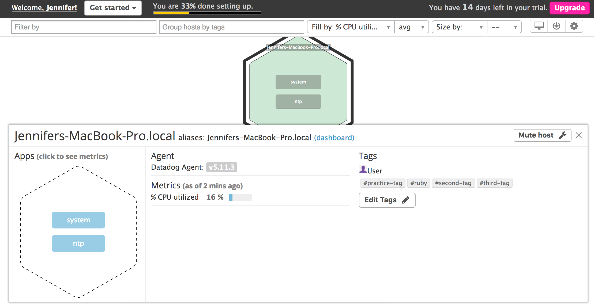

# DataDog Support Engineer Challenge

## Level 1 - Collecting Your Data
* Bonus Question: An agent is the program that runs on a customer's local machine to track performance and metrics. It then consolidates and packages the data to send to DataDog.

* 
