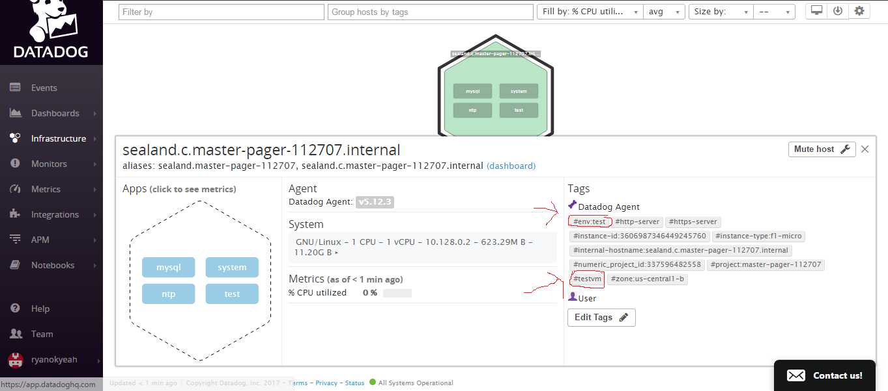
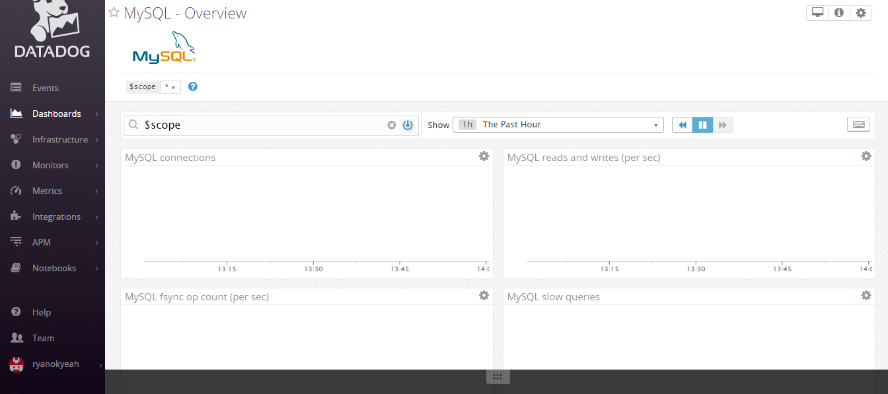
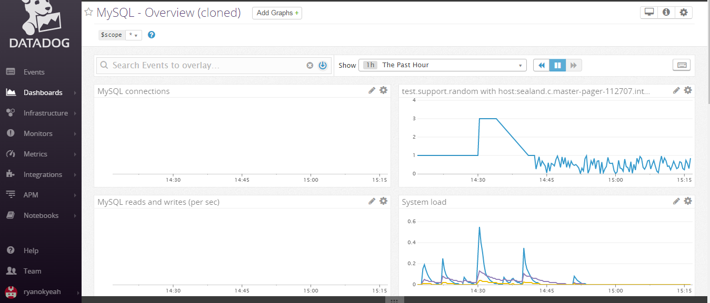
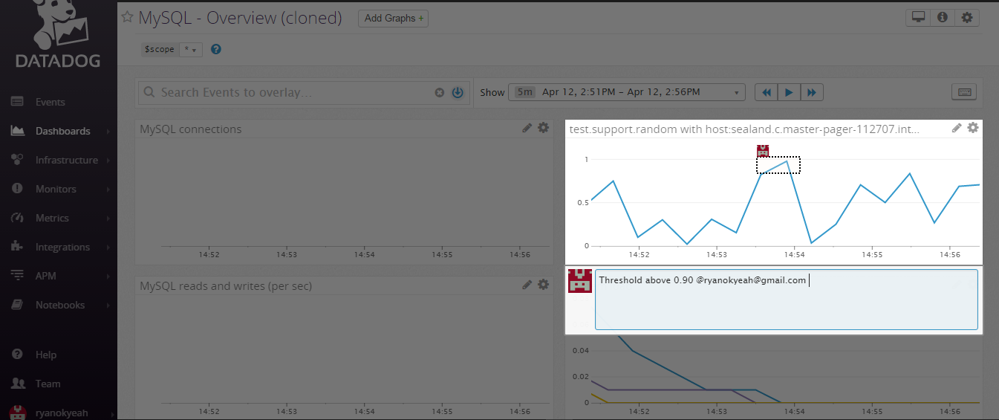
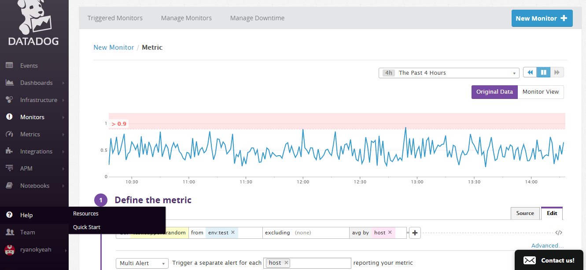
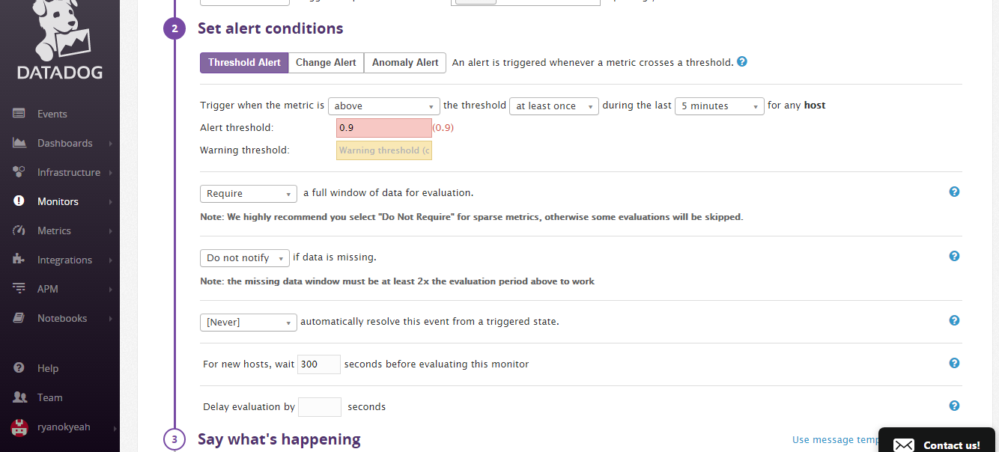
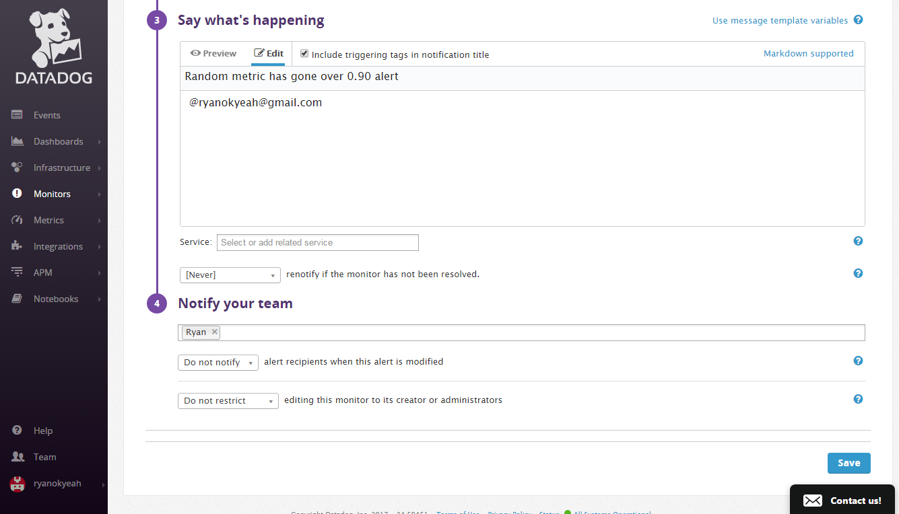
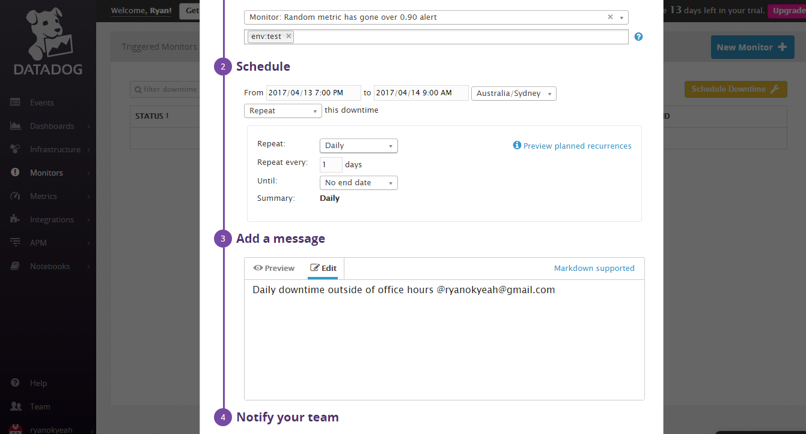
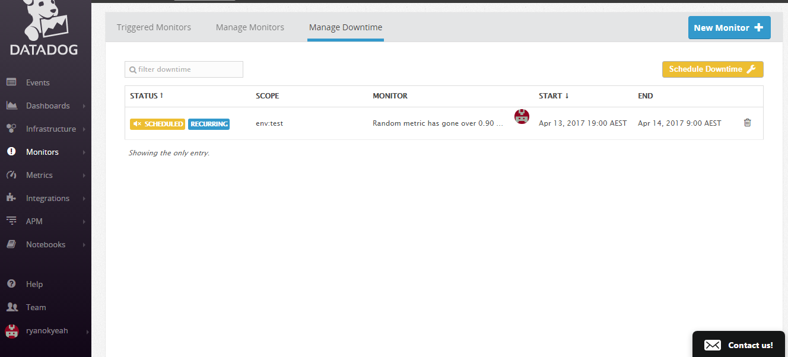

> Level 1 - Collecting your Data

> Sign up for Datadog (use "Datadog Recruiting Candidate" in the "Company" field), get the Agent reporting metrics from your local machine.

Agent was installed on a Debian vm in google compute cloud and metrics collected from there.

> Bonus question: In your own words, what is the Agent?

The Datadog is a daemon-like service that runs on monitored hosts. It acts to collect raw data and send it to Datadog for collection and analysis.

> Add tags in the Agent config file and show us a screenshot of your host and its tags on the Host Map page in Datadog.

File changed: /etc/dd-agent/datadog.config

Tags added:

"tags: testvm, env:test"

Then proceed to restart the agent: /etc/init.d/datadog-agent restart

> Install a database on your machine (MongoDB, MySQL, or PostgreSQL) and then install the respective Datadog integration for that database.

Mysql was installed on the vm and the Mysql integration instructions were followed, as per: http://docs.datadoghq.com/integrations/mysql/

This included creating a user in Mysql/granting permissions and also applying the settings within `mysql.yaml`, which have been included in this repo.

Path of file on server: /etc/dd-agent/conf.d/mysql.yaml

Then proceed to restart the agent: /etc/init.d/datadog-agent restart

> Write a custom Agent check that samples a random value. Call this new metric: test.support.random
> Here is a snippet that prints a random value in python:
> import random
> print(random.random())

Created file `firstcheck.yaml` located in server path: /etc/dd-agent/conf.d/firstcheck.yaml

Created file `firstcheck.py` located in server path: /etc/dd-agent/checks.d/firstcheck.py

Then proceed to restart the agent: /etc/init.d/datadog-agent restart

Proceeded to click "Add integration" in Datadog UI and was able to test data coming in via dashboard:

https://app.datadoghq.com/dash/integration/mysql?live=true&page=0&is_auto=false&from_ts=1492054727297&to_ts=1492058327297&tile_size=m

>Level 2 - Visualizing your Data

>Since your database integration is reporting now, clone your database integration dashboard and add additional database metrics to it as well as your test.support.random metric from the custom Agent check.

Dashboard was clone and extra metric added, as per screenshot:

https://app.datadoghq.com/dash/273866/mysql---overview-cloned?live=true&page=0&is_auto=false&from_ts=1492053135759&to_ts=1492056735759&tile_size=m

>Bonus question: What is the difference between a timeboard and a screenboard?

Timeboard is foor troubleshooting and correlation, as well as event graphs with automatic layout.

Screenboard is for status boards and sharing data, customizable widgets and layout.

>Take a snapshot of your test.support.random graph and draw a box around a section that shows it going above 0.90. Make sure this snapshot is sent to your email by using the @notification

The box for snapshot was drawn and notification created as per:

>Level 3 - Alerting on your Data

> Since you've already caught your test metric going above 0.90 once, you don't want to have to continually watch this dashboard to be alerted when it goes above 0.90 again. So let's make life easier by creating a monitor.

> Set up a monitor on this metric that alerts you when it goes above 0.90 at least once during the last 5 minutes
>Bonus points: Make it a multi-alert by host so that you won't have to recreate it if your infrastructure scales up.
> Give it a descriptive monitor name and message (it might be worth it to include the link to your previously created dashboard in the message).

A new monitor was set up with these specifications. Screenshots below outline configuration:

> Make sure that the monitor will notify you via email.
> This monitor should alert you within 15 minutes. So when it does, take a screenshot of the email that it sends you.

This monitor was put in place and it successfully triggered an alert moments later. Alert is documented in screenshot:

> Bonus: Since this monitor is going to alert pretty often, you don't want to be alerted when you are out of the office. Set up a scheduled downtime for this monitor that silences it from 7pm to 9am daily. Make sure that your email is notified when you schedule the downtime and take a screenshot of that notification.

Downtime was set up for out of office hours between aforementioned hours. Configuration in screenshot below:

