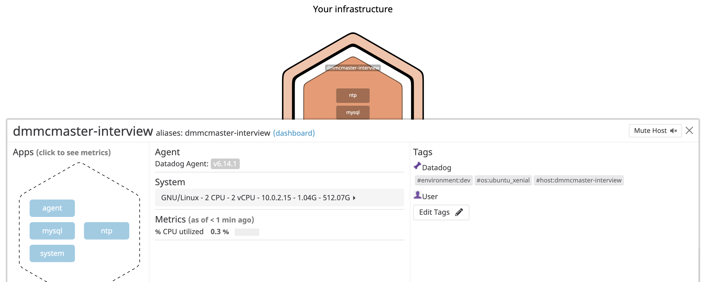
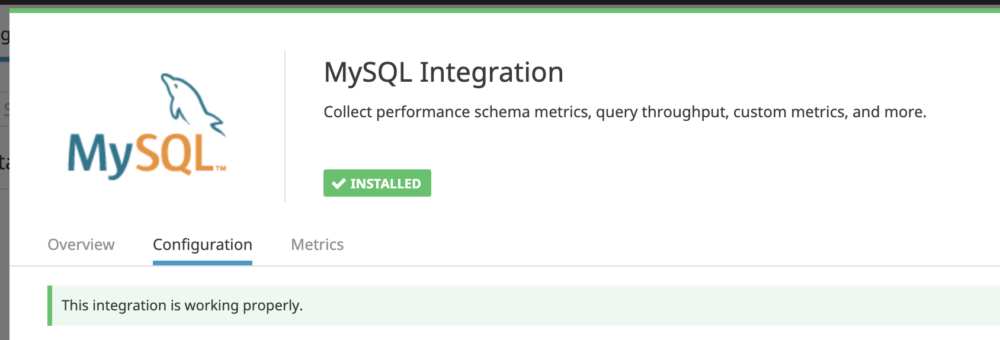
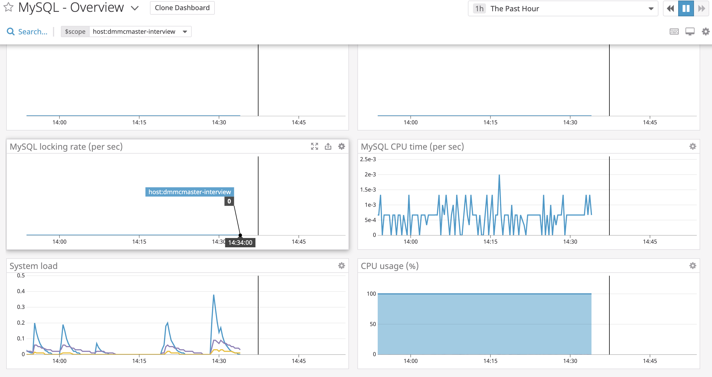
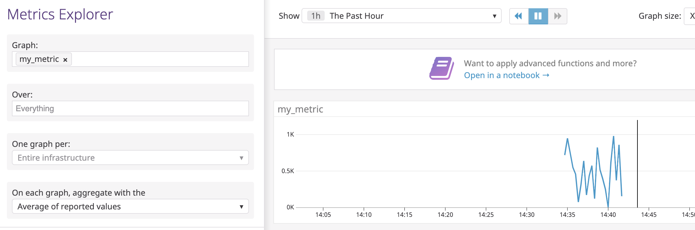
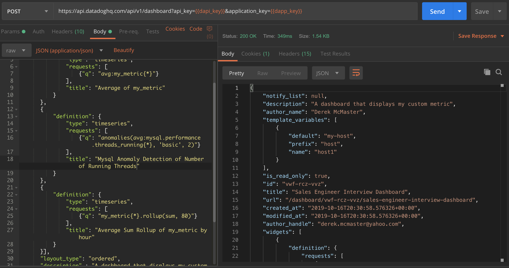
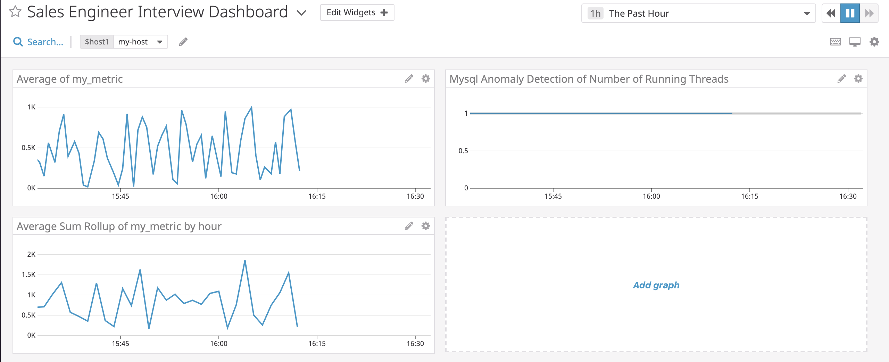
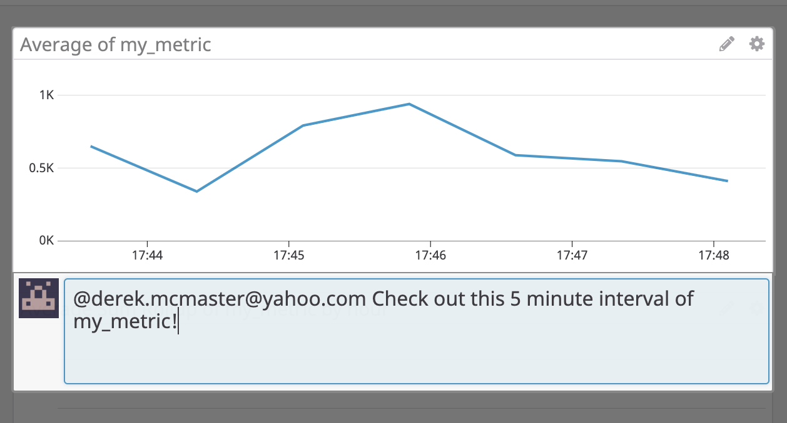
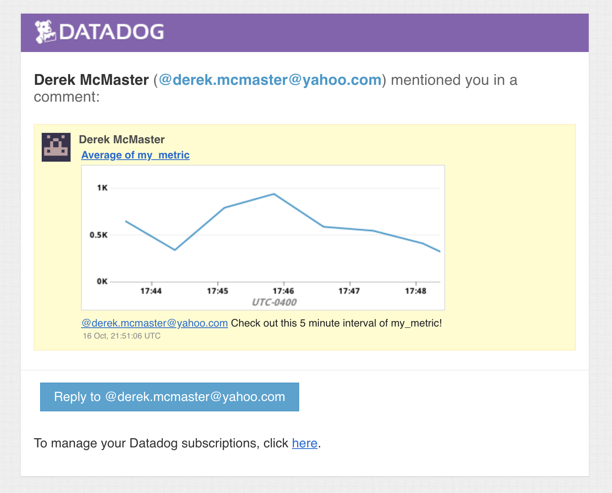

## Prerequisites - Setup the environment

I am going to walk through this technical exercise on the following environment:
 - MacBook Pro running `MacOs Mojave (10.14.X)`
 - VirtualBox 6.0 - [download link](https://www.virtualbox.org/wiki/Downloads)
 - Preferred Terminal (iTerm2 - [DL](https://www.iterm2.com/)) and Text Editor ([vim](https://www.vim.org/))

To avoid OS dependency issues I decided to use Vagrant which can be installed using the [installer on the vagrant website](https://www.vagrantup.com/intro/getting-started/install.html) or through [Homebrew](https://sourabhbajaj.com/mac-setup/Vagrant/README.html) if you're a Mac user. I used the Ubuntu 16.04 distribution, also known as Xenial Xerus, as the README recommended.

To get the Vagrant box setup and running you use the simple commands found in the vagrant docs.

```Shell
$ vagrant init ubuntu/xenial64
$ vagrant up
```
This will download the Ubuntu Xenial image and create a `VagrantFile` in your current directory and then start the virtual machine.

I then registered for a datadog account using the provided instructions.

## Collecting Metrics:
-----
### Tagging

  The first task surrounding collecting metrics is adding custom tags to the Datadog Agent. As refferred to in the [documentation](https://docs.datadoghq.com/tagging/assigning_tags/?tab=agentv6), tags are added within the main datadog.yaml file found in the root directory of the application --> [`/etc/datadog-agent`](https://docs.datadoghq.com/agent/guide/agent-configuration-files/?tab=agentv6) 


The first custom attribute I added was a custom hostname but feel free to use the default hostname provided:
```
## @param hostname - string - optional - default: auto-detected
## Force the hostname name.

hostname: dmmcmaster-interview
```
I then added a few custom tags to the Agent by uncommenting the tag line and adding the following:
```
## @param tags  - list of key:value elements - optional
## List of host tags. Attached in-app to every metric, event, log, trace, and service check emitted by this Agent.

tags:
   - environment:dev
   - os:ubuntu_xenial
```

After I added these attributes to the `datadog.yaml` file I saved and restarted the datadog agent using the following command which I will refer throughout the post:

```Shell
$ sudo service datadog-agent restart
```
And then verified the status after restart:
```Shell
$ sudo service datadog-agent status
```

After allowing a short period of time for the agent to sync with the UI the following appeared in the Host Map under the Infrastructure Tab of the UI.



Success!

### Database Integration
* Install a database on your machine (MongoDB, MySQL, or PostgreSQL) and then install the respective Datadog integration for that database.

The next step was to add a database integration to the Agent. I chose to use MySQL because of previous experience using it but there are countless other database integrations supported by Datadog. I first installed MySQL on the Ubuntu VM with the simple command:
```Shell
$ sudo apt-get update (updates package registry)
$ sudo apt-get install mysql-server
```
I selected MySQL from the list under the Integrations tab of the UI and followed the configuration instructions. I created the datadog user and granted it the necessary permissions. I finally added the config code to the mysql config file found at `/etc/datadog-agent/conf.d/mysql.d/conf.yaml`
```Shell
init_config:

instances:
  - server: 127.0.0.1
    user: datadog
    pass: ******
    port: 3306 //MySQL default
    options:
        replication: 0
        galera_cluster: true
        extra_status_metrics: true
        extra_innodb_metrics: true
        extra_performance_metrics: true
        schema_size_metrics: false
        disable_innodb_metrics: false
```
I then restarted the Agent and checked the status. After syncing, the UI showed the MySQL integration on the UI.



And shortly thereafter, the metrics began populating the MySQL dashboard in the Dashboard tab of the UI.



### Custom Metric

* Create a custom Agent check that submits a metric named my_metric with a random value between 0 and 1000.

If the nearly infinite amount of integrations don't satisfy your use case, Datadog makes it very simple to create a custom metric. Per the [documentation](https://docs.datadoghq.com/developers/write_agent_check/?tab=agentv6) on agent checks, all you have to do is add a script in the `/etc/datadog-agent/checks.d/` directory with a corresponding yaml file in the `/etc/datadog-agent/conf.d/` directory with the **SAME NAME** before the extension.

This metric's goal was to send a random integer between 0 and 1000 on a specified interval to the UI. 

I first created a python script that would produce the intended result of a random integer when called:

#### my_metric.py

```python
try:
    from checks import AgentCheck
except ImportError:
    from datadog_checks.checks import AgentCheck

from random import randint

__version__ = "1.0.0"


class MyMetricCheck(AgentCheck):
    def check(self, instance):
        self.gauge('my_metric', randint(0,1000))
```

To make sure the Agent evaluated this metric and synchronized it to the UI I created a base YAML file with the same name.

#### my_metric.yaml
```yaml
init_config:

instances: [{}]
```

After restarting the Agent, my_metric began populating in the UI --> Metrics --> Explorer:



### Configure The Metric
* Change your check's collection interval so that it only submits the metric once every 45 seconds.

Our metric is now populating but what if we wanted it to collect on a specified interval? The default collection interval of the Agent is 15 seconds. We will now change the interval to every 45 seconds. To do this you simply add one line to the my_metric.yaml file:

```yaml
init_config:

instances:
  - min_collection_interval: 45
```

Restart the Agent and again the metric is still populating but at the newly specified interval.


You can also verify the check is running by using the following command when ssh'd into the vagrant VM:

```Shell
$ sudo -u dd-agent -- datadog-agent check my_metric

```

### **Bonus Question** 

You can change the interval without modifying the python script. You would add the variable to the \<metric\>.yaml file like the above example.

## Visualizing Data:
-----
The next task is to create a Dashboard of various graphs as described in the instructions. The caveat here is to use the Datadog API instead of the UI to create it. To do this I am going to use [Postman](https://www.getpostman.com/) which is, in my opinion, the easiest and most robust tool to test APIs.

I first retreived my API key and my Application Key from the API subtab of the Integrations tab of the UI and added them to the [Postman Environment Variables](https://learning.getpostman.com/docs/postman/environments_and_globals/manage_environments/). Using the URL found in the [API documentation](https://docs.datadoghq.com/api/?lang=bash#create-a-dashboard) I created three graphs. The full payload can be found [here](src/dashboard.json) but I will explain snippets based on the different graphs.



#### Graphs
1) my_metric scoped over the host.
```json
...
{
  "definition": {
      "type": "timeseries",
      "requests": [
          {"q": "avg:my_metric{*}"}
      ],
      "title": "Average of my_metric"
  }
}
...
```
As you can see we want to plot this as a timeseries. And we want to plot the average of my_metric over `"*"` which in our case is the one host registered.

2) The anomaly detection of any database metric. I chose anonamly detection of the average number of open threads or connections to the database.
```json
  {
      "definition": {
          "type": "timeseries",
          "requests": [
              {"q": "anomalies(avg:mysql.performance.threads_running{*}, 'basic', 2)"}
          ],
          "title": "Mysql Anomaly Detection of Number of Running Threads"
      }
  },
```
Again we wanted to plot this as a timeseries. Using the anomalies function we chose the average of the desired metric over the host again. I chose basic detection over robust and agile algorithms and a value of 2 for the bounds of the anomalous values.

3) The Rollup over the past hour of my_metric.
```json
  {
      "definition": {
          "type": "timeseries",
          "requests": [
              {"q": "my_metric{*}.rollup(sum, 3600)"}
          ],
          "title": "Average Sum Rollup of my_metric by hour"
      }
  }]
```
Potting the rollup as a timeseries, we wanted the sum as opposed to the other methods applied by default with the time of 3600 second or one hour of data points.

Again, the full POST payload can be found [here](src/dashboard.json). After sending the request successfully we can navigate to the Dashboard tab of the UI and see the dashboard has been created.



Suppose, however, there was a timeframe when our metric collection was particularly interesting and you wanted to share that with other members of your team or escalate it to a higher level of investigation With the Datadog UI that is as simple as sending a tweet. You can click and drag the time window to a particular 5 minute interval of interest and prefixing an `@` symbol before an email address or another Datadog user in your Company's account send that screenshot to them as I have done below:




Once you submit the message the recipient will recieve an email notification!



#### **Bonus Question**

What is the Anomaly graph displaying?

- The anomaly graph is displaying the metric and reports occurences of the values that are above or below the set standard deviation within the configured algorithm in the function call.

## Monitoring Data

Since you’ve already caught your test metric going above 800 once, you don’t want to have to continually watch this dashboard to be alerted when it goes above 800 again. So let’s make life easier by creating a monitor.

Create a new Metric Monitor that watches the average of your custom metric (my_metric) and will alert if it’s above the following values over the past 5 minutes:

* Warning threshold of 500
* Alerting threshold of 800
* And also ensure that it will notify you if there is No Data for this query over the past 10m.

Please configure the monitor’s message so that it will:

* Send you an email whenever the monitor triggers.
* Create different messages based on whether the monitor is in an Alert, Warning, or No Data state.
* Include the metric value that caused the monitor to trigger and host ip when the Monitor triggers an Alert state.
* When this monitor sends you an email notification, take a screenshot of the email that it sends you.

* **Bonus Question**: Since this monitor is going to alert pretty often, you don’t want to be alerted when you are out of the office. Set up two scheduled downtimes for this monitor:

  * One that silences it from 7pm to 9am daily on M-F,
  * And one that silences it all day on Sat-Sun.
  * Make sure that your email is notified when you schedule the downtime and take a screenshot of that notification.