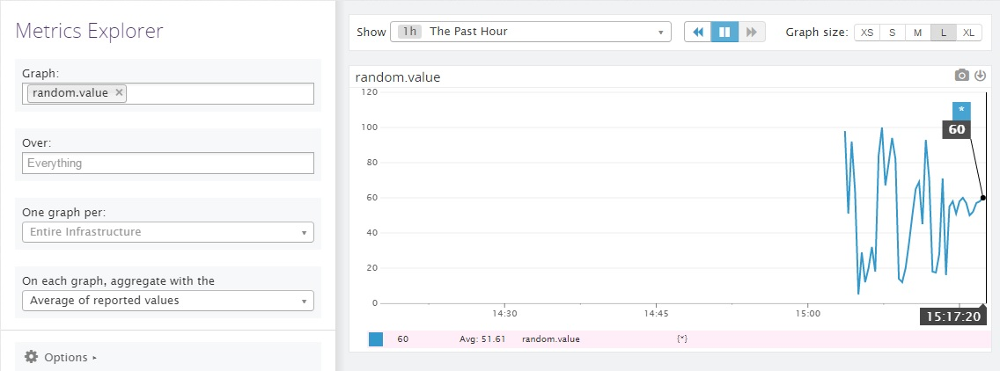
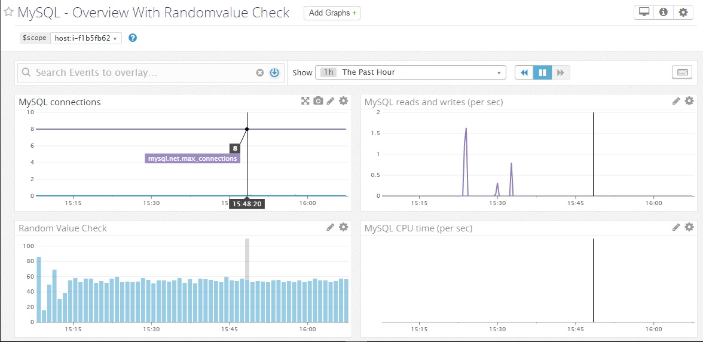
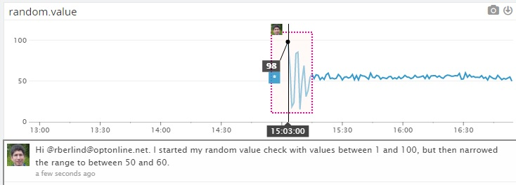

Level 1:

I set up my Datadog account with name Roger Berlind and e-mail rberlind@optonline.net. I actually set up my Datadog account with company "Job Seeker" before starting this interview exercise, but I was then able to change the name of the organization to "Datadog Recruiting Candidate" on the organization settings screen to better match the instructions and avoid any confusion.

Before starting the exercise, I deployed the Datadog agent on my Windows 7 laptop, Thorsby, and on an AWS EC2 instance with public DNS ec2-54-147-87-50.compute-1.amazonaws.com running Tomcat and MySQL on Ubuntu.  I also set up the AWS, EC2, Tomcat, and MySQL integrations on the Linux instance.

The Datadog agent is software that collects performance metrics and events from monitored hosts and technologies and sends them to Datadog's SaaS environment.  Users can then log into their Datadog account with a web browser and easily monitor and diagnose the performance of their cloud, hybrid, and on-premise infrastructure and the applications that run on it.  The agent is very lightweight and secure.

I added tags to the agent configuration file /etc/dd-agent/datadog.conf on my Linux host by uncommenting the tags line and setting tags to "env:dev, role:appserver, owner:roger".  I then restarted the agent with the command "sudo /etc/init.d/datadog-agent restart" to apply the tags to the agent and all integrations on that host.  Here is a screenshot of the tags on that host:

You can also use this [link](https://app.datadoghq.com/infrastructure/map?fillby=avg%3Acpuutilization&sizeby=avg%3Anometric&groupby=none&nameby=name&nometrichosts=false&tvMode=false&nogrouphosts=false&palette=green_to_orange&paletteflip=false&host=247596171) into my Datadog account.

As mentioned above, I had installed the MySQL integration on my Linux host to monitor the MySQL 5.6 database running on it before starting this exercise.  I also just configured the MySQL integration on my Windows laptop too. Here is a screenshot showing MySQL metrics in my account:

You can also use this [link](https://app.datadoghq.com/dash/integration/mysql?live=true&page=0&is_auto=false&from_ts=1479654185837&to_ts=1479668585837&tile_size=m&tpl_var_scope=host%3Ai-f1b5fb62) into my datadog account.

I wrote a [randomvalue.py](./randomvalue.py) check that reads first and last integers from its configuration file [randomvalue.yaml](./randomvalue.yaml) and then generates a random integer between the first and last values inclusively.  Here is a screenshot:

Note that I initially configured the check to generate integers between 1 and 100 but then restricted the range to between 50 and 60 which you can see on the right side of the graph.  You can also use this [link](https://app.datadoghq.com/metric/explorer?live=true&page=0&is_auto=false&from_ts=1479672889265&to_ts=1479676489265&tile_size=m&exp_metric=random.value&exp_scope=&exp_agg=avg&exp_row_type=metric)

Level 2:

I cloned the standard MySQL dashboard, removed some graphs, and added a graph that shows the random values being generated by my check.  Here is a screenshot:

You can see the dashboard in my account with this [link](https://app.datadoghq.com/dash/214576/mysql---overview-with-randomvalue-check?live=true&page=0&is_auto=false&from_ts=1479672831047&to_ts=1479676431047&tile_size=m&tpl_var_scope=host%3Ai-f1b5fb62)

Datadog supports two kinds of dashboards, both of which can be customized by users:
1.  TimeBoards are time-synchronized collections of metric and event graphs that are always laid out in a grid and all show data for a particular time period selected by the user.  They are useful for correlation of metrics and events when troubleshooting performance problems.
2.   ScreenBoards are intended for showing the status of various entities and for sharing information.  Their graphs are not necessarily synchronized and they support a wider range of widgets and layouts.  Note that ScreenBoards can be shared in a read-only mode with external users who do not have permission to log into Datadog.
In many cases, users might start their diagnostics with a ScreenBoard and then drill into TimeBoards that provide more details.

I added a snapshot (annotation) to the graph of my random value check as shown in this screenshot:

You can also use this [link](https://app.datadoghq.com/metric/explorer?live=true&page=0&is_auto=false&from_ts=1479664730099&to_ts=1479679130099&tile_size=m&exp_metric=random.value&exp_scope=&exp_agg=avg&exp_row_type=metric)

