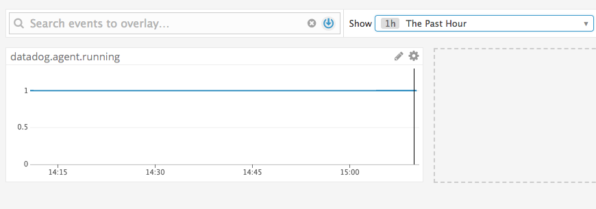
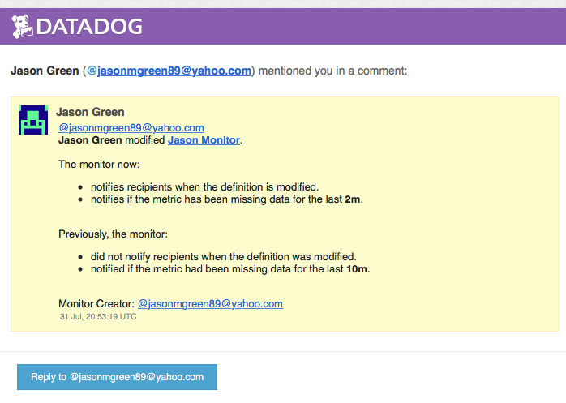
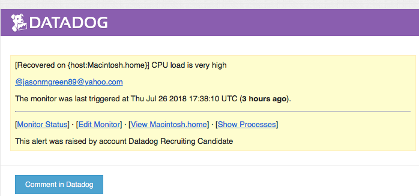
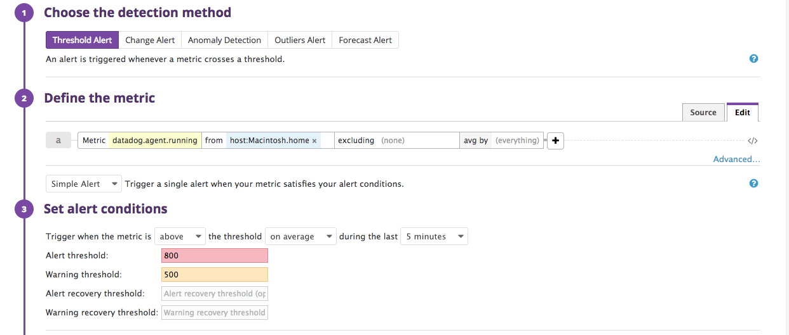

Your answers to the questions go here.

##Collecting Metrics:
1. Add tags in the Agent config file and show us a screenshot of your host and its tags on the Host Map page in Datadog:
    * After trying to open the config file, I was met with "permission denied"
    several times. 

Shortly after, I managed to open the yaml file.
Here are my edits to the yaml file and the tags on the Host Map page

2.  Install a database on your machine (MongoDB, MySQL, or PostgreSQL) and then install the respective Datadog integration for that database.

I'm using PostgreSQL on my Mac with the corresponding Datadog integration.

3. Create a custom Agent check that submits a metric named my_metric with a random value between 0 and 1000.

Answer is in the agentcheckanswers.py file

4. Change your check's collection interval so that it only submits the metric once every 45 seconds.

Answer is in the agentcheckanswers.py file

##Visualizing Data, Utilize the Datadog API to create a Timeboard that contains::

1. Your custom metric scoped over your host.
     answer in .py file

2. Any metric from the Integration on your Database with the anomaly function applied.
     answer in .py file

3. Your custom metric with the rollup function applied to sum up all the points for the past hour into one bucket   
    
    
    Unsure why the line is flat

4. I included my email and a 5 minute time notfication with the timeboard
posted above

##Monitoring Data

The following are screenshots showing the Warning and Alerting thresholds
and the corresponding emails that were sent to me. The alert email is from
a few days ago when I was working with these settings

##Collecting APM Data
    answer in .py file

##Final question
    I would use Datadog to monitor for any available parking spaces
    around the city. Specifically in crowded areas like Times Square 
    and especially within parking garages.

