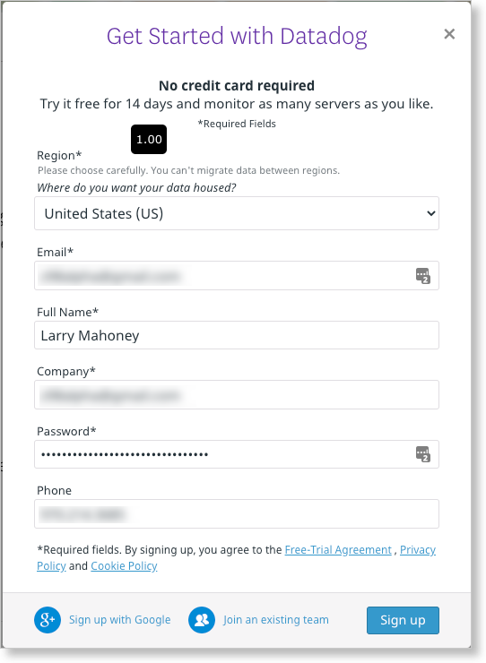
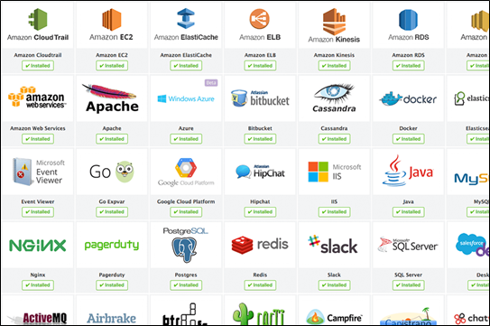
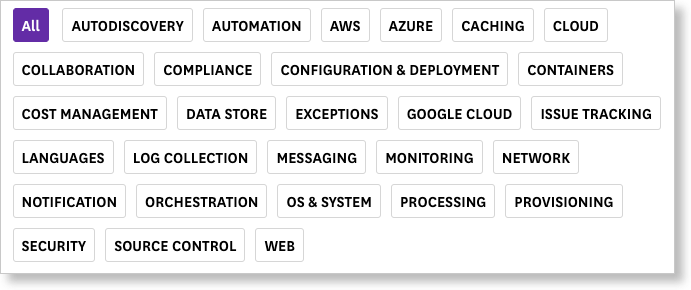

# Datadog Sales Engineer Technical Exercise

Larry Mahoney\
larrymahoney98@gmail.com\
Email address for Datadog Trial Instance:  z98alpha@gmail.com (because I had already done a free trial with larrymahoney98@gmail.com)

## This document is meant to be Customer Facing

I have formatted the remainder of this document to be a customer facing piece that you can leave with a prospect to help close a deal.  This is a guide prospects that want to learn more about about Datadog by taking it for a test drive.  It will walk them through 3 easy steps where they will learn about Metrics (collecting, visualizing and monitoring) and get a taste of APM (instrumenting code and viewing performance).

This was a really fun project!  And you have an awesome product that just works!

#######################################################################################################

# Let's take a tour of Datadog in three Easy Steps!

Congratulations!  You have found the most powerful platform for monitoring metrics, traces and logs on the planet.  Buckle in and lets take it for a test drive.  In the following 3 steps, we will walk you through:

* Step 1 -- Setting up your Datadog laboratory
* Step 2 -- Metrics - Collecting, Visualizing and Monitoring  
* Step 3 -- APM - Trace that Call!


## Step 1 -- Setting up your Datadog laboratory


### Spin up a Linux VM  

You will need a test host for the following trial of **Datadog**.  It can be any OS or host.  You can use Hashicorp's Vagrant to spin a dev environment. Or you can use IaaS.  The example that follows uses and Ubuntu 18 VM on AWS.  We recommend that you use a fresh Linux install (Ubuntu `v. 16.04` or later is recommended).  

VM Specs - the following minimum specs will work fine for this trial:
* 1 vcpu
* 1 GB memory
* 8 GB storage

On AWS, the t2.micro instance is sufficient.  Here is what our test VM looks like on the Instances dashboard:


* Sign up for a Datadog Free Trial

Register for a free **Datadog** 14-day trial here [here](https://www.datadoghq.com/free-datadog-trial/). And let us know if you need more time.  We can extend your trial!



### Add Tags in the Datadog Agent config file

Edit the `datadog.yaml` file in the `\etc\datadog-agent` directory.  Add your own custom tags using this syntax.

```YAML
tags:
   - custom_OS:Ubuntu18
   - custom_aws_host:Datadog-MondoDB
   - custom_location:Denver
```

Then in Datadog, navigate to `Infrastructure > Host Map` and click on your host. You will see something like this with your custom tags shown in the `Tags` block:


### Database

It's time to install a database. Any database will do ... MongoDB, PostgreSQL, MySQL, etc.  In this example, we are using `MongoDB v. 4.2.8`.


You can find instructions for installing MongoDB [here](https://docs.mongodb.com/manual/tutorial/install-mongodb-on-ubuntu/).

### Integrations !!!

Datadog has more than 400 integrations.  What is an integration?  See an introduction [here](https://docs.datadoghq.com/getting_started/integrations/).



Datadog integrations span numerous categories.  You will find what you need.  Or let us know.  We're likely working on it.



Install the integration for the database that you installed on your test bench.  After you do, navigate to `Integrations` in Datadog and you will see confirmation of your installed integrations:


## Step 2 -- Metrics - Collecting, Visualizing and Monitoring


### Custom Agent Check:

Please see the files `my_metric.py` and `my_metric.yaml` for my agent check that produces "My Metric".  I changed the metric interval to 45 seconds in the config file.


* **Bonus Question:** Can you change the collection interval without modifying the Python check file you created?

Yes, you can set the collection interval in the YAML config file with this command:

```python
instances:
  - min_collection_interval: 45
```

### Visualizing Data:

See the file `make_dashboard.py` for my use of the Datadog API to create a Timeboard that contains:

* 'my_metric' scoped over my host.
* The MongoDB Writes/Sec metric with the anomaly function applied.
* 'my_metric' with the rollup function applied with a 1 hour range.


Link to dashboard:
https://p.datadoghq.com/sb/wtoiabphsohwb8fi-c902bc17dca7f4b703f79280584690c8

### Snapshot of Graph

I set the timeframe to the past 5 minutes and sent a snapshot to myself:


* **Bonus Question**: What is the Anomaly graph displaying?

The Anomaly graph is showing the actual measured metric with an overlay in gray that shows the 'normal' range of values. This allows the operator to very easily see when a metric is abnormal even if it experiences cyclical perturbations.

### Monitoring Data

I created a Monitor called "My_Metric Monitor" that triggers in these conditions:

* Warning if average above 500 over last 5 minutes
* Alert if average above 800 over last 5 minutes

* No data notification: This monitor also notifies me if there is No Data for this query over the past 10m.

I configured the monitor to email me with notification type, host IP and actual metric value.  Here is a sample email:


### Bonus Question  
Set up two scheduled downtimes for this monitor.

I set up two scheduled downtimes as follows:

  * From 7pm to 9am daily on M-F
  * All day on Sat-Sun

Here is the email that I received from setting up the Monday-Friday downtime.


# Step 3 -- APM - Trace that Call!

%%%%%%%%%%%%%%%%%%%%%%%%%%%%%%%%%%%%% - swicthboard

I instrumented the provided Flask app.  See `flaskapp.py`.  I added code to enable analytics, and used ddtrace-run.

### Bonus Question
What is the difference between a Service and a Resource?

A Resource is typically an instrumented endpoint.  But it can also be a database query or a background job.
A Service is a collection of endpoints, queries or jobs.
In this example, the app `flaskapp.py` embodies the service, whereas the endpoints /api/apm and /api/trace are resources.

Screenshot and link to my Dashboard with both APM and Infrastructure Metrics:


https://p.datadoghq.com/sb/wtoiabphsohwb8fi-45cb1ab404e3e28e6792a2286b03646a

## Final Question:

Is there anything creative you would use Datadog for?

COVID Park Alert!
I would get public access to municipal cameras at the city's parks and feed them into a crowd-counting service like Amazon Rekognition.  And then pull that data into Datadog and do analytics on the crowd size data as well as weather data to send alerts when the crowd size is low on days that are sunny!  The alerts would let you know when you can throw your frisbee to your dog at the park with extra social distancing!

## Thanks!

Thank you for reviewing my work!  This was a blast!

Larry Mahoney\
larrymahoney98@gmail.com\
970.214.3685
